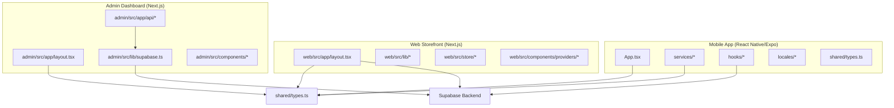
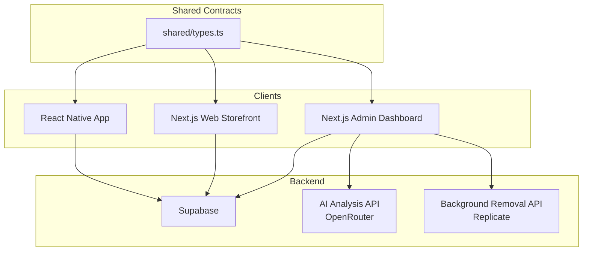
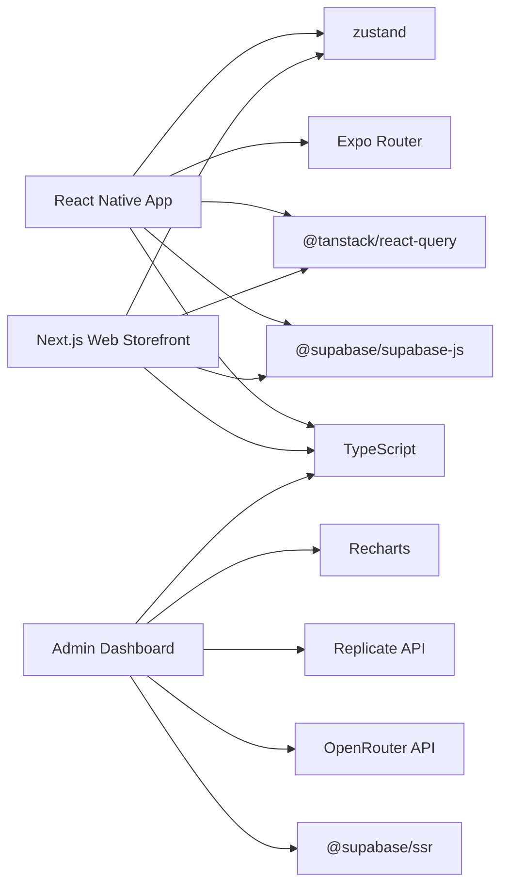
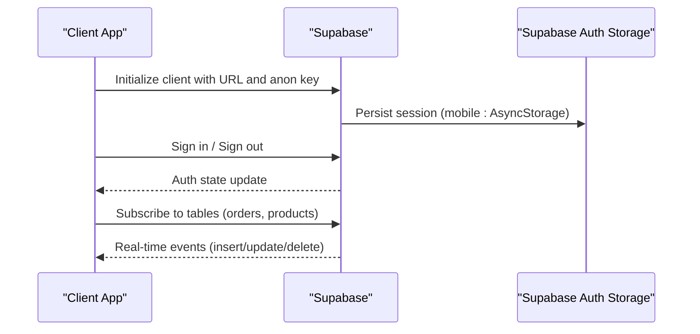
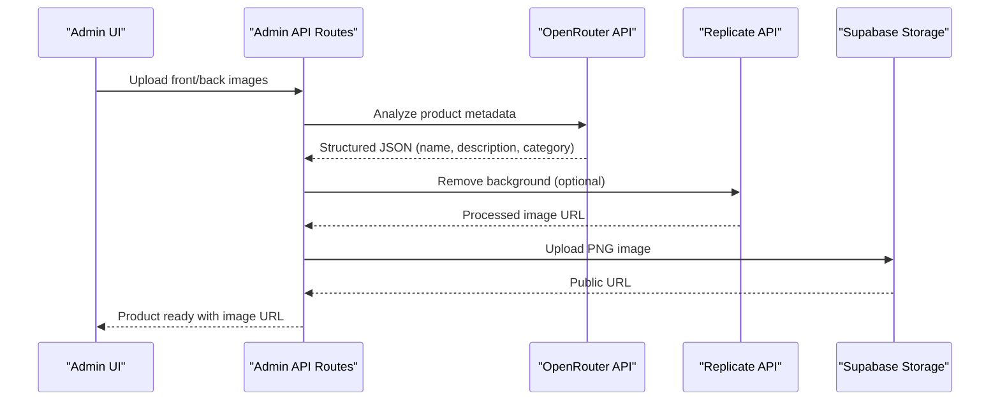
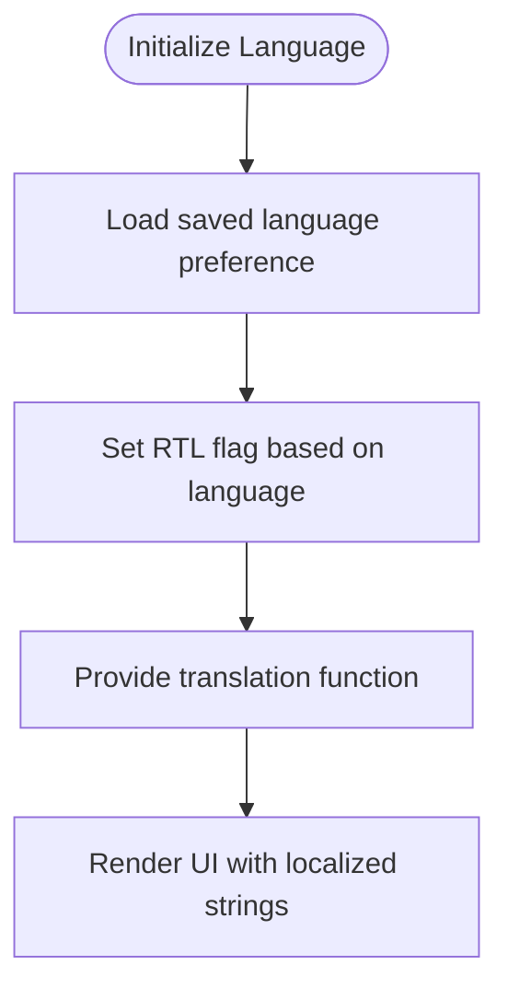
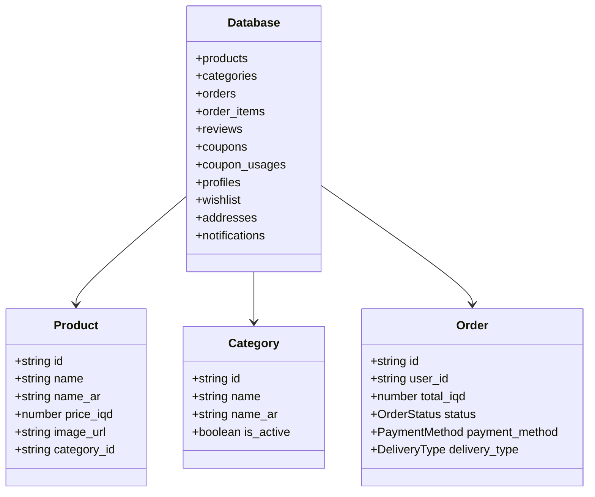
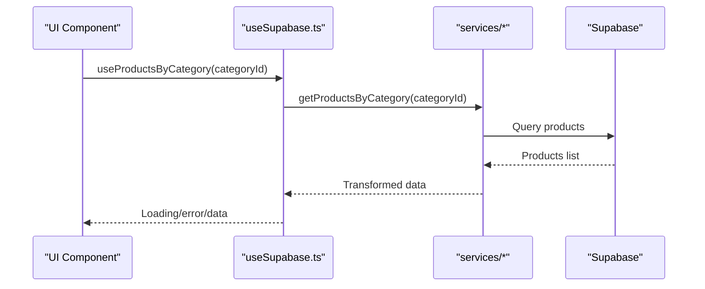
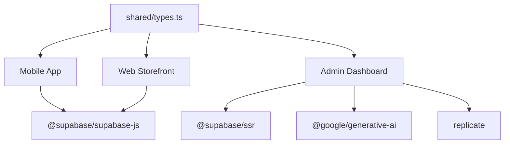

# Project Overview

<cite>
**Referenced Files in This Document**
- [package.json](file://package.json)
- [admin/package.json](file://admin/package.json)
- [web/package.json](file://web/package.json)
- [App.tsx](file://App.tsx)
- [admin/src/app/layout.tsx](file://admin/src/app/layout.tsx)
- [web/src/app/layout.tsx](file://web/src/app/layout.tsx)
- [lib/supabase.ts](file://lib/supabase.ts)
- [admin/src/lib/supabase.ts](file://admin/src/lib/supabase.ts)
- [admin/src/app/api/ai/analyze-product/route.ts](file://admin/src/app/api/ai/analyze-product/route.ts)
- [admin/src/app/api/ai/remove-background/route.ts](file://admin/src/app/api/ai/remove-background/route.ts)
- [locales/ar.json](file://locales/ar.json)
- [locales/en.json](file://locales/en.json)
- [shared/types.ts](file://shared/types.ts)
- [hooks/useSupabase.ts](file://hooks/useSupabase.ts)
- [contexts/LanguageContext.tsx](file://contexts/LanguageContext.tsx)
- [constants/app.ts](file://constants/app.ts)
</cite>

## Table of Contents
1. [Introduction](#introduction)
2. [Project Structure](#project-structure)
3. [Core Components](#core-components)
4. [Architecture Overview](#architecture-overview)
5. [Detailed Component Analysis](#detailed-component-analysis)
6. [Dependency Analysis](#dependency-analysis)
7. [Performance Considerations](#performance-considerations)
8. [Troubleshooting Guide](#troubleshooting-guide)
9. [Conclusion](#conclusion)

## Introduction
Al-Amal Center is a comprehensive multi-platform e-commerce solution designed to serve Iraqi consumers with fresh produce and everyday essentials. The platform unifies three primary touchpoints:
- A native mobile application built with React Native and Expo for iOS and Android
- A responsive web storefront powered by Next.js for desktop and tablet users
- An admin dashboard for product and content management, reporting, and AI-assisted workflows

At its core, the platform leverages Supabase as the backend foundation, ensuring scalable authentication, real-time data synchronization, and cloud storage. The entire codebase is authored in TypeScript to improve reliability and developer productivity across platforms. The system emphasizes a unified, cross-platform design language and shared business logic, enabling efficient maintenance and rapid feature iteration.

Business value is delivered through:
- Localized, Arabic-first experiences with RTL support and bilingual content
- AI-powered product ingestion and media processing to accelerate catalog operations
- Real-time order tracking and notifications for improved customer engagement
- Multi-language support and consistent branding across channels

Target audience:
- Everyday Iraqi families seeking convenient grocery shopping
- Small-to-medium retailers and suppliers managing inventory via the admin portal
- Administrators and product managers leveraging AI tools for product onboarding

Key differentiators:
- Unified codebase with shared types and services
- AI integrations for product categorization and background removal
- Real-time capabilities via Supabase
- Comprehensive multilingual and RTL-ready UI

## Project Structure
The repository is organized into three main applications plus shared resources:
- Mobile app: React Native/Expo under the root directory
- Web storefront: Next.js application under the web/ directory
- Admin dashboard: Next.js application under the admin/ directory
- Shared domain: Business types and common services under shared/ and services/

**Diagram sources**
- [App.tsx:1-21](file://App.tsx#L1-L21)
- [web/src/app/layout.tsx:1-61](file://web/src/app/layout.tsx#L1-L61)
- [admin/src/app/layout.tsx:1-30](file://admin/src/app/layout.tsx#L1-L30)
- [admin/src/lib/supabase.ts:1-24](file://admin/src/lib/supabase.ts#L1-L24)
- [shared/types.ts:1-353](file://shared/types.ts#L1-L353)

**Section sources**
- [package.json:1-65](file://package.json#L1-L65)
- [web/package.json:1-39](file://web/package.json#L1-L39)
- [admin/package.json:1-40](file://admin/package.json#L1-L40)
- [App.tsx:1-21](file://App.tsx#L1-L21)
- [web/src/app/layout.tsx:1-61](file://web/src/app/layout.tsx#L1-L61)
- [admin/src/app/layout.tsx:1-30](file://admin/src/app/layout.tsx#L1-L30)
- [shared/types.ts:1-353](file://shared/types.ts#L1-L353)

## Core Components
- Cross-platform frontend frameworks:
  - Mobile: React Native with Expo Router for navigation and platform-specific APIs
  - Web: Next.js App Router with SSR/SSG for SEO and performance
  - Admin: Next.js for administrative workflows and analytics
- Backend foundation:
  - Supabase client libraries for authentication, database, and storage
  - TypeScript-defined schemas for strong typing across platforms
- AI and automation:
  - OpenRouter/Gemini integration for product analysis
  - Replicate integration for background removal
- Localization and internationalization:
  - Arabic and English JSON dictionaries
  - RTL-aware UI and direction detection
- State and caching:
  - React Query hooks for data fetching and caching
  - Zustand stores for lightweight UI state

**Section sources**
- [package.json:12-55](file://package.json#L12-L55)
- [web/package.json:11-25](file://web/package.json#L11-L25)
- [admin/package.json:11-26](file://admin/package.json#L11-L26)
- [lib/supabase.ts:1-30](file://lib/supabase.ts#L1-L30)
- [admin/src/lib/supabase.ts:1-24](file://admin/src/lib/supabase.ts#L1-L24)
- [hooks/useSupabase.ts:1-239](file://hooks/useSupabase.ts#L1-L239)
- [locales/ar.json:1-413](file://locales/ar.json#L1-L413)
- [locales/en.json:1-413](file://locales/en.json#L1-L413)

## Architecture Overview
The system follows a client-server pattern with Supabase as the central backend:
- Clients (mobile, web, admin) communicate with Supabase via typed SDKs
- Shared types define the contract for data exchange
- AI services are exposed as Next.js API routes within the admin application
- Real-time subscriptions and auth state are managed centrally

**Diagram sources**
- [lib/supabase.ts:1-30](file://lib/supabase.ts#L1-L30)
- [admin/src/lib/supabase.ts:1-24](file://admin/src/lib/supabase.ts#L1-L24)
- [admin/src/app/api/ai/analyze-product/route.ts:1-221](file://admin/src/app/api/ai/analyze-product/route.ts#L1-L221)
- [admin/src/app/api/ai/remove-background/route.ts:1-152](file://admin/src/app/api/ai/remove-background/route.ts#L1-L152)
- [shared/types.ts:1-353](file://shared/types.ts#L1-L353)

## Detailed Component Analysis

### Technology Stack and Platform Composition
- Mobile application: React Native + Expo, TypeScript, Tailwind via NativeWind, React Navigation (via Expo Router), Supabase JS client, React Query, Zustand
- Web storefront: Next.js App Router, TypeScript, Supabase JS client, React Query, Zustand, Tailwind
- Admin dashboard: Next.js App Router, TypeScript, Supabase SSR client, AI integrations (OpenRouter, Replicate), charts and UI libraries
- Backend: Supabase (PostgreSQL, Auth, Storage, Edge Functions), environment variables for API keys

**Diagram sources**
- [package.json:12-55](file://package.json#L12-L55)
- [web/package.json:11-25](file://web/package.json#L11-L25)
- [admin/package.json:11-26](file://admin/package.json#L11-L26)

**Section sources**
- [package.json:12-55](file://package.json#L12-L55)
- [web/package.json:11-25](file://web/package.json#L11-L25)
- [admin/package.json:11-26](file://admin/package.json#L11-L26)

### Supabase Integration and Real-Time Capabilities
- Authentication and session persistence are configured for both mobile and browser environments
- The mobile client uses AsyncStorage for session storage; the admin uses a browser-compatible client
- Real-time subscriptions and auth state are managed centrally, enabling live updates across clients

**Diagram sources**
- [lib/supabase.ts:1-30](file://lib/supabase.ts#L1-L30)
- [admin/src/lib/supabase.ts:1-24](file://admin/src/lib/supabase.ts#L1-L24)

**Section sources**
- [lib/supabase.ts:18-30](file://lib/supabase.ts#L18-L30)
- [admin/src/lib/supabase.ts:19-24](file://admin/src/lib/supabase.ts#L19-L24)

### AI Integration Features
- Product analysis: Admin API consumes OpenRouter’s Gemini model to extract product metadata from front/back images, returning structured data mapped to categories
- Background removal: Admin API integrates Replicate for fast background removal, with a fallback to a local Python endpoint and uploads processed images to Supabase Storage

**Diagram sources**
- [admin/src/app/api/ai/analyze-product/route.ts:1-221](file://admin/src/app/api/ai/analyze-product/route.ts#L1-L221)
- [admin/src/app/api/ai/remove-background/route.ts:1-152](file://admin/src/app/api/ai/remove-background/route.ts#L1-L152)

**Section sources**
- [admin/src/app/api/ai/analyze-product/route.ts:71-221](file://admin/src/app/api/ai/analyze-product/route.ts#L71-L221)
- [admin/src/app/api/ai/remove-background/route.ts:12-152](file://admin/src/app/api/ai/remove-background/route.ts#L12-L152)

### Multi-Language and RTL Support
- Language dictionaries for Arabic and English provide localized strings across components
- Directionality is derived from the current language to render RTL layouts when needed
- The language context initializes persisted language preferences and exposes a translation function

**Diagram sources**
- [contexts/LanguageContext.tsx:26-62](file://contexts/LanguageContext.tsx#L26-L62)
- [locales/ar.json:1-413](file://locales/ar.json#L1-L413)
- [locales/en.json:1-413](file://locales/en.json#L1-L413)

**Section sources**
- [contexts/LanguageContext.tsx:1-84](file://contexts/LanguageContext.tsx#L1-L84)
- [locales/ar.json:1-413](file://locales/ar.json#L1-L413)
- [locales/en.json:1-413](file://locales/en.json#L1-L413)

### Shared Types and Cross-Platform Contracts
- A single source of truth for database entities, enums, and extended types ensures consistency across mobile, web, and admin
- Services and hooks consume these shared types, minimizing duplication and reducing integration risk

**Diagram sources**
- [shared/types.ts:10-211](file://shared/types.ts#L10-L211)

**Section sources**
- [shared/types.ts:1-353](file://shared/types.ts#L1-L353)

### Data Fetching and Caching Strategy
- React Query hooks encapsulate data fetching for products, categories, banners, and home sections
- Centralized services reduce duplication and enable consistent caching and refetching policies

**Diagram sources**
- [hooks/useSupabase.ts:139-145](file://hooks/useSupabase.ts#L139-L145)
- [shared/types.ts:217-223](file://shared/types.ts#L217-L223)

**Section sources**
- [hooks/useSupabase.ts:1-239](file://hooks/useSupabase.ts#L1-L239)

## Dependency Analysis
- Mobile app depends on Expo ecosystem, Supabase JS client, React Query, and Zustand
- Web and Admin dashboards depend on Next.js, Supabase SSR client, and AI libraries
- All clients share shared types and services to maintain consistency
- AI features introduce external dependencies (OpenRouter, Replicate) behind admin API routes

**Diagram sources**
- [package.json:18-55](file://package.json#L18-L55)
- [web/package.json:13-25](file://web/package.json#L13-L25)
- [admin/package.json:12-26](file://admin/package.json#L12-L26)
- [shared/types.ts:1-353](file://shared/types.ts#L1-L353)

**Section sources**
- [package.json:12-55](file://package.json#L12-L55)
- [web/package.json:11-25](file://web/package.json#L11-L25)
- [admin/package.json:11-26](file://admin/package.json#L11-L26)
- [shared/types.ts:1-353](file://shared/types.ts#L1-L353)

## Performance Considerations
- Prefer server-side rendering for SEO and initial load performance in the web storefront
- Use React Query caching and selective refetching to minimize redundant network calls
- Offload heavy AI tasks to admin API routes to keep client apps responsive
- Optimize images and leverage Supabase Storage CDN for media delivery
- Keep shared types minimal and focused to reduce bundle sizes across platforms

## Troubleshooting Guide
- Authentication and session issues:
  - Verify Supabase URL and anon keys for both mobile and browser clients
  - Confirm AsyncStorage usage on mobile vs. browser client on web/admin
- AI API failures:
  - Check OpenRouter and Replicate API keys and quotas
  - Inspect admin API logs for parsing errors and fallback behavior
- Localization problems:
  - Ensure language files are present and keys are correctly referenced
  - Verify directionality logic for RTL rendering
- Build and runtime errors:
  - Confirm TypeScript strictness and module resolution
  - Validate environment variables for external APIs

**Section sources**
- [lib/supabase.ts:19-20](file://lib/supabase.ts#L19-L20)
- [admin/src/lib/supabase.ts:20-21](file://admin/src/lib/supabase.ts#L20-L21)
- [admin/src/app/api/ai/analyze-product/route.ts:75-80](file://admin/src/app/api/ai/analyze-product/route.ts#L75-L80)
- [admin/src/app/api/ai/remove-background/route.ts:10-11](file://admin/src/app/api/ai/remove-background/route.ts#L10-L11)
- [contexts/LanguageContext.tsx:31-51](file://contexts/LanguageContext.tsx#L31-L51)

## Conclusion
Al-Amal Center delivers a cohesive, scalable e-commerce ecosystem tailored to Iraqi consumers. By combining a unified codebase with Supabase-backed services, AI-driven automation, and a robust multilingual UI, the platform accelerates time-to-market while maintaining high standards for localization, performance, and user experience. The architecture supports seamless collaboration between customers, administrators, and suppliers, positioning the project as a comprehensive solution for modern retail operations in Iraq.