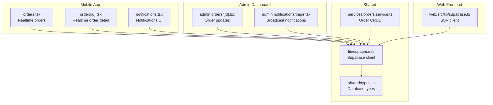
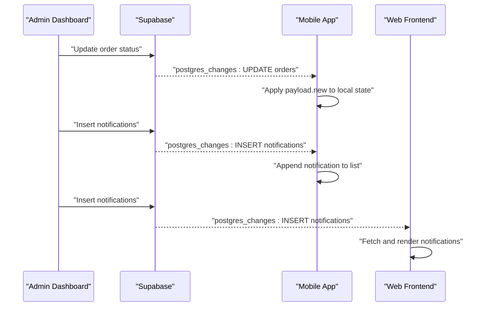
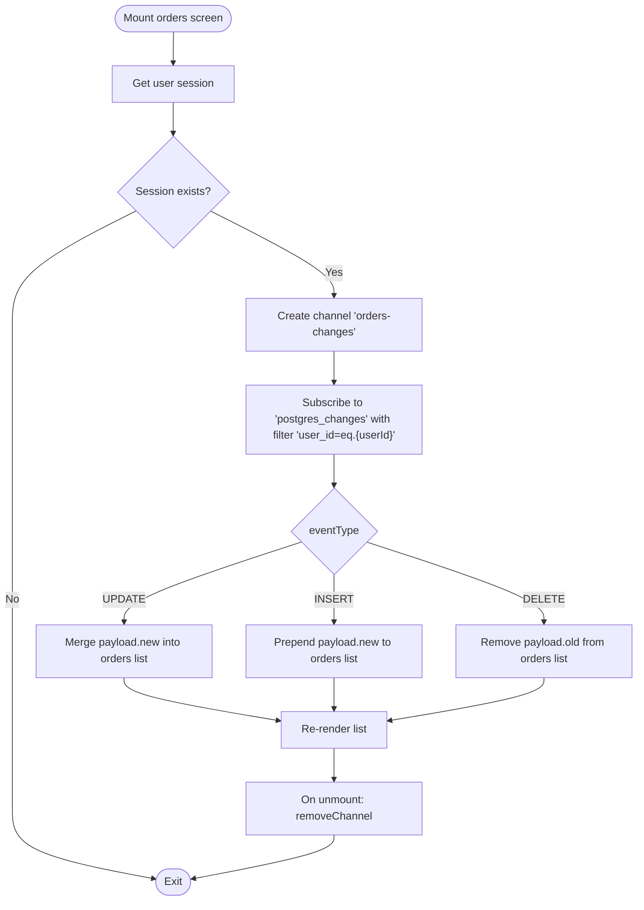
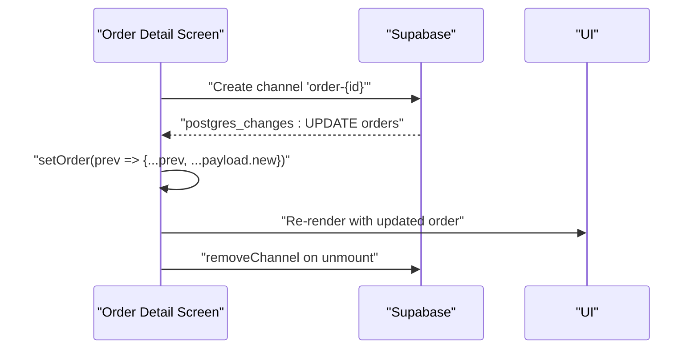
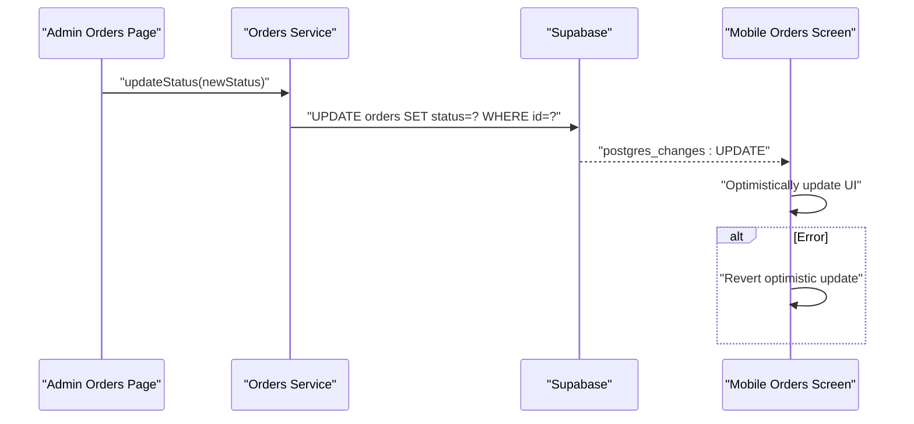
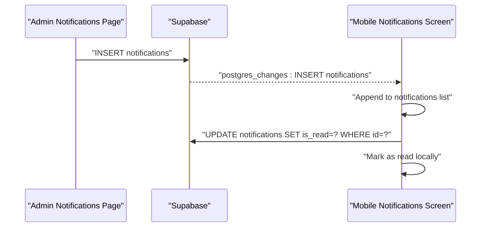
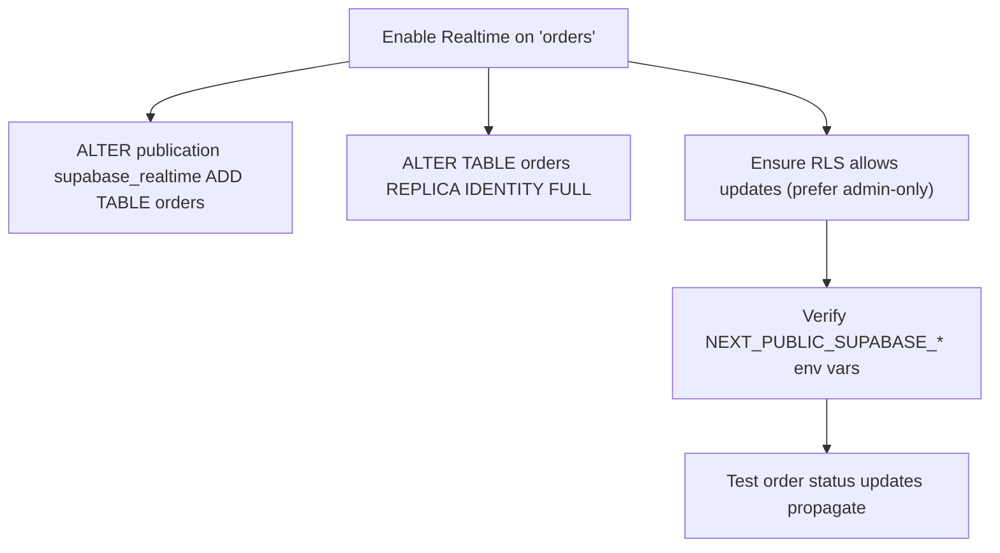
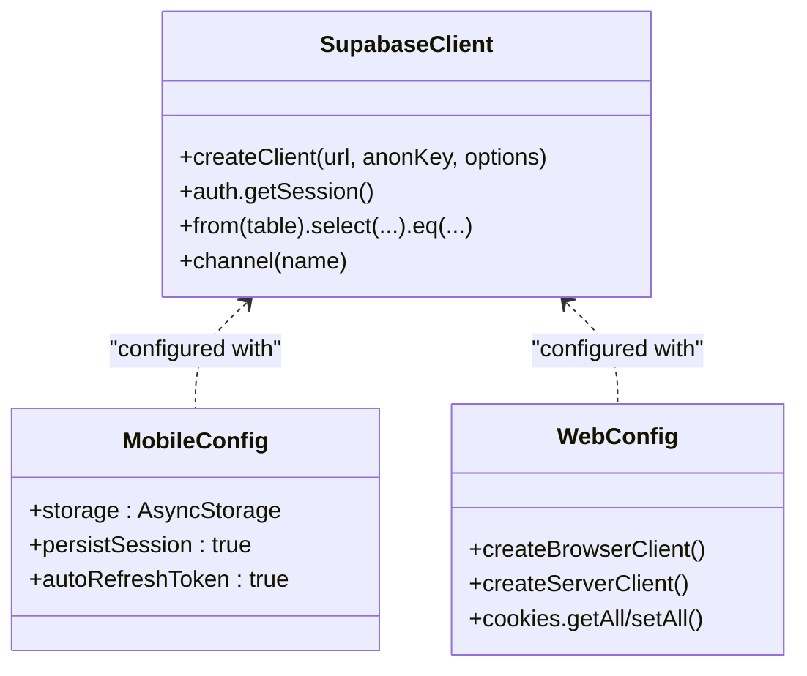
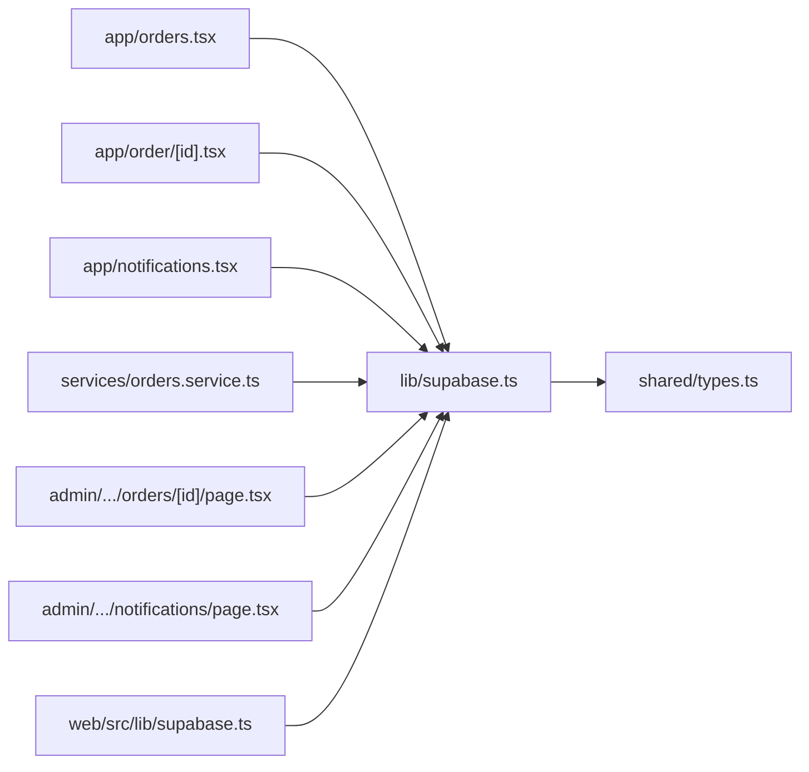

# Real-time Features

<cite>
**Referenced Files in This Document**
- [lib/supabase.ts](file://lib/supabase.ts)
- [hooks/useSupabase.ts](file://hooks/useSupabase.ts)
- [.docs/ORDERS_REALTIME_SETUP.md](file://.docs/ORDERS_REALTIME_SETUP.md)
- [services/orders.service.ts](file://services/orders.service.ts)
- [app/orders.tsx](file://app/orders.tsx)
- [app/order/[id].tsx](file://app/order/[id].tsx)
- [app/notifications.tsx](file://app/notifications.tsx)
- [admin/src/app/(dashboard)/orders/[id]/page.tsx](file://admin/src/app/(dashboard)/orders/[id]/page.tsx)
- [admin/src/app/(dashboard)/notifications/page.tsx](file://admin/src/app/(dashboard)/notifications/page.tsx)
- [web/src/lib/supabase.ts](file://web/src/lib/supabase.ts)
- [shared/types.ts](file://shared/types.ts)
</cite>

## Table of Contents
1. [Introduction](#introduction)
2. [Project Structure](#project-structure)
3. [Core Components](#core-components)
4. [Architecture Overview](#architecture-overview)
5. [Detailed Component Analysis](#detailed-component-analysis)
6. [Dependency Analysis](#dependency-analysis)
7. [Performance Considerations](#performance-considerations)
8. [Troubleshooting Guide](#troubleshooting-guide)
9. [Conclusion](#conclusion)
10. [Appendices](#appendices)

## Introduction
This document explains the real-time features and Supabase Realtime integration across the mobile app, admin dashboard, and web frontend. It covers:
- Real-time data synchronization architecture for orders and notifications
- Live updates, subscription management, and event handling
- Order tracking with live status updates and delivery coordination
- Real-time notification system for order alerts, inventory changes, and promotional campaigns
- Supabase Realtime setup, channel management, and subscription patterns
- Offline-first strategies, conflict resolution, and data synchronization upon connectivity restoration
- Performance considerations, connection pooling, and resource management
- Troubleshooting guidance and extension guidelines

## Project Structure
The real-time system spans three environments:
- Mobile app (React Native): Real-time subscriptions for orders and notifications
- Admin dashboard (Next.js): Real-time order updates and notification broadcasting
- Web frontend (Next.js): Real-time data via Supabase SSR client

**Diagram sources**
- [lib/supabase.ts:1-30](file://lib/supabase.ts#L1-L30)
- [services/orders.service.ts:1-115](file://services/orders.service.ts#L1-L115)
- [app/orders.tsx:1-516](file://app/orders.tsx#L1-L516)
- [app/order/[id].tsx:1-269](file://app/order/[id].tsx#L1-L269)
- [app/notifications.tsx:1-403](file://app/notifications.tsx#L1-L403)
- [admin/src/app/(dashboard)/orders/[id]/page.tsx:1-655](file://admin/src/app/(dashboard)/orders/[id]/page.tsx#L1-L655)
- [admin/src/app/(dashboard)/notifications/page.tsx:1-346](file://admin/src/app/(dashboard)/notifications/page.tsx#L1-L346)
- [web/src/lib/supabase.ts:1-36](file://web/src/lib/supabase.ts#L1-L36)
- [shared/types.ts:1-353](file://shared/types.ts#L1-L353)

**Section sources**
- [lib/supabase.ts:1-30](file://lib/supabase.ts#L1-L30)
- [hooks/useSupabase.ts:1-239](file://hooks/useSupabase.ts#L1-L239)
- [.docs/ORDERS_REALTIME_SETUP.md:1-107](file://.docs/ORDERS_REALTIME_SETUP.md#L1-L107)
- [services/orders.service.ts:1-115](file://services/orders.service.ts#L1-L115)
- [app/orders.tsx:1-516](file://app/orders.tsx#L1-L516)
- [app/order/[id].tsx:1-269](file://app/order/[id].tsx#L1-L269)
- [app/notifications.tsx:1-403](file://app/notifications.tsx#L1-L403)
- [admin/src/app/(dashboard)/orders/[id]/page.tsx:1-655](file://admin/src/app/(dashboard)/orders/[id]/page.tsx#L1-L655)
- [admin/src/app/(dashboard)/notifications/page.tsx:1-346](file://admin/src/app/(dashboard)/notifications/page.tsx#L1-L346)
- [web/src/lib/supabase.ts:1-36](file://web/src/lib/supabase.ts#L1-L36)
- [shared/types.ts:1-353](file://shared/types.ts#L1-L353)

## Core Components
- Supabase client initialization with persistence and auth storage
- Order service for CRUD operations and status updates
- Real-time subscriptions in mobile screens for live order updates
- Notification UI and admin broadcast system
- SSR client for web frontend

Key responsibilities:
- Real-time subscriptions: orders screen subscribes to all user orders; order detail screen subscribes to a specific order
- Event handling: UPDATE/INSERT/DELETE events applied to local state
- Admin updates: admin panel updates order status; mobile clients receive live updates
- Notifications: admin broadcasts notifications; mobile app displays and manages them

**Section sources**
- [lib/supabase.ts:1-30](file://lib/supabase.ts#L1-L30)
- [services/orders.service.ts:1-115](file://services/orders.service.ts#L1-L115)
- [app/orders.tsx:41-85](file://app/orders.tsx#L41-L85)
- [app/order/[id].tsx:24-46](file://app/order/[id].tsx#L24-L46)
- [app/notifications.tsx:34-160](file://app/notifications.tsx#L34-L160)
- [admin/src/app/(dashboard)/orders/[id]/page.tsx:95-135](file://admin/src/app/(dashboard)/orders/[id]/page.tsx#L95-L135)
- [admin/src/app/(dashboard)/notifications/page.tsx:78-132](file://admin/src/app/(dashboard)/notifications/page.tsx#L78-L132)
- [web/src/lib/supabase.ts:1-36](file://web/src/lib/supabase.ts#L1-L36)

## Architecture Overview
The real-time architecture leverages Supabase Realtime channels and filters to deliver targeted updates to authenticated users.

**Diagram sources**
- [admin/src/app/(dashboard)/orders/[id]/page.tsx:95-135](file://admin/src/app/(dashboard)/orders/[id]/page.tsx#L95-L135)
- [app/orders.tsx:47-75](file://app/orders.tsx#L47-L75)
- [app/order/[id].tsx:25-40](file://app/order/[id].tsx#L25-L40)
- [app/notifications.tsx:129-160](file://app/notifications.tsx#L129-L160)
- [admin/src/app/(dashboard)/notifications/page.tsx:101-112](file://admin/src/app/(dashboard)/notifications/page.tsx#L101-L112)
- [web/src/lib/supabase.ts:11-35](file://web/src/lib/supabase.ts#L11-L35)

## Detailed Component Analysis

### Real-time Orders Subscription (Mobile)
- Channel: orders-changes
- Filter: user_id equality
- Events handled: UPDATE, INSERT, DELETE
- Behavior: merges updates, prepends inserts, removes deletes

**Diagram sources**
- [app/orders.tsx:41-85](file://app/orders.tsx#L41-L85)

**Section sources**
- [app/orders.tsx:41-85](file://app/orders.tsx#L41-L85)

### Real-time Order Detail Subscription (Mobile)
- Channel: order-{id}
- Filter: id equality
- Event handled: UPDATE
- Behavior: shallow merge payload.new into order state

**Diagram sources**
- [app/order/[id].tsx:24-46](file://app/order/[id].tsx#L24-L46)

**Section sources**
- [app/order/[id].tsx:24-46](file://app/order/[id].tsx#L24-L46)

### Admin Order Updates and Real-time Propagation
- Admin updates order status via service call
- Supabase Realtime emits postgres_changes to subscribed clients
- Mobile clients apply optimistic updates and reconcile on error

**Diagram sources**
- [admin/src/app/(dashboard)/orders/[id]/page.tsx:95-135](file://admin/src/app/(dashboard)/orders/[id]/page.tsx#L95-L135)
- [services/orders.service.ts:80-96](file://services/orders.service.ts#L80-L96)
- [app/orders.tsx:60-72](file://app/orders.tsx#L60-L72)

**Section sources**
- [admin/src/app/(dashboard)/orders/[id]/page.tsx:95-135](file://admin/src/app/(dashboard)/orders/[id]/page.tsx#L95-L135)
- [services/orders.service.ts:80-96](file://services/orders.service.ts#L80-L96)
- [app/orders.tsx:60-72](file://app/orders.tsx#L60-L72)

### Notifications System
- Admin broadcasts notifications to the notifications table
- Mobile app fetches and displays notifications
- User can enable/disable push notifications and mark as read/clear all

**Diagram sources**
- [admin/src/app/(dashboard)/notifications/page.tsx:101-112](file://admin/src/app/(dashboard)/notifications/page.tsx#L101-L112)
- [app/notifications.tsx:129-160](file://app/notifications.tsx#L129-L160)

**Section sources**
- [admin/src/app/(dashboard)/notifications/page.tsx:78-132](file://admin/src/app/(dashboard)/notifications/page.tsx#L78-L132)
- [app/notifications.tsx:34-160](file://app/notifications.tsx#L34-L160)

### Supabase Realtime Setup and Policies
- Enable Realtime on orders table and set REPLICA IDENTITY FULL
- Configure RLS policies for safe updates
- Verify environment variables for admin panel

**Diagram sources**
- [.docs/ORDERS_REALTIME_SETUP.md:18-106](file://.docs/ORDERS_REALTIME_SETUP.md#L18-L106)

**Section sources**
- [.docs/ORDERS_REALTIME_SETUP.md:18-106](file://.docs/ORDERS_REALTIME_SETUP.md#L18-L106)

### Supabase Client Configurations
- Mobile: AsyncStorage-backed auth persistence
- Web: Browser/server client creation with cookie handling

**Diagram sources**
- [lib/supabase.ts:19-29](file://lib/supabase.ts#L19-L29)
- [web/src/lib/supabase.ts:11-35](file://web/src/lib/supabase.ts#L11-L35)

**Section sources**
- [lib/supabase.ts:19-29](file://lib/supabase.ts#L19-L29)
- [web/src/lib/supabase.ts:11-35](file://web/src/lib/supabase.ts#L11-L35)

## Dependency Analysis
- Mobile screens depend on the shared Supabase client for Realtime and Auth
- Admin dashboard depends on Supabase client for order updates and notification insertion
- Order service encapsulates database operations for orders
- Shared types define database schema and enums used across components

**Diagram sources**
- [app/orders.tsx:6](file://app/orders.tsx#L6)
- [app/order/[id].tsx:6](file://app/order/[id].tsx#L6)
- [app/notifications.tsx:6](file://app/notifications.tsx#L6)
- [services/orders.service.ts:6](file://services/orders.service.ts#L6)
- [admin/src/app/(dashboard)/orders/[id]/page.tsx:5](file://admin/src/app/(dashboard)/orders/[id]/page.tsx#L5)
- [admin/src/app/(dashboard)/notifications/page.tsx:6](file://admin/src/app/(dashboard)/notifications/page.tsx#L6)
- [web/src/lib/supabase.ts:1](file://web/src/lib/supabase.ts#L1)
- [lib/supabase.ts:1](file://lib/supabase.ts#L1)
- [shared/types.ts:10](file://shared/types.ts#L10)

**Section sources**
- [app/orders.tsx:6](file://app/orders.tsx#L6)
- [app/order/[id].tsx:6](file://app/order/[id].tsx#L6)
- [app/notifications.tsx:6](file://app/notifications.tsx#L6)
- [services/orders.service.ts:6](file://services/orders.service.ts#L6)
- [admin/src/app/(dashboard)/orders/[id]/page.tsx:5](file://admin/src/app/(dashboard)/orders/[id]/page.tsx#L5)
- [admin/src/app/(dashboard)/notifications/page.tsx:6](file://admin/src/app/(dashboard)/notifications/page.tsx#L6)
- [web/src/lib/supabase.ts:1](file://web/src/lib/supabase.ts#L1)
- [lib/supabase.ts:1](file://lib/supabase.ts#L1)
- [shared/types.ts:10](file://shared/types.ts#L10)

## Performance Considerations
- Minimize subscription scope: filter by user_id or specific order id to reduce payload volume
- Batch updates: avoid frequent re-renders by merging updates efficiently
- Connection lifecycle: remove channels on unmount to prevent leaks
- Auth session checks: guard queries/subscriptions behind session presence
- Network resilience: implement retry/backoff and optimistic UI for transient failures
- Resource management: reuse Supabase client instances; avoid creating multiple channels unnecessarily

[No sources needed since this section provides general guidance]

## Troubleshooting Guide
Common issues and resolutions:
- Realtime not updating:
  - Verify Realtime is enabled on orders table and REPLICA IDENTITY FULL is set
  - Confirm RLS policy allows updates for the admin role
  - Check environment variables for admin panel
- Order status not reflecting:
  - Ensure mobile screen mounts subscription and applies UPDATE events
  - Confirm filter matches user_id or order id
- Notifications not appearing:
  - Verify admin inserted records into notifications table
  - Check mobile notifications screen fetches and renders
- Connectivity problems:
  - Implement pull-to-refresh fallback
  - Persist user preferences (e.g., notifications_enabled) locally

**Section sources**
- [.docs/ORDERS_REALTIME_SETUP.md:83-106](file://.docs/ORDERS_REALTIME_SETUP.md#L83-L106)
- [app/orders.tsx:41-85](file://app/orders.tsx#L41-L85)
- [app/order/[id].tsx:24-46](file://app/order/[id].tsx#L24-L46)
- [app/notifications.tsx:129-160](file://app/notifications.tsx#L129-L160)
- [admin/src/app/(dashboard)/orders/[id]/page.tsx:95-135](file://admin/src/app/(dashboard)/orders/[id]/page.tsx#L95-L135)

## Conclusion
The application implements a robust real-time system centered on Supabase Realtime:
- Orders: live status updates via scoped channels with optimistic UI and error rollback
- Notifications: admin-driven broadcasts with user preference persistence
- Admin: order management with immediate propagation to clients
- Clients: consistent Supabase client configuration across platforms

Extending the system involves adding new tables to Realtime, creating appropriate RLS policies, and subscribing in relevant UI components with careful filtering and lifecycle management.

[No sources needed since this section summarizes without analyzing specific files]

## Appendices

### Supabase Realtime Channels and Filters Reference
- Orders list: channel orders-changes with filter user_id=eq.{userId}
- Order detail: channel order-{id} with filter id=eq.{orderId}
- Notifications: subscribe to notifications table for INSERT events

**Section sources**
- [app/orders.tsx:47-56](file://app/orders.tsx#L47-L56)
- [app/order/[id].tsx:25-34](file://app/order/[id].tsx#L25-L34)
- [app/notifications.tsx:129-160](file://app/notifications.tsx#L129-L160)