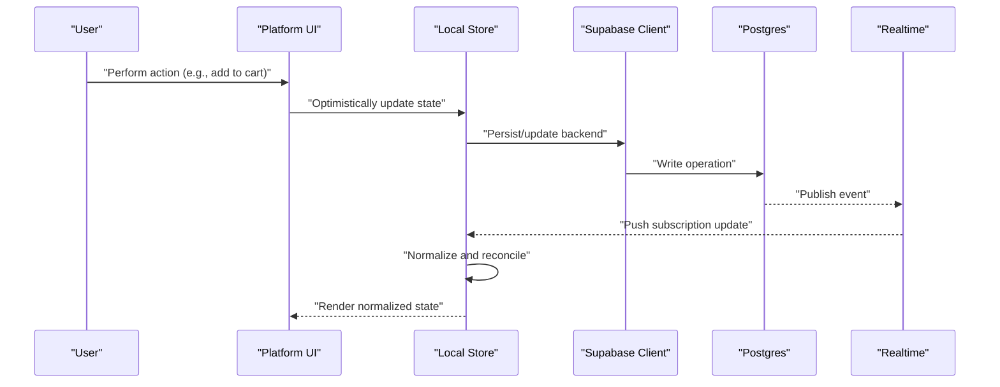
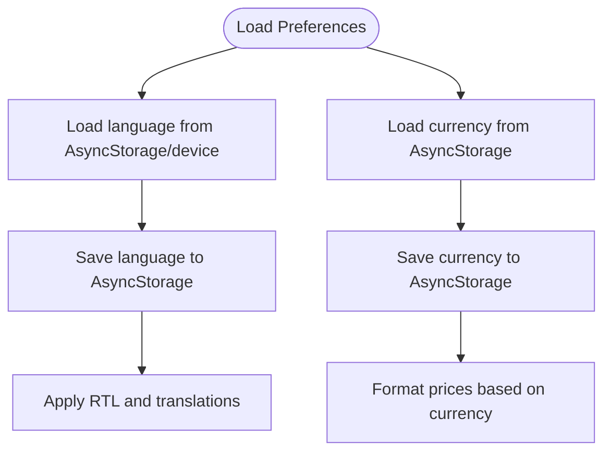
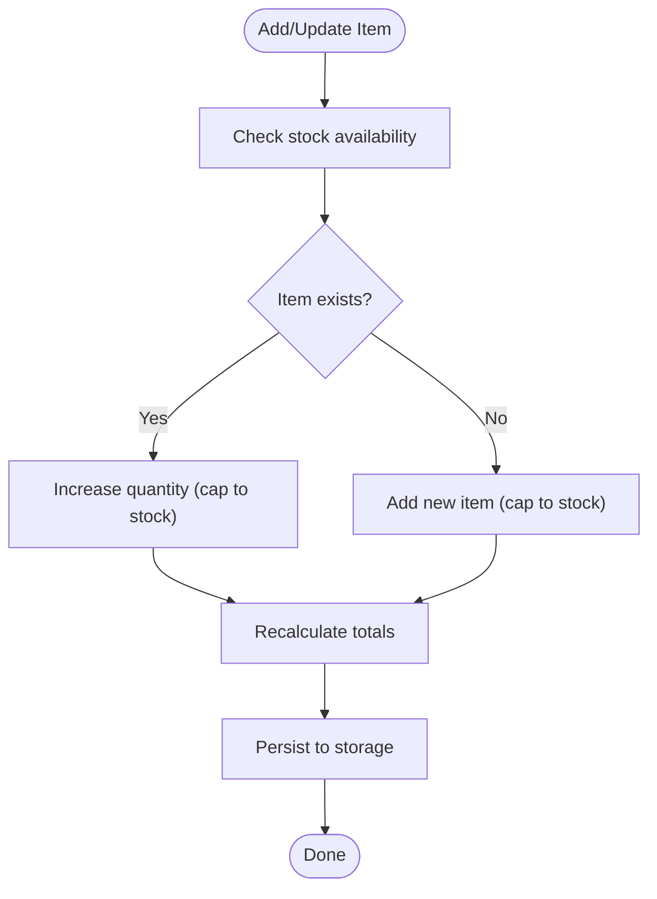
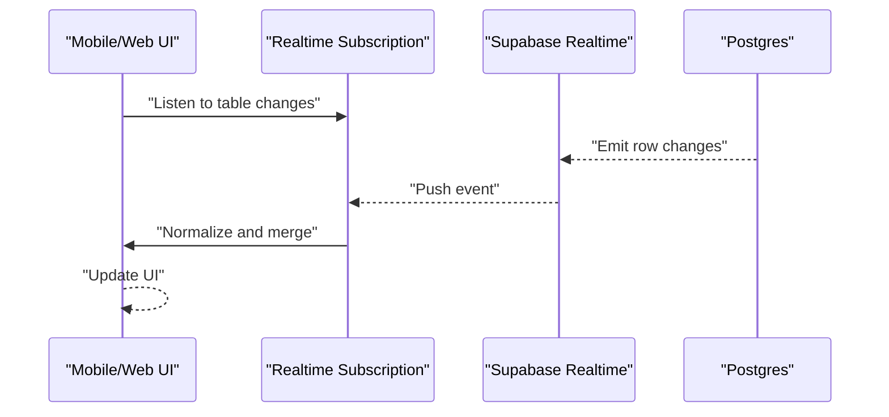
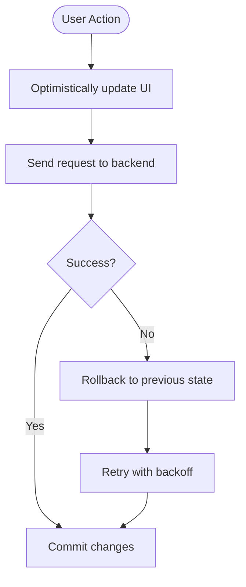
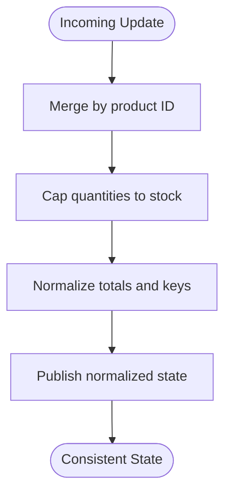
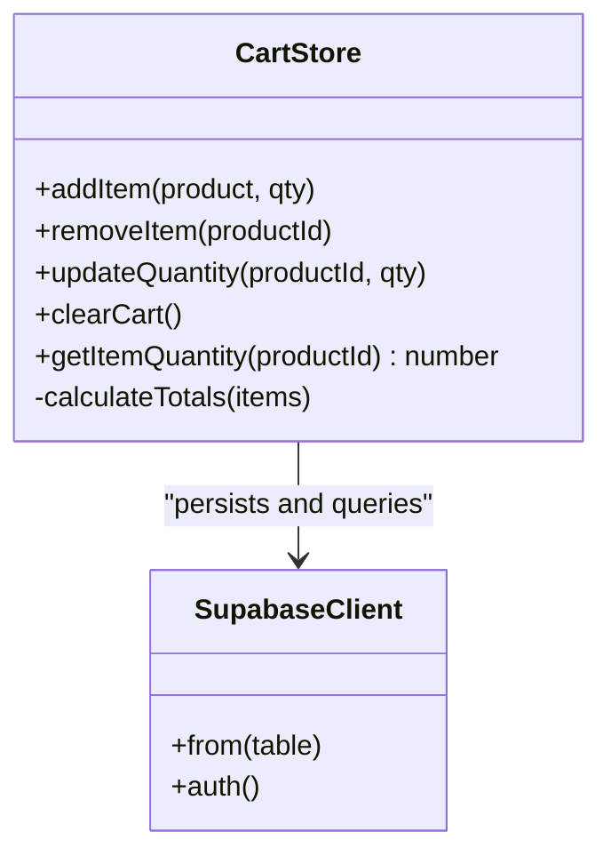
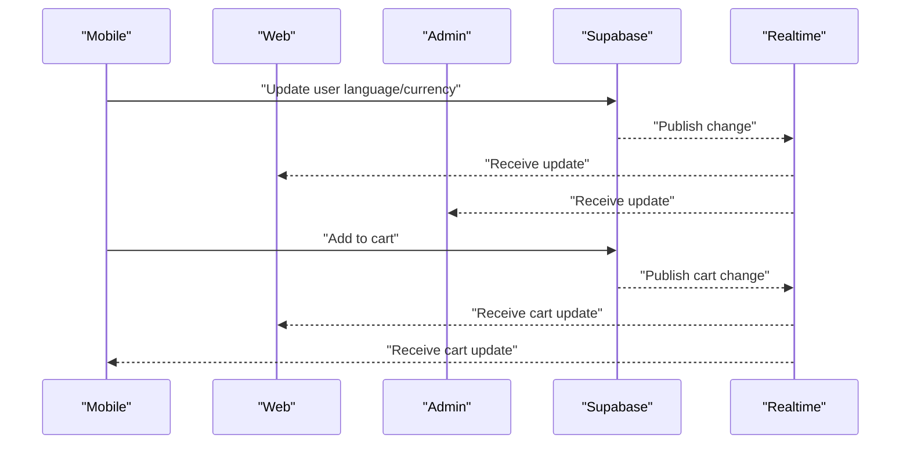
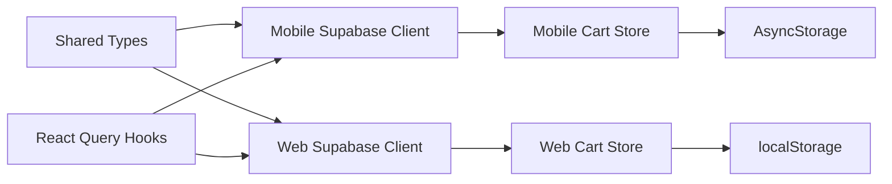

# Cross-Platform Synchronization

<cite>
**Referenced Files in This Document**
- [cartStore.ts](file://store/cartStore.ts)
- [cart.ts](file://web/src/store/cart.ts)
- [CurrencyContext.tsx](file://contexts/CurrencyContext.tsx)
- [LanguageContext.tsx](file://contexts/LanguageContext.tsx)
- [supabase.ts](file://lib/supabase.ts)
- [supabase.ts](file://web/src/lib/supabase.ts)
- [useSupabase.ts](file://hooks/useSupabase.ts)
- [types.ts](file://shared/types.ts)
- [orders.service.ts](file://services/orders.service.ts)
- [README.md](file://admin/README.md)
- [README.md](file://web/README.md)
</cite>

## Table of Contents
1. [Introduction](#introduction)
2. [Project Structure](#project-structure)
3. [Core Components](#core-components)
4. [Architecture Overview](#architecture-overview)
5. [Detailed Component Analysis](#detailed-component-analysis)
6. [Dependency Analysis](#dependency-analysis)
7. [Performance Considerations](#performance-considerations)
8. [Troubleshooting Guide](#troubleshooting-guide)
9. [Conclusion](#conclusion)
10. [Appendices](#appendices)

## Introduction
This document explains how state is synchronized across the mobile app, web storefront, and admin panel. It focuses on maintaining consistent state despite differences in runtime environments (React Native vs. Next.js SSR/CSR), platform-specific storage APIs, and varying network conditions. It covers:
- Global contexts: language and currency preferences
- Cart state synchronization and conflict resolution
- Real-time state updates via Supabase Realtime
- Optimistic updates and offline-first strategies
- State normalization, cache invalidation, and eventual consistency
- Cross-platform state sharing, synchronization triggers, and error handling

## Project Structure
The repository implements a shared Supabase backend consumed by three distinct frontends:
- Mobile (Expo + React Native)
- Web storefront (Next.js)
- Admin panel (Next.js)

Shared types and Supabase clients are centralized to ensure consistent data contracts and client behavior across platforms.

```mermaid
graph TB
subgraph "Mobile App"
M_Store["Zustand Cart Store<br/>AsyncStorage"]
M_Supa["Supabase Client<br/>React Native Auth Storage"]
M_Lang["Language & Currency Contexts"]
end
subgraph "Web Storefront"
W_Store["Zustand Cart Store<br/>localStorage"]
W_Supa["Supabase Client<br/>SSR/CSR Cookies"]
W_Providers["Providers Tree"]
end
subgraph "Admin Panel"
A_UI["Admin UI"]
A_Supa["Supabase Client"]
end
subgraph "Shared Backend"
DB["Supabase Database"]
RT["Supabase Realtime"]
end
M_Store --> M_Supa
W_Store --> W_Supa
A_UI --> A_Supa
M_Supa --> DB
W_Supa --> DB
A_Supa --> DB
DB <- --> RT
```

**Diagram sources**
- [supabase.ts:1-30](file://lib/supabase.ts#L1-L30)
- [supabase.ts:1-36](file://web/src/lib/supabase.ts#L1-L36)
- [cartStore.ts:1-174](file://store/cartStore.ts#L1-L174)
- [cart.ts:1-107](file://web/src/store/cart.ts#L1-L107)
- [README.md:1-271](file://admin/README.md#L1-L271)
- [README.md:1-24](file://web/README.md#L1-L24)

**Section sources**
- [README.md:1-271](file://admin/README.md#L1-L271)
- [README.md:1-24](file://web/README.md#L1-L24)

## Core Components
- Global contexts for language and currency are implemented in the mobile app and provide persistence and formatting utilities.
- Cart stores exist independently in mobile and web, each using platform-appropriate persistence and normalization.
- Supabase clients differ by platform (React Native AsyncStorage vs. Next.js SSR/cookies), but both consume the same shared types.
- React Query hooks encapsulate data fetching and caching for catalogs and content.

Key responsibilities:
- Mobile language/currency contexts: load/save preferences, compute RTL, format prices.
- Web language/currency: handled by Next.js themes and local storage-backed Zustand store.
- Cart stores: normalize items, compute totals, persist state, and reconcile on hydration.
- Supabase clients: configure auth storage/session persistence and SSR cookie handling.

**Section sources**
- [CurrencyContext.tsx:1-96](file://contexts/CurrencyContext.tsx#L1-L96)
- [LanguageContext.tsx:1-84](file://contexts/LanguageContext.tsx#L1-L84)
- [cartStore.ts:1-174](file://store/cartStore.ts#L1-L174)
- [cart.ts:1-107](file://web/src/store/cart.ts#L1-L107)
- [supabase.ts:1-30](file://lib/supabase.ts#L1-L30)
- [supabase.ts:1-36](file://web/src/lib/supabase.ts#L1-L36)
- [useSupabase.ts:1-239](file://hooks/useSupabase.ts#L1-L239)
- [types.ts:1-353](file://shared/types.ts#L1-L353)

## Architecture Overview
Cross-platform synchronization relies on:
- Shared Supabase backend for authoritative state
- Platform-specific clients and persistence
- Real-time subscriptions for live updates
- Optimistic UI updates with reconciliation on server acknowledgment



**Diagram sources**
- [supabase.ts:1-30](file://lib/supabase.ts#L1-L30)
- [supabase.ts:1-36](file://web/src/lib/supabase.ts#L1-L36)
- [cartStore.ts:1-174](file://store/cartStore.ts#L1-L174)
- [cart.ts:1-107](file://web/src/store/cart.ts#L1-L107)
- [orders.service.ts:1-115](file://services/orders.service.ts#L1-L115)

## Detailed Component Analysis

### Language and Currency Preferences
- Mobile:
  - Language context initializes from AsyncStorage or device locale and persists changes.
  - Currency context loads/saves currency preference and formats prices accordingly.
- Web:
  - Language and currency are managed via React Context and Zustand store with localStorage persistence.
- Cross-platform:
  - Preferences are stored locally per platform; no automatic sync across platforms is implemented.
  - Recommendation: persist preferences in Supabase profiles and subscribe to changes for cross-device consistency.



**Diagram sources**
- [LanguageContext.tsx:26-51](file://contexts/LanguageContext.tsx#L26-L51)
- [CurrencyContext.tsx:30-73](file://contexts/CurrencyContext.tsx#L30-L73)

**Section sources**
- [LanguageContext.tsx:1-84](file://contexts/LanguageContext.tsx#L1-L84)
- [CurrencyContext.tsx:1-96](file://contexts/CurrencyContext.tsx#L1-L96)

### Cart State Normalization and Persistence
- Mobile cart store:
  - Uses AsyncStorage for persistence and recalculates totals on hydration.
  - Enforces stock limits and updates quantities atomically.
- Web cart store:
  - Uses localStorage and computes totals on hydration.
  - Applies stock caps when adding/updating items.
- Cross-platform:
  - No direct cart sync between mobile and web; each maintains independent state.
  - Recommendation: synchronize cart via Supabase user carts and subscribe to changes.



**Diagram sources**
- [cartStore.ts:59-99](file://store/cartStore.ts#L59-L99)
- [cartStore.ts:167-173](file://store/cartStore.ts#L167-L173)
- [cart.ts:39-66](file://web/src/store/cart.ts#L39-L66)
- [cart.ts:23-31](file://web/src/store/cart.ts#L23-L31)

**Section sources**
- [cartStore.ts:1-174](file://store/cartStore.ts#L1-L174)
- [cart.ts:1-107](file://web/src/store/cart.ts#L1-L107)

### Real-Time State Updates with Supabase Realtime
- The mobile app’s README documents enabling Supabase Realtime for the orders table to power live order tracking.
- Supabase clients:
  - Mobile: React Native AsyncStorage for auth persistence.
  - Web: SSR/CSR client with cookie handling for sessions.
- Recommendations:
  - Subscribe to relevant tables (e.g., orders, carts) to receive push updates.
  - Normalize incoming events into local stores and invalidate caches selectively.



**Diagram sources**
- [README.md:268-271](file://admin/README.md#L268-L271)
- [supabase.ts:1-30](file://lib/supabase.ts#L1-L30)
- [supabase.ts:1-36](file://web/src/lib/supabase.ts#L1-L36)

**Section sources**
- [README.md:268-271](file://admin/README.md#L268-L271)
- [supabase.ts:1-30](file://lib/supabase.ts#L1-L30)
- [supabase.ts:1-36](file://web/src/lib/supabase.ts#L1-L36)

### Optimistic Updates and Offline-First Strategies
- Both cart stores apply optimistic updates immediately upon user actions.
- On failure, revert to last known good state or retry with exponential backoff.
- Offline-first:
  - Persist changes locally; queue operations and flush when online.
  - Use React Query’s background refetch and cache updates to reconcile.



**Diagram sources**
- [cartStore.ts:59-133](file://store/cartStore.ts#L59-L133)
- [cart.ts:39-91](file://web/src/store/cart.ts#L39-L91)

**Section sources**
- [cartStore.ts:1-174](file://store/cartStore.ts#L1-L174)
- [cart.ts:1-107](file://web/src/store/cart.ts#L1-L107)

### Conflict Resolution for Concurrent Edits
- For cart items edited concurrently on multiple platforms:
  - Use server-side atomic operations (e.g., increment/decrement with version checks).
  - Normalize incoming updates by product ID and merge with local state.
  - If discrepancies persist, re-fetch authoritative state and re-apply local pending changes.



**Diagram sources**
- [cartStore.ts:167-173](file://store/cartStore.ts#L167-L173)
- [cart.ts:23-31](file://web/src/store/cart.ts#L23-L31)

**Section sources**
- [cartStore.ts:1-174](file://store/cartStore.ts#L1-L174)
- [cart.ts:1-107](file://web/src/store/cart.ts#L1-L107)

### Implementation Patterns for State Normalization and Cache Invalidation
- Normalize entities by unique identifiers (e.g., product ID).
- Invalidate caches on mutation events and re-fetch selectively.
- Use React Query’s queryKey patterns to scope invalidations.



**Diagram sources**
- [cartStore.ts:51-164](file://store/cartStore.ts#L51-L164)
- [cart.ts:33-106](file://web/src/store/cart.ts#L33-L106)
- [supabase.ts:1-30](file://lib/supabase.ts#L1-L30)

**Section sources**
- [cartStore.ts:1-174](file://store/cartStore.ts#L1-L174)
- [cart.ts:1-107](file://web/src/store/cart.ts#L1-L107)
- [supabase.ts:1-30](file://lib/supabase.ts#L1-L30)

### Cross-Platform State Sharing and Triggers
- Current state:
  - Language and currency preferences are stored locally per platform.
  - Cart state is independent per platform.
- Recommended triggers:
  - Change language/currency: persist to Supabase profiles and broadcast via Realtime.
  - Cart changes: persist to a user-cart table and subscribe to updates.
  - Order status: listen to orders table for live updates.



**Diagram sources**
- [README.md:268-271](file://admin/README.md#L268-L271)
- [supabase.ts:1-30](file://lib/supabase.ts#L1-L30)
- [supabase.ts:1-36](file://web/src/lib/supabase.ts#L1-L36)

**Section sources**
- [README.md:268-271](file://admin/README.md#L268-L271)
- [supabase.ts:1-30](file://lib/supabase.ts#L1-L30)
- [supabase.ts:1-36](file://web/src/lib/supabase.ts#L1-L36)

### Error Handling for Network Failures
- Local persistence ensures continuity while offline.
- On reconnect, reconcile local state with server and retry failed mutations.
- Use React Query’s error boundaries and retry policies.

**Section sources**
- [cartStore.ts:153-161](file://store/cartStore.ts#L153-L161)
- [cart.ts:97-103](file://web/src/store/cart.ts#L97-L103)

## Dependency Analysis
- Shared types define the canonical schema used by all platforms.
- Supabase clients abstract auth and session handling per platform.
- React Query hooks centralize data fetching and caching.
- Cart stores depend on platform persistence and shared types.



**Diagram sources**
- [types.ts:1-353](file://shared/types.ts#L1-L353)
- [supabase.ts:1-30](file://lib/supabase.ts#L1-L30)
- [supabase.ts:1-36](file://web/src/lib/supabase.ts#L1-L36)
- [cartStore.ts:1-174](file://store/cartStore.ts#L1-L174)
- [cart.ts:1-107](file://web/src/store/cart.ts#L1-L107)
- [useSupabase.ts:1-239](file://hooks/useSupabase.ts#L1-L239)

**Section sources**
- [types.ts:1-353](file://shared/types.ts#L1-L353)
- [supabase.ts:1-30](file://lib/supabase.ts#L1-L30)
- [supabase.ts:1-36](file://web/src/lib/supabase.ts#L1-L36)
- [cartStore.ts:1-174](file://store/cartStore.ts#L1-L174)
- [cart.ts:1-107](file://web/src/store/cart.ts#L1-L107)
- [useSupabase.ts:1-239](file://hooks/useSupabase.ts#L1-L239)

## Performance Considerations
- Prefer selective cache invalidations keyed by entity IDs to minimize re-renders.
- Batch cart updates and debounce frequent mutations.
- Use server-side totals and snapshots to reduce client-side computation overhead.
- Enable Supabase Realtime only for high-churn entities (e.g., orders, carts) to avoid bandwidth waste.

## Troubleshooting Guide
- Language/Currency not applying:
  - Verify AsyncStorage/localStorage keys and initialization order.
  - Confirm RTL toggling and formatting functions are invoked after state updates.
- Cart desync across platforms:
  - Implement a user-cart table and subscribe to changes.
  - Normalize updates by product ID and cap quantities to stock.
- Realtime not updating:
  - Ensure Supabase Realtime is enabled for relevant tables.
  - Verify client credentials and query filters match backend subscriptions.
- Offline persistence issues:
  - Confirm AsyncStorage/localStorage availability and quota limits.
  - Implement retry with backoff and error boundaries.

**Section sources**
- [LanguageContext.tsx:26-51](file://contexts/LanguageContext.tsx#L26-L51)
- [CurrencyContext.tsx:30-73](file://contexts/CurrencyContext.tsx#L30-L73)
- [README.md:268-271](file://admin/README.md#L268-L271)
- [cartStore.ts:153-161](file://store/cartStore.ts#L153-L161)
- [cart.ts:97-103](file://web/src/store/cart.ts#L97-L103)

## Conclusion
Cross-platform state synchronization requires a hybrid approach: authoritative state in Supabase, platform-specific persistence, and real-time subscriptions for live updates. By normalizing entities, applying optimistic updates, and reconciling on server acknowledgment, the system achieves eventual consistency while preserving a smooth user experience. Extending synchronization to language, currency, and cart state via Supabase profiles and user-cart tables will unify behavior across mobile, web, and admin.

## Appendices
- Supabase Realtime setup for orders is documented in the repository notes referenced by the admin README.
- Web storefront requires environment variables for Supabase credentials aligned with the mobile app.

**Section sources**
- [README.md:268-271](file://admin/README.md#L268-L271)
- [README.md:1-24](file://web/README.md#L1-L24)