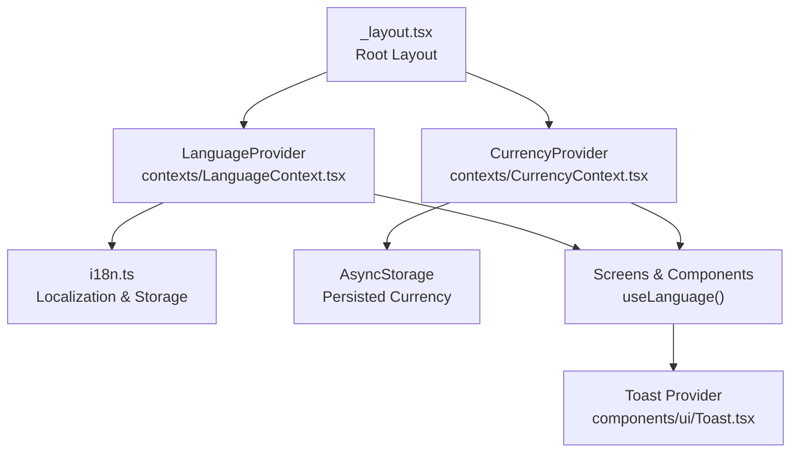
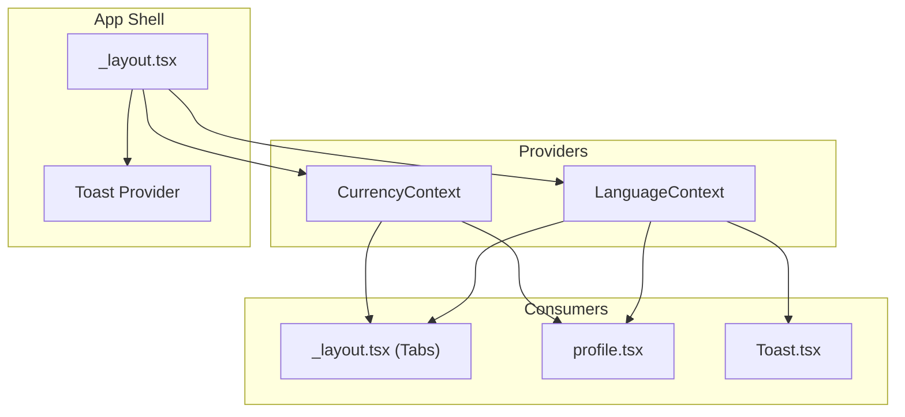
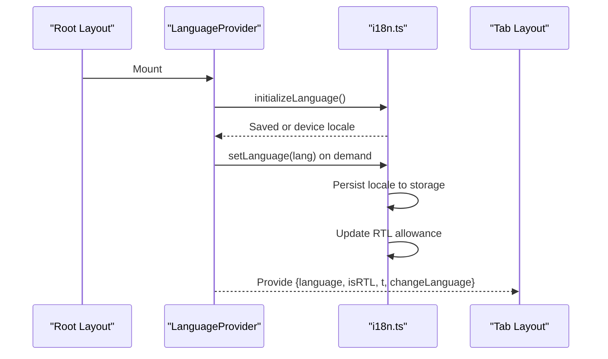
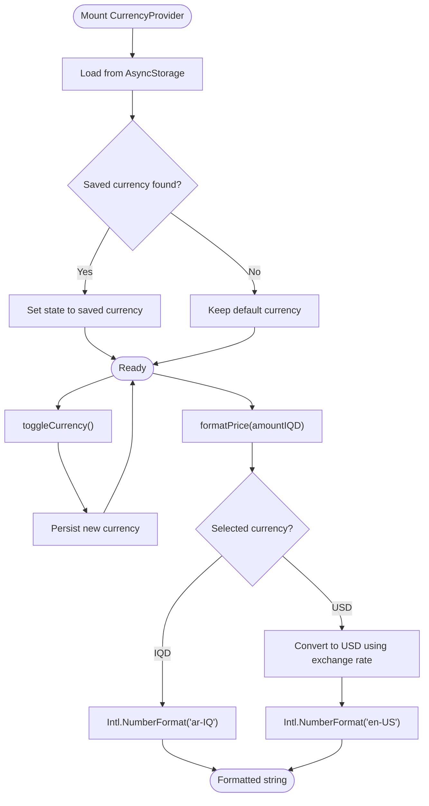
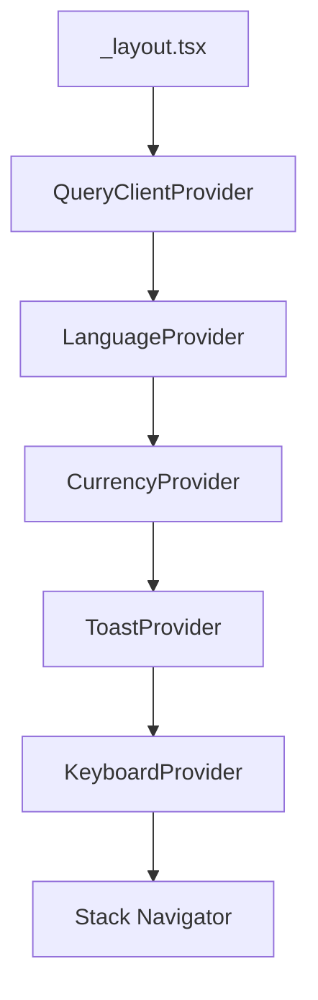
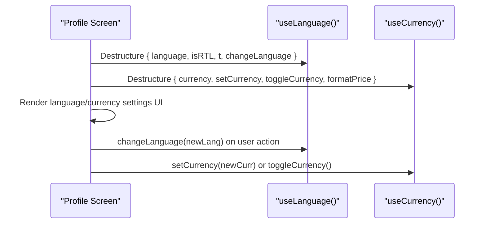
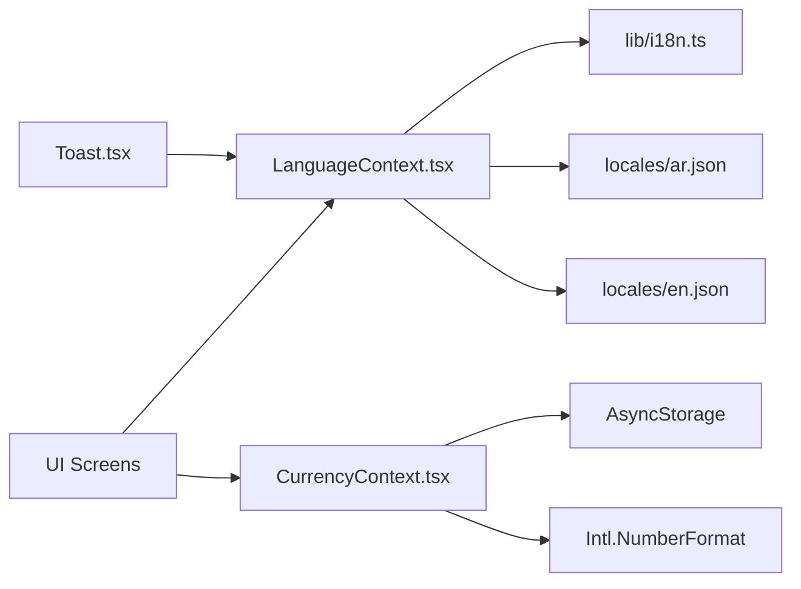

# Global State Providers

<cite>
**Referenced Files in This Document**
- [LanguageContext.tsx](file://contexts/LanguageContext.tsx)
- [CurrencyContext.tsx](file://contexts/CurrencyContext.tsx)
- [index.ts](file://contexts/index.ts)
- [i18n.ts](file://lib/i18n.ts)
- [en.json](file://locales/en.json)
- [ar.json](file://locales/ar.json)
- [_layout.tsx](file://app/_layout.tsx)
- [Toast.tsx](file://components/ui/Toast.tsx)
- [profile.tsx](file://app/(tabs)/profile.tsx)
- [_layout.tsx](file://app/(tabs)/_layout.tsx)
</cite>

## Table of Contents
1. [Introduction](#introduction)
2. [Project Structure](#project-structure)
3. [Core Components](#core-components)
4. [Architecture Overview](#architecture-overview)
5. [Detailed Component Analysis](#detailed-component-analysis)
6. [Dependency Analysis](#dependency-analysis)
7. [Performance Considerations](#performance-considerations)
8. [Troubleshooting Guide](#troubleshooting-guide)
9. [Conclusion](#conclusion)

## Introduction
This document explains the global state provider architecture built on React Context for internationalization and currency handling. It covers:
- Language detection, RTL layout handling, and dynamic language switching via LanguageContext
- Multi-currency support with persisted preferences and price formatting via CurrencyContext
- Provider composition patterns and integration with the application’s navigation and UI layers
- State initialization, hydration from storage, and fallback mechanisms
- Performance considerations, memoization strategies, and best practices for context provider nesting

## Project Structure
The global providers are composed at the root of the application and consumed across screens and components:
- Root provider composition in the application layout
- Context modules exporting provider and consumer hooks
- Shared translation resources and i18n utilities
- UI components consuming language/currency state

**Diagram sources**
- [_layout.tsx:54-106](file://app/_layout.tsx#L54-L106)
- [LanguageContext.tsx:26-62](file://contexts/LanguageContext.tsx#L26-L62)
- [CurrencyContext.tsx:23-80](file://contexts/CurrencyContext.tsx#L23-L80)
- [i18n.ts:24-43](file://lib/i18n.ts#L24-L43)
- [Toast.tsx:139-151](file://components/ui/Toast.tsx#L139-L151)

**Section sources**
- [_layout.tsx:54-106](file://app/_layout.tsx#L54-L106)
- [LanguageContext.tsx:26-62](file://contexts/LanguageContext.tsx#L26-L62)
- [CurrencyContext.tsx:23-80](file://contexts/CurrencyContext.tsx#L23-L80)
- [i18n.ts:24-43](file://lib/i18n.ts#L24-L43)
- [Toast.tsx:139-151](file://components/ui/Toast.tsx#L139-L151)

## Core Components
- LanguageContext: Manages language, RTL direction, loading state, translation function, and language switching with persistence and device fallback.
- CurrencyContext: Manages currency selection, toggling, formatting, and persistence via AsyncStorage.
- i18n utilities: Centralized localization setup, detection, and storage integration.
- Provider composition: Root layout composes providers to wrap the entire app.

Key responsibilities:
- LanguageContext
  - Detects and initializes language from storage or device locale
  - Computes RTL flag based on current language
  - Exposes translation function and changeLanguage method
  - Provides safe fallback values when outside provider
- CurrencyContext
  - Hydrates currency from AsyncStorage on mount
  - Exposes setCurrency, toggleCurrency, and formatPrice
  - Provides safe fallback values when outside provider

**Section sources**
- [LanguageContext.tsx:12-62](file://contexts/LanguageContext.tsx#L12-L62)
- [CurrencyContext.tsx:7-80](file://contexts/CurrencyContext.tsx#L7-L80)
- [i18n.ts:24-77](file://lib/i18n.ts#L24-L77)
- [index.ts:1-3](file://contexts/index.ts#L1-L3)

## Architecture Overview
The providers are composed at the root level and consumed by UI components and navigation screens. LanguageContext integrates with the native RTL manager and the i18n library, while CurrencyContext persists user preferences and formats prices accordingly.

**Diagram sources**
- [_layout.tsx:54-106](file://app/_layout.tsx#L54-L106)
- [LanguageContext.tsx:26-62](file://contexts/LanguageContext.tsx#L26-L62)
- [CurrencyContext.tsx:23-80](file://contexts/CurrencyContext.tsx#L23-L80)
- [Toast.tsx:139-151](file://components/ui/Toast.tsx#L139-L151)
- [profile.tsx](file://app/(tabs)/profile.tsx#L18-L25)
- [_layout.tsx](file://app/(tabs)/_layout.tsx#L16-L18)

## Detailed Component Analysis

### LanguageContext
- Initialization and hydration
  - Loads saved language from storage during mount and sets i18n locale
  - Falls back to device locale if none saved; supports only Arabic and English
  - Sets RTL allowance via the native RTL manager
- Dynamic language switching
  - Persists selected language to storage
  - Updates i18n locale and RTL allowance
  - Prevents redundant updates when selecting the current language
- Consumers
  - Exposes translation function and computed RTL flag
  - Provides shortcut hook for translation and language metadata
  - Fallback hook returns safe defaults when not inside provider

**Diagram sources**
- [_layout.tsx:54-106](file://app/_layout.tsx#L54-L106)
- [LanguageContext.tsx:31-51](file://contexts/LanguageContext.tsx#L31-L51)
- [i18n.ts:24-77](file://lib/i18n.ts#L24-L77)
- [_layout.tsx](file://app/(tabs)/_layout.tsx#L16-L18)

**Section sources**
- [LanguageContext.tsx:26-77](file://contexts/LanguageContext.tsx#L26-L77)
- [i18n.ts:24-77](file://lib/i18n.ts#L24-L77)
- [en.json:1-413](file://locales/en.json#L1-L413)
- [ar.json:1-413](file://locales/ar.json#L1-L413)

### CurrencyContext
- Initialization and hydration
  - Reads saved currency from AsyncStorage on mount
  - Accepts only supported currencies
- Mutations and persistence
  - setCurrency updates state and persists to storage
  - toggleCurrency switches between supported currencies
- Formatting
  - formatPrice converts IQD amounts to either IQD or USD depending on selected currency
  - Uses locale-aware formatting for Arabic and US English

**Diagram sources**
- [CurrencyContext.tsx:23-80](file://contexts/CurrencyContext.tsx#L23-L80)

**Section sources**
- [CurrencyContext.tsx:7-95](file://contexts/CurrencyContext.tsx#L7-L95)

### Provider Composition Patterns
- Root-level composition
  - Providers are nested in a specific order to ensure proper propagation
  - LanguageProvider wraps CurrencyProvider to ensure language state is available when currency formatting runs
  - ToastProvider consumes language to compute text direction and layout
- Nesting best practices
  - Place global providers near the root
  - Keep domain-specific providers grouped together
  - Avoid deep nesting; prefer a flat hierarchy with clear boundaries

**Diagram sources**
- [_layout.tsx:54-106](file://app/_layout.tsx#L54-L106)

**Section sources**
- [_layout.tsx:54-106](file://app/_layout.tsx#L54-L106)
- [Toast.tsx:139-151](file://components/ui/Toast.tsx#L139-L151)

### Implementation Details: State Initialization, Hydration, and Fallbacks
- LanguageContext
  - Hydration occurs in a lifecycle effect that loads saved language and determines RTL
  - changeLanguage guards against redundant updates and logs errors
  - useLanguage returns safe defaults when not inside provider
- CurrencyContext
  - Hydration reads AsyncStorage and validates supported values
  - setCurrency persists changes and updates state atomically
  - useCurrency returns safe defaults when not inside provider
- i18n utilities
  - initializeLanguage hydrates from storage or device locale
  - setLanguage persists and updates RTL allowance

**Section sources**
- [LanguageContext.tsx:31-51](file://contexts/LanguageContext.tsx#L31-L51)
- [CurrencyContext.tsx:30-53](file://contexts/CurrencyContext.tsx#L30-L53)
- [i18n.ts:24-77](file://lib/i18n.ts#L24-L77)

### Usage Examples and Custom Hooks
- Consuming language and currency in a screen
  - Access translation, RTL, and language via useLanguage
  - Manage currency via useCurrency (setCurrency, toggleCurrency, formatPrice)
- Example usage locations
  - Tabs layout uses translation keys and RTL for tab labels
  - Profile screen exposes language and currency controls

**Diagram sources**
- [profile.tsx](file://app/(tabs)/profile.tsx#L18-L25)
- [LanguageContext.tsx:64-83](file://contexts/LanguageContext.tsx#L64-L83)
- [CurrencyContext.tsx:82-95](file://contexts/CurrencyContext.tsx#L82-L95)

**Section sources**
- [profile.tsx](file://app/(tabs)/profile.tsx#L18-L25)
- [_layout.tsx](file://app/(tabs)/_layout.tsx#L16-L18)

## Dependency Analysis
- LanguageContext depends on:
  - i18n utilities for locale management and storage
  - AsyncStorage via i18n for persistence
  - Native RTL manager for layout direction
- CurrencyContext depends on:
  - AsyncStorage for persistence
  - Intl.NumberFormat for locale-aware formatting
- UI consumers depend on:
  - LanguageContext for translations and RTL
  - CurrencyContext for pricing and formatting

**Diagram sources**
- [LanguageContext.tsx:1-10](file://contexts/LanguageContext.tsx#L1-L10)
- [i18n.ts:1-8](file://lib/i18n.ts#L1-L8)
- [CurrencyContext.tsx:1-4](file://contexts/CurrencyContext.tsx#L1-L4)
- [en.json:1-413](file://locales/en.json#L1-L413)
- [ar.json:1-413](file://locales/ar.json#L1-L413)
- [Toast.tsx:139-151](file://components/ui/Toast.tsx#L139-L151)

**Section sources**
- [LanguageContext.tsx:1-10](file://contexts/LanguageContext.tsx#L1-L10)
- [CurrencyContext.tsx:1-4](file://contexts/CurrencyContext.tsx#L1-L4)
- [i18n.ts:1-8](file://lib/i18n.ts#L1-L8)
- [en.json:1-413](file://locales/en.json#L1-L413)
- [ar.json:1-413](file://locales/ar.json#L1-L413)
- [Toast.tsx:139-151](file://components/ui/Toast.tsx#L139-L151)

## Performance Considerations
- Minimize re-renders
  - Keep provider state granular; avoid forcing updates of unrelated consumers
  - Memoize derived values (e.g., formatted strings) when expensive
- Avoid unnecessary work
  - Guard against redundant updates in changeLanguage and setCurrency
  - Debounce or batch UI updates when toggling frequently
- Storage IO
  - Batch AsyncStorage writes when possible
  - Prefer hydration on mount rather than per-render updates
- Formatting costs
  - Use Intl.NumberFormat once per render cycle
  - Cache locale-specific formatters if needed
- Provider nesting
  - Maintain a shallow provider tree
  - Avoid wrapping heavy subtrees unnecessarily

[No sources needed since this section provides general guidance]

## Troubleshooting Guide
- Language does not update
  - Ensure changeLanguage is called with a different language than the current one
  - Verify AsyncStorage write succeeded and i18n locale was updated
- RTL not applied
  - Confirm RTL allowance is set after language change
  - Ensure the consuming component reads isRTL from useLanguage
- Currency not persisting
  - Check AsyncStorage key and value types
  - Verify toggle/setCurrency is invoked and AsyncStorage write completes
- Formatting incorrect
  - Confirm selected currency matches expected locale
  - Validate exchange rate and number formatting options

**Section sources**
- [LanguageContext.tsx:41-51](file://contexts/LanguageContext.tsx#L41-L51)
- [i18n.ts:56-72](file://lib/i18n.ts#L56-L72)
- [CurrencyContext.tsx:41-53](file://contexts/CurrencyContext.tsx#L41-L53)

## Conclusion
The global state providers leverage React Context to centralize language and currency concerns. LanguageContext integrates with i18n and the native RTL manager, while CurrencyContext persists user preferences and formats prices. The root-level provider composition ensures consistent availability across the app, and consumers use dedicated hooks to access state safely. Following the outlined patterns and performance tips helps maintain a responsive and predictable user experience.