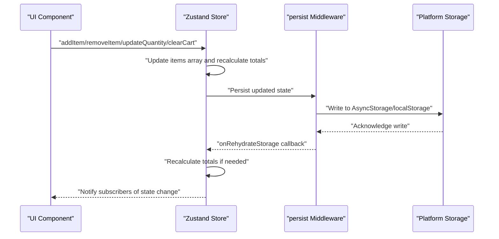
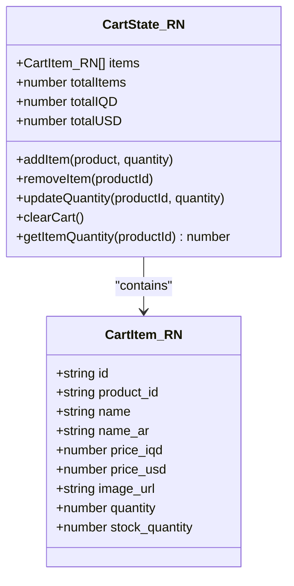
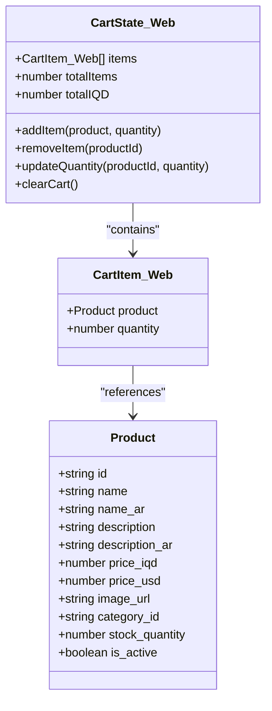
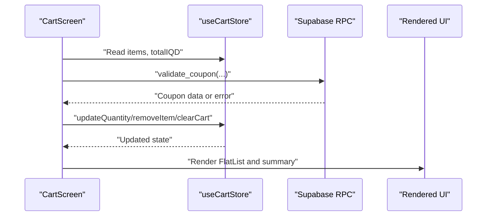
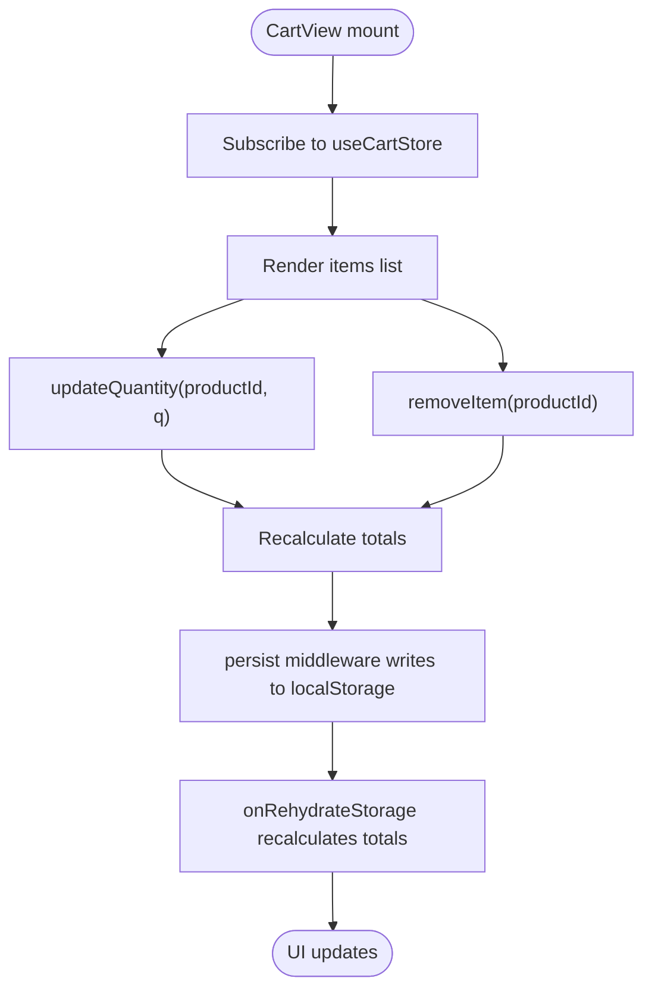
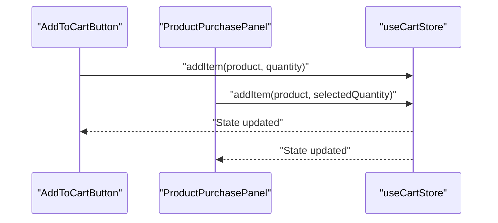
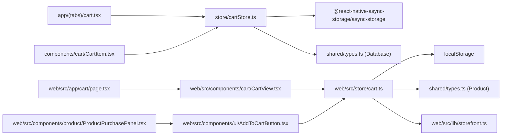

# Local State Stores

<cite>
**Referenced Files in This Document**
- [store/cartStore.ts](file://store/cartStore.ts)
- [app/(tabs)/cart.tsx](file://app/(tabs)/cart.tsx)
- [components/cart/CartItem.tsx](file://components/cart/CartItem.tsx)
- [web/src/store/cart.ts](file://web/src/store/cart.ts)
- [web/src/app/cart/page.tsx](file://web/src/app/cart/page.tsx)
- [web/src/components/cart/CartView.tsx](file://web/src/components/cart/CartView.tsx)
- [web/src/components/product/ProductPurchasePanel.tsx](file://web/src/components/product/ProductPurchasePanel.tsx)
- [web/src/components/ui/AddToCartButton.tsx](file://web/src/components/ui/AddToCartButton.tsx)
- [shared/types.ts](file://shared/types.ts)
- [types/index.ts](file://types/index.ts)
- [web/src/lib/storefront.ts](file://web/src/lib/storefront.ts)
</cite>

## Table of Contents
1. [Introduction](#introduction)
2. [Project Structure](#project-structure)
3. [Core Components](#core-components)
4. [Architecture Overview](#architecture-overview)
5. [Detailed Component Analysis](#detailed-component-analysis)
6. [Dependency Analysis](#dependency-analysis)
7. [Performance Considerations](#performance-considerations)
8. [Troubleshooting Guide](#troubleshooting-guide)
9. [Conclusion](#conclusion)
10. [Appendices](#appendices)

## Introduction
This document explains the local state management using Zustand stores for cart functionality across mobile (React Native) and web (Next.js) platforms. It covers store architecture, actions, selectors, persistence strategies, hydration, and platform-specific optimizations. It also provides guidance on subscriptions, middleware integration, debugging, performance tuning, and extending the cart store while maintaining state consistency.

## Project Structure
The cart state is implemented separately for each platform:
- Mobile: React Native store with AsyncStorage-backed persistence
- Web: Next.js store with localStorage-backed persistence

Key files:
- Mobile store and screen: store/cartStore.ts, app/(tabs)/cart.tsx, components/cart/CartItem.tsx
- Web store and views: web/src/store/cart.ts, web/src/app/cart/page.tsx, web/src/components/cart/CartView.tsx
- Shared types: shared/types.ts, types/index.ts
- Utilities and formatting: web/src/lib/storefront.ts

```mermaid
graph TB
subgraph "Mobile (React Native)"
RN_Store["store/cartStore.ts<br/>Zustand store with AsyncStorage"]
RN_Screen["app/(tabs)/cart.tsx<br/>Cart screen"]
RN_Item["components/cart/CartItem.tsx<br/>Cart item row"]
end
subgraph "Web (Next.js)"
Web_Store["web/src/store/cart.ts<br/>Zustand store with localStorage"]
Web_Page["web/src/app/cart/page.tsx<br/>Cart page entry"]
Web_View["web/src/components/cart/CartView.tsx<br/>Cart view"]
Web_Add["web/src/components/ui/AddToCartButton.tsx<br/>Add to cart button"]
Web_Purchase["web/src/components/product/ProductPurchasePanel.tsx<br/>Product purchase panel"]
end
RN_Store --> RN_Screen
RN_Screen --> RN_Item
Web_Store --> Web_Page
Web_Page --> Web_View
Web_Add --> Web_Store
Web_Purchase --> Web_Add
```

**Diagram sources**
- [store/cartStore.ts:1-174](file://store/cartStore.ts#L1-L174)
- [app/(tabs)/cart.tsx:1-417](file://app/(tabs)/cart.tsx#L1-L417)
- [components/cart/CartItem.tsx:1-169](file://components/cart/CartItem.tsx#L1-L169)
- [web/src/store/cart.ts:1-107](file://web/src/store/cart.ts#L1-L107)
- [web/src/app/cart/page.tsx:1-8](file://web/src/app/cart/page.tsx#L1-L8)
- [web/src/components/cart/CartView.tsx:1-179](file://web/src/components/cart/CartView.tsx#L1-L179)
- [web/src/components/ui/AddToCartButton.tsx:1-46](file://web/src/components/ui/AddToCartButton.tsx#L1-L46)
- [web/src/components/product/ProductPurchasePanel.tsx:1-261](file://web/src/components/product/ProductPurchasePanel.tsx#L1-L261)

**Section sources**
- [store/cartStore.ts:1-174](file://store/cartStore.ts#L1-L174)
- [web/src/store/cart.ts:1-107](file://web/src/store/cart.ts#L1-L107)

## Core Components
- Mobile Zustand store (AsyncStorage):
  - Types: CartItem with id, product_id, name/name_ar, prices, image_url, quantity, stock_quantity
  - Actions: addItem, removeItem, updateQuantity, clearCart, getItemQuantity
  - Totals: totalItems, totalIQD, totalUSD
  - Persistence: persist with AsyncStorage, onRehydrateStorage recalculates totals
  - Formatting helpers: formatIQD, formatUSD
- Web Zustand store (localStorage):
  - Types: CartItem with nested product and quantity
  - Actions: addItem, removeItem, updateQuantity, clearCart
  - Totals: totalItems, totalIQD
  - Persistence: persist with localStorage, onRehydrateStorage recalculates totals
- Shared types:
  - Database product shape and derived Product type for web
  - Additional base types and enums used across the app

Key differences:
- Mobile store tracks USD totals and includes getItemQuantity selector; web store focuses on IQD totals for storefront pricing.
- Storage medium differs (AsyncStorage vs localStorage).
- Stock enforcement and error signaling differ slightly (throw vs guard with min(quantity, stock_quantity)).

**Section sources**
- [store/cartStore.ts:6-29](file://store/cartStore.ts#L6-L29)
- [store/cartStore.ts:51-164](file://store/cartStore.ts#L51-L164)
- [web/src/store/cart.ts:8-21](file://web/src/store/cart.ts#L8-L21)
- [web/src/store/cart.ts:33-106](file://web/src/store/cart.ts#L33-L106)
- [shared/types.ts:10-32](file://shared/types.ts#L10-L32)
- [types/index.ts:8-20](file://types/index.ts#L8-L20)

## Architecture Overview
The cart state is encapsulated in a Zustand store with persistence middleware. On app launch, the store hydrates from platform storage and recalculates totals. UI components subscribe to the store via hooks and trigger actions to mutate state.

**Diagram sources**
- [store/cartStore.ts:51-164](file://store/cartStore.ts#L51-L164)
- [web/src/store/cart.ts:33-106](file://web/src/store/cart.ts#L33-L106)

## Detailed Component Analysis

### Mobile Cart Store (React Native)
- State shape and actions:
  - items: CartItem[]
  - totals: totalItems, totalIQD, totalUSD
  - addItem validates stock and throws if insufficient
  - updateQuantity validates stock and removes item if quantity falls to zero
  - removeItem filters out the item
  - clearCart resets to empty state
  - getItemQuantity helper returns current quantity
- Persistence:
  - name: "cart-storage"
  - storage: AsyncStorage
  - onRehydrateStorage recalculates totals from hydrated items
- Formatting:
  - formatIQD and formatUSD helpers for consistent currency display

**Diagram sources**
- [store/cartStore.ts:6-29](file://store/cartStore.ts#L6-L29)

**Section sources**
- [store/cartStore.ts:51-164](file://store/cartStore.ts#L51-L164)

### Web Cart Store (Next.js)
- State shape and actions:
  - items: { product: Product, quantity }[]
  - totals: totalItems, totalIQD
  - addItem guards quantity against stock
  - updateQuantity guards and removes if quantity <= 0
  - removeItem filters out the item
  - clearCart resets totals and items
- Persistence:
  - name: "storefront-cart"
  - storage: localStorage
  - onRehydrateStorage recalculates totals from hydrated items
- Shared types:
  - Product interface used for web store items

**Diagram sources**
- [web/src/store/cart.ts:8-21](file://web/src/store/cart.ts#L8-L21)
- [shared/types.ts:217-219](file://shared/types.ts#L217-L219)

**Section sources**
- [web/src/store/cart.ts:33-106](file://web/src/store/cart.ts#L33-L106)
- [shared/types.ts:217-219](file://shared/types.ts#L217-L219)

### Cart Screen (Mobile)
- Subscribes to useCartStore to render items and totals
- Implements coupon application via RPC call and updates discount
- Computes order summary with delivery fee and discount
- Uses FlatList for performance on large carts
- Memoized callbacks and calculations reduce re-renders

**Diagram sources**
- [app/(tabs)/cart.tsx:18-417](file://app/(tabs)/cart.tsx#L18-L417)
- [store/cartStore.ts:51-164](file://store/cartStore.ts#L51-L164)

**Section sources**
- [app/(tabs)/cart.tsx:18-417](file://app/(tabs)/cart.tsx#L18-L417)

### Cart View (Web)
- Subscribes to useCartStore to render items and totals
- Provides quantity controls and remove actions
- Displays order summary with discount and total amount
- Uses memoization and localized formatting

**Diagram sources**
- [web/src/components/cart/CartView.tsx:12-179](file://web/src/components/cart/CartView.tsx#L12-L179)
- [web/src/store/cart.ts:33-106](file://web/src/store/cart.ts#L33-L106)

**Section sources**
- [web/src/components/cart/CartView.tsx:12-179](file://web/src/components/cart/CartView.tsx#L12-L179)

### Add to Cart Components (Web)
- AddToCartButton triggers addItem with default quantity
- ProductPurchasePanel integrates quantity selection and notices

**Diagram sources**
- [web/src/components/ui/AddToCartButton.tsx:16-46](file://web/src/components/ui/AddToCartButton.tsx#L16-L46)
- [web/src/components/product/ProductPurchasePanel.tsx:52-63](file://web/src/components/product/ProductPurchasePanel.tsx#L52-L63)
- [web/src/store/cart.ts:33-106](file://web/src/store/cart.ts#L33-L106)

**Section sources**
- [web/src/components/ui/AddToCartButton.tsx:16-46](file://web/src/components/ui/AddToCartButton.tsx#L16-L46)
- [web/src/components/product/ProductPurchasePanel.tsx:52-63](file://web/src/components/product/ProductPurchasePanel.tsx#L52-L63)

## Dependency Analysis
- Mobile store depends on:
  - AsyncStorage for persistence
  - Database product shape for typed addItem
  - Currency formatters for display
- Web store depends on:
  - localStorage for persistence
  - Product type for typed addItem
  - storefront utilities for formatting and translations
- UI components depend on:
  - Store hooks for state and actions
  - Contexts for language and currency formatting

**Diagram sources**
- [store/cartStore.ts:1-4](file://store/cartStore.ts#L1-L4)
- [shared/types.ts:10-32](file://shared/types.ts#L10-L32)
- [web/src/store/cart.ts:1-6](file://web/src/store/cart.ts#L1-L6)
- [web/src/lib/storefront.ts:527-535](file://web/src/lib/storefront.ts#L527-L535)
- [app/(tabs)/cart.tsx:1-9](file://app/(tabs)/cart.tsx#L1-L9)
- [components/cart/CartItem.tsx:1-5](file://components/cart/CartItem.tsx#L1-L5)
- [web/src/app/cart/page.tsx:1-7](file://web/src/app/cart/page.tsx#L1-L7)
- [web/src/components/cart/CartView.tsx:8-10](file://web/src/components/cart/CartView.tsx#L8-L10)
- [web/src/components/ui/AddToCartButton.tsx:5-8](file://web/src/components/ui/AddToCartButton.tsx#L5-L8)
- [web/src/components/product/ProductPurchasePanel.tsx:6-13](file://web/src/components/product/ProductPurchasePanel.tsx#L6-L13)

**Section sources**
- [store/cartStore.ts:1-4](file://store/cartStore.ts#L1-L4)
- [web/src/store/cart.ts:1-6](file://web/src/store/cart.ts#L1-L6)
- [shared/types.ts:10-32](file://shared/types.ts#L10-L32)
- [web/src/lib/storefront.ts:527-535](file://web/src/lib/storefront.ts#L527-L535)

## Performance Considerations
- Prefer memoization:
  - Use memoized callbacks for list item rendering (mobile)
  - Use useMemo for computed totals (mobile)
  - Use shallow selectors in web store to avoid unnecessary re-renders
- Efficient updates:
  - Batch updates by updating items array once per action
  - Avoid redundant recalculations by computing totals in one place
- Large cart optimization:
  - Use FlatList on mobile for virtualized rendering
  - Keep item arrays minimal; avoid deep copies unless necessary
- Storage efficiency:
  - Persist only essential fields
  - Debounce writes if needed (middleware handles persistence automatically)
- Memory management:
  - Clear cart when appropriate
  - Avoid retaining references to removed items

[No sources needed since this section provides general guidance]

## Troubleshooting Guide
Common issues and resolutions:
- Stock validation errors (mobile):
  - addItem/updateQuantity throws when requested quantity exceeds stock
  - Ensure UI respects stock_quantity and disables controls accordingly
- Hydration mismatches:
  - onRehydrateStorage recalculates totals; verify items structure matches expected shape
  - Confirm storage keys ("cart-storage", "storefront-cart") are unique per environment
- Currency formatting inconsistencies:
  - Mobile uses formatIQD/formatUSD helpers; web uses storefront.formatIQD
  - Ensure locale and currency codes match target markets
- Action not triggering updates:
  - Verify component subscribes to the store correctly
  - Ensure actions are called with correct signatures and parameters
- Debugging techniques:
  - Log state transitions in actions
  - Use browser devtools to inspect localStorage entries
  - Use React DevTools to monitor component re-renders

**Section sources**
- [store/cartStore.ts:63-82](file://store/cartStore.ts#L63-L82)
- [store/cartStore.ts:153-161](file://store/cartStore.ts#L153-L161)
- [web/src/store/cart.ts:97-103](file://web/src/store/cart.ts#L97-L103)
- [web/src/lib/storefront.ts:527-535](file://web/src/lib/storefront.ts#L527-L535)

## Conclusion
The cart state is robustly implemented with platform-specific stores leveraging Zustand’s simplicity and persistence middleware. Mobile and web share similar action semantics while adapting to platform storage and UI patterns. By following the recommended practices—memoization, efficient updates, hydration hygiene, and debugging—the cart remains performant and maintainable as features evolve.

[No sources needed since this section summarizes without analyzing specific files]

## Appendices

### State Persistence Strategies
- Mobile:
  - Storage: AsyncStorage
  - Key: "cart-storage"
  - Rehydration: Recalculate totals from items
- Web:
  - Storage: localStorage
  - Key: "storefront-cart"
  - Rehydration: Recalculate totals from items

**Section sources**
- [store/cartStore.ts:150-162](file://store/cartStore.ts#L150-L162)
- [web/src/store/cart.ts:94-104](file://web/src/store/cart.ts#L94-L104)

### Extending the Cart Store
Recommended steps:
- Define new action(s) in the store creator
- Add corresponding UI handlers and pass parameters
- Update totals calculation in one place (helper function)
- Ensure persistence middleware persists new fields
- Add tests to verify state transitions and hydration

[No sources needed since this section provides general guidance]