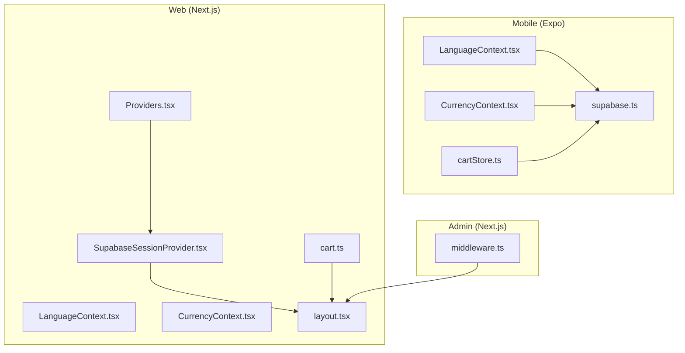
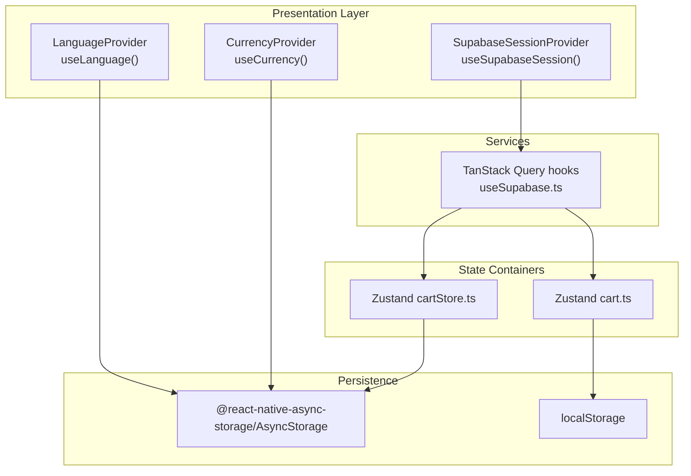
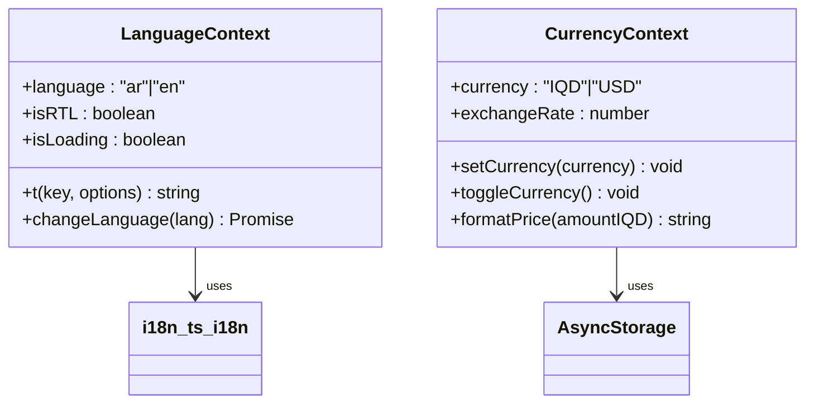
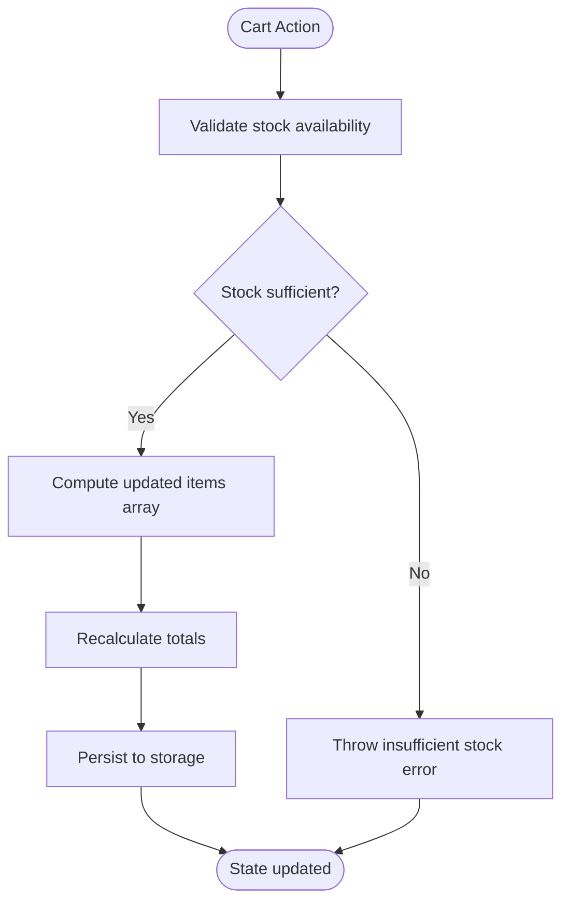
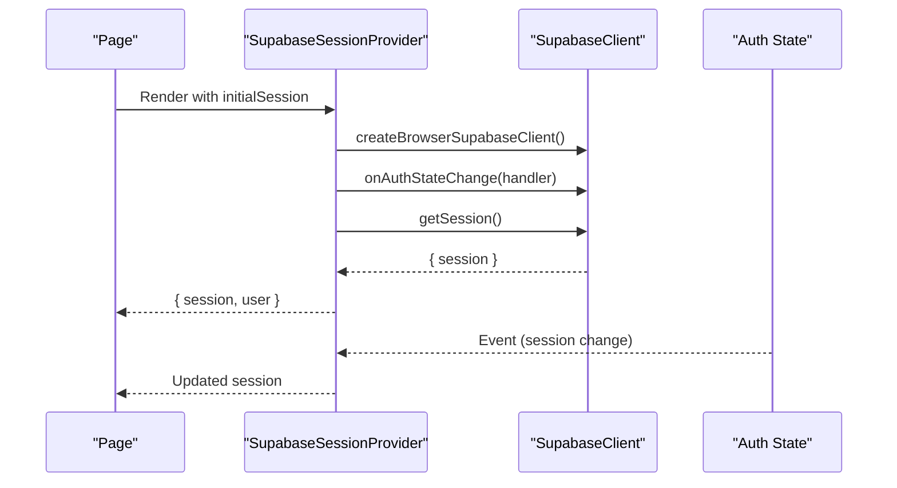
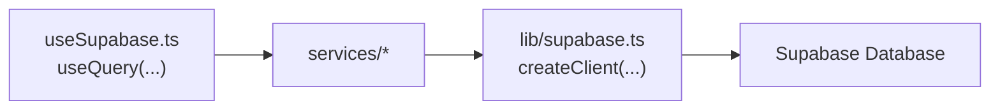
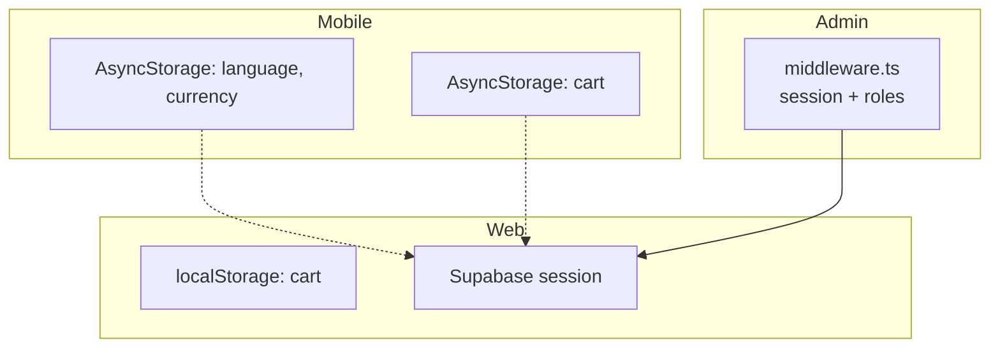
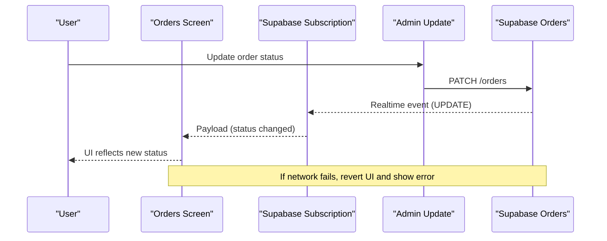
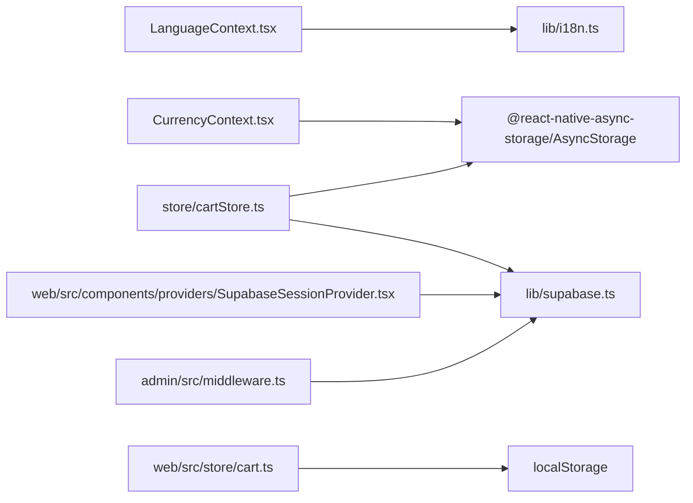

# State Management

<cite>
**Referenced Files in This Document**
- [LanguageContext.tsx](file://contexts/LanguageContext.tsx)
- [CurrencyContext.tsx](file://contexts/CurrencyContext.tsx)
- [index.ts](file://contexts/index.ts)
- [i18n.ts](file://lib/i18n.ts)
- [supabase.ts](file://lib/supabase.ts)
- [useSupabase.ts](file://hooks/useSupabase.ts)
- [cartStore.ts](file://store/cartStore.ts)
- [cart.ts](file://web/src/store/cart.ts)
- [SupabaseSessionProvider.tsx](file://web/src/components/providers/SupabaseSessionProvider.tsx)
- [Providers.tsx](file://web/src/components/providers/Providers.tsx)
- [layout.tsx](file://web/src/app/layout.tsx)
- [ORDERS_REALTIME_SETUP.md](file://.docs/ORDERS_REALTIME_SETUP.md)
- [orders.tsx](file://app/orders.tsx)
- [middleware.ts](file://admin/src/middleware.ts)
</cite>

## Table of Contents
1. [Introduction](#introduction)
2. [Project Structure](#project-structure)
3. [Core Components](#core-components)
4. [Architecture Overview](#architecture-overview)
5. [Detailed Component Analysis](#detailed-component-analysis)
6. [Dependency Analysis](#dependency-analysis)
7. [Performance Considerations](#performance-considerations)
8. [Troubleshooting Guide](#troubleshooting-guide)
9. [Conclusion](#conclusion)
10. [Appendices](#appendices)

## Introduction
This document explains the state management architecture across the mobile (Expo), web (Next.js), and admin platforms. It covers:
- React Context pattern for global language and currency preferences
- Authentication state via Supabase session management
- Zustand stores for cart state with persistence and hydration
- Cross-platform synchronization strategies
- Persistence, hydration, and restoration after restart
- Real-time updates, optimistic updates, and conflict resolution
- Integration with the service layer and performance optimization
- Guidance for extending state management and maintaining consistency

## Project Structure
The state management spans three major environments:
- Mobile (Expo): Context providers for language/currency, Zustand cart store with AsyncStorage persistence
- Web (Next.js): Context/session providers, Zustand cart store with localStorage persistence
- Admin (Next.js): Middleware for session protection and role-based access

**Diagram sources**
- [LanguageContext.tsx:1-84](file://contexts/LanguageContext.tsx#L1-L84)
- [CurrencyContext.tsx:1-96](file://contexts/CurrencyContext.tsx#L1-L96)
- [cartStore.ts:1-174](file://store/cartStore.ts#L1-L174)
- [supabase.ts:1-30](file://lib/supabase.ts#L1-L30)
- [cart.ts:1-107](file://web/src/store/cart.ts#L1-L107)
- [SupabaseSessionProvider.tsx:1-74](file://web/src/components/providers/SupabaseSessionProvider.tsx#L1-L74)
- [Providers.tsx:1-32](file://web/src/components/providers/Providers.tsx#L1-L32)
- [layout.tsx:1-61](file://web/src/app/layout.tsx#L1-L61)
- [middleware.ts:1-90](file://admin/src/middleware.ts#L1-L90)

**Section sources**
- [LanguageContext.tsx:1-84](file://contexts/LanguageContext.tsx#L1-L84)
- [CurrencyContext.tsx:1-96](file://contexts/CurrencyContext.tsx#L1-L96)
- [cartStore.ts:1-174](file://store/cartStore.ts#L1-L174)
- [cart.ts:1-107](file://web/src/store/cart.ts#L1-L107)
- [SupabaseSessionProvider.tsx:1-74](file://web/src/components/providers/SupabaseSessionProvider.tsx#L1-L74)
- [Providers.tsx:1-32](file://web/src/components/providers/Providers.tsx#L1-L32)
- [layout.tsx:1-61](file://web/src/app/layout.tsx#L1-L61)
- [supabase.ts:1-30](file://lib/supabase.ts#L1-L30)
- [middleware.ts:1-90](file://admin/src/middleware.ts#L1-L90)

## Core Components
- Global language and direction: Managed via a React Context provider with hydration from AsyncStorage and device locale fallback. Includes translation function and RTL detection.
- Currency and formatting: Managed via a React Context provider with AsyncStorage-backed persistence and exchange rate conversion helpers.
- Cart state: Managed via Zustand stores with persistence to AsyncStorage (mobile) and localStorage (web). Includes totals calculation and stock validation.
- Authentication session: Managed via Supabase client with session persistence and auth state change subscriptions. Web uses a dedicated provider; mobile uses Supabase client configured with AsyncStorage.

**Section sources**
- [LanguageContext.tsx:1-84](file://contexts/LanguageContext.tsx#L1-L84)
- [i18n.ts:1-81](file://lib/i18n.ts#L1-L81)
- [CurrencyContext.tsx:1-96](file://contexts/CurrencyContext.tsx#L1-L96)
- [cartStore.ts:1-174](file://store/cartStore.ts#L1-L174)
- [cart.ts:1-107](file://web/src/store/cart.ts#L1-L107)
- [supabase.ts:1-30](file://lib/supabase.ts#L1-L30)

## Architecture Overview
The architecture separates concerns:
- Presentation layer: React Context providers and components
- State containers: Zustand stores for cart
- Services: TanStack Query hooks wrapping service functions
- Authentication: Supabase session management
- Persistence: AsyncStorage (mobile) and localStorage (web)

**Diagram sources**
- [LanguageContext.tsx:26-62](file://contexts/LanguageContext.tsx#L26-L62)
- [CurrencyContext.tsx:23-79](file://contexts/CurrencyContext.tsx#L23-L79)
- [SupabaseSessionProvider.tsx:29-61](file://web/src/components/providers/SupabaseSessionProvider.tsx#L29-L61)
- [cartStore.ts:51-164](file://store/cartStore.ts#L51-L164)
- [cart.ts:33-107](file://web/src/store/cart.ts#L33-L107)
- [useSupabase.ts:1-239](file://hooks/useSupabase.ts#L1-L239)
- [supabase.ts:1-30](file://lib/supabase.ts#L1-L30)

## Detailed Component Analysis

### React Context: Language and Currency
- LanguageContext
  - Initializes language from AsyncStorage or device locale, sets RTL flag, exposes translation function, and supports runtime language switching.
  - Provides a fallback behavior when used outside the provider.
- CurrencyContext
  - Loads preferred currency from AsyncStorage, toggles between IQD and USD, formats prices according to locale and currency, and persists changes.

**Diagram sources**
- [LanguageContext.tsx:12-62](file://contexts/LanguageContext.tsx#L12-L62)
- [CurrencyContext.tsx:7-79](file://contexts/CurrencyContext.tsx#L7-L79)
- [i18n.ts:9-81](file://lib/i18n.ts#L9-L81)

**Section sources**
- [LanguageContext.tsx:1-84](file://contexts/LanguageContext.tsx#L1-L84)
- [CurrencyContext.tsx:1-96](file://contexts/CurrencyContext.tsx#L1-L96)
- [i18n.ts:1-81](file://lib/i18n.ts#L1-L81)

### Zustand Cart Stores: Mobile and Web
- Mobile (Expo)
  - Persisted cart store with AsyncStorage; recalculates totals on hydration; validates stock before updates; exposes add/remove/update/clear helpers and getters.
- Web (Next.js)
  - Persisted cart store with localStorage; recalculates totals on hydration; clamps quantities to stock; exposes add/remove/update/clear helpers.

**Diagram sources**
- [cartStore.ts:59-100](file://store/cartStore.ts#L59-L100)
- [cartStore.ts:109-133](file://store/cartStore.ts#L109-L133)
- [cartStore.ts:150-164](file://store/cartStore.ts#L150-L164)
- [cart.ts:39-66](file://web/src/store/cart.ts#L39-L66)
- [cart.ts:73-91](file://web/src/store/cart.ts#L73-L91)
- [cart.ts:94-106](file://web/src/store/cart.ts#L94-L106)

**Section sources**
- [cartStore.ts:1-174](file://store/cartStore.ts#L1-L174)
- [cart.ts:1-107](file://web/src/store/cart.ts#L1-L107)

### Authentication Session Provider (Web)
- Creates a Supabase client per render and subscribes to auth state changes.
- Hydrates session on mount and unsubscribes on cleanup.
- Exposes session and user via context for downstream components.

**Diagram sources**
- [SupabaseSessionProvider.tsx:29-61](file://web/src/components/providers/SupabaseSessionProvider.tsx#L29-L61)
- [layout.tsx:32-37](file://web/src/app/layout.tsx#L32-L37)

**Section sources**
- [SupabaseSessionProvider.tsx:1-74](file://web/src/components/providers/SupabaseSessionProvider.tsx#L1-L74)
- [layout.tsx:1-61](file://web/src/app/layout.tsx#L1-L61)

### Service Layer Integration
- TanStack Query hooks encapsulate data fetching and caching for products, categories, banners, and home sections.
- These hooks depend on service functions that call Supabase clients configured differently per platform (AsyncStorage vs browser storage).

**Diagram sources**
- [useSupabase.ts:1-239](file://hooks/useSupabase.ts#L1-L239)
- [supabase.ts:1-30](file://lib/supabase.ts#L1-L30)

**Section sources**
- [useSupabase.ts:1-239](file://hooks/useSupabase.ts#L1-L239)
- [supabase.ts:1-30](file://lib/supabase.ts#L1-L30)

### Cross-Platform Synchronization Strategies
- Language and currency preferences are persisted separately per platform:
  - Mobile: AsyncStorage keys for language and currency
  - Web: localStorage keys for cart and language/session hydration
- Authentication sessions are managed independently per platform but share the same Supabase backend.
- Admin middleware enforces session and role-based access control.

**Diagram sources**
- [i18n.ts:24-43](file://lib/i18n.ts#L24-L43)
- [CurrencyContext.tsx:30-48](file://contexts/CurrencyContext.tsx#L30-L48)
- [cartStore.ts:150-164](file://store/cartStore.ts#L150-L164)
- [cart.ts:94-106](file://web/src/store/cart.ts#L94-L106)
- [SupabaseSessionProvider.tsx:33-52](file://web/src/components/providers/SupabaseSessionProvider.tsx#L33-L52)
- [middleware.ts:57-90](file://admin/src/middleware.ts#L57-L90)

**Section sources**
- [i18n.ts:1-81](file://lib/i18n.ts#L1-L81)
- [CurrencyContext.tsx:1-96](file://contexts/CurrencyContext.tsx#L1-L96)
- [cartStore.ts:1-174](file://store/cartStore.ts#L1-L174)
- [cart.ts:1-107](file://web/src/store/cart.ts#L1-L107)
- [SupabaseSessionProvider.tsx:1-74](file://web/src/components/providers/SupabaseSessionProvider.tsx#L1-L74)
- [middleware.ts:1-90](file://admin/src/middleware.ts#L1-L90)

### Real-Time Updates, Optimistic Updates, and Conflict Resolution
- Real-time orders updates are implemented via Supabase Realtime subscriptions on the mobile orders screen, with pull-to-refresh fallback.
- Admin panel updates order statuses with explicit feedback; real-time propagation depends on Supabase Realtime configuration and policies.
- For optimistic updates, consider updating UI immediately and rolling back on failure; ensure server-side validation and conflict resolution via merge strategies.

**Diagram sources**
- [orders.tsx:64-76](file://app/orders.tsx#L64-L76)
- [ORDERS_REALTIME_SETUP.md:1-107](file://.docs/ORDERS_REALTIME_SETUP.md#L1-L107)

**Section sources**
- [orders.tsx:64-116](file://app/orders.tsx#L64-L116)
- [ORDERS_REALTIME_SETUP.md:1-107](file://.docs/ORDERS_REALTIME_SETUP.md#L1-L107)

## Dependency Analysis
- Contexts depend on i18n utilities and AsyncStorage for persistence.
- Zustand stores depend on platform-specific storage and Supabase client for data operations.
- Web providers depend on Supabase browser client and theme provider.
- Admin middleware depends on Supabase SSR client and cookie handling.

**Diagram sources**
- [LanguageContext.tsx:1-84](file://contexts/LanguageContext.tsx#L1-L84)
- [CurrencyContext.tsx:1-96](file://contexts/CurrencyContext.tsx#L1-L96)
- [i18n.ts:1-81](file://lib/i18n.ts#L1-L81)
- [cartStore.ts:1-174](file://store/cartStore.ts#L1-L174)
- [cart.ts:1-107](file://web/src/store/cart.ts#L1-L107)
- [SupabaseSessionProvider.tsx:1-74](file://web/src/components/providers/SupabaseSessionProvider.tsx#L1-L74)
- [supabase.ts:1-30](file://lib/supabase.ts#L1-L30)
- [middleware.ts:1-90](file://admin/src/middleware.ts#L1-L90)

**Section sources**
- [index.ts:1-3](file://contexts/index.ts#L1-L3)
- [supabase.ts:1-30](file://lib/supabase.ts#L1-L30)
- [useSupabase.ts:1-239](file://hooks/useSupabase.ts#L1-L239)

## Performance Considerations
- Minimize re-renders by keeping state granular; separate cart totals from items when possible.
- Use memoization for derived values (e.g., totals) computed from cart items.
- Persist only necessary fields; avoid serializing large objects.
- Debounce or batch updates for frequent actions (e.g., quantity changes).
- Prefer shallow comparisons in selectors to reduce unnecessary renders.
- For real-time updates, throttle UI updates and apply optimistic updates with rollback on failure.

## Troubleshooting Guide
- Language/Currency not persisting:
  - Verify AsyncStorage keys and permissions on mobile; confirm localStorage availability on web.
- Cart totals incorrect after hydration:
  - Ensure onRehydrateStorage recalculates totals consistently for both platforms.
- Authentication session not syncing:
  - Confirm Supabase client initialization and auth state subscription on web; verify AsyncStorage-based auth storage on mobile.
- Real-time order updates not appearing:
  - Check Supabase Realtime publication and policies; validate client-side subscription setup and error logs.

**Section sources**
- [i18n.ts:24-43](file://lib/i18n.ts#L24-L43)
- [CurrencyContext.tsx:30-48](file://contexts/CurrencyContext.tsx#L30-L48)
- [cartStore.ts:150-164](file://store/cartStore.ts#L150-L164)
- [cart.ts:94-106](file://web/src/store/cart.ts#L94-L106)
- [SupabaseSessionProvider.tsx:33-52](file://web/src/components/providers/SupabaseSessionProvider.tsx#L33-L52)
- [ORDERS_REALTIME_SETUP.md:1-107](file://.docs/ORDERS_REALTIME_SETUP.md#L1-L107)

## Conclusion
The project employs a layered state management approach:
- React Context for global preferences (language, currency)
- Zustand for cart state with robust persistence and hydration
- Supabase for authentication and real-time integrations
- Platform-specific storage and providers ensure native-like behavior while sharing core logic

## Appendices

### Extending State Management
- Adding a new global preference:
  - Create a new Context provider similar to LanguageContext/CurrencyContext
  - Persist to AsyncStorage/localStorage as appropriate
  - Export from contexts/index.ts
- Adding a new Zustand store:
  - Define types and actions
  - Wrap with persist and configure storage
  - Add onRehydrateStorage to normalize state
  - Integrate with service layer via hooks
- Maintaining consistency:
  - Use platform-appropriate storage
  - Normalize state shape and recalculate derived values on hydration
  - Apply optimistic updates with rollback on errors
  - Keep real-time subscriptions and manual refresh fallbacks