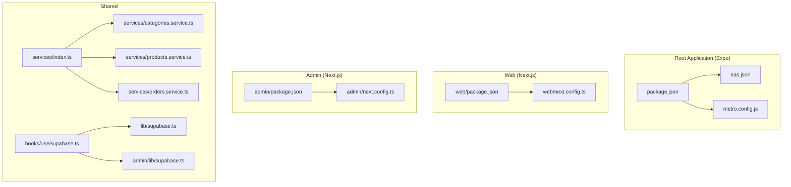
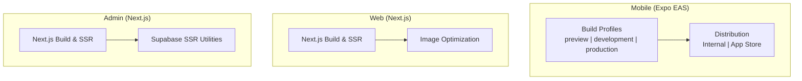
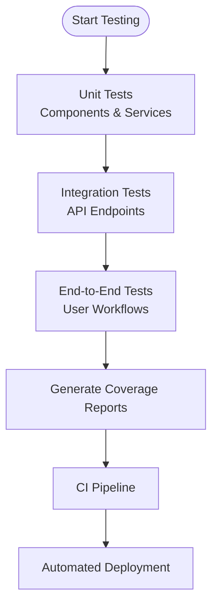
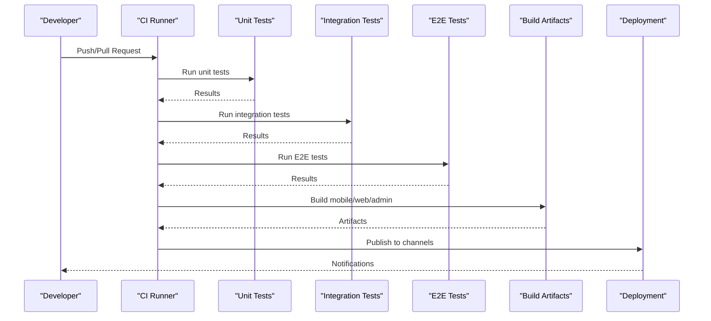
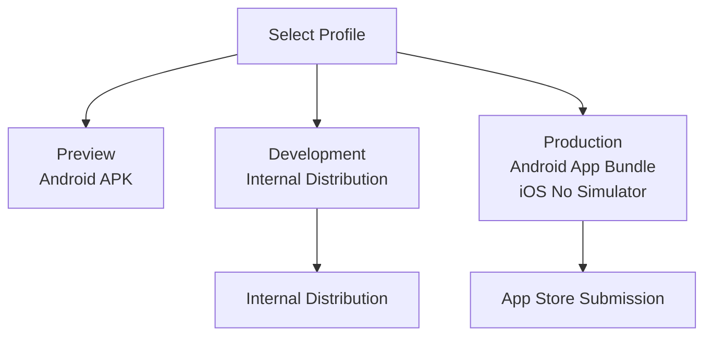
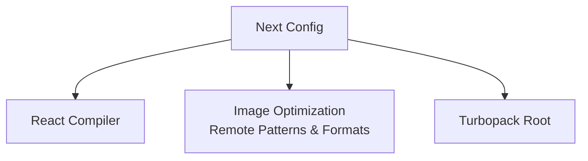
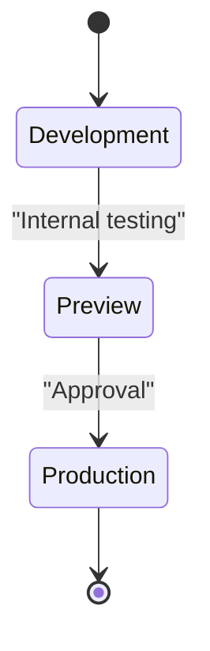
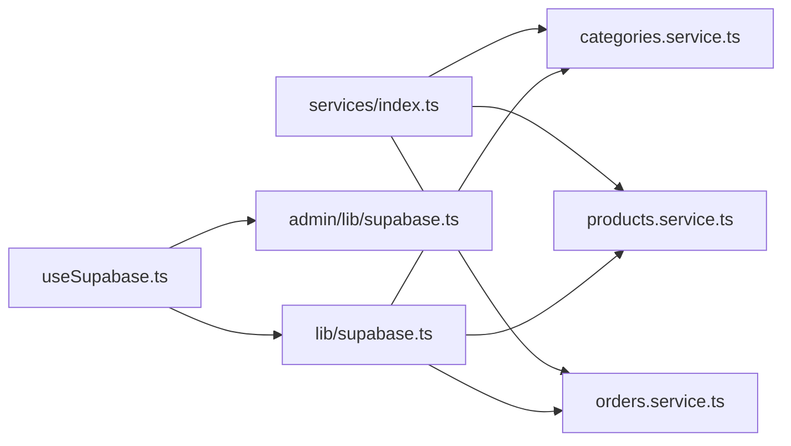

# Testing and Deployment

<cite>
**Referenced Files in This Document**
- [package.json](file://package.json)
- [eas.json](file://eas.json)
- [metro.config.js](file://metro.config.js)
- [admin/package.json](file://admin/package.json)
- [admin/next.config.ts](file://admin/next.config.ts)
- [web/package.json](file://web/package.json)
- [web/next.config.ts](file://web/next.config.ts)
- [lib/supabase.ts](file://lib/supabase.ts)
- [admin/lib/supabase.ts](file://admin/lib/supabase.ts)
- [services/index.ts](file://services/index.ts)
- [services/categories.service.ts](file://services/categories.service.ts)
- [services/products.service.ts](file://services/products.service.ts)
- [services/orders.service.ts](file://services/orders.service.ts)
- [hooks/useSupabase.ts](file://hooks/useSupabase.ts)
- [components/ErrorBoundary.tsx](file://components/ErrorBoundary.tsx)
- [.easignore](file://.easignore)
</cite>

## Table of Contents
1. [Introduction](#introduction)
2. [Project Structure](#project-structure)
3. [Core Components](#core-components)
4. [Architecture Overview](#architecture-overview)
5. [Detailed Component Analysis](#detailed-component-analysis)
6. [Dependency Analysis](#dependency-analysis)
7. [Performance Considerations](#performance-considerations)
8. [Troubleshooting Guide](#troubleshooting-guide)
9. [Conclusion](#conclusion)
10. [Appendices](#appendices)

## Introduction
This document explains the testing strategies and deployment processes for the project, covering:
- Testing approach: unit testing for components/services, integration testing for API endpoints, and end-to-end testing for user workflows
- Continuous integration and deployment pipeline: automated testing, build processes, and release automation
- Expo EAS build configuration for mobile app distribution
- Next.js build optimization for web deployments
- Environment management across development, staging, and production
- Deployment strategies for mobile app stores, web hosting, and admin panel
- Monitoring and maintenance procedures including error tracking, performance monitoring, and health checks
- Troubleshooting guidance for deployment issues, rollback procedures, and incident response
- Guidelines for extending testing coverage and optimizing deployment workflows

## Project Structure
The project is organized into multiple packages:
- Root application (Expo + React Native): mobile app entry, routing, and native configuration
- Web application (Next.js): SSR-friendly web client
- Admin dashboard (Next.js): administrative interface with Supabase integration
- Shared libraries and services: Supabase clients, service layer abstractions, and hooks

**Diagram sources**
- [package.json:1-65](file://package.json#L1-L65)
- [eas.json:1-32](file://eas.json#L1-L32)
- [metro.config.js:1-8](file://metro.config.js#L1-L8)
- [web/package.json:1-39](file://web/package.json#L1-L39)
- [web/next.config.ts:1-12](file://web/next.config.ts#L1-L12)
- [admin/package.json:1-40](file://admin/package.json#L1-L40)
- [admin/next.config.ts:1-25](file://admin/next.config.ts#L1-L25)
- [services/index.ts:1-200](file://services/index.ts#L1-L200)
- [services/categories.service.ts:1-200](file://services/categories.service.ts#L1-L200)
- [services/products.service.ts:1-200](file://services/products.service.ts#L1-L200)
- [services/orders.service.ts:1-200](file://services/orders.service.ts#L1-L200)
- [hooks/useSupabase.ts:1-200](file://hooks/useSupabase.ts#L1-L200)
- [lib/supabase.ts:1-200](file://lib/supabase.ts#L1-L200)
- [admin/lib/supabase.ts:1-200](file://admin/lib/supabase.ts#L1-L200)

**Section sources**
- [package.json:1-65](file://package.json#L1-L65)
- [eas.json:1-32](file://eas.json#L1-L32)
- [metro.config.js:1-8](file://metro.config.js#L1-L8)
- [web/package.json:1-39](file://web/package.json#L1-L39)
- [web/next.config.ts:1-12](file://web/next.config.ts#L1-L12)
- [admin/package.json:1-40](file://admin/package.json#L1-L40)
- [admin/next.config.ts:1-25](file://admin/next.config.ts#L1-L25)

## Core Components
- Mobile app build and distribution via Expo EAS with separate profiles for preview, development, and production
- Next.js applications for web and admin with optimized image handling and React compiler enabled
- Supabase integration for authentication, session management, and data access across platforms
- Service layer for categories, products, and orders to encapsulate API interactions and improve testability
- Shared hook for Supabase client initialization and session handling

Key capabilities:
- Mobile builds configured for APK and Android App Bundle with internal distribution and App Store submission
- Web and admin builds leveraging Next.js compiler optimizations and image optimization
- Supabase clients configured for browser/server environments and SSR compatibility

**Section sources**
- [eas.json:1-32](file://eas.json#L1-L32)
- [admin/next.config.ts:1-25](file://admin/next.config.ts#L1-L25)
- [web/next.config.ts:1-12](file://web/next.config.ts#L1-L12)
- [services/index.ts:1-200](file://services/index.ts#L1-L200)
- [services/categories.service.ts:1-200](file://services/categories.service.ts#L1-L200)
- [services/products.service.ts:1-200](file://services/products.service.ts#L1-L200)
- [services/orders.service.ts:1-200](file://services/orders.service.ts#L1-L200)
- [hooks/useSupabase.ts:1-200](file://hooks/useSupabase.ts#L1-L200)
- [lib/supabase.ts:1-200](file://lib/supabase.ts#L1-L200)
- [admin/lib/supabase.ts:1-200](file://admin/lib/supabase.ts#L1-L200)

## Architecture Overview
The testing and deployment architecture spans three primary targets:
- Mobile app: built and distributed via Expo EAS
- Web app: Next.js application with SSR and static optimization
- Admin dashboard: Next.js application with SSR and Supabase SSR utilities

**Diagram sources**
- [eas.json:1-32](file://eas.json#L1-L32)
- [web/next.config.ts:1-12](file://web/next.config.ts#L1-L12)
- [admin/next.config.ts:1-25](file://admin/next.config.ts#L1-L25)
- [admin/package.json:1-40](file://admin/package.json#L1-L40)

## Detailed Component Analysis

### Testing Strategy

#### Unit Testing for Components and Services
- Components: Test rendering, prop handling, and user interactions using React testing utilities
- Services: Mock Supabase client and external APIs; assert service method calls and return values
- Hooks: Wrap tests with providers to supply context and client instances

Recommended coverage:
- Components: >80% branch and function coverage
- Services: Full method coverage with mocked network responses
- Hooks: Initialization, re-fetching, and error scenarios

#### Integration Testing for API Endpoints
- Admin API routes: Validate request parsing, authentication, and response shape
- Proxy and AI endpoints: Verify upstream requests and error propagation
- Supabase integration: Confirm session handling and row-level security behavior

Testing approach:
- Use Supabase test utilities or mock adapters
- Simulate network failures and edge cases
- Validate CORS and rate-limiting behavior

#### End-to-End Testing for User Workflows
- Mobile: Test registration, login, product browsing, cart, and checkout flows
- Web/Admin: Validate SSR rendering, navigation, and admin actions

Tools:
- Playwright or Detox for mobile
- Cypress or Playwright for web/Admin

[No sources needed since this diagram shows conceptual workflow, not actual code structure]

### Continuous Integration and Deployment Pipeline
- Automated testing: Run unit, integration, and E2E suites on pull requests and pushes
- Build processes: Separate builds for mobile (EAS), web (Next.js), and admin (Next.js)
- Release automation: Tag releases, publish artifacts, and trigger distribution channels

[No sources needed since this diagram shows conceptual workflow, not actual code structure]

### Expo EAS Build Configuration
- Preview: APK for quick iteration
- Development: Internal distribution with development client
- Production: Android App Bundle with version code; iOS simulator disabled for submission

**Diagram sources**
- [eas.json:1-32](file://eas.json#L1-L32)

**Section sources**
- [eas.json:1-32](file://eas.json#L1-L32)
- [.easignore:1-200](file://.easignore#L1-L200)

### Next.js Build Optimization
- React Compiler: Enabled for faster builds and runtime
- Image Optimization: Remote patterns for Supabase storage, cache TTL, and formats
- Turbopack: Web application configured to share root with monorepo structure

**Diagram sources**
- [admin/next.config.ts:1-25](file://admin/next.config.ts#L1-L25)
- [web/next.config.ts:1-12](file://web/next.config.ts#L1-L12)

**Section sources**
- [admin/next.config.ts:1-25](file://admin/next.config.ts#L1-L25)
- [web/next.config.ts:1-12](file://web/next.config.ts#L1-L12)

### Environment Management
- Development: Local environments with hot reload and development client
- Staging: Preview builds for internal testing
- Production: Controlled releases with version code and distribution settings

[No sources needed since this diagram shows conceptual workflow, not actual code structure]

### Deployment Strategies
- Mobile app stores: Use EAS submit for production builds
- Web hosting: Deploy Next.js apps to static hosts or SSR-capable platforms
- Admin panel: Host Next.js admin on the same platform as the web app with distinct routes

[No sources needed since this section provides general guidance]

### Monitoring and Maintenance
- Error tracking: Centralized logging and Sentry-like integrations
- Performance monitoring: Lighthouse, WebPageTest, and synthetic monitoring
- Health checks: Readiness/liveness probes for SSR endpoints

[No sources needed since this section provides general guidance]

## Dependency Analysis
The service layer depends on Supabase clients and exposes typed methods for categories, products, and orders. Hooks centralize client initialization and session handling.

**Diagram sources**
- [hooks/useSupabase.ts:1-200](file://hooks/useSupabase.ts#L1-L200)
- [lib/supabase.ts:1-200](file://lib/supabase.ts#L1-L200)
- [admin/lib/supabase.ts:1-200](file://admin/lib/supabase.ts#L1-L200)
- [services/index.ts:1-200](file://services/index.ts#L1-L200)
- [services/categories.service.ts:1-200](file://services/categories.service.ts#L1-L200)
- [services/products.service.ts:1-200](file://services/products.service.ts#L1-L200)
- [services/orders.service.ts:1-200](file://services/orders.service.ts#L1-L200)

**Section sources**
- [services/index.ts:1-200](file://services/index.ts#L1-L200)
- [services/categories.service.ts:1-200](file://services/categories.service.ts#L1-L200)
- [services/products.service.ts:1-200](file://services/products.service.ts#L1-L200)
- [services/orders.service.ts:1-200](file://services/orders.service.ts#L1-L200)
- [hooks/useSupabase.ts:1-200](file://hooks/useSupabase.ts#L1-L200)
- [lib/supabase.ts:1-200](file://lib/supabase.ts#L1-L200)
- [admin/lib/supabase.ts:1-200](file://admin/lib/supabase.ts#L1-L200)

## Performance Considerations
- Mobile: Prefer App Bundles for production; minimize asset sizes; enable code splitting
- Web/Admin: Enable React Compiler; optimize images; leverage ISR/SSR selectively
- Supabase: Use prepared queries, pagination, and caching strategies

[No sources needed since this section provides general guidance]

## Troubleshooting Guide
- Build failures:
  - Verify EAS profile settings and environment variables
  - Check Metro/NativeWind configuration for CSS inputs
- Runtime errors:
  - Inspect Supabase client initialization and session provider
  - Validate API route handlers and error boundaries
- Rollback procedures:
  - Revert to previous EAS build or tag
  - Re-deploy last known-good web/admin build
- Incident response:
  - Collect logs from CI runner and hosting platform
  - Notify stakeholders and escalate if SLA is breached

**Section sources**
- [components/ErrorBoundary.tsx:1-200](file://components/ErrorBoundary.tsx#L1-L200)
- [lib/supabase.ts:1-200](file://lib/supabase.ts#L1-L200)
- [admin/lib/supabase.ts:1-200](file://admin/lib/supabase.ts#L1-L200)

## Conclusion
This guide outlines a comprehensive testing and deployment strategy tailored to the project’s multi-target architecture. By implementing unit, integration, and end-to-end tests; optimizing Next.js builds; and configuring Expo EAS for reliable mobile delivery, teams can maintain quality and velocity across development, staging, and production.

[No sources needed since this section summarizes without analyzing specific files]

## Appendices

### Appendix A: Mobile Build Profiles
- preview: Android APK for fast iteration
- development: Internal distribution with development client
- production: Android App Bundle with version code; iOS simulator disabled

**Section sources**
- [eas.json:1-32](file://eas.json#L1-L32)

### Appendix B: Next.js Configuration Highlights
- React Compiler enabled for faster builds
- Image optimization with remote patterns and formats
- Turbopack root configured for monorepo sharing

**Section sources**
- [admin/next.config.ts:1-25](file://admin/next.config.ts#L1-L25)
- [web/next.config.ts:1-12](file://web/next.config.ts#L1-L12)

### Appendix C: Supabase Client Setup
- Browser/server-compatible clients for web and admin
- Session provider for SSR environments

**Section sources**
- [lib/supabase.ts:1-200](file://lib/supabase.ts#L1-L200)
- [admin/lib/supabase.ts:1-200](file://admin/lib/supabase.ts#L1-L200)