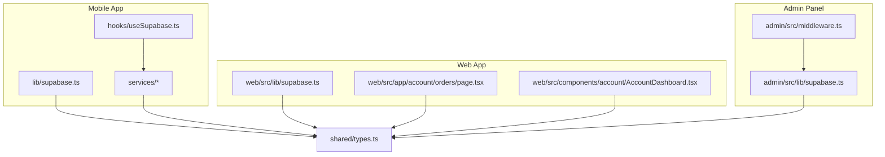
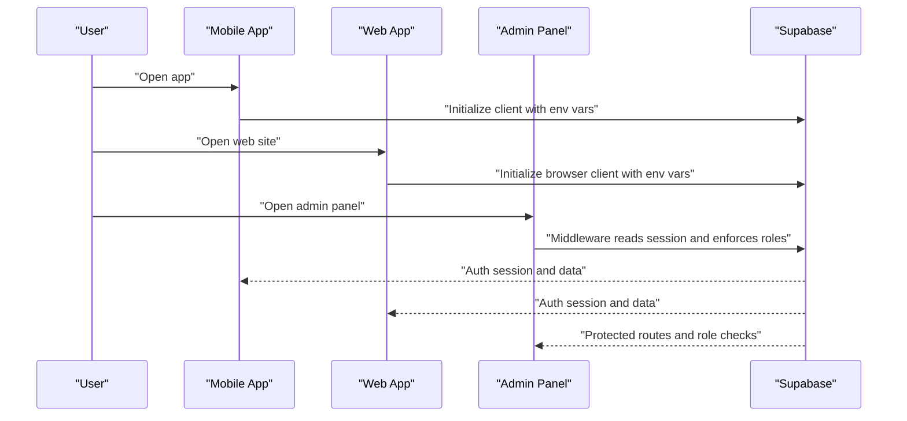
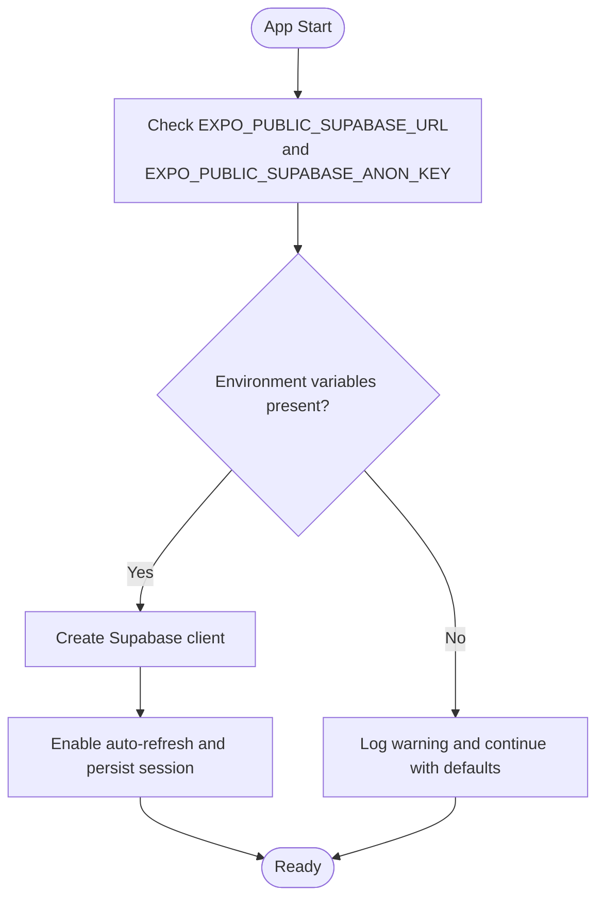
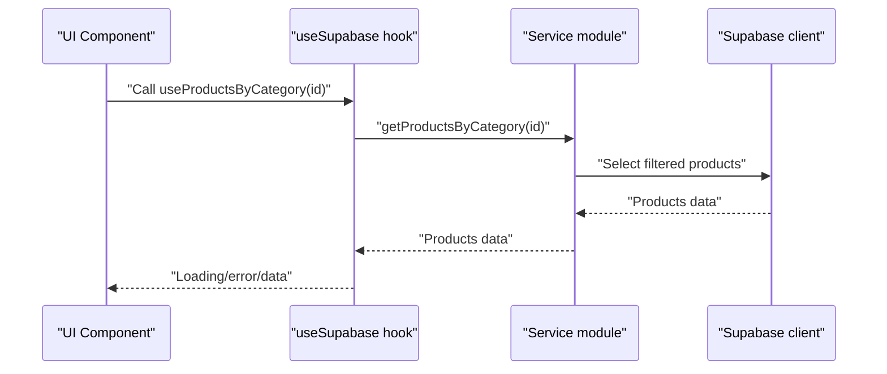
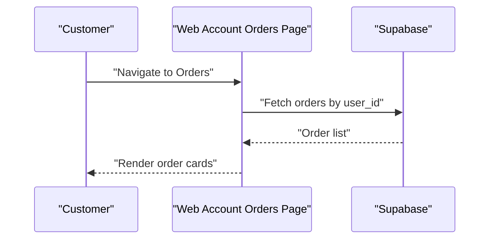
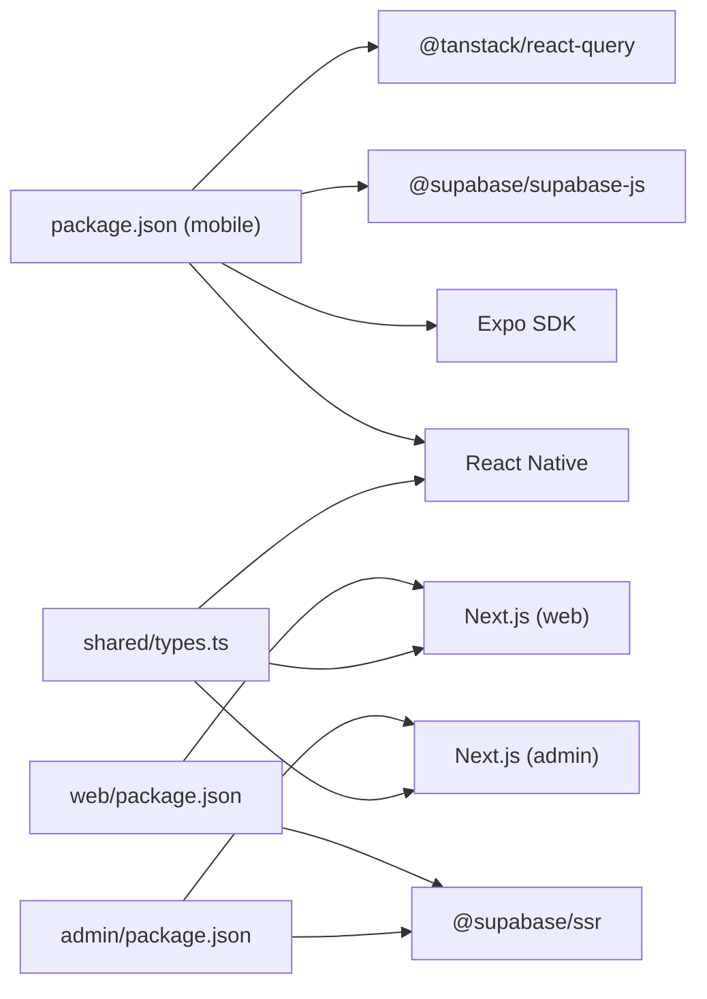

# Troubleshooting and FAQ

<cite>
**Referenced Files in This Document**
- [package.json](file://package.json)
- [admin/package.json](file://admin/package.json)
- [web/package.json](file://web/package.json)
- [lib/supabase.ts](file://lib/supabase.ts)
- [admin/src/lib/supabase.ts](file://admin/src/lib/supabase.ts)
- [shared/types.ts](file://shared/types.ts)
- [hooks/useSupabase.ts](file://hooks/useSupabase.ts)
- [services/index.ts](file://services/index.ts)
- [services/products.service.ts](file://services/products.service.ts)
- [services/categories.service.ts](file://services/categories.service.ts)
- [services/orders.service.ts](file://services/orders.service.ts)
- [admin/src/middleware.ts](file://admin/src/middleware.ts)
- [app/help/faq.tsx](file://app/help/faq.tsx)
- [components/ErrorBoundary.tsx](file://components/ErrorBoundary.tsx)
- [web/src/app/account/orders/page.tsx](file://web/src/app/account/orders/page.tsx)
- [web/src/components/account/AccountDashboard.tsx](file://web/src/components/account/AccountDashboard.tsx)
- [app/auth/register.tsx](file://app/auth/register.tsx)
</cite>

## Table of Contents
1. [Introduction](#introduction)
2. [Project Structure](#project-structure)
3. [Core Components](#core-components)
4. [Architecture Overview](#architecture-overview)
5. [Detailed Component Analysis](#detailed-component-analysis)
6. [Dependency Analysis](#dependency-analysis)
7. [Performance Considerations](#performance-considerations)
8. [Troubleshooting Guide](#troubleshooting-guide)
9. [Conclusion](#conclusion)
10. [Appendices](#appendices)

## Introduction
This document provides comprehensive troubleshooting guidance and FAQs for the Amal Center platform. It covers development environment issues, runtime diagnostics for authentication and API connectivity, performance tuning, and practical resolutions for common user-reported problems such as payment processing, order tracking, and account access. It also documents debugging strategies for mobile, web, and admin panels, plus preventive measures, monitoring recommendations, and escalation procedures.

## Project Structure
The platform comprises three primary environments:
- Mobile app (Expo + React Native)
- Web app (Next.js)
- Admin panel (Next.js)

Each environment integrates with Supabase for authentication and data persistence, and shares a centralized types definition for type safety across platforms.



**Diagram sources**
- [lib/supabase.ts:1-30](file://lib/supabase.ts#L1-L30)
- [admin/src/lib/supabase.ts:1-24](file://admin/src/lib/supabase.ts#L1-L24)
- [shared/types.ts:1-353](file://shared/types.ts#L1-L353)
- [hooks/useSupabase.ts:1-239](file://hooks/useSupabase.ts#L1-L239)
- [services/index.ts:1-9](file://services/index.ts#L1-L9)
- [services/products.service.ts:1-449](file://services/products.service.ts#L1-L449)
- [services/categories.service.ts:1-137](file://services/categories.service.ts#L1-L137)
- [services/orders.service.ts:1-115](file://services/orders.service.ts#L1-L115)
- [web/src/app/account/orders/page.tsx:64-102](file://web/src/app/account/orders/page.tsx#L64-L102)
- [web/src/components/account/AccountDashboard.tsx:617-641](file://web/src/components/account/AccountDashboard.tsx#L617-L641)
- [admin/src/middleware.ts:1-122](file://admin/src/middleware.ts#L1-L122)

**Section sources**
- [package.json:1-65](file://package.json#L1-L65)
- [admin/package.json:1-40](file://admin/package.json#L1-L40)
- [web/package.json:1-39](file://web/package.json#L1-L39)
- [lib/supabase.ts:1-30](file://lib/supabase.ts#L1-L30)
- [admin/src/lib/supabase.ts:1-24](file://admin/src/lib/supabase.ts#L1-L24)
- [shared/types.ts:1-353](file://shared/types.ts#L1-L353)

## Core Components
- Supabase client initialization and environment configuration
- Centralized shared types for database entities and enums
- React Query hooks for data fetching and caching
- Service modules for products, categories, and orders
- Admin middleware for session management and role-based access control
- Web and admin order listing pages
- Error boundary for graceful failure handling
- FAQ screen for user self-service

**Section sources**
- [lib/supabase.ts:1-30](file://lib/supabase.ts#L1-L30)
- [admin/src/lib/supabase.ts:1-24](file://admin/src/lib/supabase.ts#L1-L24)
- [shared/types.ts:1-353](file://shared/types.ts#L1-L353)
- [hooks/useSupabase.ts:1-239](file://hooks/useSupabase.ts#L1-L239)
- [services/products.service.ts:1-449](file://services/products.service.ts#L1-L449)
- [services/categories.service.ts:1-137](file://services/categories.service.ts#L1-L137)
- [services/orders.service.ts:1-115](file://services/orders.service.ts#L1-L115)
- [admin/src/middleware.ts:1-122](file://admin/src/middleware.ts#L1-L122)
- [web/src/app/account/orders/page.tsx:64-102](file://web/src/app/account/orders/page.tsx#L64-L102)
- [web/src/components/account/AccountDashboard.tsx:617-641](file://web/src/components/account/AccountDashboard.tsx#L617-L641)
- [components/ErrorBoundary.tsx:39-67](file://components/ErrorBoundary.tsx#L39-L67)
- [app/help/faq.tsx:1-287](file://app/help/faq.tsx#L1-L287)

## Architecture Overview
The system relies on Supabase for:
- Authentication (email/password, session persistence)
- Realtime data access via Supabase client libraries
- Environment variable-driven configuration for Supabase URLs and keys



**Diagram sources**
- [lib/supabase.ts:18-30](file://lib/supabase.ts#L18-L30)
- [admin/src/lib/supabase.ts:19-24](file://admin/src/lib/supabase.ts#L19-L24)
- [admin/src/middleware.ts:57-107](file://admin/src/middleware.ts#L57-L107)

## Detailed Component Analysis

### Supabase Client Initialization
- Mobile uses a native client with AsyncStorage for session persistence.
- Web and Admin use a browser-compatible client.
- Environment variables are used to configure Supabase URL and anonymous key.



**Diagram sources**
- [lib/supabase.ts:18-30](file://lib/supabase.ts#L18-L30)
- [admin/src/lib/supabase.ts:19-24](file://admin/src/lib/supabase.ts#L19-L24)

**Section sources**
- [lib/supabase.ts:1-30](file://lib/supabase.ts#L1-L30)
- [admin/src/lib/supabase.ts:1-24](file://admin/src/lib/supabase.ts#L1-L24)

### Admin Middleware and Access Control
- Enforces session presence for protected routes.
- Redirects unauthenticated users to login.
- Restricts products_manager role to specific paths.
- Uses Supabase to fetch user role for authorization.

```mermaid
flowchart TD
Req(["Incoming Request"]) --> GetSession["Get session from cookie"]
GetSession --> HasSession{"Session exists?"}
HasSession --> |No| ToLogin["Redirect to /login"]
HasSession --> |Yes| CheckRole["Fetch user role from profiles"]
CheckRole --> Role{"Role == products_manager?"}
Role --> |Yes| PathCheck["Is path allowed?"}
Role --> |No| Allow["Allow access"]
PathCheck --> |No| ToProducts["Redirect to /products"]
PathCheck --> |Yes| Allow
ToLogin --> End(["End"])
ToProducts --> End
Allow --> End
```

**Diagram sources**
- [admin/src/middleware.ts:57-107](file://admin/src/middleware.ts#L57-L107)

**Section sources**
- [admin/src/middleware.ts:1-122](file://admin/src/middleware.ts#L1-L122)

### Data Fetching with React Query Hooks
- Centralized hooks wrap service calls and expose typed queries.
- Query keys enable cache invalidation and refetching.
- Selectors shape data for UI consumption.



**Diagram sources**
- [hooks/useSupabase.ts:138-145](file://hooks/useSupabase.ts#L138-L145)
- [services/products.service.ts:45-57](file://services/products.service.ts#L45-L57)

**Section sources**
- [hooks/useSupabase.ts:1-239](file://hooks/useSupabase.ts#L1-L239)
- [services/products.service.ts:1-449](file://services/products.service.ts#L1-L449)

### Order Listing in Web and Admin
- Web account orders page lists recent orders with status and totals.
- Admin middleware ensures only authorized users access admin routes.



**Diagram sources**
- [web/src/app/account/orders/page.tsx:64-102](file://web/src/app/account/orders/page.tsx#L64-L102)
- [web/src/components/account/AccountDashboard.tsx:617-641](file://web/src/components/account/AccountDashboard.tsx#L617-L641)

**Section sources**
- [web/src/app/account/orders/page.tsx:64-102](file://web/src/app/account/orders/page.tsx#L64-L102)
- [web/src/components/account/AccountDashboard.tsx:617-641](file://web/src/components/account/AccountDashboard.tsx#L617-L641)
- [admin/src/middleware.ts:57-107](file://admin/src/middleware.ts#L57-L107)

## Dependency Analysis
- Mobile app depends on Expo, React Native, and @supabase/supabase-js with AsyncStorage.
- Web and Admin depend on Next.js and @supabase/ssr for browser sessions.
- Shared types define database entities and enums used across platforms.



**Diagram sources**
- [package.json:12-56](file://package.json#L12-L56)
- [web/package.json:11-25](file://web/package.json#L11-L25)
- [admin/package.json:11-26](file://admin/package.json#L11-L26)
- [shared/types.ts:1-353](file://shared/types.ts#L1-L353)

**Section sources**
- [package.json:1-65](file://package.json#L1-L65)
- [web/package.json:1-39](file://web/package.json#L1-L39)
- [admin/package.json:1-40](file://admin/package.json#L1-L40)
- [shared/types.ts:1-353](file://shared/types.ts#L1-L353)

## Performance Considerations
- Prefer selective column queries to reduce payload sizes (e.g., product list fields).
- Use pagination and range queries to limit result sets.
- Leverage React Query caching and selective refetching to minimize redundant network calls.
- Avoid fetching heavy fields (like descriptions) in list views; load them on demand.

**Section sources**
- [services/products.service.ts:10-28](file://services/products.service.ts#L10-L28)
- [hooks/useSupabase.ts:1-239](file://hooks/useSupabase.ts#L1-L239)

## Troubleshooting Guide

### Development Environment Issues

- Dependency conflicts
  - Symptoms: Build fails with peer dependency warnings or incompatible versions.
  - Resolution:
    - Align React and React Native versions across packages.
    - Ensure Next.js versions match between web and admin projects.
    - Resolve version mismatches for @supabase clients in mobile vs. SSR environments.
  - References:
    - [package.json:12-56](file://package.json#L12-L56)
    - [web/package.json:11-25](file://web/package.json#L11-L25)
    - [admin/package.json:11-26](file://admin/package.json#L11-L26)

- Build errors
  - Symptoms: Metro bundler errors, TypeScript errors, or ESLint failures.
  - Resolution:
    - Clear node_modules and reinstall dependencies.
    - Verify TypeScript strictness and ESLint configurations are consistent.
    - Check Tailwind and PostCSS configurations for each environment.
  - References:
    - [package.json:57-63](file://package.json#L57-L63)
    - [web/package.json:26-38](file://web/package.json#L26-L38)
    - [admin/package.json:27-39](file://admin/package.json#L27-L39)

- Platform-specific problems
  - Symptoms: iOS/Android differences in behavior, WebView issues, or font rendering.
  - Resolution:
    - Test on device/emulator after updating Expo and React Native versions.
    - Validate WebView polyfills and URL handling.
    - Confirm fonts are properly configured for Arabic and Latin text.

**Section sources**
- [package.json:1-65](file://package.json#L1-L65)
- [web/package.json:1-39](file://web/package.json#L1-L39)
- [admin/package.json:1-40](file://admin/package.json#L1-L40)

### Runtime Troubleshooting

- Authentication failures
  - Symptoms: Login redirects to /login, session not persisted, or role-based access denied.
  - Diagnostics:
    - Verify NEXT_PUBLIC_SUPABASE_URL and NEXT_PUBLIC_SUPABASE_ANON_KEY are set in admin/web.
    - Confirm mobile env variables EXPO_PUBLIC_SUPABASE_URL and EXPO_PUBLIC_SUPABASE_ANON_KEY are configured.
    - Check admin middleware session retrieval and role lookup.
  - Resolution:
    - Set environment variables in deployment pipeline.
    - Ensure cookies are readable by the admin middleware.
    - Fix user role in the profiles table if access is blocked.
  - References:
    - [admin/src/lib/supabase.ts:19-24](file://admin/src/lib/supabase.ts#L19-L24)
    - [lib/supabase.ts:18-30](file://lib/supabase.ts#L18-L30)
    - [admin/src/middleware.ts:57-107](file://admin/src/middleware.ts#L57-L107)

- API connectivity issues
  - Symptoms: Network errors, timeouts, or empty data from services.
  - Diagnostics:
    - Inspect service functions for thrown errors and verify query correctness.
    - Confirm query keys and enabled conditions in hooks.
    - Validate shared types for entity shapes.
  - Resolution:
    - Wrap service calls with proper error handling.
    - Adjust query parameters and pagination limits.
    - Ensure Supabase policies allow read/write access.
  - References:
    - [services/products.service.ts:18-28](file://services/products.service.ts#L18-L28)
    - [services/orders.service.ts:12-21](file://services/orders.service.ts#L12-L21)
    - [hooks/useSupabase.ts:104-119](file://hooks/useSupabase.ts#L104-L119)
    - [shared/types.ts:1-353](file://shared/types.ts#L1-L353)

- Performance problems
  - Symptoms: Slow product/category listings, frequent re-fetches, or excessive network traffic.
  - Diagnostics:
    - Measure query durations and cache hit rates.
    - Audit column selection and pagination usage.
  - Resolution:
    - Use selective fields for list views.
    - Apply pagination and sorting efficiently.
    - Optimize hooks to prevent unnecessary refetches.
  - References:
    - [services/products.service.ts:10-28](file://services/products.service.ts#L10-L28)
    - [hooks/useSupabase.ts:1-239](file://hooks/useSupabase.ts#L1-L239)

- Debugging strategies
  - Mobile:
    - Use Flipper or React DevTools to inspect hooks and queries.
    - Log query keys and data returned by services.
  - Web/Admin:
    - Enable Next.js dev logs and check browser console/network tab.
    - Inspect cookies and session state in middleware.
  - Shared:
    - Centralize error logging and surface user-friendly messages.
  - References:
    - [components/ErrorBoundary.tsx:39-67](file://components/ErrorBoundary.tsx#L39-L67)
    - [app/auth/register.tsx:35-62](file://app/auth/register.tsx#L35-L62)

### Common User-Reported Issues

- Payment processing problems
  - Symptoms: Payment status not updating, failed transactions.
  - Resolution:
    - Verify payment status updates via updatePaymentStatus.
    - Confirm order totals and currency conversions.
  - References:
    - [services/orders.service.ts:100-114](file://services/orders.service.ts#L100-L114)
    - [shared/types.ts:253-256](file://shared/types.ts#L253-L256)

- Order tracking confusion
  - Symptoms: Users cannot find orders or statuses are unclear.
  - Resolution:
    - Ensure order listing displays status badges and totals.
    - Improve status label formatting and localization.
  - References:
    - [web/src/app/account/orders/page.tsx:64-102](file://web/src/app/account/orders/page.tsx#L64-L102)
    - [web/src/components/account/AccountDashboard.tsx:617-641](file://web/src/components/account/AccountDashboard.tsx#L617-L641)
    - [shared/types.ts:253-256](file://shared/types.ts#L253-L256)

- Account access issues
  - Symptoms: Registration errors, rate limits, or invalid data.
  - Resolution:
    - Map backend error messages to user-friendly strings.
    - Implement rate-limit awareness and retry logic.
  - References:
    - [app/auth/register.tsx:35-62](file://app/auth/register.tsx#L35-L62)

- FAQ self-service
  - Use the built-in FAQ screen to guide users on tracking, payments, delivery, cancellations, returns, contact, free shipping thresholds, and discount codes.
  - References:
    - [app/help/faq.tsx:21-78](file://app/help/faq.tsx#L21-L78)

### Diagnostic Procedures

- Real-time feature problems
  - Steps:
    - Confirm Supabase client initialization in each environment.
    - Validate environment variables for Supabase URL and keys.
    - Check middleware/session handling for admin routes.
  - References:
    - [lib/supabase.ts:18-30](file://lib/supabase.ts#L18-L30)
    - [admin/src/lib/supabase.ts:19-24](file://admin/src/lib/supabase.ts#L19-L24)
    - [admin/src/middleware.ts:57-107](file://admin/src/middleware.ts#L57-L107)

- AI service integration issues
  - Notes: The codebase includes AI-related routes in the admin API and dependencies for AI/ML services. Ensure environment variables for AI providers are configured and that routes are reachable.
  - References:
    - [admin/src/app/api/ai/analyze-product/route.ts](file://admin/src/app/api/ai/analyze-product/route.ts)
    - [admin/src/app/api/ai/remove-background/route.ts](file://admin/src/app/api/ai/remove-background/route.ts)
    - [admin/src/app/api/ai/test/route.ts](file://admin/src/app/api/ai/test/route.ts)
    - [admin/package.json:12-25](file://admin/package.json#L12-L25)

- File upload failures
  - Notes: The admin panel includes an image proxy route. Validate proxy configuration and permissions for uploads.
  - References:
    - [admin/src/app/api/proxy-image/route.ts](file://admin/src/app/api/proxy-image/route.ts)
    - [admin/package.json:23-25](file://admin/package.json#L23-L25)

### Step-by-Step Resolution Guides

- Authentication redirect loop
  1. Verify NEXT_PUBLIC_SUPABASE_URL and NEXT_PUBLIC_SUPABASE_ANON_KEY are set.
  2. Confirm cookies are readable by the server and client.
  3. Check user role in profiles and ensure allowed paths for products_manager.
  4. Restart dev servers and clear browser cookies.
  - References:
    - [admin/src/lib/supabase.ts:19-24](file://admin/src/lib/supabase.ts#L19-L24)
    - [admin/src/middleware.ts:57-107](file://admin/src/middleware.ts#L57-L107)

- Orders not appearing in web account
  1. Confirm user_id matches authenticated session.
  2. Check getUserOrders query and ordering by created_at.
  3. Validate order totals and status mapping.
  - References:
    - [services/orders.service.ts:56-65](file://services/orders.service.ts#L56-L65)
    - [web/src/app/account/orders/page.tsx:64-102](file://web/src/app/account/orders/page.tsx#L64-L102)

- Product list slow loading
  1. Use selective fields for product lists.
  2. Apply pagination and limit queries.
  3. Ensure hooks are enabled only when IDs are present.
  - References:
    - [services/products.service.ts:10-28](file://services/products.service.ts#L10-L28)
    - [hooks/useSupabase.ts:104-119](file://hooks/useSupabase.ts#L104-L119)

### Escalation Procedures
- Capture environment variables, Supabase logs, and client-side error traces.
- Provide reproducible steps and screenshots for UI issues.
- Tag relevant components and service files in bug reports.

## Conclusion
This guide consolidates actionable troubleshooting steps, diagnostic flows, and resolutions for Amal Center’s mobile, web, and admin environments. By validating environment configuration, leveraging shared types, and following the outlined procedures, teams can quickly resolve authentication, API, and performance issues while improving user experience through clearer UI messaging and robust error handling.

## Appendices

### Frequently Asked Questions (FAQ)

- How can I track my order?
  - Navigate to “My Orders” in your account. You will see all orders with updated status for each order.
  - References:
    - [app/help/faq.tsx:21-28](file://app/help/faq.tsx#L21-L28)

- What payment methods are available?
  - Cash on Delivery, Credit Cards (Visa, Mastercard), and E-Wallets (Zain Cash, Asia Hawala).
  - References:
    - [app/help/faq.tsx:29-35](file://app/help/faq.tsx#L29-L35)

- How long does delivery take?
  - Standard delivery takes 24-48 hours. Express delivery is available and takes only 2 hours. Delivery times may vary based on your location.
  - References:
    - [app/help/faq.tsx:36-42](file://app/help/faq.tsx#L36-L42)

- Can I cancel my order?
  - Yes, you can cancel your order if it is in "Pending" or "Confirmed" status. Once the order preparation starts, it cannot be cancelled.
  - References:
    - [app/help/faq.tsx:43-49](file://app/help/faq.tsx#L43-L49)

- What is the return policy?
  - You can return products within 7 days of receipt provided they are in their original condition. Perishable food products are non-returnable.
  - References:
    - [app/help/faq.tsx:50-56](file://app/help/faq.tsx#L50-L56)

- How can I contact customer service?
  - You can contact us via WhatsApp, through the "Contact Us" page in the app, or via email at support@al-amal-center.iq.
  - References:
    - [app/help/faq.tsx:57-63](file://app/help/faq.tsx#L57-L63)

- Is delivery free?
  - Delivery is free for orders over 50,000 IQD. For smaller orders, delivery fees are calculated based on your area.
  - References:
    - [app/help/faq.tsx:64-70](file://app/help/faq.tsx#L64-L70)

- How do I use a discount code?
  - When checking out in the cart page, enter the discount code in the designated field and press "Apply". The amount will be deducted automatically.
  - References:
    - [app/help/faq.tsx:71-77](file://app/help/faq.tsx#L71-L77)

### Preventive Measures and Best Practices
- Keep environment variables secure and validated during CI/CD.
- Use shared types to enforce schema consistency across platforms.
- Implement structured error handling and user-friendly messages.
- Monitor query performance and apply pagination/selective fields.
- Regularly review Supabase policies and RBAC for admin roles.

### Support Channels and Community Resources
- Internal support: Use team chat and ticketing systems to escalate issues with logs and repro steps.
- Community: Engage with Expo and Next.js communities for platform-specific guidance.
- Documentation: Refer to Supabase docs for authentication and data access patterns.