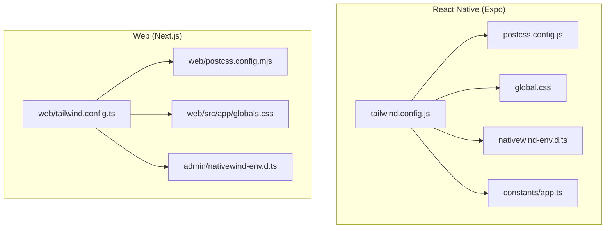
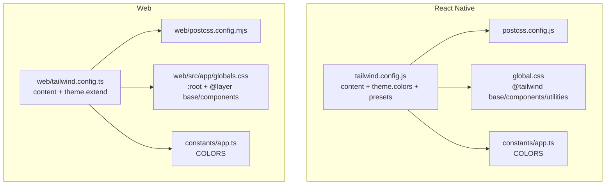
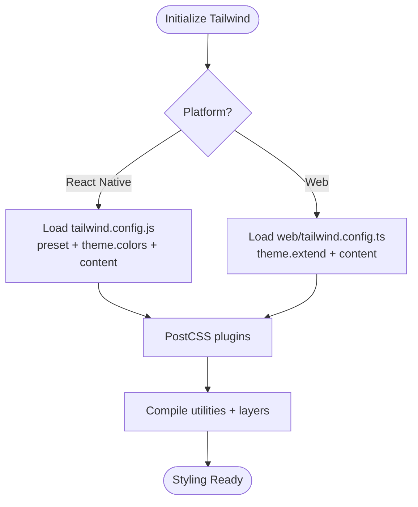
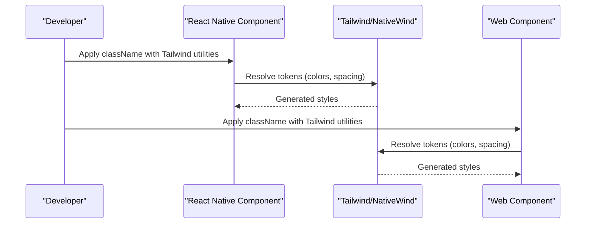
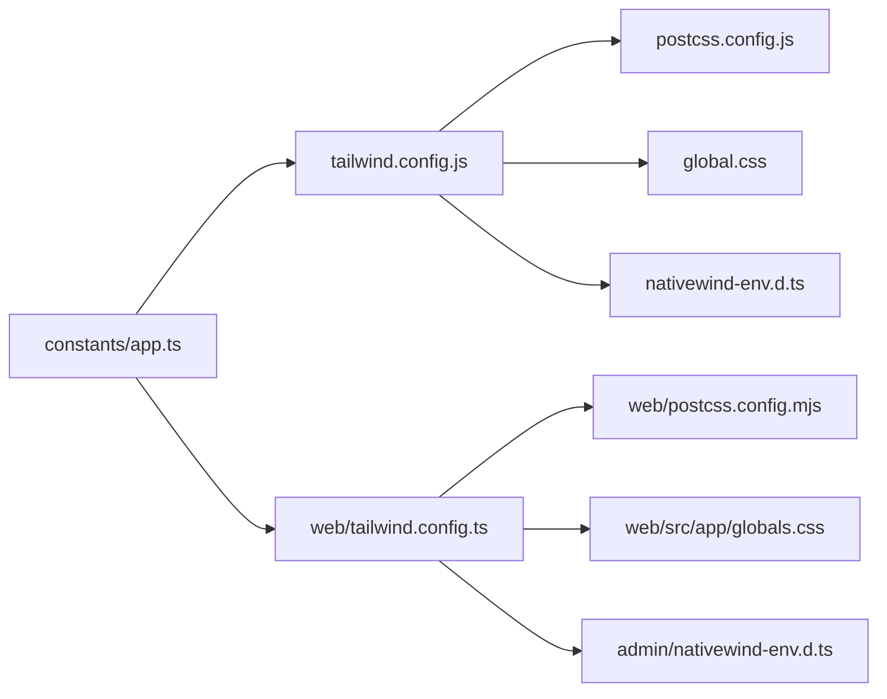

# Design System and Styling

<cite>
**Referenced Files in This Document**
- [tailwind.config.js](file://tailwind.config.js)
- [postcss.config.js](file://postcss.config.js)
- [global.css](file://global.css)
- [constants/index.ts](file://constants/index.ts)
- [constants/app.ts](file://constants/app.ts)
- [web/tailwind.config.ts](file://web/tailwind.config.ts)
- [web/src/app/globals.css](file://web/src/app/globals.css)
- [web/postcss.config.mjs](file://web/postcss.config.mjs)
- [admin/nativewind-env.d.ts](file://admin/nativewind-env.d.ts)
- [nativewind-env.d.ts](file://nativewind-env.d.ts)
- [components/ui/ProductCard.tsx](file://components/ui/ProductCard.tsx)
- [components/ui/MainHeader.tsx](file://components/ui/MainHeader.tsx)
- [components/ui/BannerSlider.tsx](file://components/ui/BannerSlider.tsx)
</cite>

## Table of Contents
1. [Introduction](#introduction)
2. [Project Structure](#project-structure)
3. [Core Components](#core-components)
4. [Architecture Overview](#architecture-overview)
5. [Detailed Component Analysis](#detailed-component-analysis)
6. [Dependency Analysis](#dependency-analysis)
7. [Performance Considerations](#performance-considerations)
8. [Troubleshooting Guide](#troubleshooting-guide)
9. [Conclusion](#conclusion)
10. [Appendices](#appendices)

## Introduction
This document describes the design system architecture and styling framework across the React Native and Web applications. It explains the design token system (colors, typography, spacing), TailwindCSS and NativeWind configuration, cross-platform styling strategies, component styling patterns, responsive design, and theme customization. It also provides practical guidelines for evolving the design system and maintaining brand consistency.

## Project Structure
The design system spans two environments:
- React Native (Expo): TailwindCSS via NativeWind with platform-specific presets and runtime utilities.
- Web (Next.js): TailwindCSS with custom theme extensions, layer-based utilities, and PostCSS.

Key configuration and styling files:
- Tailwind presets and theme extensions
- Global CSS layers and component utilities
- Color constants and brand tokens
- Environment typings for NativeWind

**Diagram sources**
- [tailwind.config.js:1-22](file://tailwind.config.js#L1-L22)
- [postcss.config.js:1-7](file://postcss.config.js#L1-L7)
- [global.css:1-4](file://global.css#L1-L4)
- [nativewind-env.d.ts:1-2](file://nativewind-env.d.ts#L1-L2)
- [constants/app.ts:51-69](file://constants/app.ts#L51-L69)
- [web/tailwind.config.ts:1-32](file://web/tailwind.config.ts#L1-L32)
- [web/postcss.config.mjs:1-9](file://web/postcss.config.mjs#L1-L9)
- [web/src/app/globals.css:1-129](file://web/src/app/globals.css#L1-L129)
- [admin/nativewind-env.d.ts:1-3](file://admin/nativewind-env.d.ts#L1-L3)

**Section sources**
- [tailwind.config.js:1-22](file://tailwind.config.js#L1-L22)
- [postcss.config.js:1-7](file://postcss.config.js#L1-L7)
- [global.css:1-4](file://global.css#L1-L4)
- [constants/index.ts:1-7](file://constants/index.ts#L1-L7)
- [constants/app.ts:51-69](file://constants/app.ts#L51-L69)
- [web/tailwind.config.ts:1-32](file://web/tailwind.config.ts#L1-L32)
- [web/src/app/globals.css:1-129](file://web/src/app/globals.css#L1-L129)
- [web/postcss.config.mjs:1-9](file://web/postcss.config.mjs#L1-L9)
- [admin/nativewind-env.d.ts:1-3](file://admin/nativewind-env.d.ts#L1-L3)
- [nativewind-env.d.ts:1-2](file://nativewind-env.d.ts#L1-L2)

## Core Components
- Design tokens: Centralized brand and semantic tokens in constants and CSS variables.
- Tailwind configuration: Platform-specific theme extensions and content scanning.
- Layered utilities: Base, components, and utilities layers for consistent overrides.
- NativeWind integration: Typings and preset for React Native styling.

Key token and configuration references:
- Brand and semantic colors in constants and Tailwind theme.
- CSS variables for light theme tokens in web globals.
- Tailwind theme extensions for fonts, shadows, and gradients.
- NativeWind env typings for type safety.

**Section sources**
- [constants/app.ts:51-69](file://constants/app.ts#L51-L69)
- [tailwind.config.js:9-19](file://tailwind.config.js#L9-L19)
- [web/tailwind.config.ts:5-27](file://web/tailwind.config.ts#L5-L27)
- [web/src/app/globals.css:5-16](file://web/src/app/globals.css#L5-L16)
- [nativewind-env.d.ts:1-2](file://nativewind-env.d.ts#L1-L2)
- [admin/nativewind-env.d.ts:1-3](file://admin/nativewind-env.d.ts#L1-L3)

## Architecture Overview
The design system uses a dual-config approach:
- React Native: TailwindCSS with NativeWind preset and runtime transformations.
- Web: TailwindCSS with custom theme extensions and layer-based utilities.

**Diagram sources**
- [tailwind.config.js:1-22](file://tailwind.config.js#L1-L22)
- [postcss.config.js:1-7](file://postcss.config.js#L1-L7)
- [global.css:1-4](file://global.css#L1-L4)
- [constants/app.ts:51-69](file://constants/app.ts#L51-L69)
- [web/tailwind.config.ts:1-32](file://web/tailwind.config.ts#L1-L32)
- [web/postcss.config.mjs:1-9](file://web/postcss.config.mjs#L1-L9)
- [web/src/app/globals.css:1-129](file://web/src/app/globals.css#L1-L129)

## Detailed Component Analysis

### Design Token System
- Color tokens: Brand primary, secondary, and semantic roles (danger, success, warning, info) are defined centrally and extended in Tailwind themes.
- Typography tokens: Font families and weights are referenced via CSS variables and Tailwind theme extensions.
- Spacing tokens: Consistent padding and margin utilities are applied across components; spacing is derived from Tailwind defaults and custom utilities.
- Component sizing: Aspect ratios and fixed sizes are computed per component to maintain responsive layouts.

Implementation highlights:
- Centralized color definitions in constants for reuse across platforms.
- Tailwind theme extension for brand and semantic colors.
- CSS variables for light theme tokens in web globals.
- Component-level styles leverage Tailwind utilities and platform-specific props.

**Section sources**
- [constants/app.ts:51-69](file://constants/app.ts#L51-L69)
- [tailwind.config.js:9-19](file://tailwind.config.js#L9-L19)
- [web/tailwind.config.ts:7-16](file://web/tailwind.config.ts#L7-L16)
- [web/src/app/globals.css:5-16](file://web/src/app/globals.css#L5-L16)

### TailwindCSS and NativeWind Configuration
- React Native: Tailwind preset included; content scans app and components directories; theme extends brand and semantic colors.
- Web: Content scans Next.js source; theme extends colors, fonts, shadows, and gradients; layer utilities define reusable component classes.

**Diagram sources**
- [tailwind.config.js:1-22](file://tailwind.config.js#L1-L22)
- [web/tailwind.config.ts:1-32](file://web/tailwind.config.ts#L1-L32)
- [postcss.config.js:1-7](file://postcss.config.js#L1-L7)
- [web/postcss.config.mjs:1-9](file://web/postcss.config.mjs#L1-L9)

**Section sources**
- [tailwind.config.js:1-22](file://tailwind.config.js#L1-L22)
- [web/tailwind.config.ts:1-32](file://web/tailwind.config.ts#L1-L32)
- [postcss.config.js:1-7](file://postcss.config.js#L1-L7)
- [web/postcss.config.mjs:1-9](file://web/postcss.config.mjs#L1-L9)

### Styling Architecture: Cross-Platform Consistency
- Shared tokens: Use constants for brand and semantic colors to keep RN and Web aligned.
- Utility-first: Prefer Tailwind utilities for rapid iteration; layer utilities encapsulate component-level styles.
- NativeWind typing: Ensure type-safe styling in React Native with generated env typings.

**Diagram sources**
- [tailwind.config.js:1-22](file://tailwind.config.js#L1-L22)
- [web/tailwind.config.ts:1-32](file://web/tailwind.config.ts#L1-L32)
- [nativewind-env.d.ts:1-2](file://nativewind-env.d.ts#L1-L2)
- [admin/nativewind-env.d.ts:1-3](file://admin/nativewind-env.d.ts#L1-L3)

**Section sources**
- [constants/app.ts:51-69](file://constants/app.ts#L51-L69)
- [tailwind.config.js:1-22](file://tailwind.config.js#L1-L22)
- [web/tailwind.config.ts:1-32](file://web/tailwind.config.ts#L1-L32)
- [nativewind-env.d.ts:1-2](file://nativewind-env.d.ts#L1-L2)
- [admin/nativewind-env.d.ts:1-3](file://admin/nativewind-env.d.ts#L1-L3)

### Color Palette and Accessibility
- Semantic naming: Colors are named by purpose (primary, secondary, danger, success) to improve readability and accessibility.
- Contrast: Ensure sufficient contrast between foreground and background colors for text and interactive elements.
- Dark mode: Not yet configured; plan to add a dark variant using Tailwind’s dark mode strategy and CSS variables.

Practical guidance:
- Use semantic tokens consistently across components.
- Validate contrast ratios for text and interactive controls.
- Introduce dark mode variants in Tailwind theme and CSS variables.

**Section sources**
- [constants/app.ts:51-69](file://constants/app.ts#L51-L69)
- [tailwind.config.js:11-17](file://tailwind.config.js#L11-L17)
- [web/tailwind.config.ts:7-13](file://web/tailwind.config.ts#L7-L13)

### Typography Hierarchy and Responsive Sizing
- Web typography: CSS variables define font families; Tailwind theme extends font families; responsive text utilities scale headings and body copy.
- Component typography: Titles and labels use explicit classes for consistent hierarchy and rhythm.

Guidelines:
- Define base font family via CSS variable and Tailwind theme.
- Use responsive utilities for headings and body text.
- Keep line heights and letter spacing consistent across components.

**Section sources**
- [web/src/app/globals.css:14-16](file://web/src/app/globals.css#L14-L16)
- [web/tailwind.config.ts:14-16](file://web/tailwind.config.ts#L14-L16)
- [web/src/app/globals.css:81-83](file://web/src/app/globals.css#L81-L83)

### Spacing and Layout Systems
- Padding and margins: Use Tailwind utilities for consistent gutters and spacing; avoid ad-hoc numeric values.
- Grid patterns: Prefer container utilities and gap utilities for consistent layouts.
- Component spacing: Encapsulate spacing in component utilities (e.g., section spacing, field inputs).

**Section sources**
- [web/src/app/globals.css:72-128](file://web/src/app/globals.css#L72-L128)

### Component Styling Patterns and Variants
- Utility composition: Combine small, focused utilities to build complex component states.
- Variant classes: Define reusable variants (e.g., pill buttons, soft panels) in component layers.
- Platform-specific props: Use component props for dynamic sizing and layout adjustments.

Examples:
- Product card uses rounded backgrounds, shadows, and typography utilities.
- Main header composes search input with borders and paddings.
- Banner slider computes dimensions and applies shadows and rounded corners.

**Section sources**
- [components/ui/ProductCard.tsx:29-86](file://components/ui/ProductCard.tsx#L29-L86)
- [components/ui/MainHeader.tsx:13-46](file://components/ui/MainHeader.tsx#L13-L46)
- [components/ui/BannerSlider.tsx:81-134](file://components/ui/BannerSlider.tsx#L81-L134)

### Responsive Design Strategy
- Mobile-first: Start with base styles; add responsive modifiers for larger screens.
- Breakpoints: Use Tailwind’s responsive prefixes to scale typography, spacing, and layouts.
- Adaptive components: Compute widths and heights based on device metrics; apply shadows and rounded variants conditionally.

**Section sources**
- [web/src/app/globals.css:72-128](file://web/src/app/globals.css#L72-L128)
- [components/ui/BannerSlider.tsx:25-29](file://components/ui/BannerSlider.tsx#L25-L29)

### Theme Customization and Brand Consistency
- Centralized tokens: Keep brand and semantic colors in constants and Tailwind theme.
- Layered utilities: Encapsulate brand-specific utilities in component layers to enforce consistency.
- Type-safe styling: Use NativeWind env typings to prevent runtime errors.

**Section sources**
- [constants/app.ts:51-69](file://constants/app.ts#L51-L69)
- [web/src/app/globals.css:72-128](file://web/src/app/globals.css#L72-L128)
- [nativewind-env.d.ts:1-2](file://nativewind-env.d.ts#L1-L2)
- [admin/nativewind-env.d.ts:1-3](file://admin/nativewind-env.d.ts#L1-L3)

## Dependency Analysis
The design system depends on:
- TailwindCSS for utility generation.
- PostCSS for plugin pipeline.
- NativeWind for React Native runtime transformations.
- CSS variables for theme tokens.

**Diagram sources**
- [constants/app.ts:51-69](file://constants/app.ts#L51-L69)
- [tailwind.config.js:1-22](file://tailwind.config.js#L1-L22)
- [web/tailwind.config.ts:1-32](file://web/tailwind.config.ts#L1-L32)
- [postcss.config.js:1-7](file://postcss.config.js#L1-L7)
- [web/postcss.config.mjs:1-9](file://web/postcss.config.mjs#L1-L9)
- [global.css:1-4](file://global.css#L1-L4)
- [web/src/app/globals.css:1-129](file://web/src/app/globals.css#L1-L129)
- [nativewind-env.d.ts:1-2](file://nativewind-env.d.ts#L1-L2)
- [admin/nativewind-env.d.ts:1-3](file://admin/nativewind-env.d.ts#L1-L3)

**Section sources**
- [constants/app.ts:51-69](file://constants/app.ts#L51-L69)
- [tailwind.config.js:1-22](file://tailwind.config.js#L1-L22)
- [web/tailwind.config.ts:1-32](file://web/tailwind.config.ts#L1-L32)
- [postcss.config.js:1-7](file://postcss.config.js#L1-L7)
- [web/postcss.config.mjs:1-9](file://web/postcss.config.mjs#L1-L9)
- [global.css:1-4](file://global.css#L1-L4)
- [web/src/app/globals.css:1-129](file://web/src/app/globals.css#L1-L129)
- [nativewind-env.d.ts:1-2](file://nativewind-env.d.ts#L1-L2)
- [admin/nativewind-env.d.ts:1-3](file://admin/nativewind-env.d.ts#L1-L3)

## Performance Considerations
- Minimize custom utilities: Prefer built-in Tailwind utilities to reduce CSS bloat.
- Scope content: Keep content globs precise to limit scanned files.
- Avoid excessive dynamic styles: Prefer static utilities and minimal inline styles.
- Bundle size: Consolidate theme extensions and layer utilities to reduce repeated declarations.

[No sources needed since this section provides general guidance]

## Troubleshooting Guide
Common issues and resolutions:
- Missing NativeWind types: Ensure env typings are present and up to date.
- Inconsistent colors: Verify theme extensions match constants and CSS variables.
- Utility not applying: Confirm content globs include the component and that layers are ordered correctly.
- PostCSS plugin errors: Validate PostCSS configuration and plugin versions.

**Section sources**
- [nativewind-env.d.ts:1-2](file://nativewind-env.d.ts#L1-L2)
- [admin/nativewind-env.d.ts:1-3](file://admin/nativewind-env.d.ts#L1-L3)
- [tailwind.config.js:3-7](file://tailwind.config.js#L3-L7)
- [web/tailwind.config.ts](file://web/tailwind.config.ts#L4)

## Conclusion
The design system leverages centralized tokens, TailwindCSS, and NativeWind to achieve consistent, scalable styling across React Native and Web. By extending themes with brand and semantic colors, organizing utilities into layers, and enforcing type-safe styling, teams can evolve the system while maintaining brand coherence and accessibility.

[No sources needed since this section summarizes without analyzing specific files]

## Appendices

### Adding New Design Tokens
- Define token values in constants and CSS variables.
- Extend Tailwind theme with new keys.
- Create component utilities for frequently used combinations.
- Update NativeWind env typings if needed.

**Section sources**
- [constants/app.ts:51-69](file://constants/app.ts#L51-L69)
- [web/tailwind.config.ts:5-27](file://web/tailwind.config.ts#L5-L27)
- [web/src/app/globals.css:5-16](file://web/src/app/globals.css#L5-L16)

### Creating Custom Components
- Compose utilities for layout, colors, and typography.
- Encapsulate variants in component layers.
- Use platform-specific props for adaptive sizing.
- Keep component styles declarative and reusable.

**Section sources**
- [components/ui/ProductCard.tsx:29-86](file://components/ui/ProductCard.tsx#L29-L86)
- [components/ui/MainHeader.tsx:13-46](file://components/ui/MainHeader.tsx#L13-L46)
- [components/ui/BannerSlider.tsx:81-134](file://components/ui/BannerSlider.tsx#L81-L134)

### Maintaining Design System Evolution
- Audit token usage periodically.
- Gradually migrate legacy styles to new tokens.
- Document variant APIs and update component layers.
- Align React Native and Web updates through shared constants.

[No sources needed since this section provides general guidance]