# Mobile-Specific Components

<cite>
**Referenced Files in This Document**
- [App.tsx](file://App.tsx)
- [components/cart/CartItem.tsx](file://components/cart/CartItem.tsx)
- [components/auth/AuthUI.tsx](file://components/auth/AuthUI.tsx)
- [components/checkout/AddressStep.tsx](file://components/checkout/AddressStep.tsx)
- [components/checkout/DeliveryStep.tsx](file://components/checkout/DeliveryStep.tsx)
- [components/checkout/PaymentStep.tsx](file://components/checkout/PaymentStep.tsx)
- [components/checkout/ReviewStep.tsx](file://components/checkout/ReviewStep.tsx)
- [components/shared/KeyboardAvoidingWrapper.tsx](file://components/shared/KeyboardAvoidingWrapper.tsx)
- [components/ui/LocationPicker.tsx](file://components/ui/LocationPicker.tsx)
- [components/ui/PriceSlider.tsx](file://components/ui/PriceSlider.tsx)
- [contexts/index.ts](file://contexts/index.ts)
- [types/checkout.ts](file://types/checkout.ts)
- [store/cartStore.ts](file://store/cartStore.ts)
- [components/ErrorBoundary.tsx](file://components/ErrorBoundary.tsx)
- [components/SplashScreen.tsx](file://components/SplashScreen.tsx)
</cite>

## Table of Contents
1. [Introduction](#introduction)
2. [Project Structure](#project-structure)
3. [Core Components](#core-components)
4. [Architecture Overview](#architecture-overview)
5. [Detailed Component Analysis](#detailed-component-analysis)
6. [Dependency Analysis](#dependency-analysis)
7. [Performance Considerations](#performance-considerations)
8. [Troubleshooting Guide](#troubleshooting-guide)
9. [Conclusion](#conclusion)

## Introduction
This document focuses on mobile-optimized UI components designed for touch-first interactions and small screens. It covers:
- CartItem: Shopping cart item rendering with quantity controls and removal
- AuthUI: Mobile-first authentication scaffolding, form fields, validation, and error handling
- Checkout steps: AddressStep, DeliveryStep, PaymentStep, ReviewStep for a progressive checkout
- KeyboardAvoidingWrapper: Mobile keyboard handling for forms
- LocationPicker: Geolocation-based address selection with map integration
- PriceSlider: Touch-friendly price-range filtering
It also documents touch-friendly interaction patterns, gestures, responsive design, performance optimizations, and integration with native mobile features.

## Project Structure
The mobile-focused components live under the native app tree and integrate with shared UI, stores, and contexts:
- Native app entry and scaffolding: [App.tsx](file://App.tsx)
- Cart item component: [components/cart/CartItem.tsx](file://components/cart/CartItem.tsx)
- Authentication UI: [components/auth/AuthUI.tsx](file://components/auth/AuthUI.tsx)
- Checkout steps: [components/checkout/AddressStep.tsx](file://components/checkout/AddressStep.tsx), [components/checkout/DeliveryStep.tsx](file://components/checkout/DeliveryStep.tsx), [components/checkout/PaymentStep.tsx](file://components/checkout/PaymentStep.tsx), [components/checkout/ReviewStep.tsx](file://components/checkout/ReviewStep.tsx)
- Keyboard handling: [components/shared/KeyboardAvoidingWrapper.tsx](file://components/shared/KeyboardAvoidingWrapper.tsx)
- Location picker: [components/ui/LocationPicker.tsx](file://components/ui/LocationPicker.tsx)
- Price slider: [components/ui/PriceSlider.tsx](file://components/ui/PriceSlider.tsx)
- Shared contexts: [contexts/index.ts](file://contexts/index.ts)
- Checkout types: [types/checkout.ts](file://types/checkout.ts)
- Cart store: [store/cartStore.ts](file://store/cartStore.ts)
- Error boundary and splash: [components/ErrorBoundary.tsx](file://components/ErrorBoundary.tsx), [components/SplashScreen.tsx](file://components/SplashScreen.tsx)

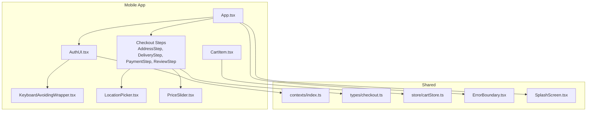

**Diagram sources**
- [App.tsx:1-21](file://App.tsx#L1-L21)
- [components/auth/AuthUI.tsx:1-486](file://components/auth/AuthUI.tsx#L1-L486)
- [components/shared/KeyboardAvoidingWrapper.tsx:1-36](file://components/shared/KeyboardAvoidingWrapper.tsx#L1-L36)
- [components/cart/CartItem.tsx:1-169](file://components/cart/CartItem.tsx#L1-L169)
- [components/ui/LocationPicker.tsx:1-560](file://components/ui/LocationPicker.tsx#L1-L560)
- [components/ui/PriceSlider.tsx:1-274](file://components/ui/PriceSlider.tsx#L1-L274)
- [components/checkout/AddressStep.tsx:1-233](file://components/checkout/AddressStep.tsx#L1-L233)
- [components/checkout/DeliveryStep.tsx:1-77](file://components/checkout/DeliveryStep.tsx#L1-L77)
- [components/checkout/PaymentStep.tsx:1-69](file://components/checkout/PaymentStep.tsx#L1-L69)
- [components/checkout/ReviewStep.tsx:1-171](file://components/checkout/ReviewStep.tsx#L1-L171)
- [contexts/index.ts:1-3](file://contexts/index.ts#L1-L3)
- [types/checkout.ts:1-50](file://types/checkout.ts#L1-L50)
- [store/cartStore.ts:1-174](file://store/cartStore.ts#L1-L174)
- [components/ErrorBoundary.tsx:1-68](file://components/ErrorBoundary.tsx#L1-L68)
- [components/SplashScreen.tsx:1-152](file://components/SplashScreen.tsx#L1-L152)

**Section sources**
- [App.tsx:1-21](file://App.tsx#L1-L21)
- [contexts/index.ts:1-3](file://contexts/index.ts#L1-L3)
- [types/checkout.ts:1-50](file://types/checkout.ts#L1-L50)
- [store/cartStore.ts:1-174](file://store/cartStore.ts#L1-L174)

## Core Components
This section highlights the primary mobile-optimized components and their roles.

- CartItem
  - Purpose: Render a single cart item with image, name, price, quantity controls, and remove action
  - Touch targets: Large hit areas with activeOpacity and hitSlop for accessibility
  - RTL support: Mirrors layout for right-to-left languages
  - Accessibility: Uses accessibilityLabel and role attributes for screen readers
  - Integration: Receives callbacks for quantity updates and removal

- AuthUI
  - Purpose: Provides reusable scaffolding for authentication flows
  - Keyboard handling: Integrates a keyboard-aware scroll view
  - Form fields: Styled inputs with icons, labels, helper/error text, and focus states
  - Buttons: Gradient primary buttons with loading states
  - Switch prompts and notes: Consistent messaging and actions
  - RTL alignment: Automatic directionality and writing direction

- Checkout Steps
  - AddressStep: Collects full name, phone, city, area, street, optional map pin, and landmark
  - DeliveryStep: Horizontal scroller of delivery options with pricing and labels
  - PaymentStep: Option cards for COD and placeholders for future methods
  - ReviewStep: Order summary, items preview, cost breakdown, and localization

- KeyboardAvoidingWrapper
  - Purpose: Wraps content to adjust for keyboard visibility on both iOS and Android
  - Behavior: Uses padding on iOS and height adjustment on Android
  - Interaction: Scroll view with handled taps and interactive dismiss on iOS

- LocationPicker
  - Purpose: Allows users to pick a delivery location via map with geocoding
  - Features: Current location detection, map center pin, address text, confirmation
  - Safety: Permission checks, error handling, debounced reverse geocoding

- PriceSlider
  - Purpose: Touch-friendly dual-thumb slider for price range filtering
  - Formatting: Localized numeric formatting with Arabic/Metric suffixes
  - Constraints: Minimum distance between thumbs and configurable step sizes

**Section sources**
- [components/cart/CartItem.tsx:1-169](file://components/cart/CartItem.tsx#L1-L169)
- [components/auth/AuthUI.tsx:1-486](file://components/auth/AuthUI.tsx#L1-L486)
- [components/checkout/AddressStep.tsx:1-233](file://components/checkout/AddressStep.tsx#L1-L233)
- [components/checkout/DeliveryStep.tsx:1-77](file://components/checkout/DeliveryStep.tsx#L1-L77)
- [components/checkout/PaymentStep.tsx:1-69](file://components/checkout/PaymentStep.tsx#L1-L69)
- [components/checkout/ReviewStep.tsx:1-171](file://components/checkout/ReviewStep.tsx#L1-L171)
- [components/shared/KeyboardAvoidingWrapper.tsx:1-36](file://components/shared/KeyboardAvoidingWrapper.tsx#L1-L36)
- [components/ui/LocationPicker.tsx:1-560](file://components/ui/LocationPicker.tsx#L1-L560)
- [components/ui/PriceSlider.tsx:1-274](file://components/ui/PriceSlider.tsx#L1-L274)

## Architecture Overview
The checkout flow integrates UI components, form state, and stores. AuthUI is used across authentication pages and wraps forms with keyboard-aware scrolling. LocationPicker and PriceSlider are embedded within checkout steps to enhance mobile usability.

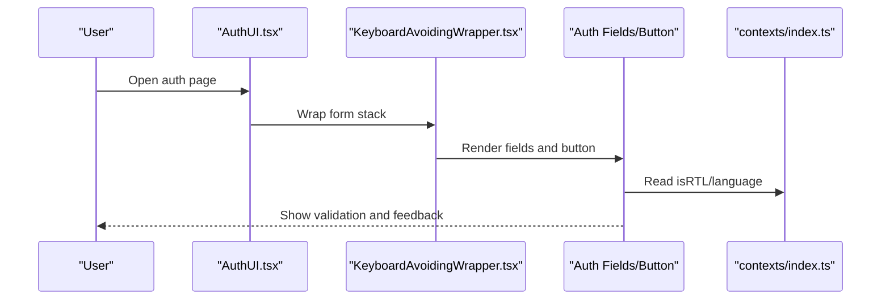

**Diagram sources**
- [components/auth/AuthUI.tsx:59-124](file://components/auth/AuthUI.tsx#L59-L124)
- [components/shared/KeyboardAvoidingWrapper.tsx:11-35](file://components/shared/KeyboardAvoidingWrapper.tsx#L11-L35)
- [contexts/index.ts:1-3](file://contexts/index.ts#L1-L3)

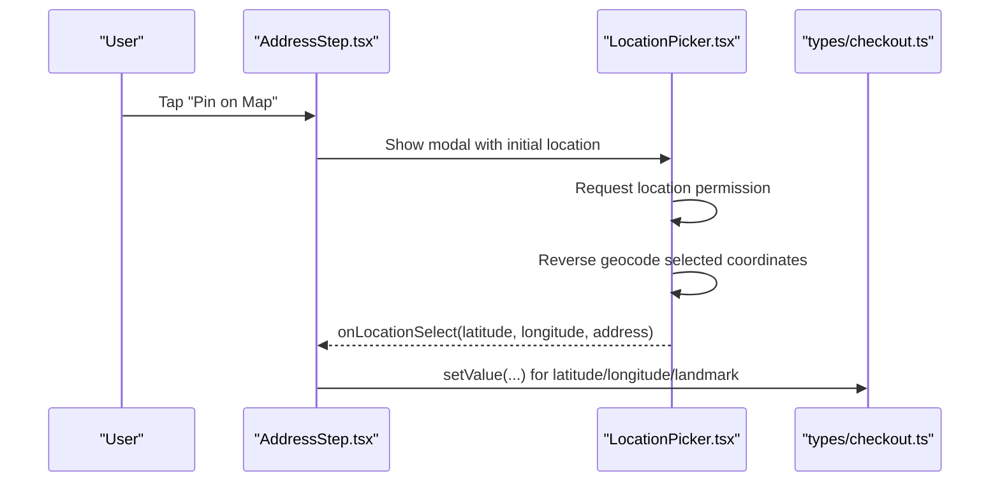

**Diagram sources**
- [components/checkout/AddressStep.tsx:20, 24-30:20-30](file://components/checkout/AddressStep.tsx#L20-L30)
- [components/ui/LocationPicker.tsx:91-137](file://components/ui/LocationPicker.tsx#L91-L137)
- [types/checkout.ts:3, 12-14:3-14](file://types/checkout.ts#L3-L14)

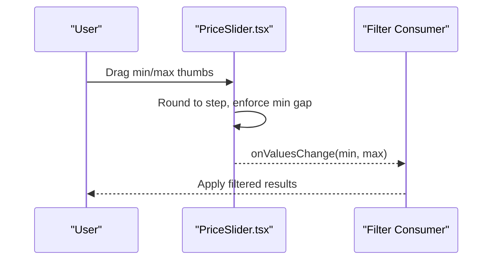

**Diagram sources**
- [components/ui/PriceSlider.tsx:53-89](file://components/ui/PriceSlider.tsx#L53-L89)

## Detailed Component Analysis

### CartItem
- Touch targets: Remove button and quantity +/- buttons use hitSlop and activeOpacity for large, forgiving press areas
- RTL mirroring: Layout flips for right-to-left languages using flex-row-reverse
- Accessibility: Labels describe actions and quantities for assistive tech
- Performance: Uses memoization to prevent unnecessary re-renders
- Data handling: Receives callbacks for updates and removal, formatting via props

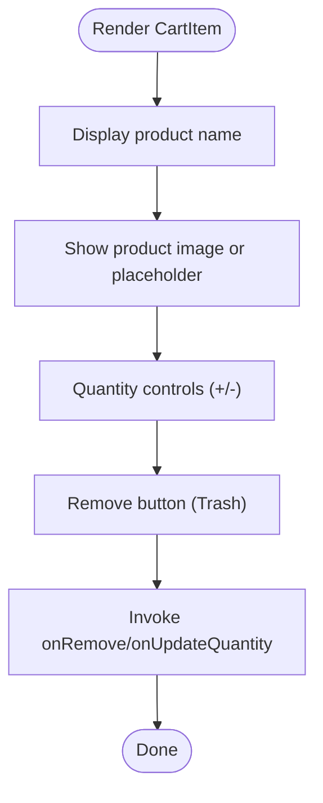

**Diagram sources**
- [components/cart/CartItem.tsx:25-164](file://components/cart/CartItem.tsx#L25-L164)

**Section sources**
- [components/cart/CartItem.tsx:1-169](file://components/cart/CartItem.tsx#L1-L169)

### AuthUI
- Scaffolding: SafeAreaView, gradient background, back navigation, and keyboard-aware scroll
- Fields: Icon, label, input, trailing elements, helper/error text, and dynamic alignment
- Validation: Visual feedback for focused, success, and error states
- Buttons: Gradient styling, loading indicator, and disabled states
- Prompts and notes: Consistent typography and layout for actions and messages
- RTL: Writing direction and layout adapt automatically

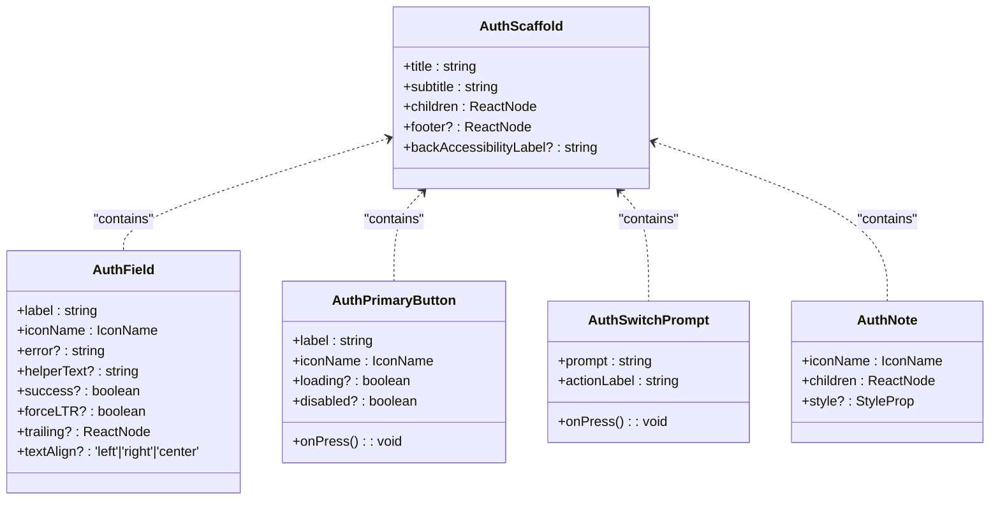

**Diagram sources**
- [components/auth/AuthUI.tsx:26, 34, 45, 53, 59:26-59](file://components/auth/AuthUI.tsx#L26-L59)

**Section sources**
- [components/auth/AuthUI.tsx:1-486](file://components/auth/AuthUI.tsx#L1-L486)

### AddressStep
- Progressive form: Name, phone, city dropdown, area/street, and optional map pin
- City picker: Modal with FlatList of Iraqi cities, localized names
- Map integration: Opens LocationPicker to capture latitude/longitude and landmark
- Focus handling: Scrolls to keep focused input visible
- Validation: Renders error rows below invalid fields with warning icons

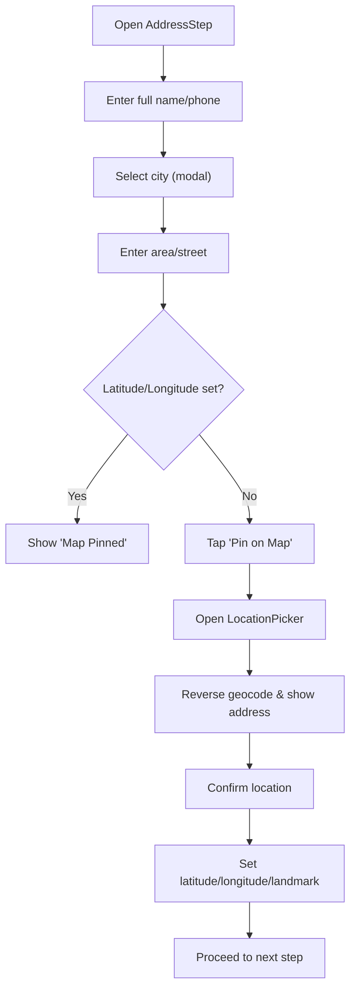

**Diagram sources**
- [components/checkout/AddressStep.tsx:16-36](file://components/checkout/AddressStep.tsx#L16-L36)
- [components/checkout/AddressStep.tsx:204-229](file://components/checkout/AddressStep.tsx#L204-L229)
- [types/checkout.ts:17-36](file://types/checkout.ts#L17-L36)

**Section sources**
- [components/checkout/AddressStep.tsx:1-233](file://components/checkout/AddressStep.tsx#L1-L233)
- [types/checkout.ts:1-50](file://types/checkout.ts#L1-L50)

### DeliveryStep
- Horizontal scrolling cards for delivery options
- Visual indicators for selected option and pricing
- Icons represent service types (standard, express, fragile)

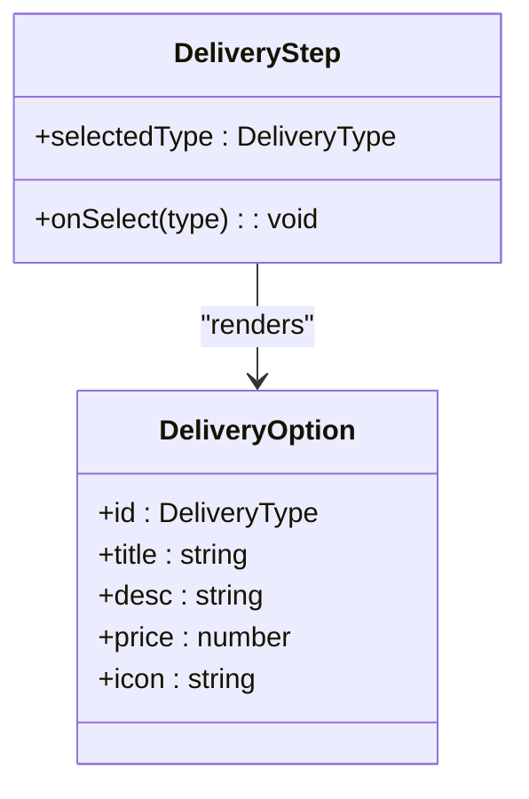

**Diagram sources**
- [components/checkout/DeliveryStep.tsx:7-10](file://components/checkout/DeliveryStep.tsx#L7-L10)
- [components/checkout/DeliveryStep.tsx:17-39](file://components/checkout/DeliveryStep.tsx#L17-L39)

**Section sources**
- [components/checkout/DeliveryStep.tsx:1-77](file://components/checkout/DeliveryStep.tsx#L1-L77)

### PaymentStep
- Option cards for payment methods
- Visual feedback for selected method
- Availability flags for future methods

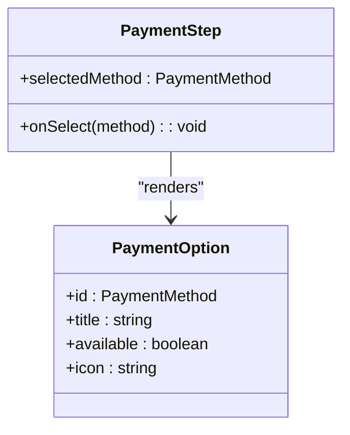

**Diagram sources**
- [components/checkout/PaymentStep.tsx:7-10](file://components/checkout/PaymentStep.tsx#L7-L10)
- [components/checkout/PaymentStep.tsx:16-35](file://components/checkout/PaymentStep.tsx#L16-L35)

**Section sources**
- [components/checkout/PaymentStep.tsx:1-69](file://components/checkout/PaymentStep.tsx#L1-L69)

### ReviewStep
- Order summary: Address, phone, delivery, payment
- Items preview: Horizontal scroll with thumbnails and quantities
- Cost summary: Subtotal, delivery fee, optional discount, total

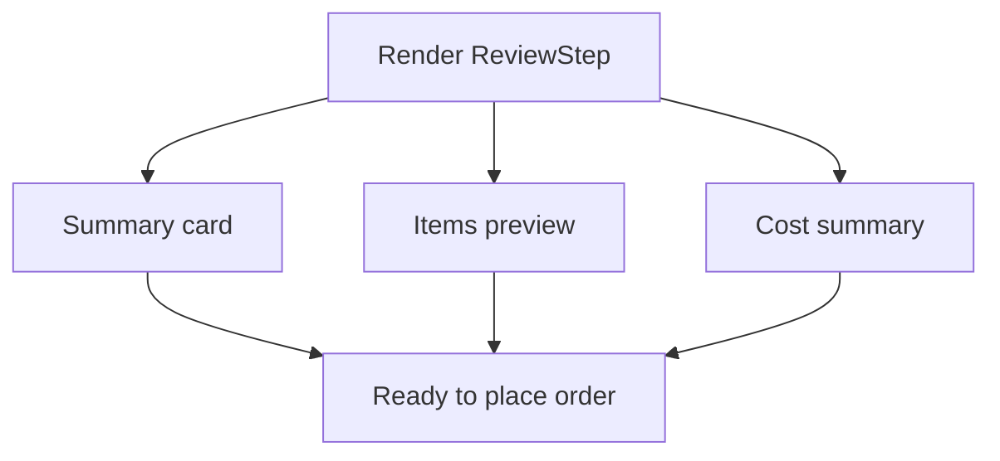

**Diagram sources**
- [components/checkout/ReviewStep.tsx:35-169](file://components/checkout/ReviewStep.tsx#L35-L169)

**Section sources**
- [components/checkout/ReviewStep.tsx:1-171](file://components/checkout/ReviewStep.tsx#L1-L171)

### KeyboardAvoidingWrapper
- Wraps children in a KeyboardAvoidingView and ScrollView
- Adjusts behavior per platform (iOS padding vs Android height)
- Handles keyboard dismissal modes and scroll persistence

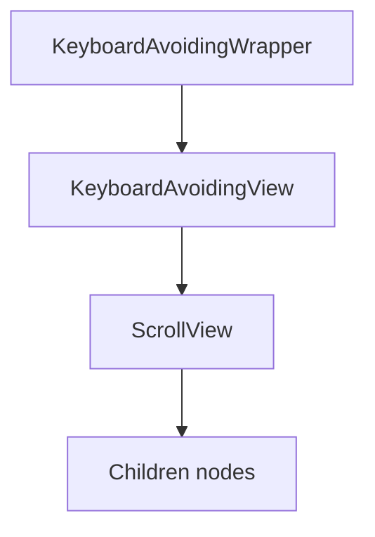

**Diagram sources**
- [components/shared/KeyboardAvoidingWrapper.tsx:11-35](file://components/shared/KeyboardAvoidingWrapper.tsx#L11-L35)

**Section sources**
- [components/shared/KeyboardAvoidingWrapper.tsx:1-36](file://components/shared/KeyboardAvoidingWrapper.tsx#L1-L36)

### LocationPicker
- WebView-based map using Leaflet
- Permission flow for foreground location
- Reverse geocoding with debouncing to reduce API calls
- Confirmation dialog with selected coordinates and address text

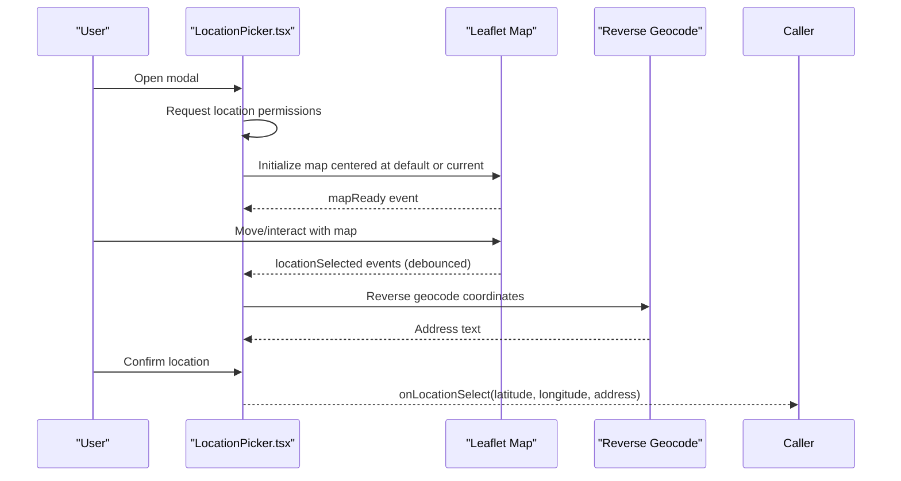

**Diagram sources**
- [components/ui/LocationPicker.tsx:39-62](file://components/ui/LocationPicker.tsx#L39-L62)
- [components/ui/LocationPicker.tsx:139-171](file://components/ui/LocationPicker.tsx#L139-L171)
- [components/ui/LocationPicker.tsx:173-187](file://components/ui/LocationPicker.tsx#L173-L187)

**Section sources**
- [components/ui/LocationPicker.tsx:1-560](file://components/ui/LocationPicker.tsx#L1-L560)

### PriceSlider
- Dual-thumb slider with rounded values and step constraints
- Real-time visual fill between thumbs
- Localized formatting for Arabic and English

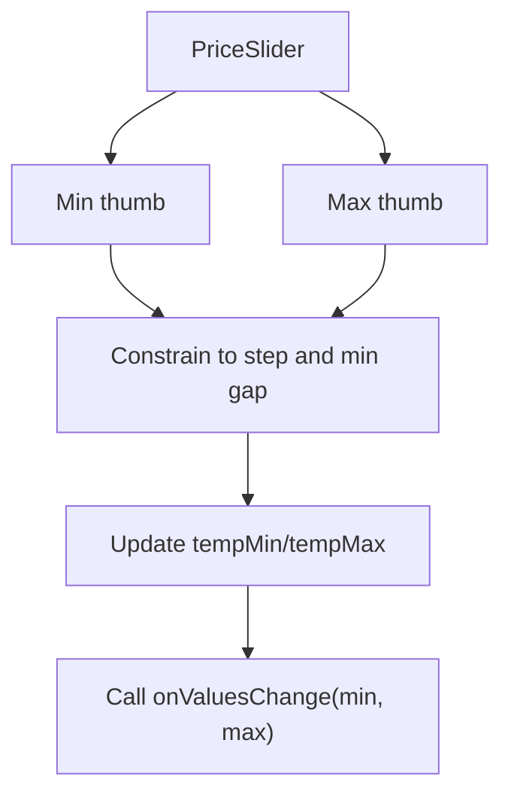

**Diagram sources**
- [components/ui/PriceSlider.tsx:46-51](file://components/ui/PriceSlider.tsx#L46-L51)
- [components/ui/PriceSlider.tsx:53-89](file://components/ui/PriceSlider.tsx#L53-L89)

**Section sources**
- [components/ui/PriceSlider.tsx:1-274](file://components/ui/PriceSlider.tsx#L1-L274)

## Dependency Analysis
- CartItem depends on:
  - Store for cart totals and item quantities
  - Contexts for language and currency formatting
  - Accessibility props for screen readers
- AuthUI depends on:
  - Keyboard controller for mobile keyboard handling
  - Language context for RTL and text direction
  - Constants for colors and gradients
- Checkout steps depend on:
  - react-hook-form for controlled inputs and validation
  - LocationPicker for geolocation
  - PriceSlider for filters
  - Store for cart items and totals
  - Types for checkout data structures
- LocationPicker depends on:
  - expo-location for permissions and positioning
  - WebView for Leaflet map
  - Reverse geocoding API for address text
- PriceSlider depends on:
  - @react-native-community/slider for touch interaction
  - Localized formatting helpers

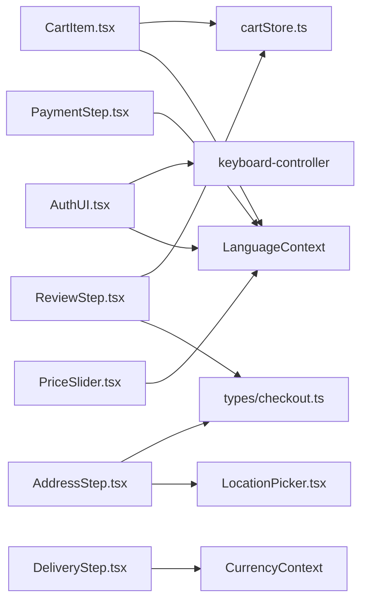

**Diagram sources**
- [components/cart/CartItem.tsx:1, 21-22:1-22](file://components/cart/CartItem.tsx#L1-L22)
- [store/cartStore.ts:1-174](file://store/cartStore.ts#L1-L174)
- [contexts/index.ts:1-3](file://contexts/index.ts#L1-L3)
- [components/auth/AuthUI.tsx:15, 21:15-21](file://components/auth/AuthUI.tsx#L15-L21)
- [components/checkout/AddressStep.tsx:5, 7:5-7](file://components/checkout/AddressStep.tsx#L5-L7)
- [types/checkout.ts:1-50](file://types/checkout.ts#L1-L50)
- [components/ui/LocationPicker.tsx:4](file://components/ui/LocationPicker.tsx#L4)
- [components/checkout/DeliveryStep.tsx:5](file://components/checkout/DeliveryStep.tsx#L5)
- [components/checkout/PaymentStep.tsx:5](file://components/checkout/PaymentStep.tsx#L5)
- [components/checkout/ReviewStep.tsx:5-6](file://components/checkout/ReviewStep.tsx#L5-L6)
- [components/ui/PriceSlider.tsx:3](file://components/ui/PriceSlider.tsx#L3)

**Section sources**
- [components/cart/CartItem.tsx:1-169](file://components/cart/CartItem.tsx#L1-L169)
- [components/auth/AuthUI.tsx:1-486](file://components/auth/AuthUI.tsx#L1-L486)
- [components/checkout/AddressStep.tsx:1-233](file://components/checkout/AddressStep.tsx#L1-L233)
- [components/checkout/DeliveryStep.tsx:1-77](file://components/checkout/DeliveryStep.tsx#L1-L77)
- [components/checkout/PaymentStep.tsx:1-69](file://components/checkout/PaymentStep.tsx#L1-L69)
- [components/checkout/ReviewStep.tsx:1-171](file://components/checkout/ReviewStep.tsx#L1-L171)
- [components/ui/LocationPicker.tsx:1-560](file://components/ui/LocationPicker.tsx#L1-L560)
- [components/ui/PriceSlider.tsx:1-274](file://components/ui/PriceSlider.tsx#L1-L274)
- [contexts/index.ts:1-3](file://contexts/index.ts#L1-L3)
- [types/checkout.ts:1-50](file://types/checkout.ts#L1-L50)
- [store/cartStore.ts:1-174](file://store/cartStore.ts#L1-L174)

## Performance Considerations
- Touch targets: Ensure buttons and controls are large enough for thumb interaction; use hitSlop to expand press areas without affecting layout
- Keyboard handling: Prefer keyboard-aware scroll views to avoid layout thrashing; minimize nested scrollable regions
- Images: Use caching policies and appropriate sizing to reduce memory pressure on mobile devices
- Sliders: Debounce reverse geocoding and throttle frequent updates to limit API calls
- Lists: Use FlatList for long pickers (e.g., city list) to recycle off-screen items
- Animations: Keep transitions subtle and avoid heavy animations during form submission
- Storage: Persist cart state efficiently to avoid recalculating totals on every render

## Troubleshooting Guide
- Keyboard overlaps input
  - Ensure the form is wrapped in a keyboard-aware scroll view and that the focused input is scrolled into view
  - Verify keyboardShouldPersistTaps and keyboardDismissMode are configured appropriately
- Location permission denied
  - Prompt users to enable location access in system settings; provide clear error messages
  - Handle last-known position fallback gracefully
- Map fails to load
  - Show a loading indicator and error alert; retry on user action
  - Validate WebView configuration and network connectivity
- Slider thumb overlap
  - Enforce minimum gap between thumbs and round to step boundaries
- Cart quantity exceeds stock
  - Validate against stock before allowing updates; surface user-friendly errors

**Section sources**
- [components/shared/KeyboardAvoidingWrapper.tsx:11-35](file://components/shared/KeyboardAvoidingWrapper.tsx#L11-L35)
- [components/ui/LocationPicker.tsx:91-137](file://components/ui/LocationPicker.tsx#L91-L137)
- [components/ui/LocationPicker.tsx:278-287](file://components/ui/LocationPicker.tsx#L278-L287)
- [components/ui/PriceSlider.tsx:53-89](file://components/ui/PriceSlider.tsx#L53-L89)
- [store/cartStore.ts:109-133](file://store/cartStore.ts#L109-L133)

## Conclusion
These mobile-optimized components emphasize touch-friendly interactions, robust keyboard handling, and seamless integration with native capabilities. By leveraging RTL-aware layouts, accessible semantics, and efficient data flows, the UI delivers a smooth, reliable shopping experience on mobile devices. Extending these patterns ensures consistent UX across authentication, checkout, and browsing flows.