# Shared Components

<cite>
**Referenced Files in This Document**
- [ProductCard.tsx](file://components/ui/ProductCard.tsx)
- [MainHeader.tsx](file://components/ui/MainHeader.tsx)
- [BottomSheet.tsx](file://components/ui/BottomSheet.tsx)
- [SectionHeader.tsx](file://components/ui/SectionHeader.tsx)
- [Toast.tsx](file://components/ui/Toast.tsx)
- [WishlistButton.tsx](file://components/ui/WishlistButton.tsx)
- [BannerSlider.tsx](file://components/ui/BannerSlider.tsx)
- [PromoBannerSlot.tsx](file://components/ui/PromoBannerSlot.tsx)
- [CountdownTimer.tsx](file://components/ui/CountdownTimer.tsx)
- [KeyboardAvoidingWrapper.tsx](file://components/shared/KeyboardAvoidingWrapper.tsx)
- [useSupabase.ts](file://hooks/useSupabase.ts)
- [types.ts](file://shared/types.ts)
- [content.service.ts](file://services/content.service.ts)
</cite>

## Table of Contents
1. [Introduction](#introduction)
2. [Project Structure](#project-structure)
3. [Core Components](#core-components)
4. [Architecture Overview](#architecture-overview)
5. [Detailed Component Analysis](#detailed-component-analysis)
6. [Dependency Analysis](#dependency-analysis)
7. [Performance Considerations](#performance-considerations)
8. [Troubleshooting Guide](#troubleshooting-guide)
9. [Conclusion](#conclusion)
10. [Appendices](#appendices)

## Introduction
This document describes the shared UI components library used across mobile, web, and admin platforms. It focuses on reusable elements that provide consistent navigation, content presentation, user feedback, and interactive modals. The documentation covers each component’s purpose, props interface, styling approach, usage patterns, composition, event handling, and cross-platform compatibility. It also highlights integration points with localization, currency formatting, routing, and backend services.

## Project Structure
The shared UI components live under components/ui and are consumed by pages and views across the mobile app, web app, and admin app. Supporting utilities and providers include:
- Localization and currency contexts
- Supabase hooks and services for data fetching
- Shared types for consistent typing across platforms

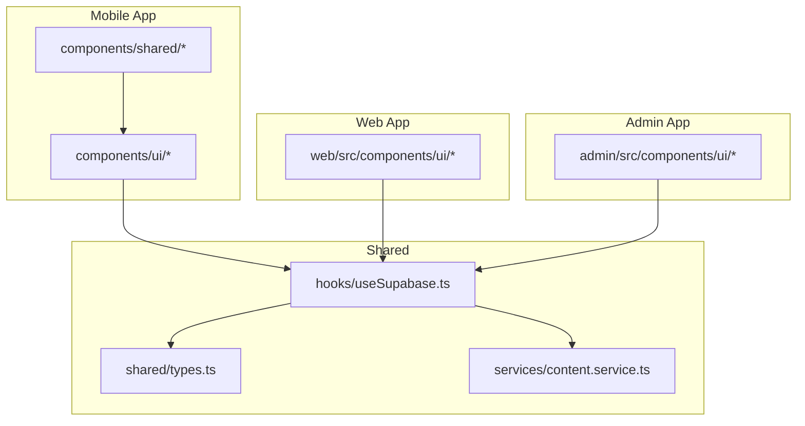

**Diagram sources**
- [ProductCard.tsx](file://components/ui/ProductCard.tsx)
- [MainHeader.tsx](file://components/ui/MainHeader.tsx)
- [BottomSheet.tsx](file://components/ui/BottomSheet.tsx)
- [SectionHeader.tsx](file://components/ui/SectionHeader.tsx)
- [Toast.tsx](file://components/ui/Toast.tsx)
- [WishlistButton.tsx](file://components/ui/WishlistButton.tsx)
- [BannerSlider.tsx](file://components/ui/BannerSlider.tsx)
- [PromoBannerSlot.tsx](file://components/ui/PromoBannerSlot.tsx)
- [CountdownTimer.tsx](file://components/ui/CountdownTimer.tsx)
- [KeyboardAvoidingWrapper.tsx](file://components/shared/KeyboardAvoidingWrapper.tsx)
- [useSupabase.ts](file://hooks/useSupabase.ts)
- [types.ts](file://shared/types.ts)
- [content.service.ts](file://services/content.service.ts)

**Section sources**
- [ProductCard.tsx](file://components/ui/ProductCard.tsx)
- [MainHeader.tsx](file://components/ui/MainHeader.tsx)
- [BottomSheet.tsx](file://components/ui/BottomSheet.tsx)
- [SectionHeader.tsx](file://components/ui/SectionHeader.tsx)
- [Toast.tsx](file://components/ui/Toast.tsx)
- [WishlistButton.tsx](file://components/ui/WishlistButton.tsx)
- [BannerSlider.tsx](file://components/ui/BannerSlider.tsx)
- [PromoBannerSlot.tsx](file://components/ui/PromoBannerSlot.tsx)
- [CountdownTimer.tsx](file://components/ui/CountdownTimer.tsx)
- [KeyboardAvoidingWrapper.tsx](file://components/shared/KeyboardAvoidingWrapper.tsx)
- [useSupabase.ts](file://hooks/useSupabase.ts)
- [types.ts](file://shared/types.ts)
- [content.service.ts](file://services/content.service.ts)

## Core Components
This section summarizes the primary shared components and their responsibilities.

- ProductCard: Displays product images, pricing, optional discount badge, and “Add to Cart” action.
- MainHeader: Provides a branded header with a search bar and safe-area-aware layout.
- BottomSheet: Modal overlay with animated backdrop and draggable handle for content presentation.
- SectionHeader: Section title with optional icon, countdown timer, and “See all” action.
- Toast: Global notification provider with animated toasts and dialog overlays.
- WishlistButton: Toggle favorite item with user authentication gating and optimistic UI updates.
- BannerSlider: Auto-rotating promotional banners with pagination indicators.
- PromoBannerSlot: Responsive promotional slots supporting full-width, half-width, and square layouts.
- CountdownTimer: Live countdown display for limited-time offers.

**Section sources**
- [ProductCard.tsx](file://components/ui/ProductCard.tsx)
- [MainHeader.tsx](file://components/ui/MainHeader.tsx)
- [BottomSheet.tsx](file://components/ui/BottomSheet.tsx)
- [SectionHeader.tsx](file://components/ui/SectionHeader.tsx)
- [Toast.tsx](file://components/ui/Toast.tsx)
- [WishlistButton.tsx](file://components/ui/WishlistButton.tsx)
- [BannerSlider.tsx](file://components/ui/BannerSlider.tsx)
- [PromoBannerSlot.tsx](file://components/ui/PromoBannerSlot.tsx)
- [CountdownTimer.tsx](file://components/ui/CountdownTimer.tsx)

## Architecture Overview
The components rely on:
- Routing via Expo Router for navigation
- Localization and RTL support via LanguageContext
- Currency formatting via CurrencyContext
- Backend integration via Supabase hooks and services
- Animated transitions via react-native-reanimated and Animated

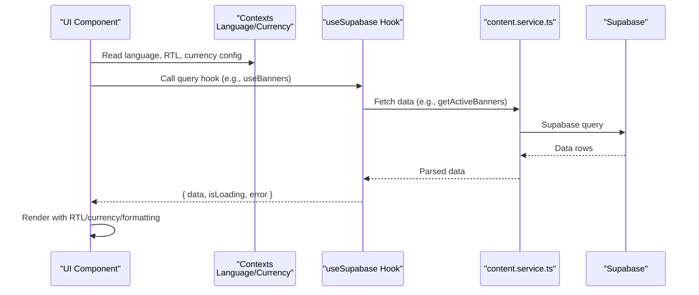

**Diagram sources**
- [useSupabase.ts](file://hooks/useSupabase.ts)
- [content.service.ts](file://services/content.service.ts)
- [ProductCard.tsx](file://components/ui/ProductCard.tsx)
- [SectionHeader.tsx](file://components/ui/SectionHeader.tsx)
- [BannerSlider.tsx](file://components/ui/BannerSlider.tsx)
- [PromoBannerSlot.tsx](file://components/ui/PromoBannerSlot.tsx)

## Detailed Component Analysis

### ProductCard
- Purpose: Present a single product with image, name, price, optional discount badge, and “Add to Cart” action.
- Props:
  - product: Product
  - showDiscount?: boolean
  - width?: DimensionValue
- Behavior:
  - Navigates to product detail on press.
  - Adds product to cart via cart store and shows localized toast.
  - Uses currency formatting and language switching for names/prices.
- Styling:
  - Tailwind-like classes for layout and shadows.
  - Aspect-ratio maintained for product image.
- Accessibility:
  - Uses semantic pressable areas; ensure focus outlines if extended.
- Cross-platform:
  - Uses expo-image and native touchables; compatible with web via Expo Router.

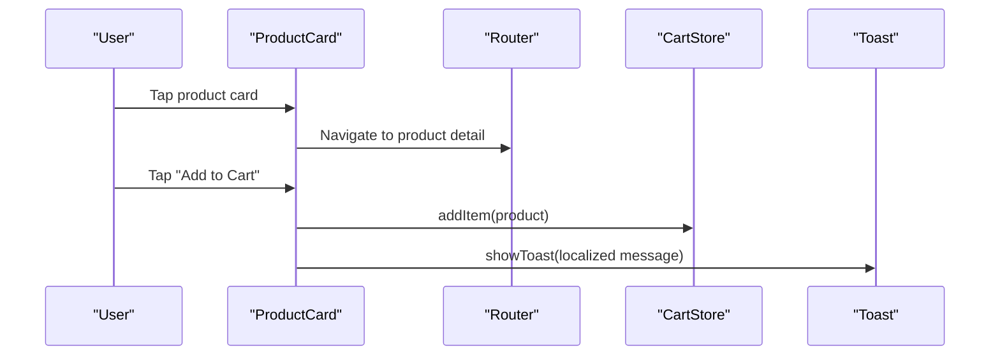

**Diagram sources**
- [ProductCard.tsx](file://components/ui/ProductCard.tsx)
- [Toast.tsx](file://components/ui/Toast.tsx)

**Section sources**
- [ProductCard.tsx](file://components/ui/ProductCard.tsx)
- [types.ts](file://shared/types.ts)

### MainHeader
- Purpose: Branding and search entry point with safe-area awareness.
- Props: None
- Behavior:
  - Renders a search box that navigates to the search page.
  - Adapts layout direction based on language (RTL/LTR).
- Styling:
  - Dynamic padding based on safe-area insets.
- Accessibility:
  - Clear focus target for the search box; ensure label for assistive tech.

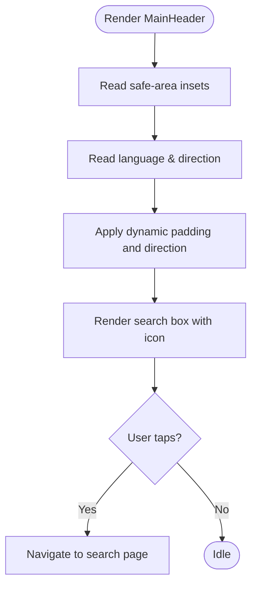

**Diagram sources**
- [MainHeader.tsx](file://components/ui/MainHeader.tsx)

**Section sources**
- [MainHeader.tsx](file://components/ui/MainHeader.tsx)

### BottomSheet
- Purpose: Modal overlay with animated backdrop and draggable handle.
- Props:
  - visible: boolean
  - onClose: () => void
  - children: ReactNode
  - maxHeight?: number | string
- Behavior:
  - Opens with slide-up and fade-in; closes with slide-down and fade-out.
  - Responds to hardware back press when visible.
  - Draggable handle supports swipe-to-dismiss.
- Styling:
  - Rounded top corners, backdrop overlay, and animated transforms.
- Accessibility:
  - Transparent backdrop dismiss; ensure focus trapping if adding inputs.

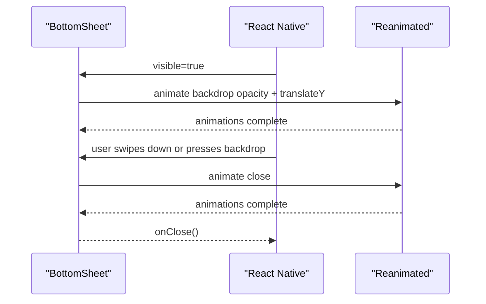

**Diagram sources**
- [BottomSheet.tsx](file://components/ui/BottomSheet.tsx)

**Section sources**
- [BottomSheet.tsx](file://components/ui/BottomSheet.tsx)

### SectionHeader
- Purpose: Section title with optional icon, countdown timer, and “See all” action.
- Props:
  - title: string
  - icon?: Ionicons key
  - onSeeAll?: () => void
  - hasTimer?: boolean
  - timerSeconds?: number
- Behavior:
  - Composes CountdownTimer when requested.
  - Localizes “See all” text via translation function.
- Styling:
  - Flexible row layout with RTL-aware ordering.

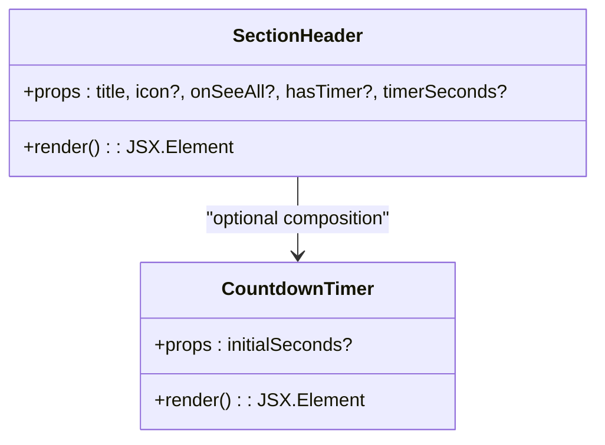

**Diagram sources**
- [SectionHeader.tsx](file://components/ui/SectionHeader.tsx)
- [CountdownTimer.tsx](file://components/ui/CountdownTimer.tsx)

**Section sources**
- [SectionHeader.tsx](file://components/ui/SectionHeader.tsx)
- [CountdownTimer.tsx](file://components/ui/CountdownTimer.tsx)

### Toast
- Purpose: Global notification system with animated toasts and dialog overlays.
- APIs:
  - showToast(message, type?, duration?)
  - showAppToast(data)
  - showAppDialog(data)
- Behavior:
  - Infers type from keywords or destructive buttons.
  - Supports RTL-aware text direction and layout.
  - Integrates with native Alert while preserving custom dialogs.
- Styling:
  - Accent bars, soft backgrounds, and directional icons per type.

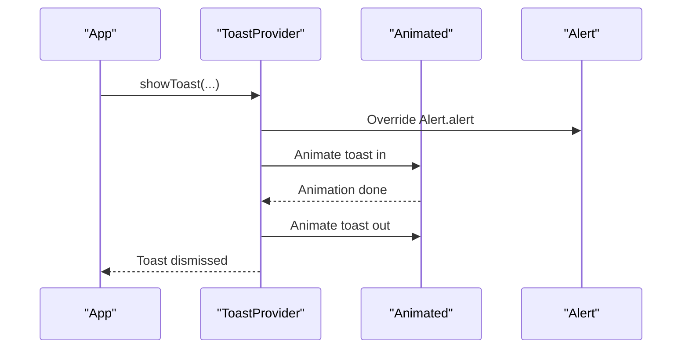

**Diagram sources**
- [Toast.tsx](file://components/ui/Toast.tsx)

**Section sources**
- [Toast.tsx](file://components/ui/Toast.tsx)

### WishlistButton
- Purpose: Toggle product as favorite with user authentication gating.
- Props:
  - productId: string
  - size?: number
  - iconSize?: number
  - backgroundColor?: string
  - activeBackgroundColor?: string
  - color?: string
  - activeColor?: string
- Behavior:
  - Loads current user session and checks existing wishlist record.
  - Prompts login if unauthenticated; otherwise inserts/deletes wishlist item.
  - Shows localized toasts for success/error.
- Styling:
  - Circular button with active/inactive states.

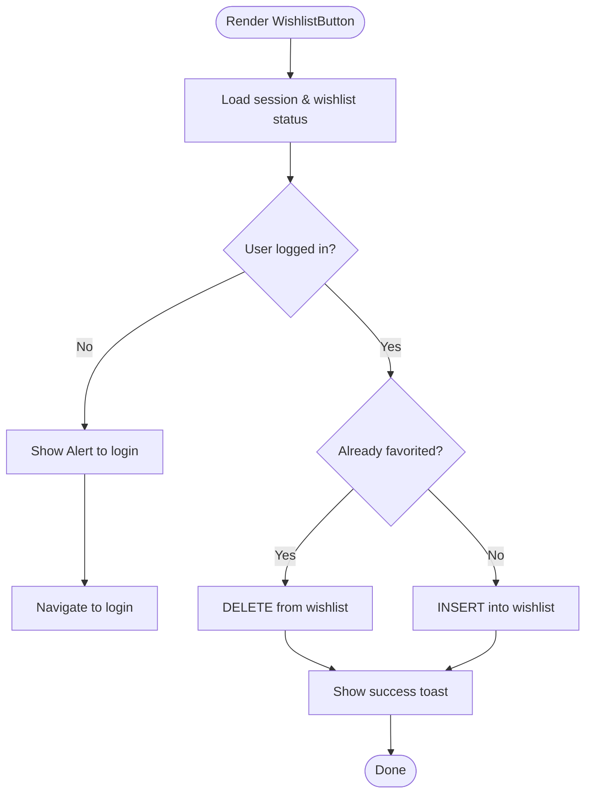

**Diagram sources**
- [WishlistButton.tsx](file://components/ui/WishlistButton.tsx)
- [Toast.tsx](file://components/ui/Toast.tsx)

**Section sources**
- [WishlistButton.tsx](file://components/ui/WishlistButton.tsx)
- [types.ts](file://shared/types.ts)

### BannerSlider
- Purpose: Auto-scrolling promotional banners with pagination dots.
- Props:
  - banners: Banner[] | undefined
  - isLoading: boolean
  - error: any
  - onRetry: () => void
  - t: (key: string) => string
- Behavior:
  - Auto-advances slides at intervals; manual scroll updates active index.
  - Handles external links vs internal navigation.
  - Shows skeleton loader, error state, or empty state.
- Styling:
  - Paging-enabled horizontal scroll with snap-to-interval.

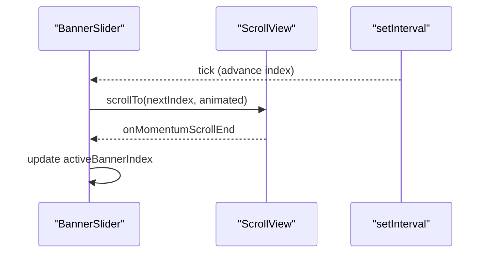

**Diagram sources**
- [BannerSlider.tsx](file://components/ui/BannerSlider.tsx)

**Section sources**
- [BannerSlider.tsx](file://components/ui/BannerSlider.tsx)
- [content.service.ts](file://services/content.service.ts)

### PromoBannerSlot
- Purpose: Render promotional banners in responsive layouts (full, half, square).
- Props:
  - banners: PromoBanner[] | undefined
  - isLoading?: boolean
- Behavior:
  - Determines layout based on first banner’s size.
  - Handles external URLs and internal navigation.
  - Shows skeleton loader during loading.
- Styling:
  - Dynamic widths/heights based on screen width; shadow and rounded corners.

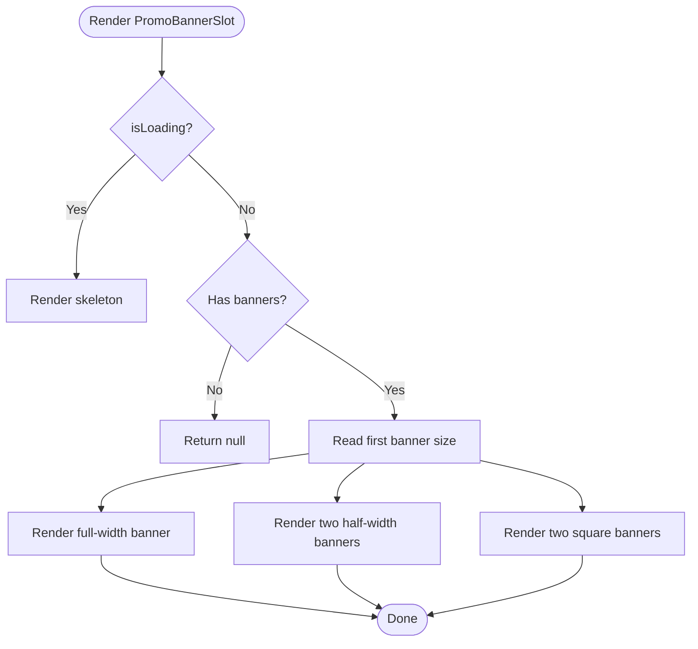

**Diagram sources**
- [PromoBannerSlot.tsx](file://components/ui/PromoBannerSlot.tsx)
- [content.service.ts](file://services/content.service.ts)

**Section sources**
- [PromoBannerSlot.tsx](file://components/ui/PromoBannerSlot.tsx)
- [content.service.ts](file://services/content.service.ts)

### CountdownTimer
- Purpose: Display a live countdown for limited-time offers.
- Props:
  - initialSeconds?: number
- Behavior:
  - Decrements every second until zero.
  - Renders with icon, time digits, and localized suffix.
- Styling:
  - Compact pill layout with danger accents and RTL-aware text direction.

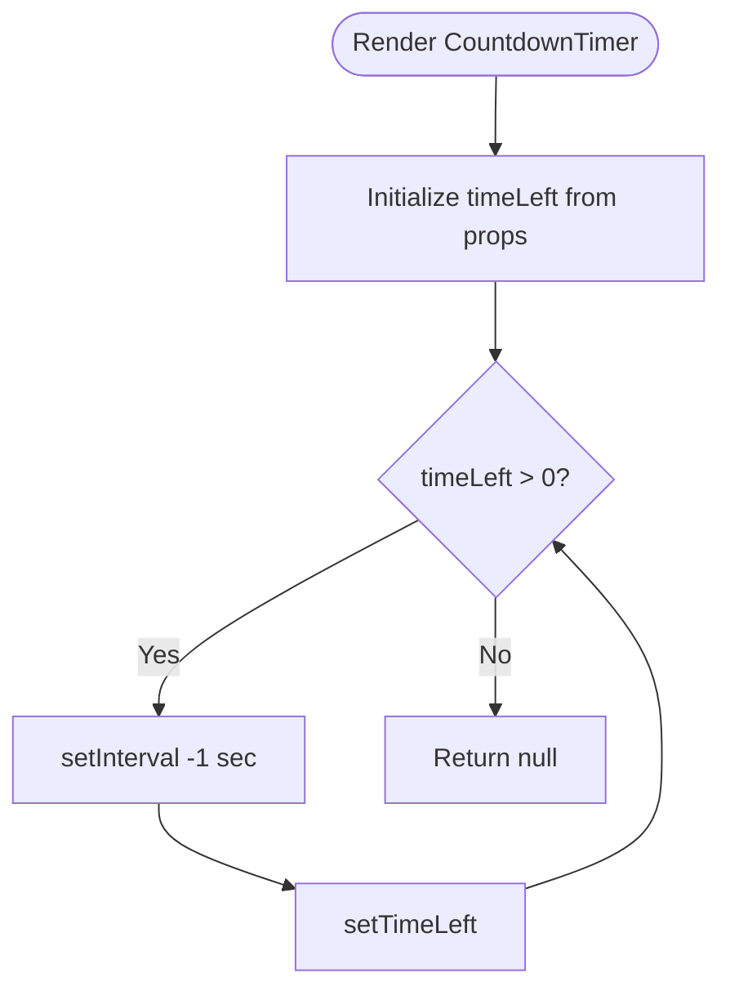

**Diagram sources**
- [CountdownTimer.tsx](file://components/ui/CountdownTimer.tsx)

**Section sources**
- [CountdownTimer.tsx](file://components/ui/CountdownTimer.tsx)

### KeyboardAvoidingWrapper
- Purpose: Provide a consistent keyboard-avoiding container for forms and scrollable content.
- Props:
  - children, contentContainerStyle, style, keyboardVerticalOffset
- Behavior:
  - Wraps content in a keyboard-avoiding view and scroll view with platform-specific adjustments.
- Styling:
  - Flex-based layout with handled keyboard dismissal modes.

**Section sources**
- [KeyboardAvoidingWrapper.tsx](file://components/shared/KeyboardAvoidingWrapper.tsx)

## Dependency Analysis
- Data fetching:
  - useSupabase.ts re-exports typed hooks for products, categories, and content.
  - content.service.ts defines Banner, HomeSection, and PromoBanner types and fetches from Supabase.
- Type safety:
  - shared/types.ts centralizes database-derived types and enums.
- Component coupling:
  - Components depend on contexts (Language/Currency) and hooks/services for data.
  - Minimal coupling via props and composition (e.g., SectionHeader composes CountdownTimer).

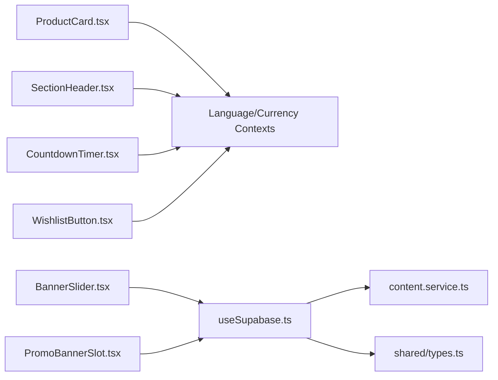

**Diagram sources**
- [ProductCard.tsx](file://components/ui/ProductCard.tsx)
- [SectionHeader.tsx](file://components/ui/SectionHeader.tsx)
- [CountdownTimer.tsx](file://components/ui/CountdownTimer.tsx)
- [WishlistButton.tsx](file://components/ui/WishlistButton.tsx)
- [BannerSlider.tsx](file://components/ui/BannerSlider.tsx)
- [PromoBannerSlot.tsx](file://components/ui/PromoBannerSlot.tsx)
- [useSupabase.ts](file://hooks/useSupabase.ts)
- [content.service.ts](file://services/content.service.ts)
- [types.ts](file://shared/types.ts)

**Section sources**
- [useSupabase.ts](file://hooks/useSupabase.ts)
- [content.service.ts](file://services/content.service.ts)
- [types.ts](file://shared/types.ts)

## Performance Considerations
- Memoization:
  - BannerSlider uses React.memo to prevent unnecessary re-renders.
- Animations:
  - BottomSheet and Toast use native-driven animations for smoothness.
- Lazy loading:
  - BannerSlider and PromoBannerSlot render skeletons during loading states.
- Scrolling:
  - BannerSlider enables paging and snap-to-interval for efficient horizontal scrolling.
- Network:
  - useSupabase.ts integrates React Query for caching and background refetching.

[No sources needed since this section provides general guidance]

## Troubleshooting Guide
- Toast not appearing:
  - Ensure ToastProvider wraps the app root so global handlers are registered.
  - Verify language context is initialized for proper RTL detection.
- BottomSheet does not close:
  - Confirm visible prop is controlled and onClose is called after animations complete.
  - Check hardware back handler registration.
- WishlistButton shows incorrect state:
  - Ensure session is loaded before rendering; confirm user_id exists.
  - Verify database constraints and error handling for insert/delete.
- BannerSlider not auto-advancing:
  - Confirm banners array length > 1; verify bannerWidth calculation and snap interval.
- PromoBannerSlot not rendering:
  - Ensure banners are passed and first banner size is one of supported values.
- CountdownTimer not updating:
  - Verify initialSeconds is greater than zero and timer interval is active.

**Section sources**
- [Toast.tsx](file://components/ui/Toast.tsx)
- [BottomSheet.tsx](file://components/ui/BottomSheet.tsx)
- [WishlistButton.tsx](file://components/ui/WishlistButton.tsx)
- [BannerSlider.tsx](file://components/ui/BannerSlider.tsx)
- [PromoBannerSlot.tsx](file://components/ui/PromoBannerSlot.tsx)
- [CountdownTimer.tsx](file://components/ui/CountdownTimer.tsx)

## Conclusion
The shared UI components library provides a cohesive, cross-platform foundation for product displays, navigation, promotions, and user feedback. By composing lightweight, context-aware components and integrating with Supabase-backed hooks, teams can maintain consistency across mobile, web, and admin experiences while ensuring responsive and accessible interfaces.

[No sources needed since this section summarizes without analyzing specific files]

## Appendices

### Component Composition Patterns
- Composition over inheritance: Components like SectionHeader compose smaller elements (e.g., CountdownTimer).
- Provider pattern: ToastProvider centralizes global state and animations.
- Controlled props: BottomSheet relies on visible and onClose to manage lifecycle.

**Section sources**
- [SectionHeader.tsx](file://components/ui/SectionHeader.tsx)
- [Toast.tsx](file://components/ui/Toast.tsx)
- [BottomSheet.tsx](file://components/ui/BottomSheet.tsx)

### Prop Validation and Defaults
- Optional props with defaults (e.g., width, showDiscount, maxHeight, timerSeconds) simplify usage.
- Controlled visibility (visible) prevents accidental leaks of hidden modals.

**Section sources**
- [ProductCard.tsx](file://components/ui/ProductCard.tsx)
- [BottomSheet.tsx](file://components/ui/BottomSheet.tsx)
- [SectionHeader.tsx](file://components/ui/SectionHeader.tsx)
- [CountdownTimer.tsx](file://components/ui/CountdownTimer.tsx)

### Event Handling and Navigation
- Navigation:
  - ProductCard and PromoBannerSlot use router to navigate to product or internal routes; external links open via Linking.
- Interaction:
  - BottomSheet handles backdrop press and back handler; WishlistButton manages auth prompts and optimistic UI.

**Section sources**
- [ProductCard.tsx](file://components/ui/ProductCard.tsx)
- [PromoBannerSlot.tsx](file://components/ui/PromoBannerSlot.tsx)
- [BottomSheet.tsx](file://components/ui/BottomSheet.tsx)
- [WishlistButton.tsx](file://components/ui/WishlistButton.tsx)

### Cross-Platform Compatibility and Accessibility
- Cross-platform:
  - Components use React Native primitives and Expo Router for navigation; styling leverages platform-agnostic libraries.
- Accessibility:
  - Prefer pressable targets with adequate size; add labels for assistive technologies where needed.
  - Respect RTL layouts and text direction resolution.

[No sources needed since this section provides general guidance]