# UI Components and Design System

<cite>
**Referenced Files in This Document**
- [MainHeader.tsx](file://components/ui/MainHeader.tsx)
- [ProductCard.tsx](file://components/ui/ProductCard.tsx)
- [BottomSheet.tsx](file://components/ui/BottomSheet.tsx)
- [Skeleton.tsx](file://components/ui/Skeleton.tsx)
- [WishlistButton.tsx](file://components/ui/WishlistButton.tsx)
- [Toast.tsx](file://components/ui/Toast.tsx)
- [Header.tsx](file://web/src/components/layout/Header.tsx)
- [ProductCard.tsx](file://web/src/components/ui/ProductCard.tsx)
- [StorefrontSearchBar.tsx](file://web/src/components/search/StorefrontSearchBar.tsx)
- [AIProductForm.tsx](file://admin/src/components/products/AIProductForm.tsx)
- [tailwind.config.js](file://tailwind.config.js)
- [LanguageContext.tsx](file://contexts/LanguageContext.tsx)
- [i18n.ts](file://lib/i18n.ts)
- [en.json](file://locales/en.json)
- [ar.json](file://locales/ar.json)
</cite>

## Table of Contents
1. [Introduction](#introduction)
2. [Project Structure](#project-structure)
3. [Core Components](#core-components)
4. [Architecture Overview](#architecture-overview)
5. [Detailed Component Analysis](#detailed-component-analysis)
6. [Dependency Analysis](#dependency-analysis)
7. [Performance Considerations](#performance-considerations)
8. [Accessibility Compliance](#accessibility-compliance)
9. [Internationalization Support](#internationalization-support)
10. [Responsive Design Patterns](#responsive-design-patterns)
11. [Styling Architecture with TailwindCSS and NativeWind](#styling-architecture-with-tailwindcss-and-nativewind)
12. [Component Composition Patterns and Slot Systems](#component-composition-patterns-and-slot-systems)
13. [Integration with Design Tokens](#integration-with-design-tokens)
14. [Component Usage Examples and Best Practices](#component-usage-examples-and-best-practices)
15. [Guidelines for Extending the Component Library](#guidelines-for-extending-the-component-library)
16. [Troubleshooting Guide](#troubleshooting-guide)
17. [Conclusion](#conclusion)

## Introduction
This document describes the UI component library and design system that powers the mobile, web, and admin platforms. It explains the shared component architecture enabling code reuse, documents design principles, prop interfaces, customization options, and platform-specific optimizations. It also covers styling via TailwindCSS and NativeWind, accessibility, internationalization, responsive patterns, composition approaches, and practical guidelines for extending the library.

## Project Structure
The component library is organized by platform:
- Mobile: components under the root directory (React Native)
- Web: Next.js components under web/src/components
- Admin: Next.js admin components under admin/src/components

Cross-cutting concerns (internationalization, design tokens, styling) are centralized for consistent behavior across platforms.

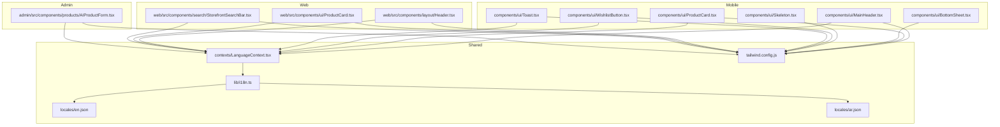

**Diagram sources**
- [MainHeader.tsx:1-49](file://components/ui/MainHeader.tsx#L1-L49)
- [ProductCard.tsx:1-89](file://components/ui/ProductCard.tsx#L1-L89)
- [BottomSheet.tsx:1-178](file://components/ui/BottomSheet.tsx#L1-L178)
- [Skeleton.tsx:1-81](file://components/ui/Skeleton.tsx#L1-L81)
- [WishlistButton.tsx:1-155](file://components/ui/WishlistButton.tsx#L1-L155)
- [Toast.tsx:1-625](file://components/ui/Toast.tsx#L1-L625)
- [Header.tsx:1-275](file://web/src/components/layout/Header.tsx#L1-L275)
- [ProductCard.tsx:1-98](file://web/src/components/ui/ProductCard.tsx#L1-L98)
- [StorefrontSearchBar.tsx:1-106](file://web/src/components/search/StorefrontSearchBar.tsx#L1-L106)
- [AIProductForm.tsx:1-670](file://admin/src/components/products/AIProductForm.tsx#L1-L670)
- [LanguageContext.tsx:1-84](file://contexts/LanguageContext.tsx#L1-L84)
- [i18n.ts:1-81](file://lib/i18n.ts#L1-L81)
- [en.json:1-413](file://locales/en.json#L1-L413)
- [ar.json:1-413](file://locales/ar.json#L1-L413)
- [tailwind.config.js:1-22](file://tailwind.config.js#L1-L22)

**Section sources**
- [MainHeader.tsx:1-49](file://components/ui/MainHeader.tsx#L1-L49)
- [ProductCard.tsx:1-89](file://components/ui/ProductCard.tsx#L1-L89)
- [BottomSheet.tsx:1-178](file://components/ui/BottomSheet.tsx#L1-L178)
- [Skeleton.tsx:1-81](file://components/ui/Skeleton.tsx#L1-L81)
- [WishlistButton.tsx:1-155](file://components/ui/WishlistButton.tsx#L1-L155)
- [Toast.tsx:1-625](file://components/ui/Toast.tsx#L1-L625)
- [Header.tsx:1-275](file://web/src/components/layout/Header.tsx#L1-L275)
- [ProductCard.tsx:1-98](file://web/src/components/ui/ProductCard.tsx#L1-L98)
- [StorefrontSearchBar.tsx:1-106](file://web/src/components/search/StorefrontSearchBar.tsx#L1-L106)
- [AIProductForm.tsx:1-670](file://admin/src/components/products/AIProductForm.tsx#L1-L670)
- [LanguageContext.tsx:1-84](file://contexts/LanguageContext.tsx#L1-L84)
- [i18n.ts:1-81](file://lib/i18n.ts#L1-L81)
- [en.json:1-413](file://locales/en.json#L1-L413)
- [ar.json:1-413](file://locales/ar.json#L1-L413)
- [tailwind.config.js:1-22](file://tailwind.config.js#L1-L22)

## Core Components
This section documents the shared component architecture and platform-specific implementations.

- Mobile components:
  - MainHeader: Platform-aware header with search and safe-area handling
  - ProductCard: Touch-friendly product card with add-to-cart and wishlist actions
  - BottomSheet: Animated bottom sheet with gestures and backdrop
  - Skeleton: Animated skeleton loaders for content placeholders
  - WishlistButton: Toggle wishlist with persisted state and alerts
  - Toast: Unified toast and dialog system with RTL-aware text direction

- Web components:
  - Header: Desktop-first navigation with responsive behavior and search integration
  - ProductCard: Web-optimized product card with hover effects and stock indicators
  - StorefrontSearchBar: Reusable search bar with variants and helper text

- Admin components:
  - AIProductForm: Multi-step form for AI-powered product creation with image uploads and review

Key design principles:
- Cross-platform props and behavior parity where feasible
- Platform-specific UX enhancements (touch targets, gestures, animations)
- Centralized internationalization and RTL handling
- Consistent design tokens and spacing via Tailwind/NativeWind

**Section sources**
- [MainHeader.tsx:1-49](file://components/ui/MainHeader.tsx#L1-L49)
- [ProductCard.tsx:1-89](file://components/ui/ProductCard.tsx#L1-L89)
- [BottomSheet.tsx:1-178](file://components/ui/BottomSheet.tsx#L1-L178)
- [Skeleton.tsx:1-81](file://components/ui/Skeleton.tsx#L1-L81)
- [WishlistButton.tsx:1-155](file://components/ui/WishlistButton.tsx#L1-L155)
- [Toast.tsx:1-625](file://components/ui/Toast.tsx#L1-L625)
- [Header.tsx:1-275](file://web/src/components/layout/Header.tsx#L1-L275)
- [ProductCard.tsx:1-98](file://web/src/components/ui/ProductCard.tsx#L1-L98)
- [StorefrontSearchBar.tsx:1-106](file://web/src/components/search/StorefrontSearchBar.tsx#L1-L106)
- [AIProductForm.tsx:1-670](file://admin/src/components/products/AIProductForm.tsx#L1-L670)

## Architecture Overview
The design system centers around:
- Internationalization and RTL: LanguageContext and i18n engine
- Shared UI primitives: Base components reused across platforms
- Platform adapters: Platform-specific implementations and optimizations
- Styling: TailwindCSS with NativeWind preset for RN, Tailwind for Next.js
- State and persistence: Local storage for language, Supabase for user data

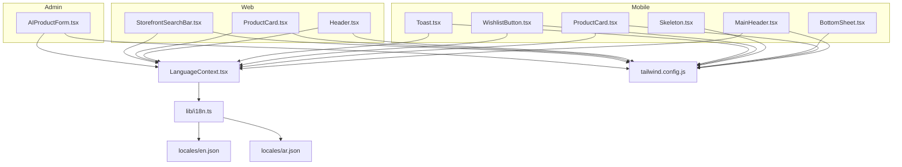

**Diagram sources**
- [LanguageContext.tsx:1-84](file://contexts/LanguageContext.tsx#L1-L84)
- [i18n.ts:1-81](file://lib/i18n.ts#L1-L81)
- [en.json:1-413](file://locales/en.json#L1-L413)
- [ar.json:1-413](file://locales/ar.json#L1-L413)
- [MainHeader.tsx:1-49](file://components/ui/MainHeader.tsx#L1-L49)
- [ProductCard.tsx:1-89](file://components/ui/ProductCard.tsx#L1-L89)
- [BottomSheet.tsx:1-178](file://components/ui/BottomSheet.tsx#L1-L178)
- [Skeleton.tsx:1-81](file://components/ui/Skeleton.tsx#L1-L81)
- [WishlistButton.tsx:1-155](file://components/ui/WishlistButton.tsx#L1-L155)
- [Toast.tsx:1-625](file://components/ui/Toast.tsx#L1-L625)
- [Header.tsx:1-275](file://web/src/components/layout/Header.tsx#L1-L275)
- [ProductCard.tsx:1-98](file://web/src/components/ui/ProductCard.tsx#L1-L98)
- [StorefrontSearchBar.tsx:1-106](file://web/src/components/search/StorefrontSearchBar.tsx#L1-L106)
- [AIProductForm.tsx:1-670](file://admin/src/components/products/AIProductForm.tsx#L1-L670)
- [tailwind.config.js:1-22](file://tailwind.config.js#L1-L22)

## Detailed Component Analysis

### Mobile Components

#### MainHeader
- Purpose: Top app bar with search, RTL-aware layout, and safe-area padding
- Props: None (uses router, language context)
- Behavior: Renders a search box that navigates to search page; adapts layout direction based on language
- Accessibility: Uses semantic text and icons; respects safe areas

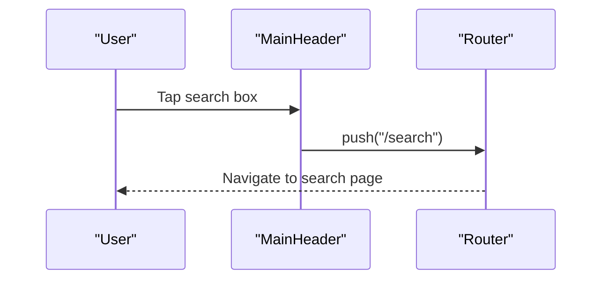

**Diagram sources**
- [MainHeader.tsx:23-44](file://components/ui/MainHeader.tsx#L23-L44)

**Section sources**
- [MainHeader.tsx:1-49](file://components/ui/MainHeader.tsx#L1-L49)

#### ProductCard (Mobile)
- Purpose: Touch-friendly product card with add-to-cart and optional discount badge
- Props:
  - product: Product
  - showDiscount?: boolean
  - width?: DimensionValue
- Behavior: Navigates to product detail; adds to cart; shows localized toast; displays discount badge when enabled
- Customization: Width, discount visibility, RTL alignment

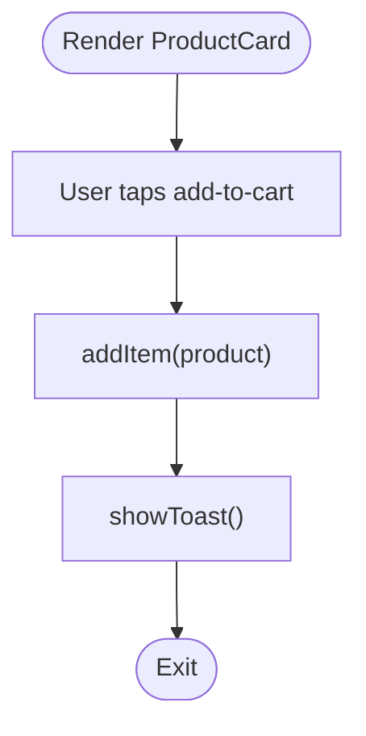

**Diagram sources**
- [ProductCard.tsx:23-27](file://components/ui/ProductCard.tsx#L23-L27)

**Section sources**
- [ProductCard.tsx:1-89](file://components/ui/ProductCard.tsx#L1-L89)

#### BottomSheet
- Purpose: Modal bottom sheet with animated entrance/exit and swipe-to-dismiss
- Props:
  - visible: boolean
  - onClose: () => void
  - children: ReactNode
  - maxHeight?: number|string
- Behavior: Animated backdrop and sheet; hardware back handler; pan responder for drag gestures
- Customization: Max height percentage or absolute value; safe area padding

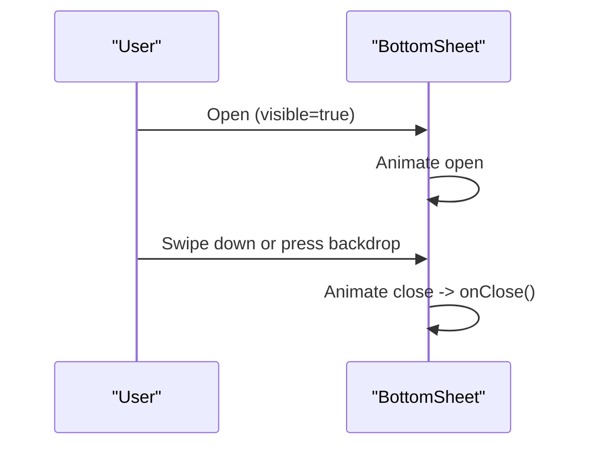

**Diagram sources**
- [BottomSheet.tsx:42-52](file://components/ui/BottomSheet.tsx#L42-L52)
- [BottomSheet.tsx:62-72](file://components/ui/BottomSheet.tsx#L62-L72)

**Section sources**
- [BottomSheet.tsx:1-178](file://components/ui/BottomSheet.tsx#L1-L178)

#### Skeleton
- Purpose: Animated skeleton placeholders for content loading
- Props:
  - width?: number|string
  - height?: number|string
  - style?: ViewStyle
  - borderRadius?: number
- Variants:
  - ProductCardSkeleton: Composite skeleton for product cards

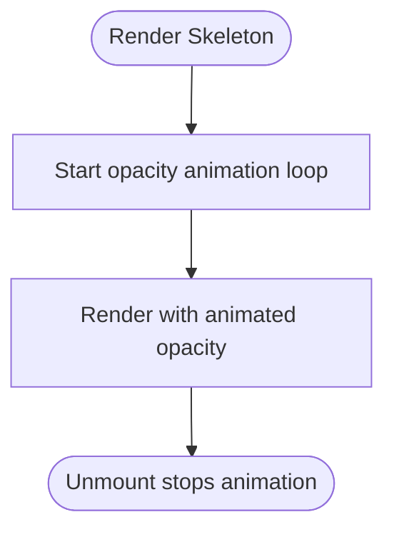

**Diagram sources**
- [Skeleton.tsx:14-32](file://components/ui/Skeleton.tsx#L14-L32)

**Section sources**
- [Skeleton.tsx:1-81](file://components/ui/Skeleton.tsx#L1-L81)

#### WishlistButton
- Purpose: Toggle wishlist with persisted state and user prompts
- Props:
  - productId: string
  - size?: number
  - iconSize?: number
  - backgroundColor?: string
  - activeBackgroundColor?: string
  - color?: string
  - activeColor?: string
- Behavior: Loads existing wishlist state; opens login prompt if unauthenticated; shows localized toasts

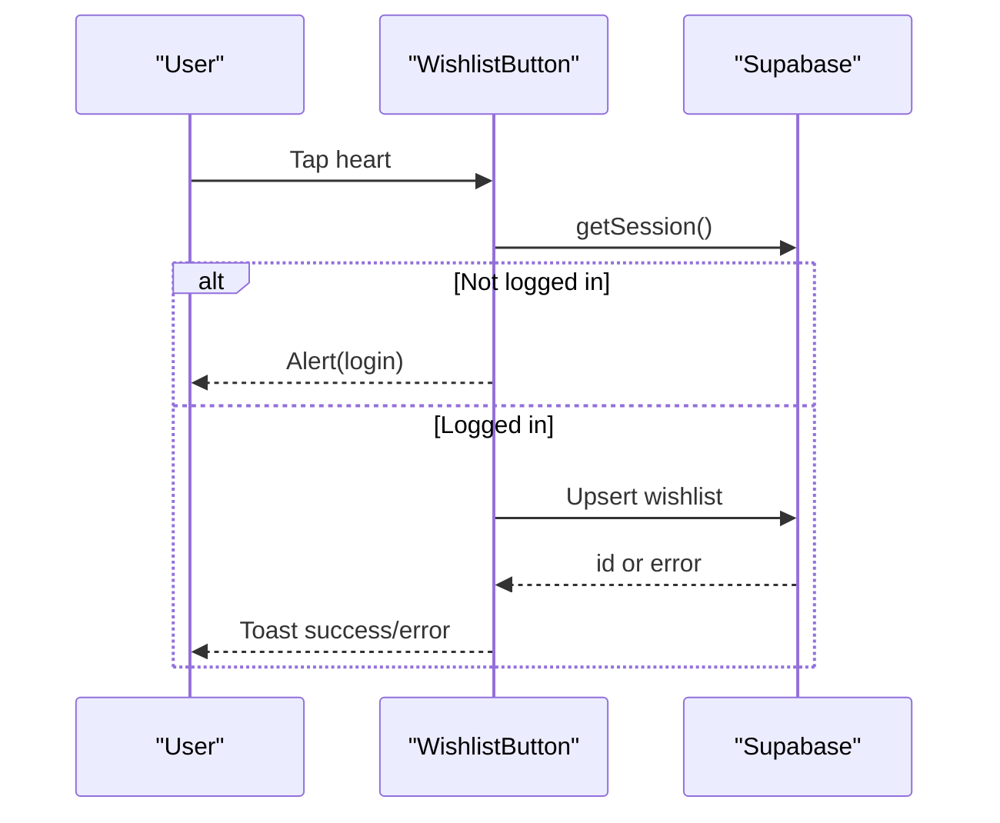

**Diagram sources**
- [WishlistButton.tsx:78-128](file://components/ui/WishlistButton.tsx#L78-L128)

**Section sources**
- [WishlistButton.tsx:1-155](file://components/ui/WishlistButton.tsx#L1-L155)

#### Toast
- Purpose: Unified toast and dialog system with RTL-aware text direction
- Features:
  - Type inference from keywords
  - Animated entrance/exit
  - Modal dialog with configurable buttons
  - Auto-hide timers
- Integration: Wraps Alert.alert; exposes imperative APIs

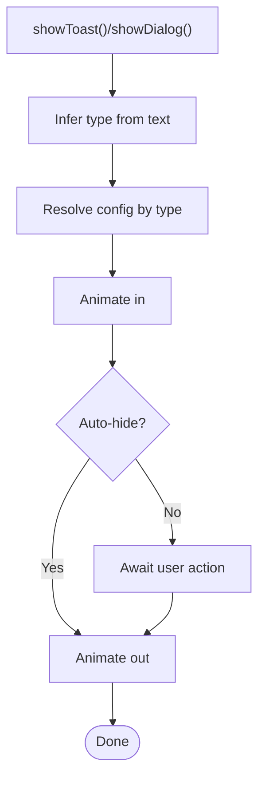

**Diagram sources**
- [Toast.tsx:49-85](file://components/ui/Toast.tsx#L49-L85)
- [Toast.tsx:204-233](file://components/ui/Toast.tsx#L204-L233)
- [Toast.tsx:261-288](file://components/ui/Toast.tsx#L261-L288)

**Section sources**
- [Toast.tsx:1-625](file://components/ui/Toast.tsx#L1-L625)

### Web Components

#### Header
- Purpose: Desktop-first navigation with responsive behavior, cart count, and language toggle
- Features:
  - Navigation links with active states
  - Storefront search integration
  - Mobile menu collapse/expand
  - Language toggle with session refresh

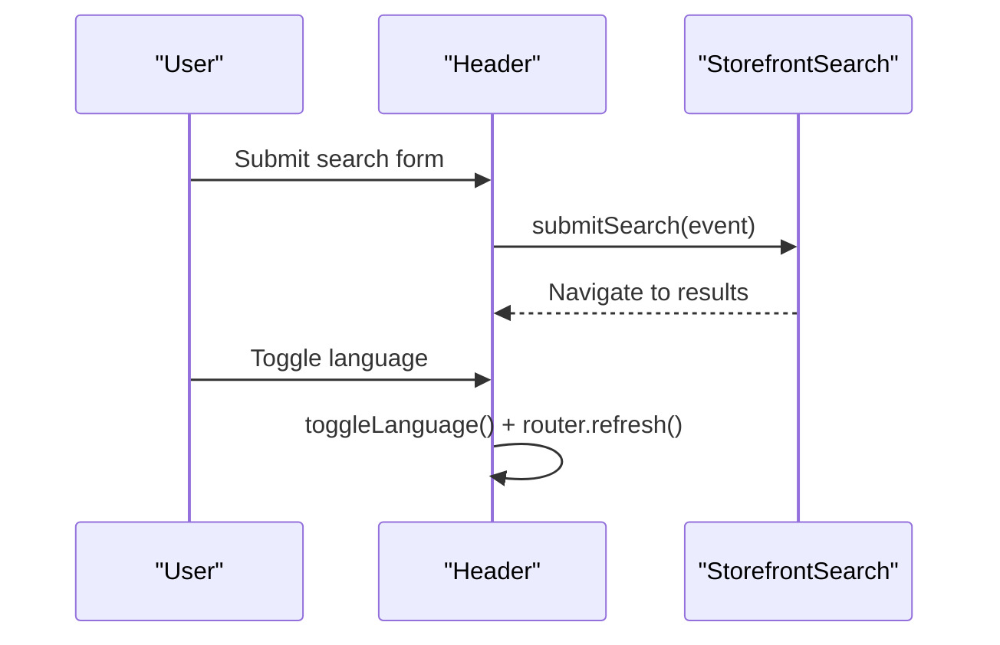

**Diagram sources**
- [Header.tsx:80-89](file://web/src/components/layout/Header.tsx#L80-L89)
- [Header.tsx:85-89](file://web/src/components/layout/Header.tsx#L85-L89)

**Section sources**
- [Header.tsx:1-275](file://web/src/components/layout/Header.tsx#L1-L275)

#### ProductCard (Web)
- Purpose: Web-optimized product card with hover effects, stock indicators, and add-to-cart
- Props:
  - product: Product
- Behavior: Uses lazy-loaded images, hover scaling, and disabled states for out-of-stock items

**Section sources**
- [ProductCard.tsx:1-98](file://web/src/components/ui/ProductCard.tsx#L1-L98)

#### StorefrontSearchBar
- Purpose: Reusable search input with clear, submit, and helper text
- Props:
  - value, isRTL, placeholder, helperText?, pending?
  - variant?: "header" | "page"
  - onChange, onClear, onSubmit
- Behavior: Applies variant-specific styling and responsive heights

**Section sources**
- [StorefrontSearchBar.tsx:1-106](file://web/src/components/search/StorefrontSearchBar.tsx#L1-L106)

### Admin Components

#### AIProductForm
- Purpose: Multi-step product creation powered by AI and background removal
- Steps:
  - Upload front/back images
  - Edit AI-extracted metadata
  - Review and save
- Features:
  - Image compression and preview
  - Background removal fallback
  - Validation and error handling
  - Supabase integration for categories and storage

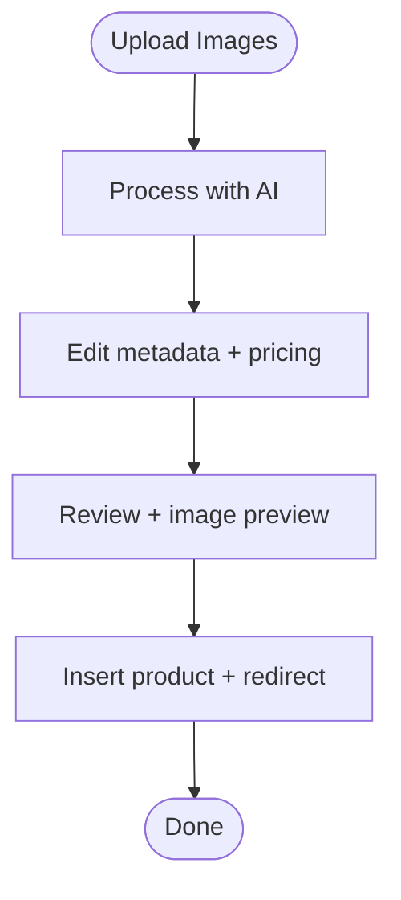

**Diagram sources**
- [AIProductForm.tsx:76-199](file://admin/src/components/products/AIProductForm.tsx#L76-L199)
- [AIProductForm.tsx:236-278](file://admin/src/components/products/AIProductForm.tsx#L236-L278)

**Section sources**
- [AIProductForm.tsx:1-670](file://admin/src/components/products/AIProductForm.tsx#L1-L670)

## Dependency Analysis
- Language and i18n:
  - LanguageContext provides language, RTL, and translation functions
  - i18n.ts initializes locale, persists language, and exposes t()
  - Locales are loaded from JSON files
- Styling:
  - Tailwind config extends colors and enables NativeWind preset for RN
- Platform differences:
  - Mobile uses React Native primitives and NativeWind
  - Web uses Next.js and Tailwind
  - Admin uses Next.js with additional UI patterns

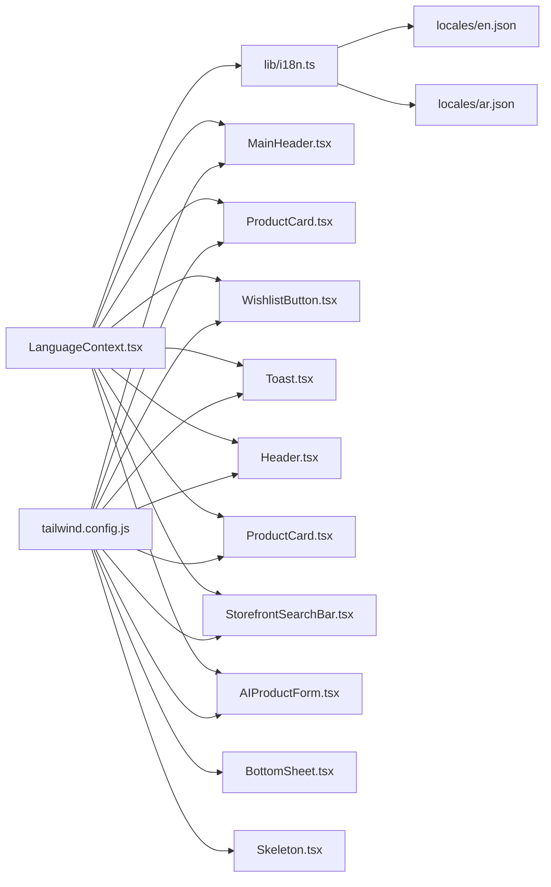

**Diagram sources**
- [LanguageContext.tsx:1-84](file://contexts/LanguageContext.tsx#L1-L84)
- [i18n.ts:1-81](file://lib/i18n.ts#L1-L81)
- [en.json:1-413](file://locales/en.json#L1-L413)
- [ar.json:1-413](file://locales/ar.json#L1-L413)
- [tailwind.config.js:1-22](file://tailwind.config.js#L1-L22)
- [MainHeader.tsx:1-49](file://components/ui/MainHeader.tsx#L1-L49)
- [ProductCard.tsx:1-89](file://components/ui/ProductCard.tsx#L1-L89)
- [BottomSheet.tsx:1-178](file://components/ui/BottomSheet.tsx#L1-L178)
- [Skeleton.tsx:1-81](file://components/ui/Skeleton.tsx#L1-L81)
- [WishlistButton.tsx:1-155](file://components/ui/WishlistButton.tsx#L1-L155)
- [Toast.tsx:1-625](file://components/ui/Toast.tsx#L1-L625)
- [Header.tsx:1-275](file://web/src/components/layout/Header.tsx#L1-L275)
- [ProductCard.tsx:1-98](file://web/src/components/ui/ProductCard.tsx#L1-L98)
- [StorefrontSearchBar.tsx:1-106](file://web/src/components/search/StorefrontSearchBar.tsx#L1-L106)
- [AIProductForm.tsx:1-670](file://admin/src/components/products/AIProductForm.tsx#L1-L670)

**Section sources**
- [LanguageContext.tsx:1-84](file://contexts/LanguageContext.tsx#L1-L84)
- [i18n.ts:1-81](file://lib/i18n.ts#L1-L81)
- [en.json:1-413](file://locales/en.json#L1-L413)
- [ar.json:1-413](file://locales/ar.json#L1-L413)
- [tailwind.config.js:1-22](file://tailwind.config.js#L1-L22)

## Performance Considerations
- Mobile:
  - Animated components (BottomSheet, Toast) use native drivers for smoothness
  - Skeleton uses looping opacity animation; unmounts to stop work
  - Image loading optimized with transitions and lazy loading patterns
- Web:
  - StorefrontSearchBar defers heavy DOM rendering to variants
  - ProductCard uses lazy image loading and hover effects judiciously
- Admin:
  - AIProductForm compresses images before upload and falls back gracefully if background removal fails

[No sources needed since this section provides general guidance]

## Accessibility Compliance
- Language and RTL:
  - LanguageContext exposes isRTL and t() for dynamic text direction
  - i18n manages RTL preferences and allows RTL switching
- Mobile:
  - Toast resolves text direction per content; supports LTR/RTL text detection
  - Safe-area insets ensure content does not overlap system bars
- Web:
  - Semantic markup and proper aria labels for interactive elements
  - Focus management and keyboard navigation encouraged in parent layouts

**Section sources**
- [LanguageContext.tsx:1-84](file://contexts/LanguageContext.tsx#L1-L84)
- [i18n.ts:1-81](file://lib/i18n.ts#L1-L81)
- [Toast.tsx:102-137](file://components/ui/Toast.tsx#L102-L137)
- [MainHeader.tsx:10-20](file://components/ui/MainHeader.tsx#L10-L20)

## Internationalization Support
- Initialization:
  - Device locale determines initial language; defaults to Arabic
  - Language preference persisted in async storage
- Runtime:
  - Language change triggers RTL flag and re-mounts routing stack
- Content:
  - Translations provided for common keys, home, product, cart, profile, auth, checkout, category, and more
- Usage:
  - Components consume t() and isRTL from context

**Section sources**
- [i18n.ts:24-43](file://lib/i18n.ts#L24-L43)
- [i18n.ts:56-72](file://lib/i18n.ts#L56-L72)
- [LanguageContext.tsx:26-51](file://contexts/LanguageContext.tsx#L26-L51)
- [en.json:1-413](file://locales/en.json#L1-L413)
- [ar.json:1-413](file://locales/ar.json#L1-L413)

## Responsive Design Patterns
- Mobile:
  - Safe-area aware padding and bottom sheets that adapt to screen height
  - Gesture-driven bottom sheet with thresholds
- Web:
  - Header collapses to mobile menu at narrow widths
  - Search bar variants adjust sizing and layout for header vs page
- Admin:
  - Grid-based forms with responsive breakpoints and clear visual hierarchy

**Section sources**
- [MainHeader.tsx:10-20](file://components/ui/MainHeader.tsx#L10-L20)
- [BottomSheet.tsx:32-52](file://components/ui/BottomSheet.tsx#L32-L52)
- [Header.tsx:236-265](file://web/src/components/layout/Header.tsx#L236-L265)
- [StorefrontSearchBar.tsx:36-44](file://web/src/components/search/StorefrontSearchBar.tsx#L36-L44)
- [AIProductForm.tsx:322-416](file://admin/src/components/products/AIProductForm.tsx#L322-L416)

## Styling Architecture with TailwindCSS and NativeWind
- Tailwind configuration:
  - Content globs include app, components, and contexts
  - Preset enables NativeWind for React Native
  - Extended colors: primary, secondary, background, text-primary, text-secondary
- Usage:
  - Mobile components use className strings and StyleSheet for animations
  - Web components use Tailwind classes directly
  - Admin components leverage Tailwind for consistent design language

**Section sources**
- [tailwind.config.js:1-22](file://tailwind.config.js#L1-L22)

## Component Composition Patterns and Slot Systems
- Composition patterns:
  - BottomSheet composes children inside an animated container
  - StorefrontSearchBar composes input, icon, and button slots
  - ProductCard composes image, discount badge, and action buttons
- Slot-like behavior:
  - Children passed to BottomSheet act as the main content slot
  - SearchBar exposes onChange/onClear/onSubmit handlers for flexible composition
- Recommendations:
  - Keep slots minimal and well-typed
  - Prefer composition over deep nesting
  - Use forwardRef for imperative control where needed

**Section sources**
- [BottomSheet.tsx:137-144](file://components/ui/BottomSheet.tsx#L137-L144)
- [StorefrontSearchBar.tsx:47-104](file://web/src/components/search/StorefrontSearchBar.tsx#L47-L104)

## Integration with Design Tokens
- Color tokens:
  - primary (#2E7D32), secondary (#FFB300), background (#F5F5F5)
  - text-primary and text-secondary for typography
- Typography and spacing:
  - Consistent use of font families and sizes across components
  - Spacing derived from Tailwind utilities
- RTL alignment:
  - Automatic mirroring of paddings/margins based on isRTL

**Section sources**
- [tailwind.config.js:10-18](file://tailwind.config.js#L10-L18)

## Component Usage Examples and Best Practices
- Mobile:
  - Use MainHeader for consistent top navigation; pass t() for localized placeholders
  - Wrap lists with Skeleton during data fetch; use ProductCardSkeleton variants
  - Use BottomSheet for filters and modals; set maxHeight appropriately
  - Use Toast for user feedback; infer type from messages
- Web:
  - Integrate StorefrontSearchBar with catalog search hooks
  - Use Header for desktop navigation; ensure cart count updates reactively
- Admin:
  - Use AIProductForm for streamlined product onboarding; validate inputs before save
- General:
  - Always pass isRTL-aware props to components
  - Keep translations centralized; avoid inline strings
  - Prefer controlled components for search and forms

[No sources needed since this section provides general guidance]

## Guidelines for Extending the Component Library
- Naming and location:
  - Place shared components under components/ui
  - Web-specific under web/src/components/ui; Admin-specific under admin/src/components
- Props interface:
  - Keep interfaces minimal and explicit
  - Provide sensible defaults for optional props
- Styling:
  - Use Tailwind classes; avoid inline styles when possible
  - Respect RTL and language context
- Internationalization:
  - Expose t() and isRTL via context; localize all user-facing strings
- Accessibility:
  - Provide aria labels and keyboard navigation where applicable
- Testing:
  - Write unit tests for logic; snapshot tests for layout stability
- Documentation:
  - Add prop tables and usage notes for each component

[No sources needed since this section provides general guidance]

## Troubleshooting Guide
- Language switching:
  - Ensure setLanguage persists and toggles RTL; verify key prop remounts routes
- Toast/dialogs:
  - Confirm Alert.alert wrapper is initialized; check type inference keywords
- BottomSheet:
  - Verify safe-area insets and window dimensions; test gesture thresholds
- Search:
  - Validate form submission handlers and query param updates
- Admin image uploads:
  - Check file type/size limits; handle fallbacks for background removal

**Section sources**
- [i18n.ts:56-72](file://lib/i18n.ts#L56-L72)
- [Toast.tsx:294-323](file://components/ui/Toast.tsx#L294-L323)
- [BottomSheet.tsx:32-60](file://components/ui/BottomSheet.tsx#L32-L60)
- [StorefrontSearchBar.tsx:80-89](file://web/src/components/search/StorefrontSearchBar.tsx#L80-L89)
- [AIProductForm.tsx:48-74](file://admin/src/components/products/AIProductForm.tsx#L48-L74)

## Conclusion
The UI component library establishes a robust, cross-platform foundation with shared design principles, centralized internationalization, and consistent styling. Mobile, web, and admin implementations leverage platform strengths while preserving a unified user experience. By following the documented patterns, customization options, and best practices, teams can extend the library efficiently and maintain design consistency at scale.