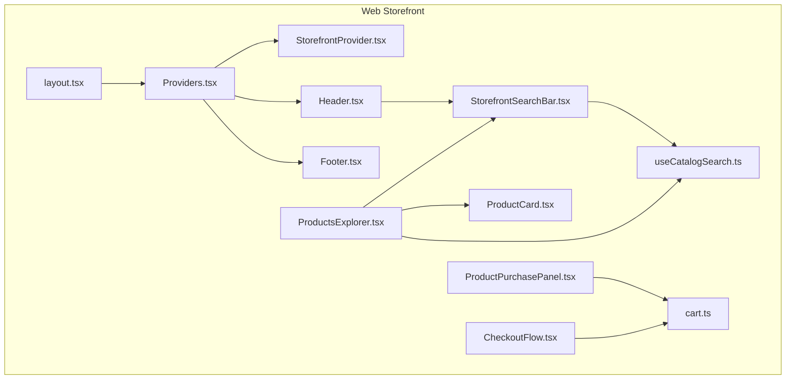
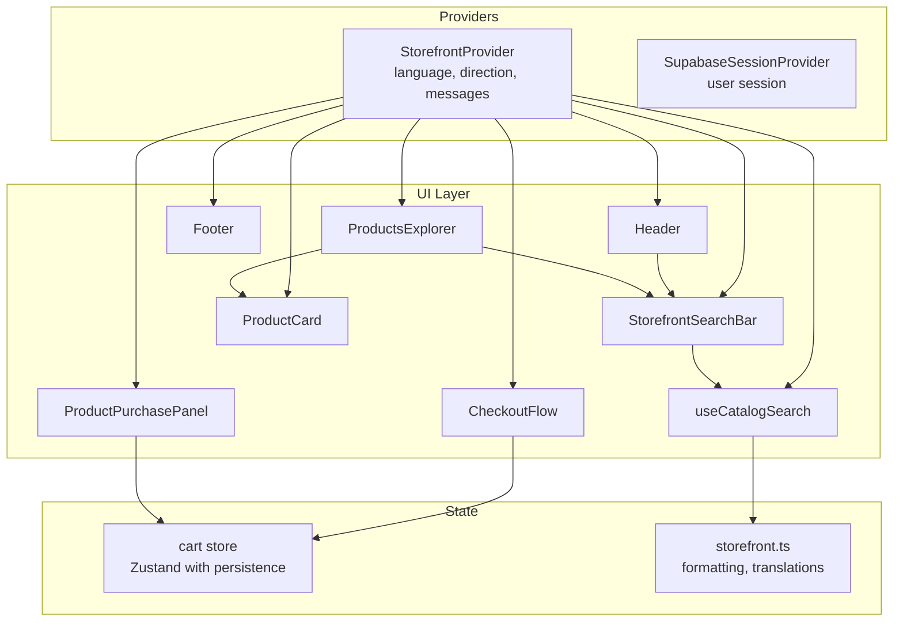
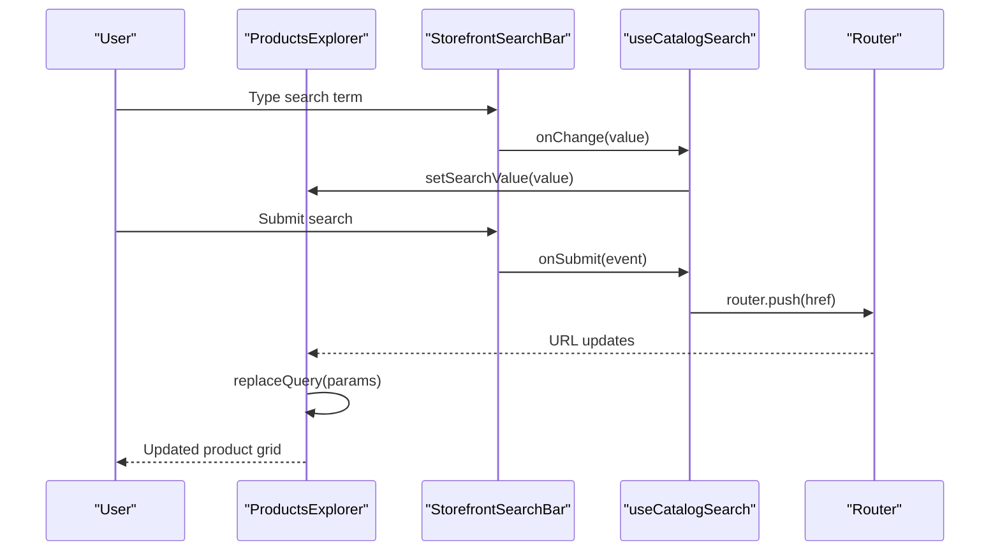
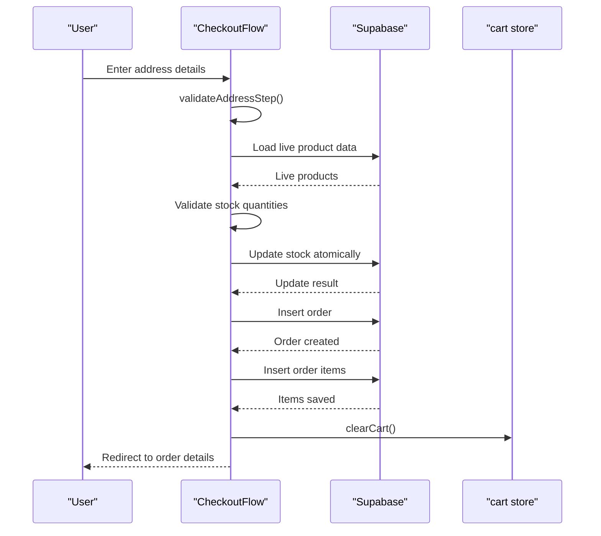
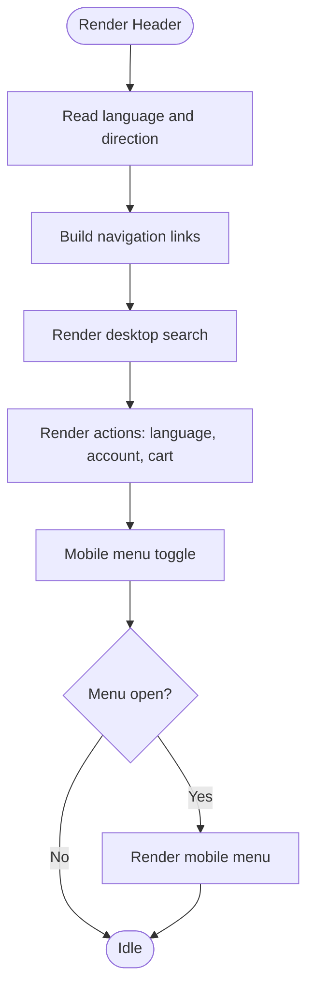
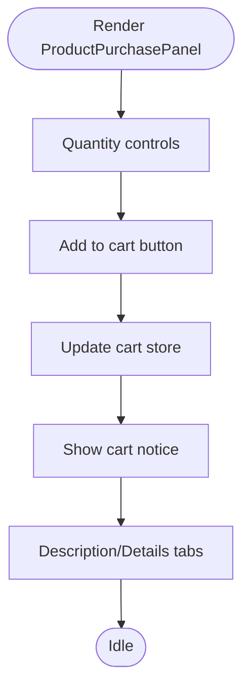
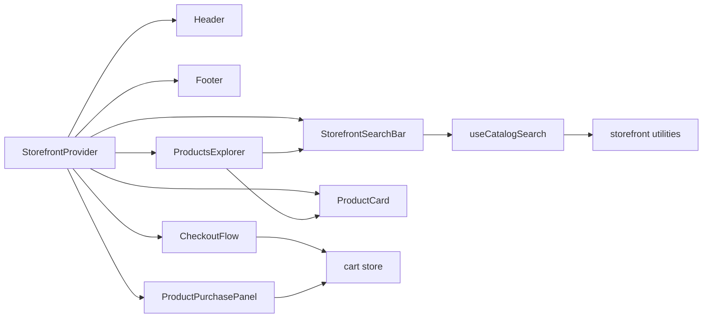

# Web Storefront Components

<cite>
**Referenced Files in This Document**
- [ProductsExplorer.tsx](file://web/src/components/catalog/ProductsExplorer.tsx)
- [CheckoutFlow.tsx](file://web/src/components/checkout/CheckoutFlow.tsx)
- [Header.tsx](file://web/src/components/layout/Header.tsx)
- [Footer.tsx](file://web/src/components/layout/Footer.tsx)
- [ProductPurchasePanel.tsx](file://web/src/components/product/ProductPurchasePanel.tsx)
- [StorefrontSearchBar.tsx](file://web/src/components/search/StorefrontSearchBar.tsx)
- [useCatalogSearch.ts](file://web/src/components/search/useCatalogSearch.ts)
- [ProductCard.tsx](file://web/src/components/ui/ProductCard.tsx)
- [StorefrontProvider.tsx](file://web/src/components/providers/StorefrontProvider.tsx)
- [storefront.ts](file://web/src/lib/storefront.ts)
- [cart.ts](file://web/src/store/cart.ts)
- [Providers.tsx](file://web/src/components/providers/Providers.tsx)
- [layout.tsx](file://web/src/app/layout.tsx)
</cite>

## Table of Contents
1. [Introduction](#introduction)
2. [Project Structure](#project-structure)
3. [Core Components](#core-components)
4. [Architecture Overview](#architecture-overview)
5. [Detailed Component Analysis](#detailed-component-analysis)
6. [Dependency Analysis](#dependency-analysis)
7. [Performance Considerations](#performance-considerations)
8. [Accessibility Compliance](#accessibility-compliance)
9. [Responsive Design Patterns](#responsive-design-patterns)
10. [Troubleshooting Guide](#troubleshooting-guide)
11. [Conclusion](#conclusion)

## Introduction
This document provides comprehensive technical documentation for the web-specific UI components optimized for desktop experiences within the Al Amal Center storefront. It focuses on advanced product browsing, checkout workflows, layout components, product detail interactions, and search capabilities. The documentation covers component responsibilities, data flows, state management, accessibility, responsiveness, and performance characteristics tailored for web browsers.

## Project Structure
The web storefront is organized under the `web/` directory with a Next.js-based architecture. Key areas include:
- Catalog browsing and filtering: ProductsExplorer
- Checkout flow: CheckoutFlow
- Layout: Header and Footer
- Product detail interactions: ProductPurchasePanel
- Search: StorefrontSearchBar and useCatalogSearch hook
- UI primitives: ProductCard
- Global providers: StorefrontProvider, Providers
- Shared utilities: storefront.ts, cart store

**Diagram sources**
- [layout.tsx:27-60](file://web/src/app/layout.tsx#L27-L60)
- [Providers.tsx:17-31](file://web/src/components/providers/Providers.tsx#L17-L31)
- [StorefrontProvider.tsx:44-77](file://web/src/components/providers/StorefrontProvider.tsx#L44-L77)
- [Header.tsx:57-274](file://web/src/components/layout/Header.tsx#L57-L274)
- [Footer.tsx:134-311](file://web/src/components/layout/Footer.tsx#L134-L311)
- [StorefrontSearchBar.tsx:21-105](file://web/src/components/search/StorefrontSearchBar.tsx#L21-L105)
- [useCatalogSearch.ts:29-113](file://web/src/components/search/useCatalogSearch.ts#L29-L113)
- [cart.ts:33-106](file://web/src/store/cart.ts#L33-L106)
- [ProductCard.tsx:16-97](file://web/src/components/ui/ProductCard.tsx#L16-L97)
- [ProductPurchasePanel.tsx:21-260](file://web/src/components/product/ProductPurchasePanel.tsx#L21-L260)
- [ProductsExplorer.tsx:36-426](file://web/src/components/catalog/ProductsExplorer.tsx#L36-L426)
- [CheckoutFlow.tsx:52-721](file://web/src/components/checkout/CheckoutFlow.tsx#L52-L721)

**Section sources**
- [layout.tsx:27-60](file://web/src/app/layout.tsx#L27-L60)
- [Providers.tsx:17-31](file://web/src/components/providers/Providers.tsx#L17-L31)

## Core Components
This section outlines the primary web components and their roles in delivering a desktop-optimized shopping experience.

- ProductsExplorer: Advanced product catalog with filtering, sorting, pagination, and grid/list view options. Integrates StorefrontSearchBar and useCatalogSearch for real-time query synchronization.
- CheckoutFlow: Multi-step checkout process with address collection, payment selection, order review, and order submission with stock validation and rollback mechanisms.
- Header: Desktop-optimized navigation bar with logo, search, language toggle, account, and cart actions. Includes mobile-responsive collapsible menu.
- Footer: Comprehensive footer with quick links, branch locations, contact info, social media, and app store badges.
- ProductPurchasePanel: Product detail page component featuring quantity selection, add-to-cart, pricing display, stock status, and tabbed description/details.
- StorefrontSearchBar: Reusable search input with clear, submit, and helper text support, configurable for header or page variants.
- useCatalogSearch: Hook managing search state, debounced synchronization with URL query parameters, and navigation transitions.
- ProductCard: Web-optimized product card with enhanced hover effects, discount badges, stock indicators, and add-to-cart button.

**Section sources**
- [ProductsExplorer.tsx:36-426](file://web/src/components/catalog/ProductsExplorer.tsx#L36-L426)
- [CheckoutFlow.tsx:52-721](file://web/src/components/checkout/CheckoutFlow.tsx#L52-L721)
- [Header.tsx:57-274](file://web/src/components/layout/Header.tsx#L57-L274)
- [Footer.tsx:134-311](file://web/src/components/layout/Footer.tsx#L134-L311)
- [ProductPurchasePanel.tsx:21-260](file://web/src/components/product/ProductPurchasePanel.tsx#L21-L260)
- [StorefrontSearchBar.tsx:21-105](file://web/src/components/search/StorefrontSearchBar.tsx#L21-L105)
- [useCatalogSearch.ts:29-113](file://web/src/components/search/useCatalogSearch.ts#L29-L113)
- [ProductCard.tsx:16-97](file://web/src/components/ui/ProductCard.tsx#L16-L97)

## Architecture Overview
The web storefront follows a provider-based architecture with global state management and shared utilities.

**Diagram sources**
- [StorefrontProvider.tsx:44-77](file://web/src/components/providers/StorefrontProvider.tsx#L44-L77)
- [Providers.tsx:17-31](file://web/src/components/providers/Providers.tsx#L17-L31)
- [Header.tsx:57-274](file://web/src/components/layout/Header.tsx#L57-L274)
- [Footer.tsx:134-311](file://web/src/components/layout/Footer.tsx#L134-L311)
- [StorefrontSearchBar.tsx:21-105](file://web/src/components/search/StorefrontSearchBar.tsx#L21-L105)
- [useCatalogSearch.ts:29-113](file://web/src/components/search/useCatalogSearch.ts#L29-L113)
- [ProductsExplorer.tsx:36-426](file://web/src/components/catalog/ProductsExplorer.tsx#L36-L426)
- [CheckoutFlow.tsx:52-721](file://web/src/components/checkout/CheckoutFlow.tsx#L52-L721)
- [ProductPurchasePanel.tsx:21-260](file://web/src/components/product/ProductPurchasePanel.tsx#L21-L260)
- [ProductCard.tsx:16-97](file://web/src/components/ui/ProductCard.tsx#L16-L97)
- [cart.ts:33-106](file://web/src/store/cart.ts#L33-L106)
- [storefront.ts:527-535](file://web/src/lib/storefront.ts#L527-L535)

## Detailed Component Analysis

### ProductsExplorer Component
Advanced product browsing with:
- Sticky sidebar filters: categories, price range, stock availability, and clear filters.
- Real-time search integration via StorefrontSearchBar and useCatalogSearch.
- Sorting controls and pagination with URL query parameter synchronization.
- Responsive grid layout with smooth scrolling to results after filter changes.

**Diagram sources**
- [ProductsExplorer.tsx:36-125](file://web/src/components/catalog/ProductsExplorer.tsx#L36-L125)
- [StorefrontSearchBar.tsx:21-105](file://web/src/components/search/StorefrontSearchBar.tsx#L21-L105)
- [useCatalogSearch.ts:87-93](file://web/src/components/search/useCatalogSearch.ts#L87-L93)

Key implementation highlights:
- URL parameter management for filters, sorting, pagination, and search queries.
- Deferred search synchronization to avoid excessive re-renders.
- Sticky sidebar layout for desktop with top positioning and height containment.
- Smooth scroll into view after applying filters.

**Section sources**
- [ProductsExplorer.tsx:36-426](file://web/src/components/catalog/ProductsExplorer.tsx#L36-L426)
- [useCatalogSearch.ts:29-113](file://web/src/components/search/useCatalogSearch.ts#L29-L113)

### CheckoutFlow Component
Multi-step checkout with:
- Address collection with validation and saved address selection.
- Payment method selection (Cash on delivery supported; electronic payment placeholder).
- Order review with itemized totals and delivery details.
- Stock validation and atomic order creation with rollback on failure.
- Progress indicator with step completion states.

**Diagram sources**
- [CheckoutFlow.tsx:162-346](file://web/src/components/checkout/CheckoutFlow.tsx#L162-L346)
- [cart.ts:33-106](file://web/src/store/cart.ts#L33-L106)

Validation and error handling:
- Phone number regex validation for Iraqi numbers.
- Stock rollback on concurrent updates or failures.
- Graceful handling of missing or invalid product data.

**Section sources**
- [CheckoutFlow.tsx:52-721](file://web/src/components/checkout/CheckoutFlow.tsx#L52-L721)
- [storefront.ts:13-13](file://web/src/lib/storefront.ts#L13-L13)

### Header Component
Desktop-optimized navigation with:
- Logo and branding with hover animations.
- Persistent search bar in desktop view and collapsible mobile menu.
- Navigation links, language toggle, account, and cart with badge.
- Active state detection for navigation items.

**Diagram sources**
- [Header.tsx:57-274](file://web/src/components/layout/Header.tsx#L57-L274)

**Section sources**
- [Header.tsx:57-274](file://web/src/components/layout/Header.tsx#L57-L274)

### Footer Component
Comprehensive footer with:
- Brand identity and description.
- Quick links to key pages.
- Branch locations with external links.
- Contact information and social media.
- App store badges with external links.

**Section sources**
- [Footer.tsx:134-311](file://web/src/components/layout/Footer.tsx#L134-L311)

### ProductPurchasePanel Component
Product detail page interactions:
- Quantity selection with increment/decrement controls and stock limits.
- Add-to-cart with visual feedback and persistent notice.
- Pricing display with discount overlay and stock status.
- Tabbed content for description and product details.

**Diagram sources**
- [ProductPurchasePanel.tsx:21-260](file://web/src/components/product/ProductPurchasePanel.tsx#L21-L260)
- [cart.ts:33-106](file://web/src/store/cart.ts#L33-L106)

**Section sources**
- [ProductPurchasePanel.tsx:21-260](file://web/src/components/product/ProductPurchasePanel.tsx#L21-L260)
- [cart.ts:33-106](file://web/src/store/cart.ts#L33-L106)

### StorefrontSearchBar Component
Reusable search input with:
- Clear and submit actions.
- Helper text with pending state indication.
- Variant styling for header and page contexts.
- Accessibility attributes for screen readers.

**Section sources**
- [StorefrontSearchBar.tsx:21-105](file://web/src/components/search/StorefrontSearchBar.tsx#L21-L105)

### useCatalogSearch Hook
Search state management:
- Defer search value to reduce re-render pressure.
- Synchronize with URL query parameters automatically on product page.
- Build navigation hrefs for push/replace operations.
- Clear search and reset query safely.

**Section sources**
- [useCatalogSearch.ts:29-113](file://web/src/components/search/useCatalogSearch.ts#L29-L113)

### ProductCard Component
Web-optimized product card:
- Hover scaling effect on product image.
- Discount badge calculation and display.
- Stock status and pricing with localized formatting.
- Add-to-cart button with disabled state handling.

**Section sources**
- [ProductCard.tsx:16-97](file://web/src/components/ui/ProductCard.tsx#L16-L97)
- [storefront.ts:527-535](file://web/src/lib/storefront.ts#L527-L535)

## Dependency Analysis
Component interdependencies and shared utilities:

**Diagram sources**
- [StorefrontProvider.tsx:44-77](file://web/src/components/providers/StorefrontProvider.tsx#L44-L77)
- [Header.tsx:57-274](file://web/src/components/layout/Header.tsx#L57-L274)
- [Footer.tsx:134-311](file://web/src/components/layout/Footer.tsx#L134-L311)
- [StorefrontSearchBar.tsx:21-105](file://web/src/components/search/StorefrontSearchBar.tsx#L21-L105)
- [ProductsExplorer.tsx:36-426](file://web/src/components/catalog/ProductsExplorer.tsx#L36-L426)
- [CheckoutFlow.tsx:52-721](file://web/src/components/checkout/CheckoutFlow.tsx#L52-L721)
- [ProductPurchasePanel.tsx:21-260](file://web/src/components/product/ProductPurchasePanel.tsx#L21-L260)
- [ProductCard.tsx:16-97](file://web/src/components/ui/ProductCard.tsx#L16-L97)
- [useCatalogSearch.ts:29-113](file://web/src/components/search/useCatalogSearch.ts#L29-L113)
- [cart.ts:33-106](file://web/src/store/cart.ts#L33-L106)
- [storefront.ts:527-535](file://web/src/lib/storefront.ts#L527-L535)

**Section sources**
- [Providers.tsx:17-31](file://web/src/components/providers/Providers.tsx#L17-L31)
- [layout.tsx:27-60](file://web/src/app/layout.tsx#L27-L60)

## Performance Considerations
- Deferred rendering and transitions:
  - useDeferredValue reduces re-render pressure during rapid typing in search.
  - useTransition ensures smooth navigation transitions without blocking the UI.
- Local state persistence:
  - cart store persists to localStorage for continuity across sessions.
- Lazy loading:
  - Images use lazy loading to improve initial page load performance.
- Minimal re-renders:
  - Memoization in StorefrontProvider prevents unnecessary provider re-renders.
- Debounced search:
  - Automatic synchronization on the product page avoids excessive network requests.

[No sources needed since this section provides general guidance]

## Accessibility Compliance
- Semantic HTML and ARIA:
  - Buttons and links include appropriate aria-labels and aria-current for navigation state.
  - Form elements use proper labels and placeholders.
- Focus management:
  - Interactive elements receive visible focus states.
- Language and direction:
  - Dynamic html lang and dir attributes based on language selection.
- Screen reader support:
  - Helper text and pending states are announced appropriately.
- Keyboard navigation:
  - All interactive controls are operable via keyboard.

**Section sources**
- [Header.tsx:107-111](file://web/src/components/layout/Header.tsx#L107-L111)
- [ProductsExplorer.tsx:280-288](file://web/src/components/catalog/ProductsExplorer.tsx#L280-L288)
- [ProductCard.tsx:82-88](file://web/src/components/ui/ProductCard.tsx#L82-L88)
- [StorefrontProvider.tsx:36-41](file://web/src/components/providers/StorefrontProvider.tsx#L36-L41)

## Responsive Design Patterns
- Grid layouts:
  - ProductsExplorer uses responsive grid classes for 1–3 columns based on viewport width.
- Sticky positioning:
  - Filters sidebar remains sticky at larger viewports with top offset for fixed header.
- Typography scaling:
  - Font sizes scale appropriately across breakpoints for readability.
- Mobile-first interactions:
  - Collapsible mobile menu with smooth transitions and overflow control.
- Adaptive spacing:
  - Consistent padding and margin scales across device sizes.

**Section sources**
- [ProductsExplorer.tsx:133-134](file://web/src/components/catalog/ProductsExplorer.tsx#L133-L134)
- [Header.tsx:238-240](file://web/src/components/layout/Header.tsx#L238-L240)

## Troubleshooting Guide
Common issues and resolutions:
- Search not updating URL:
  - Verify pathname and router integration in useCatalogSearch.
  - Ensure autoSyncOnProducts is enabled on the product page.
- Stock update conflicts:
  - Confirm atomic updates and rollback logic in checkout flow.
  - Validate stock thresholds and concurrent modifications.
- Cart persistence not working:
  - Check localStorage availability and Zustand persistence configuration.
- Language switching not applied:
  - Confirm cookie and localStorage writes in StorefrontProvider.
  - Ensure html lang and dir attributes reflect the current language.

**Section sources**
- [useCatalogSearch.ts:64-85](file://web/src/components/search/useCatalogSearch.ts#L64-L85)
- [CheckoutFlow.tsx:150-251](file://web/src/components/checkout/CheckoutFlow.tsx#L150-L251)
- [cart.ts:94-106](file://web/src/store/cart.ts#L94-L106)
- [StorefrontProvider.tsx:36-52](file://web/src/components/providers/StorefrontProvider.tsx#L36-L52)

## Conclusion
The web storefront components deliver a robust, desktop-optimized shopping experience with advanced browsing, reliable checkout, and accessible UI patterns. The provider-based architecture, shared utilities, and performance-conscious design ensure scalability and maintainability. By leveraging the documented components and patterns, teams can extend functionality while preserving consistency and usability.