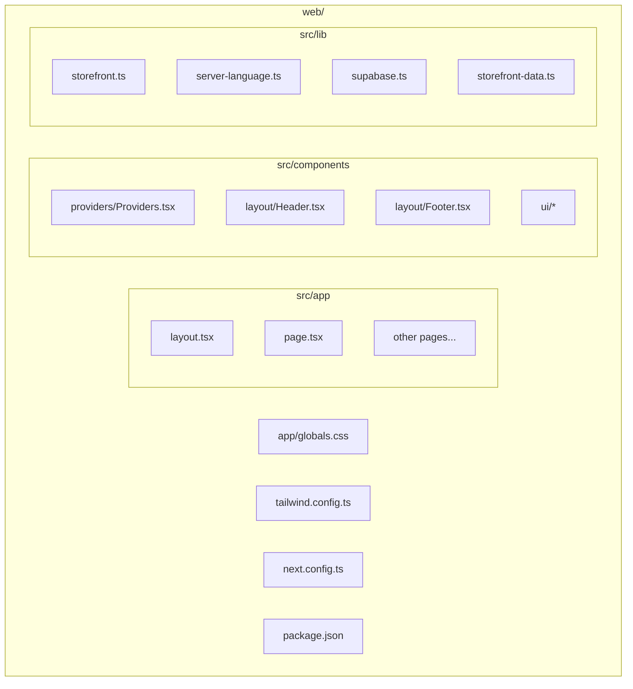
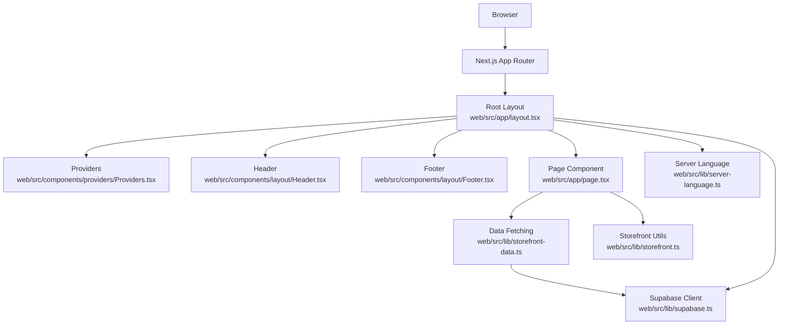
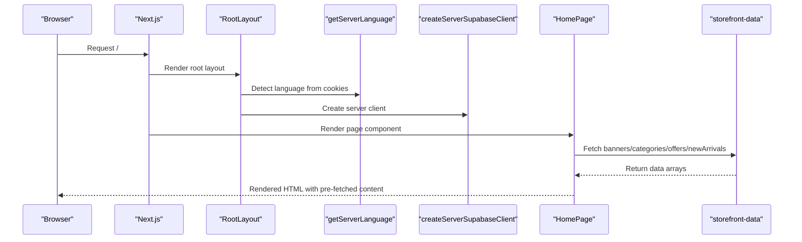
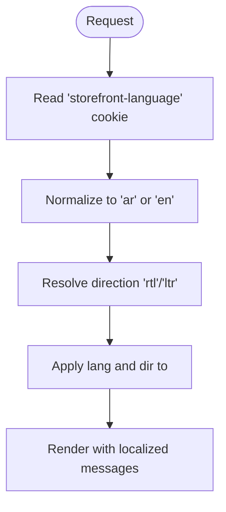
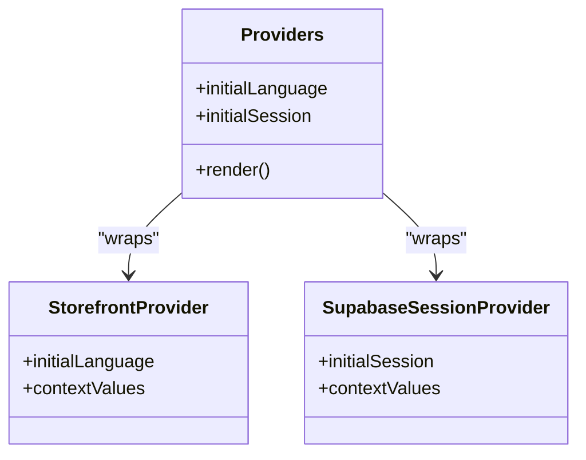
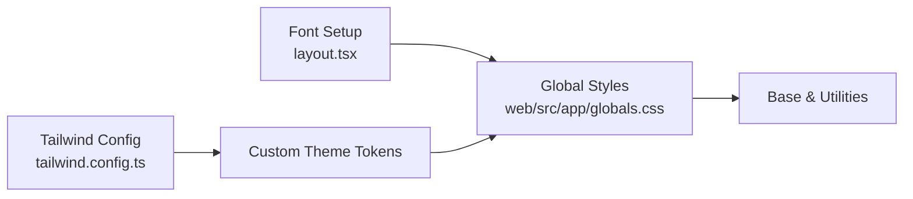
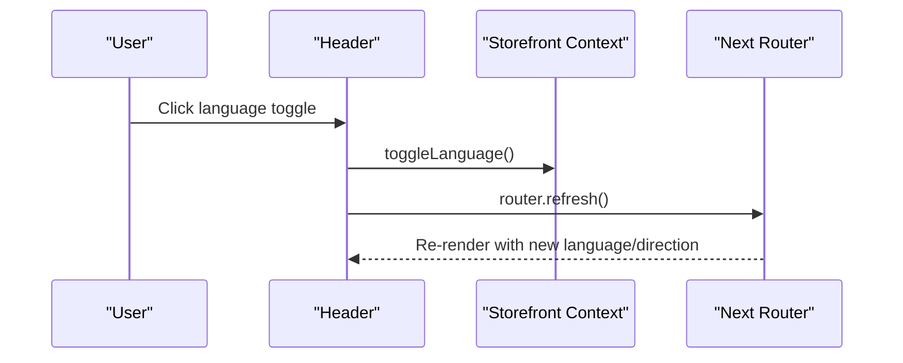
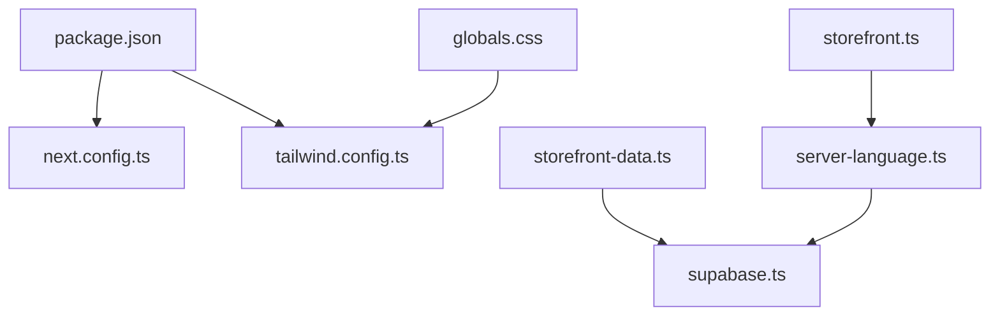

# Web Application Overview

<cite>
**Referenced Files in This Document**
- [web/src/app/layout.tsx](file://web/src/app/layout.tsx)
- [web/src/app/page.tsx](file://web/src/app/page.tsx)
- [web/src/lib/storefront.ts](file://web/src/lib/storefront.ts)
- [web/src/lib/server-language.ts](file://web/src/lib/server-language.ts)
- [web/src/lib/supabase.ts](file://web/src/lib/supabase.ts)
- [web/src/lib/storefront-data.ts](file://web/src/lib/storefront-data.ts)
- [web/src/components/providers/Providers.tsx](file://web/src/components/providers/Providers.tsx)
- [web/src/components/layout/Header.tsx](file://web/src/components/layout/Header.tsx)
- [web/src/components/layout/Footer.tsx](file://web/src/components/layout/Footer.tsx)
- [web/src/app/globals.css](file://web/src/app/globals.css)
- [web/tailwind.config.ts](file://web/tailwind.config.ts)
- [web/next.config.ts](file://web/next.config.ts)
- [web/package.json](file://web/package.json)
</cite>

## Table of Contents
1. [Introduction](#introduction)
2. [Project Structure](#project-structure)
3. [Core Components](#core-components)
4. [Architecture Overview](#architecture-overview)
5. [Detailed Component Analysis](#detailed-component-analysis)
6. [Dependency Analysis](#dependency-analysis)
7. [Performance Considerations](#performance-considerations)
8. [Troubleshooting Guide](#troubleshooting-guide)
9. [Conclusion](#conclusion)
10. [Appendices](#appendices)

## Introduction
This document provides a comprehensive overview of the Next.js web storefront for the Al-Amal Center. It explains server-side rendering (SSR) implementation, SEO optimization strategies, and performance benefits of SSR for the Al-Amal Center web interface. It also documents the architectural decisions behind the Next.js framework choice, including static generation capabilities and dynamic routes. The internationalization setup with Arabic and English language support, RTL layout handling, and font loading strategies are covered. Build configuration, environment setup, and deployment considerations specific to the web platform are included. The relationship between the web storefront and other platforms (mobile, admin) within the monorepo architecture is explained, along with guidance on development workflow, hot reloading, and debugging techniques.

## Project Structure
The web storefront is organized as a Next.js application under the web directory. Key areas include:
- App Router pages and layouts under web/src/app
- Shared UI components under web/src/components
- Internationalization and storefront utilities under web/src/lib
- Styling via Tailwind CSS and global styles
- Build configuration and runtime settings under web/next.config.ts and web/package.json

**Diagram sources**
- [web/src/app/layout.tsx](file://web/src/app/layout.tsx)
- [web/src/app/page.tsx](file://web/src/app/page.tsx)
- [web/src/components/providers/Providers.tsx](file://web/src/components/providers/Providers.tsx)
- [web/src/components/layout/Header.tsx](file://web/src/components/layout/Header.tsx)
- [web/src/components/layout/Footer.tsx](file://web/src/components/layout/Footer.tsx)
- [web/src/lib/storefront.ts](file://web/src/lib/storefront.ts)
- [web/src/lib/server-language.ts](file://web/src/lib/server-language.ts)
- [web/src/lib/supabase.ts](file://web/src/lib/supabase.ts)
- [web/src/lib/storefront-data.ts](file://web/src/lib/storefront-data.ts)
- [web/src/app/globals.css](file://web/src/app/globals.css)
- [web/tailwind.config.ts](file://web/tailwind.config.ts)
- [web/next.config.ts](file://web/next.config.ts)
- [web/package.json](file://web/package.json)

**Section sources**
- [web/src/app/layout.tsx](file://web/src/app/layout.tsx)
- [web/src/app/page.tsx](file://web/src/app/page.tsx)
- [web/src/lib/storefront.ts](file://web/src/lib/storefront.ts)
- [web/src/lib/server-language.ts](file://web/src/lib/server-language.ts)
- [web/src/lib/supabase.ts](file://web/src/lib/supabase.ts)
- [web/src/lib/storefront-data.ts](file://web/src/lib/storefront-data.ts)
- [web/src/components/providers/Providers.tsx](file://web/src/components/providers/Providers.tsx)
- [web/src/components/layout/Header.tsx](file://web/src/components/layout/Header.tsx)
- [web/src/components/layout/Footer.tsx](file://web/src/components/layout/Footer.tsx)
- [web/src/app/globals.css](file://web/src/app/globals.css)
- [web/tailwind.config.ts](file://web/tailwind.config.ts)
- [web/next.config.ts](file://web/next.config.ts)
- [web/package.json](file://web/package.json)

## Core Components
- Root layout and HTML directionality: The root layout sets metadata, language, and directionality, initializes providers, and renders header and footer around page content. It uses a Google Font subset supporting Arabic and Latin and applies a CSS variable for font family.
- Internationalization and direction: Language detection is performed server-side via a cookie, normalized to "ar" or "en", and direction is resolved accordingly. Messages and translations are centralized in a single module.
- SSR data fetching: Pages and components fetch data server-side using a Supabase client configured for server environments, ensuring rendered HTML is populated with live content.
- Provider stack: A nested provider hierarchy manages session state, theme, and storefront context, enabling consistent behavior across components.
- Styling and fonts: Tailwind is configured with custom theme tokens and extended font families. Global CSS defines base styles, typography, and responsive utilities.

**Section sources**
- [web/src/app/layout.tsx](file://web/src/app/layout.tsx)
- [web/src/lib/storefront.ts](file://web/src/lib/storefront.ts)
- [web/src/lib/server-language.ts](file://web/src/lib/server-language.ts)
- [web/src/lib/supabase.ts](file://web/src/lib/supabase.ts)
- [web/src/lib/storefront-data.ts](file://web/src/lib/storefront-data.ts)
- [web/src/components/providers/Providers.tsx](file://web/src/components/providers/Providers.tsx)
- [web/src/app/globals.css](file://web/src/app/globals.css)
- [web/tailwind.config.ts](file://web/tailwind.config.ts)

## Architecture Overview
The web storefront leverages Next.js App Router with SSR. The root layout orchestrates server-side language detection, session retrieval, and provider initialization. Pages perform data fetching against Supabase to render content. Internationalization is handled centrally with message bundles and direction resolution. Styling is applied via Tailwind with custom theme tokens and global CSS.

**Diagram sources**
- [web/src/app/layout.tsx](file://web/src/app/layout.tsx)
- [web/src/components/providers/Providers.tsx](file://web/src/components/providers/Providers.tsx)
- [web/src/components/layout/Header.tsx](file://web/src/components/layout/Header.tsx)
- [web/src/components/layout/Footer.tsx](file://web/src/components/layout/Footer.tsx)
- [web/src/app/page.tsx](file://web/src/app/page.tsx)
- [web/src/lib/storefront.ts](file://web/src/lib/storefront.ts)
- [web/src/lib/server-language.ts](file://web/src/lib/server-language.ts)
- [web/src/lib/storefront-data.ts](file://web/src/lib/storefront-data.ts)
- [web/src/lib/supabase.ts](file://web/src/lib/supabase.ts)

## Detailed Component Analysis

### Server-Side Rendering and Data Fetching
- Root layout performs SSR to detect language and initialize session state, then renders the page shell with providers.
- The home page executes parallel data fetches for banners, categories, offers, and new arrivals, ensuring efficient hydration and SEO-friendly markup.
- Data utilities encapsulate Supabase queries and error handling, returning safe defaults when errors occur.

**Diagram sources**
- [web/src/app/layout.tsx](file://web/src/app/layout.tsx)
- [web/src/lib/server-language.ts](file://web/src/lib/server-language.ts)
- [web/src/lib/supabase.ts](file://web/src/lib/supabase.ts)
- [web/src/app/page.tsx](file://web/src/app/page.tsx)
- [web/src/lib/storefront-data.ts](file://web/src/lib/storefront-data.ts)

**Section sources**
- [web/src/app/layout.tsx](file://web/src/app/layout.tsx)
- [web/src/app/page.tsx](file://web/src/app/page.tsx)
- [web/src/lib/storefront-data.ts](file://web/src/lib/storefront-data.ts)
- [web/src/lib/supabase.ts](file://web/src/lib/supabase.ts)

### Internationalization and RTL Handling
- Language normalization ensures consistent "ar" or "en" selection from cookies.
- Direction resolution returns "rtl" for Arabic and "ltr" for English.
- Messages are centralized in a single module with keys mapped to localized strings for both languages.
- The layout applies the resolved language and direction to the html element, while global CSS inherits direction for form elements and text.

**Diagram sources**
- [web/src/lib/server-language.ts](file://web/src/lib/server-language.ts)
- [web/src/lib/storefront.ts](file://web/src/lib/storefront.ts)
- [web/src/app/layout.tsx](file://web/src/app/layout.tsx)
- [web/src/app/globals.css](file://web/src/app/globals.css)

**Section sources**
- [web/src/lib/storefront.ts](file://web/src/lib/storefront.ts)
- [web/src/lib/server-language.ts](file://web/src/lib/server-language.ts)
- [web/src/app/layout.tsx](file://web/src/app/layout.tsx)
- [web/src/app/globals.css](file://web/src/app/globals.css)

### Provider Stack and Session Management
- Providers wrap the application with theme management, Supabase session context, and storefront context.
- The Supabase server client synchronizes cookies to maintain session state during SSR.

**Diagram sources**
- [web/src/components/providers/Providers.tsx](file://web/src/components/providers/Providers.tsx)

**Section sources**
- [web/src/components/providers/Providers.tsx](file://web/src/components/providers/Providers.tsx)
- [web/src/lib/supabase.ts](file://web/src/lib/supabase.ts)

### Styling and Typography
- Tailwind is configured with custom colors, shadows, gradients, and font families.
- Global CSS establishes base styles, typography scales, and responsive utilities.
- The layout uses a Google Font subset with CSS variables for font family application.

**Diagram sources**
- [web/tailwind.config.ts](file://web/tailwind.config.ts)
- [web/src/app/globals.css](file://web/src/app/globals.css)
- [web/src/app/layout.tsx](file://web/src/app/layout.tsx)

**Section sources**
- [web/tailwind.config.ts](file://web/tailwind.config.ts)
- [web/src/app/globals.css](file://web/src/app/globals.css)
- [web/src/app/layout.tsx](file://web/src/app/layout.tsx)

### Navigation and Language Switching
- The header component integrates navigation, search, cart, and account actions.
- Language switching toggles the language and refreshes the page to re-render with new locale and direction.

**Diagram sources**
- [web/src/components/layout/Header.tsx](file://web/src/components/layout/Header.tsx)
- [web/src/lib/storefront.ts](file://web/src/lib/storefront.ts)

**Section sources**
- [web/src/components/layout/Header.tsx](file://web/src/components/layout/Header.tsx)
- [web/src/lib/storefront.ts](file://web/src/lib/storefront.ts)

## Dependency Analysis
- Next.js runtime and build-time configuration are defined in package.json and next.config.ts.
- Styling relies on Tailwind CSS and PostCSS with Tailwind directives in global CSS.
- Internationalization and utilities depend on centralized message bundles and helpers.
- Data fetching depends on Supabase client libraries for SSR-safe cookie handling.

**Diagram sources**
- [web/package.json](file://web/package.json)
- [web/next.config.ts](file://web/next.config.ts)
- [web/tailwind.config.ts](file://web/tailwind.config.ts)
- [web/src/app/globals.css](file://web/src/app/globals.css)
- [web/src/lib/storefront.ts](file://web/src/lib/storefront.ts)
- [web/src/lib/server-language.ts](file://web/src/lib/server-language.ts)
- [web/src/lib/storefront-data.ts](file://web/src/lib/storefront-data.ts)
- [web/src/lib/supabase.ts](file://web/src/lib/supabase.ts)

**Section sources**
- [web/package.json](file://web/package.json)
- [web/next.config.ts](file://web/next.config.ts)
- [web/tailwind.config.ts](file://web/tailwind.config.ts)
- [web/src/app/globals.css](file://web/src/app/globals.css)
- [web/src/lib/storefront.ts](file://web/src/lib/storefront.ts)
- [web/src/lib/server-language.ts](file://web/src/lib/server-language.ts)
- [web/src/lib/storefront-data.ts](file://web/src/lib/storefront-data.ts)
- [web/src/lib/supabase.ts](file://web/src/lib/supabase.ts)

## Performance Considerations
- SSR reduces client-side work by pre-rendering content server-side, improving initial load performance and SEO.
- Parallel data fetching in pages minimizes round-trips to the database.
- Using a compiled font with display swap and CSS variables helps avoid layout shifts and improves perceived performance.
- Tailwind’s JIT and purging reduce bundle size; ensure production builds leverage optimized configurations.
- Cookie-based session synchronization in the server client avoids unnecessary client-side hydration steps.

[No sources needed since this section provides general guidance]

## Troubleshooting Guide
- Language and direction issues: Verify the "storefront-language" cookie is set and normalized correctly; confirm direction resolution and html attributes are applied in the root layout.
- SSR data failures: Inspect data utilities for error handling and fallbacks; ensure Supabase client is initialized with server cookies.
- Hydration mismatches: Confirm that server-rendered props (language, session) match client expectations; avoid writing cookies in server components when unsupported.
- Styling inconsistencies: Validate Tailwind configuration and global CSS; check font variable application and direction inheritance.

**Section sources**
- [web/src/lib/server-language.ts](file://web/src/lib/server-language.ts)
- [web/src/lib/storefront.ts](file://web/src/lib/storefront.ts)
- [web/src/lib/storefront-data.ts](file://web/src/lib/storefront-data.ts)
- [web/src/lib/supabase.ts](file://web/src/lib/supabase.ts)
- [web/src/app/layout.tsx](file://web/src/app/layout.tsx)
- [web/src/app/globals.css](file://web/src/app/globals.css)

## Conclusion
The Next.js web storefront implements robust SSR, strong internationalization with RTL support, and a scalable provider architecture. Centralized utilities manage language, direction, and translations, while server-side data fetching ensures SEO-friendly and performant pages. Tailwind and global CSS provide a consistent design system. The build and runtime configurations align with modern Next.js practices, and the architecture supports seamless integration with other platforms in the monorepo.

[No sources needed since this section summarizes without analyzing specific files]

## Appendices
- Development workflow: Use the development script to start the Next.js dev server with hot reloading enabled.
- Environment variables: Configure Supabase URL and anonymous key via environment variables consumed by the Supabase client.
- Deployment: Build the application using the build script and serve with the start script in production.

**Section sources**
- [web/package.json](file://web/package.json)
- [web/src/lib/supabase.ts](file://web/src/lib/supabase.ts)