# Web Authentication

<cite>
**Referenced Files in This Document**
- [login.tsx](file://app/auth/login.tsx)
- [register.tsx](file://app/auth/register.tsx)
- [forgot-password.tsx](file://app/auth/forgot-password.tsx)
- [verify.tsx](file://app/auth/verify.tsx)
- [AuthUI.tsx](file://components/auth/AuthUI.tsx)
- [supabase.ts](file://lib/supabase.ts)
- [useSupabase.ts](file://hooks/useSupabase.ts)
- [SupabaseSessionProvider.tsx](file://web/src/components/providers/SupabaseSessionProvider.tsx)
- [supabase.ts](file://web/src/lib/supabase.ts)
- [login/page.tsx](file://web/src/app/auth/login/page.tsx)
- [register/page.tsx](file://web/src/app/auth/register/page.tsx)
- [layout.tsx](file://web/src/app/layout.tsx)
- [Providers.tsx](file://web/src/components/providers/Providers.tsx)
- [Header.tsx](file://web/src/components/layout/Header.tsx)
- [account/page.tsx](file://web/src/app/account/page.tsx)
- [AccountDashboard.tsx](file://web/src/components/account/AccountDashboard.tsx)
</cite>

## Table of Contents
1. [Introduction](#introduction)
2. [Project Structure](#project-structure)
3. [Core Components](#core-components)
4. [Architecture Overview](#architecture-overview)
5. [Detailed Component Analysis](#detailed-component-analysis)
6. [Dependency Analysis](#dependency-analysis)
7. [Performance Considerations](#performance-considerations)
8. [Troubleshooting Guide](#troubleshooting-guide)
9. [Security Best Practices](#security-best-practices)
10. [Conclusion](#conclusion)

## Introduction
This document explains the web authentication system across both mobile and web applications. It covers login and registration forms with validation and feedback, session management via Supabase Auth, protected routes and guards, email verification, password reset, and the SupabaseSessionProvider’s role in maintaining global authentication state. It also includes troubleshooting guidance and security best practices.

## Project Structure
Authentication spans two environments:
- Mobile app (Expo): located under app/ and components/auth/, using react-hook-form and Zod for validation and Supabase JS client configured with AsyncStorage.
- Web app (Next.js): located under web/src/, using Next.js App Router, Supabase SSR clients, and a custom SupabaseSessionProvider for global state.

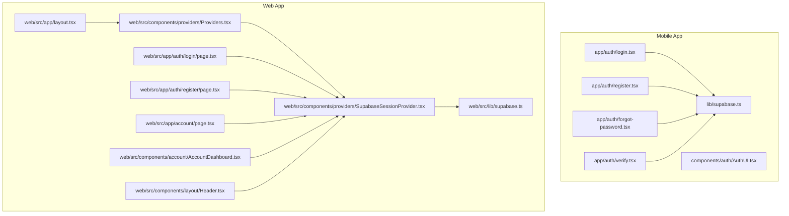

**Diagram sources**
- [login.tsx:1-171](file://app/auth/login.tsx#L1-L171)
- [register.tsx:1-324](file://app/auth/register.tsx#L1-L324)
- [forgot-password.tsx:1-134](file://app/auth/forgot-password.tsx#L1-L134)
- [verify.tsx:1-145](file://app/auth/verify.tsx#L1-L145)
- [AuthUI.tsx:1-486](file://components/auth/AuthUI.tsx#L1-L486)
- [supabase.ts:1-30](file://lib/supabase.ts#L1-L30)
- [layout.tsx:1-61](file://web/src/app/layout.tsx#L1-L61)
- [Providers.tsx:1-32](file://web/src/components/providers/Providers.tsx#L1-L32)
- [SupabaseSessionProvider.tsx:1-74](file://web/src/components/providers/SupabaseSessionProvider.tsx#L1-L74)
- [supabase.ts:1-36](file://web/src/lib/supabase.ts#L1-L36)
- [login/page.tsx:1-178](file://web/src/app/auth/login/page.tsx#L1-L178)
- [register/page.tsx:1-263](file://web/src/app/auth/register/page.tsx#L1-L263)
- [account/page.tsx:1-59](file://web/src/app/account/page.tsx#L1-L59)
- [AccountDashboard.tsx:1-800](file://web/src/components/account/AccountDashboard.tsx#L1-L800)
- [Header.tsx:1-275](file://web/src/components/layout/Header.tsx#L1-L275)

**Section sources**
- [login.tsx:1-171](file://app/auth/login.tsx#L1-L171)
- [register.tsx:1-324](file://app/auth/register.tsx#L1-L324)
- [forgot-password.tsx:1-134](file://app/auth/forgot-password.tsx#L1-L134)
- [verify.tsx:1-145](file://app/auth/verify.tsx#L1-L145)
- [AuthUI.tsx:1-486](file://components/auth/AuthUI.tsx#L1-L486)
- [supabase.ts:1-30](file://lib/supabase.ts#L1-L30)
- [layout.tsx:1-61](file://web/src/app/layout.tsx#L1-L61)
- [Providers.tsx:1-32](file://web/src/components/providers/Providers.tsx#L1-L32)
- [SupabaseSessionProvider.tsx:1-74](file://web/src/components/providers/SupabaseSessionProvider.tsx#L1-L74)
- [supabase.ts:1-36](file://web/src/lib/supabase.ts#L1-L36)
- [login/page.tsx:1-178](file://web/src/app/auth/login/page.tsx#L1-L178)
- [register/page.tsx:1-263](file://web/src/app/auth/register/page.tsx#L1-L263)
- [account/page.tsx:1-59](file://web/src/app/account/page.tsx#L1-L59)
- [AccountDashboard.tsx:1-800](file://web/src/components/account/AccountDashboard.tsx#L1-L800)
- [Header.tsx:1-275](file://web/src/components/layout/Header.tsx#L1-L275)

## Core Components
- Mobile authentication pages:
  - Login: form validation, submission, error handling, and navigation after success.
  - Registration: multi-field validation, normalization, and email confirmation handling.
  - Password reset: email input with feedback and success state.
  - Email verification: OTP input, resend, and activation.
  - Shared UI: AuthScaffold, AuthField, AuthPrimaryButton, AuthNote, AuthSwitchPrompt.
  - Supabase client configured with AsyncStorage for session persistence.

- Web authentication pages:
  - Login and Register: Zod validation, Supabase Auth integration, and redirect handling.
  - SupabaseSessionProvider: global session state, AuthStateChange listener, and initial session hydration.
  - Providers: composes theme, session provider, and storefront provider.
  - Layout: hydrates session server-side and passes initialSession to Providers.
  - Protected account dashboard: guarded by requireAuthenticatedUser and renders tabs for profile, orders, and addresses.

**Section sources**
- [login.tsx:1-171](file://app/auth/login.tsx#L1-L171)
- [register.tsx:1-324](file://app/auth/register.tsx#L1-L324)
- [forgot-password.tsx:1-134](file://app/auth/forgot-password.tsx#L1-L134)
- [verify.tsx:1-145](file://app/auth/verify.tsx#L1-L145)
- [AuthUI.tsx:1-486](file://components/auth/AuthUI.tsx#L1-L486)
- [supabase.ts:1-30](file://lib/supabase.ts#L1-L30)
- [login/page.tsx:1-178](file://web/src/app/auth/login/page.tsx#L1-L178)
- [register/page.tsx:1-263](file://web/src/app/auth/register/page.tsx#L1-L263)
- [SupabaseSessionProvider.tsx:1-74](file://web/src/components/providers/SupabaseSessionProvider.tsx#L1-L74)
- [Providers.tsx:1-32](file://web/src/components/providers/Providers.tsx#L1-L32)
- [layout.tsx:1-61](file://web/src/app/layout.tsx#L1-L61)
- [account/page.tsx:1-59](file://web/src/app/account/page.tsx#L1-L59)
- [AccountDashboard.tsx:1-800](file://web/src/components/account/AccountDashboard.tsx#L1-L800)

## Architecture Overview
The authentication architecture integrates Supabase Auth across platforms:
- Mobile uses a client configured with AsyncStorage for session persistence.
- Web uses a browser client hydrated from server-supplied session data and listens to AuthStateChange events.
- Global session state is exposed via a React Context and consumed by UI components and pages.

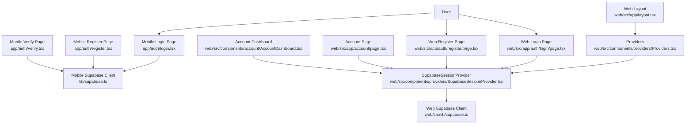

**Diagram sources**
- [login.tsx:1-171](file://app/auth/login.tsx#L1-L171)
- [register.tsx:1-324](file://app/auth/register.tsx#L1-L324)
- [verify.tsx:1-145](file://app/auth/verify.tsx#L1-L145)
- [supabase.ts:1-30](file://lib/supabase.ts#L1-L30)
- [layout.tsx:1-61](file://web/src/app/layout.tsx#L1-L61)
- [Providers.tsx:1-32](file://web/src/components/providers/Providers.tsx#L1-L32)
- [SupabaseSessionProvider.tsx:1-74](file://web/src/components/providers/SupabaseSessionProvider.tsx#L1-L74)
- [login/page.tsx:1-178](file://web/src/app/auth/login/page.tsx#L1-L178)
- [register/page.tsx:1-263](file://web/src/app/auth/register/page.tsx#L1-L263)
- [account/page.tsx:1-59](file://web/src/app/account/page.tsx#L1-L59)
- [AccountDashboard.tsx:1-800](file://web/src/components/account/AccountDashboard.tsx#L1-L800)
- [supabase.ts:1-36](file://web/src/lib/supabase.ts#L1-L36)

## Detailed Component Analysis

### Mobile Login Page
- Validation: Zod schema enforces email and password length.
- Submission: calls Supabase Auth signInWithPassword, normalizes email, and handles errors.
- Feedback: shows localized alerts for invalid credentials and unconfirmed emails.
- Navigation: redirects to profile after successful login.

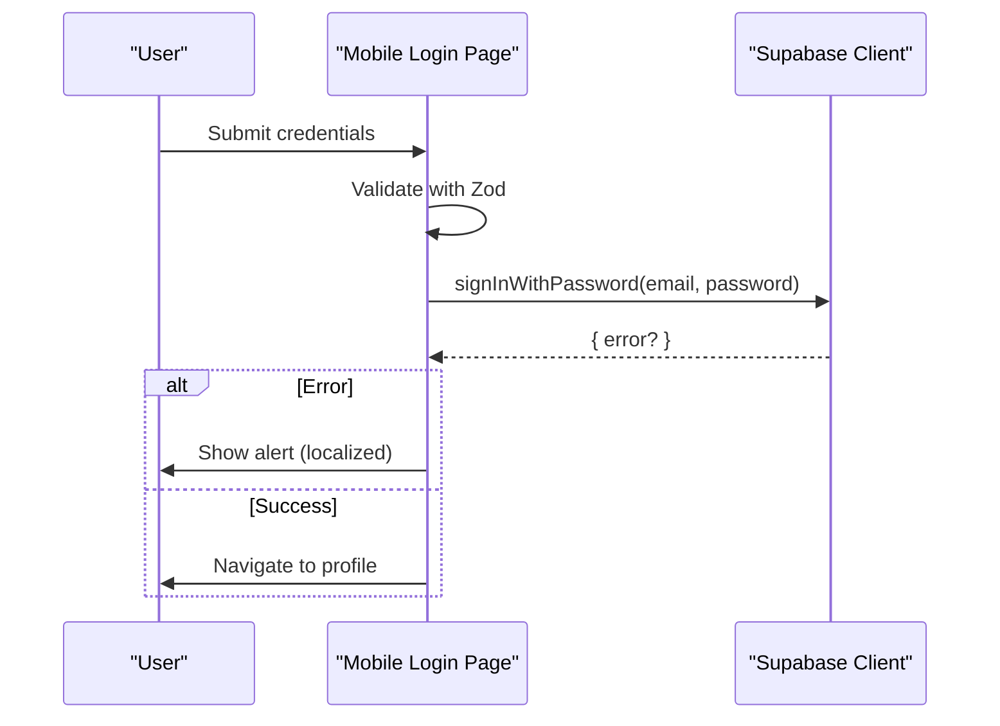

**Diagram sources**
- [login.tsx:50-85](file://app/auth/login.tsx#L50-L85)
- [supabase.ts:1-30](file://lib/supabase.ts#L1-L30)

**Section sources**
- [login.tsx:1-171](file://app/auth/login.tsx#L1-L171)
- [AuthUI.tsx:1-486](file://components/auth/AuthUI.tsx#L1-L486)
- [supabase.ts:1-30](file://lib/supabase.ts#L1-L30)

### Mobile Registration Page
- Validation: Zod schema with localized messages, phone regex, and password confirmation.
- Submission: calls Supabase Auth signUp with normalized data and user metadata.
- Feedback: shows localized alerts for various errors; special handling for email confirmation errors.
- Navigation: routes to verification or profile depending on session presence.

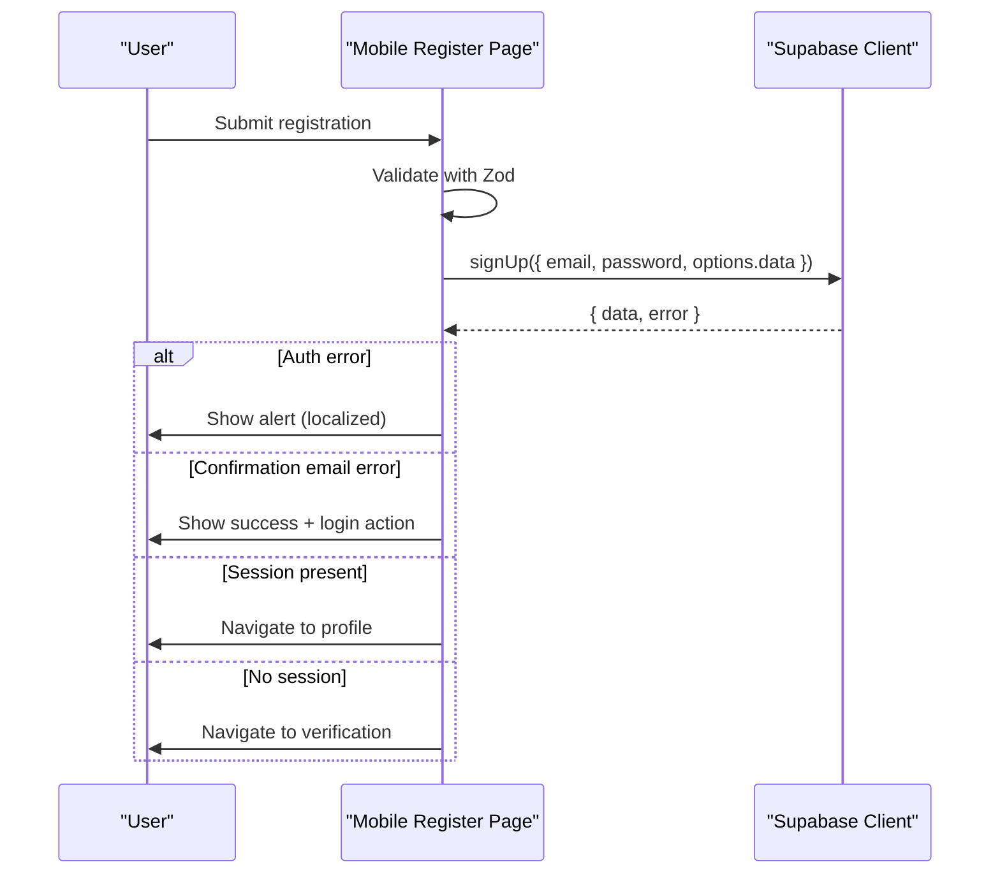

**Diagram sources**
- [register.tsx:92-149](file://app/auth/register.tsx#L92-L149)
- [supabase.ts:1-30](file://lib/supabase.ts#L1-L30)

**Section sources**
- [register.tsx:1-324](file://app/auth/register.tsx#L1-L324)
- [AuthUI.tsx:1-486](file://components/auth/AuthUI.tsx#L1-L486)
- [supabase.ts:1-30](file://lib/supabase.ts#L1-L30)

### Mobile Password Reset
- Input: email field with validation.
- Submission: calls Supabase Auth resetPasswordForEmail with a redirect URL.
- Feedback: shows success state with checkmark and back-to-login action.

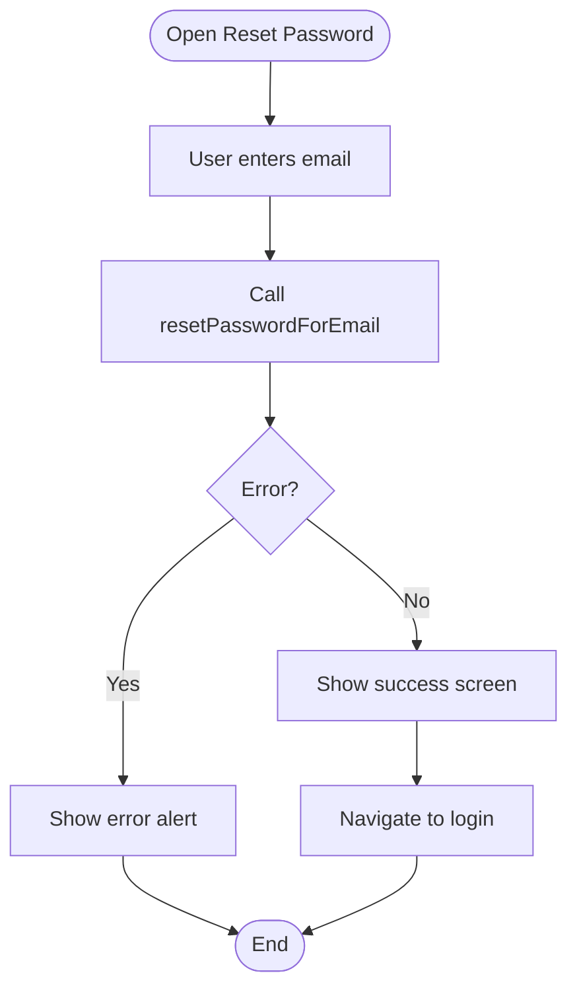

**Diagram sources**
- [forgot-password.tsx:17-37](file://app/auth/forgot-password.tsx#L17-L37)

**Section sources**
- [forgot-password.tsx:1-134](file://app/auth/forgot-password.tsx#L1-L134)

### Mobile Email Verification
- Input: 6-digit OTP with numeric keypad and auto-focus.
- Resend: calls Supabase Auth resend for signup.
- Submission: calls Supabase Auth verifyOtp; navigates to profile on success.

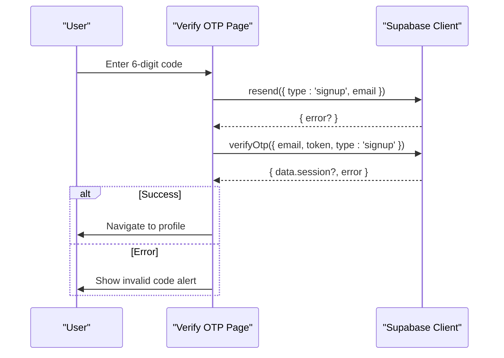

**Diagram sources**
- [verify.tsx:21-71](file://app/auth/verify.tsx#L21-L71)
- [supabase.ts:1-30](file://lib/supabase.ts#L1-L30)

**Section sources**
- [verify.tsx:1-145](file://app/auth/verify.tsx#L1-L145)

### Web Login Page
- Validation: Zod schema with localized messages.
- Submission: calls Supabase Auth signInWithPassword via SupabaseSessionProvider.
- Redirect: uses next query param or defaults to /account; refreshes to rehydrate state.

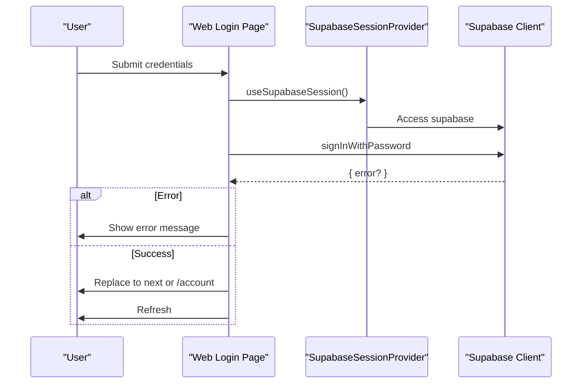

**Diagram sources**
- [login/page.tsx:48-66](file://web/src/app/auth/login/page.tsx#L48-L66)
- [SupabaseSessionProvider.tsx:36-52](file://web/src/components/providers/SupabaseSessionProvider.tsx#L36-L52)
- [supabase.ts:1-36](file://web/src/lib/supabase.ts#L1-L36)

**Section sources**
- [login/page.tsx:1-178](file://web/src/app/auth/login/page.tsx#L1-L178)
- [SupabaseSessionProvider.tsx:1-74](file://web/src/components/providers/SupabaseSessionProvider.tsx#L1-L74)
- [supabase.ts:1-36](file://web/src/lib/supabase.ts#L1-L36)

### Web Register Page
- Validation: Zod schema with localized messages and phone regex.
- Submission: calls Supabase Auth signUp; handles session presence or email confirmation requirement.
- Feedback: shows localized error or confirmation messages.

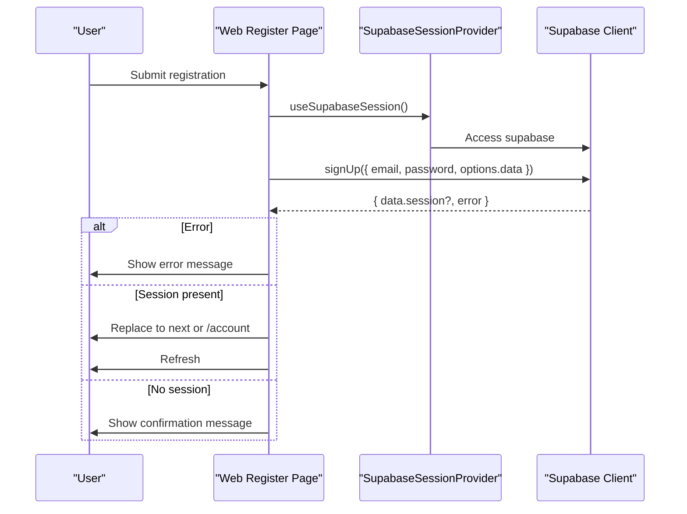

**Diagram sources**
- [register/page.tsx:79-113](file://web/src/app/auth/register/page.tsx#L79-L113)
- [SupabaseSessionProvider.tsx:36-52](file://web/src/components/providers/SupabaseSessionProvider.tsx#L36-L52)
- [supabase.ts:1-36](file://web/src/lib/supabase.ts#L1-L36)

**Section sources**
- [register/page.tsx:1-263](file://web/src/app/auth/register/page.tsx#L1-L263)
- [SupabaseSessionProvider.tsx:1-74](file://web/src/components/providers/SupabaseSessionProvider.tsx#L1-L74)
- [supabase.ts:1-36](file://web/src/lib/supabase.ts#L1-L36)

### SupabaseSessionProvider (Web)
- Provides a React Context with supabase client, session, and user.
- Subscribes to AuthStateChange to keep session in sync.
- Hydrates initial session from server-supplied data.
- Exposes useSupabaseSession hook for consuming components.

```mermaid
classDiagram
class SupabaseSessionProvider {
+props : children, initialSession
+state : session, supabase
+useEffect() : subscribe to AuthStateChange
+getSession() : hydrate initial session
+render() : Provider(session, user, supabase)
}
class useSupabaseSession {
+returns : { supabase, session, user }
}
SupabaseSessionProvider --> useSupabaseSession : "consumed by"
```

**Diagram sources**
- [SupabaseSessionProvider.tsx:29-73](file://web/src/components/providers/SupabaseSessionProvider.tsx#L29-L73)

**Section sources**
- [SupabaseSessionProvider.tsx:1-74](file://web/src/components/providers/SupabaseSessionProvider.tsx#L1-L74)

### Providers and Layout (Web)
- Providers composes ThemeProvider, SupabaseSessionProvider, and StorefrontProvider.
- Layout fetches server language and session, passes initialSession to Providers.
- Header reads user from SupabaseSessionProvider to render account link.

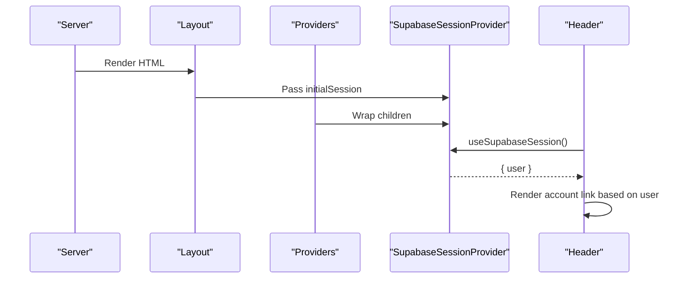

**Diagram sources**
- [layout.tsx:33-36](file://web/src/app/layout.tsx#L33-L36)
- [Providers.tsx:17-31](file://web/src/components/providers/Providers.tsx#L17-L31)
- [SupabaseSessionProvider.tsx:36-52](file://web/src/components/providers/SupabaseSessionProvider.tsx#L36-L52)
- [Header.tsx:61-78](file://web/src/components/layout/Header.tsx#L61-L78)

**Section sources**
- [layout.tsx:1-61](file://web/src/app/layout.tsx#L1-L61)
- [Providers.tsx:1-32](file://web/src/components/providers/Providers.tsx#L1-L32)
- [Header.tsx:1-275](file://web/src/components/layout/Header.tsx#L1-L275)

### Protected Routes and Guards (Web)
- Account page requires authentication via requireAuthenticatedUser before rendering.
- AccountDashboard uses SupabaseSessionProvider to access user and supabase client for sign-out.

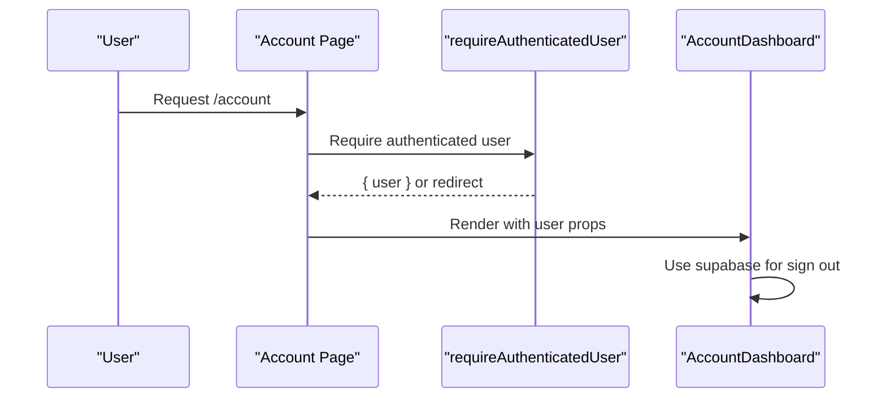

**Diagram sources**
- [account/page.tsx:31-32](file://web/src/app/account/page.tsx#L31-L32)
- [AccountDashboard.tsx:361-367](file://web/src/components/account/AccountDashboard.tsx#L361-L367)

**Section sources**
- [account/page.tsx:1-59](file://web/src/app/account/page.tsx#L1-L59)
- [AccountDashboard.tsx:1-800](file://web/src/components/account/AccountDashboard.tsx#L1-L800)

## Dependency Analysis
- Mobile:
  - Forms depend on Zod and react-hook-form.
  - Supabase client configured with AsyncStorage for session persistence.
  - AuthUI provides reusable components for consistent UX.

- Web:
  - Pages depend on SupabaseSessionProvider for session state.
  - Layout hydrates session server-side and passes to Providers.
  - Header conditionally links to account or login based on user.
  - Account page guards access via requireAuthenticatedUser.

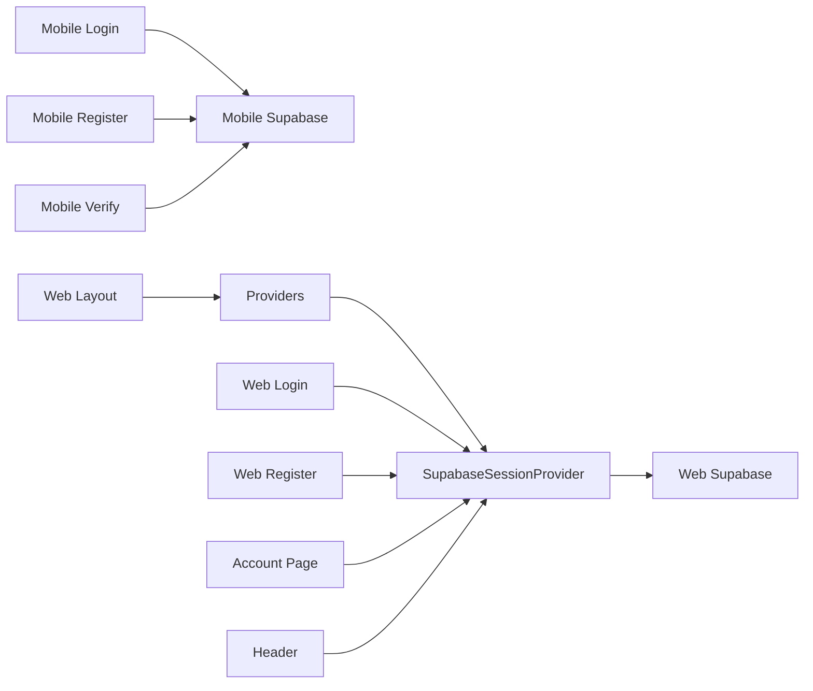

**Diagram sources**
- [login.tsx:1-171](file://app/auth/login.tsx#L1-L171)
- [register.tsx:1-324](file://app/auth/register.tsx#L1-L324)
- [verify.tsx:1-145](file://app/auth/verify.tsx#L1-L145)
- [supabase.ts:1-30](file://lib/supabase.ts#L1-L30)
- [layout.tsx:1-61](file://web/src/app/layout.tsx#L1-L61)
- [Providers.tsx:1-32](file://web/src/components/providers/Providers.tsx#L1-L32)
- [SupabaseSessionProvider.tsx:1-74](file://web/src/components/providers/SupabaseSessionProvider.tsx#L1-L74)
- [login/page.tsx:1-178](file://web/src/app/auth/login/page.tsx#L1-L178)
- [register/page.tsx:1-263](file://web/src/app/auth/register/page.tsx#L1-L263)
- [account/page.tsx:1-59](file://web/src/app/account/page.tsx#L1-L59)
- [Header.tsx:1-275](file://web/src/components/layout/Header.tsx#L1-L275)

**Section sources**
- [login.tsx:1-171](file://app/auth/login.tsx#L1-L171)
- [register.tsx:1-324](file://app/auth/register.tsx#L1-L324)
- [verify.tsx:1-145](file://app/auth/verify.tsx#L1-L145)
- [supabase.ts:1-30](file://lib/supabase.ts#L1-L30)
- [layout.tsx:1-61](file://web/src/app/layout.tsx#L1-L61)
- [Providers.tsx:1-32](file://web/src/components/providers/Providers.tsx#L1-L32)
- [SupabaseSessionProvider.tsx:1-74](file://web/src/components/providers/SupabaseSessionProvider.tsx#L1-L74)
- [login/page.tsx:1-178](file://web/src/app/auth/login/page.tsx#L1-L178)
- [register/page.tsx:1-263](file://web/src/app/auth/register/page.tsx#L1-L263)
- [account/page.tsx:1-59](file://web/src/app/account/page.tsx#L1-L59)
- [Header.tsx:1-275](file://web/src/components/layout/Header.tsx#L1-L275)

## Performance Considerations
- Prefer client-side validation with Zod to reduce server round trips during registration and login.
- Use controlled inputs and minimal re-renders in AuthUI components.
- On the web, avoid unnecessary re-renders by deriving user/session from SupabaseSessionProvider rather than refetching.
- Keep Supabase Auth state synchronized via onAuthStateChange to prevent stale UI.

## Troubleshooting Guide
- Login fails with “invalid credentials”:
  - Verify email normalization and password length.
  - Check Supabase Auth logs for blocked IPs or rate limits.

- Email not confirmed on login:
  - Prompt user to verify OTP or resend confirmation.
  - Ensure redirect URL matches configured site URL.

- Registration shows “confirmation email” error:
  - Some configurations still require manual confirmation; guide user to verify email and then log in.

- Password reset not received:
  - Confirm email exists and is deliverable.
  - Check redirect URL and domain configuration.

- Session not persisting on web:
  - Ensure SupabaseSessionProvider is wrapped around app and initialSession is passed from server.
  - Verify cookies are readable and not blocked by browser settings.

- Protected route bypass:
  - Confirm requireAuthenticatedUser is awaited before rendering account content.
  - Ensure SupabaseSessionProvider is initialized and user is available.

**Section sources**
- [login.tsx:23-85](file://app/auth/login.tsx#L23-L85)
- [register.tsx:114-149](file://app/auth/register.tsx#L114-L149)
- [forgot-password.tsx:17-37](file://app/auth/forgot-password.tsx#L17-L37)
- [verify.tsx:21-71](file://app/auth/verify.tsx#L21-L71)
- [SupabaseSessionProvider.tsx:36-52](file://web/src/components/providers/SupabaseSessionProvider.tsx#L36-L52)
- [account/page.tsx:31-32](file://web/src/app/account/page.tsx#L31-L32)

## Security Best Practices
- Enforce strong password policies and minimum lengths.
- Use HTTPS and secure cookies for web sessions.
- Sanitize and normalize user inputs (emails, phones).
- Limit rate of password resets and email verifications.
- Avoid exposing sensitive fields in UI; rely on server-side checks.
- Rotate API keys and restrict Supabase project permissions appropriately.
- Monitor AuthStateChange for unexpected session drops and notify users.

## Conclusion
The authentication system combines robust client-side validation, Supabase Auth integration, and a centralized session provider to maintain consistent user state across pages. Mobile and web implementations share similar flows—login, registration, verification, and password reset—while leveraging platform-specific strengths (AsyncStorage vs. browser cookies and SSR hydration). By following the outlined best practices and troubleshooting steps, teams can maintain a secure and reliable authentication experience.