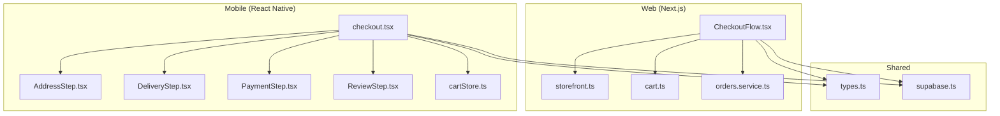
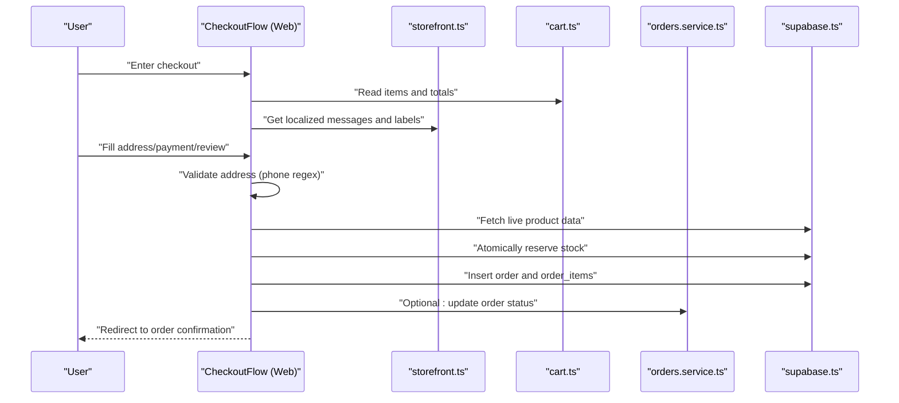
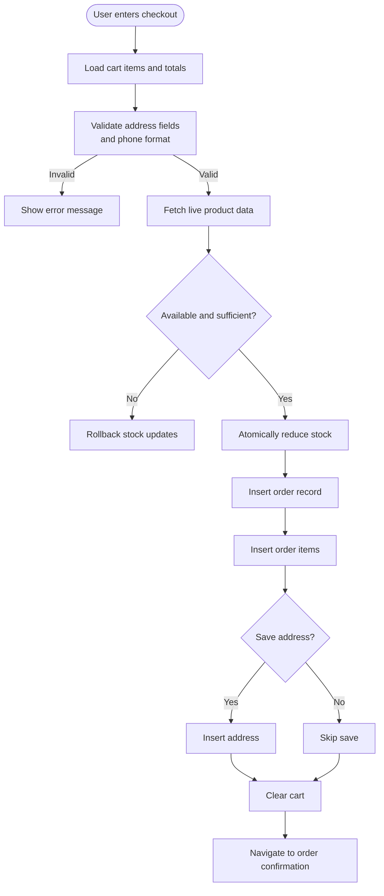
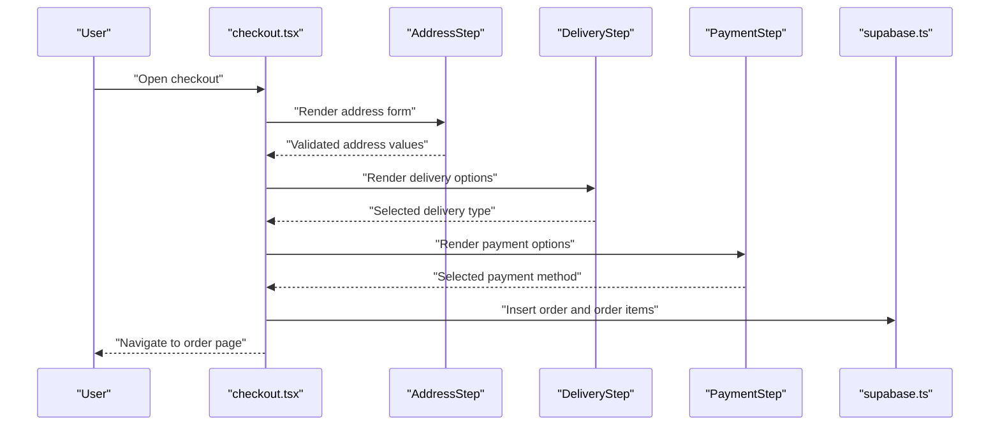
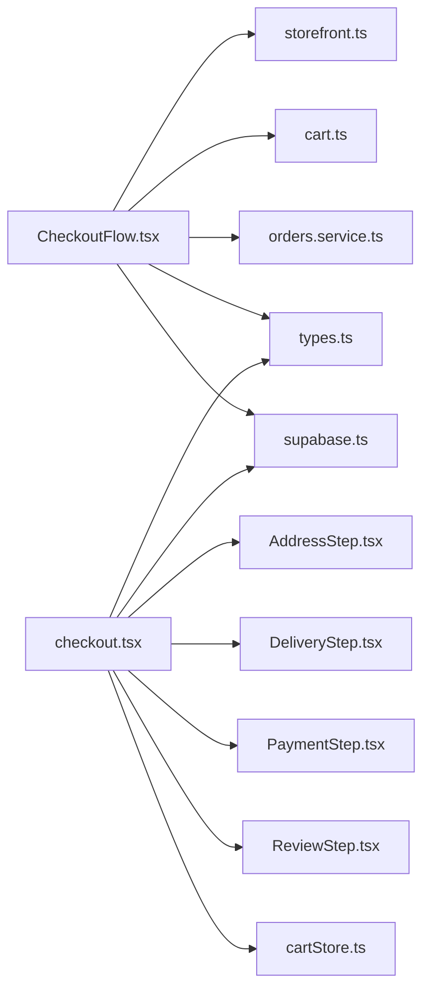

# Web Checkout Flow

<cite>
**Referenced Files in This Document**
- [CheckoutFlow.tsx](file://web/src/components/checkout/CheckoutFlow.tsx)
- [checkout.tsx](file://app/checkout.tsx)
- [AddressStep.tsx](file://components/checkout/AddressStep.tsx)
- [DeliveryStep.tsx](file://components/checkout/DeliveryStep.tsx)
- [PaymentStep.tsx](file://components/checkout/PaymentStep.tsx)
- [ReviewStep.tsx](file://components/checkout/ReviewStep.tsx)
- [storefront.ts](file://web/src/lib/storefront.ts)
- [cart.ts](file://web/src/store/cart.ts)
- [orders.service.ts](file://services/orders.service.ts)
- [types.ts](file://shared/types.ts)
- [supabase.ts](file://lib/supabase.ts)
- [cartStore.ts](file://store/cartStore.ts)
- [_layout.tsx](file://app/_layout.tsx)
</cite>

## Table of Contents
1. [Introduction](#introduction)
2. [Project Structure](#project-structure)
3. [Core Components](#core-components)
4. [Architecture Overview](#architecture-overview)
5. [Detailed Component Analysis](#detailed-component-analysis)
6. [Dependency Analysis](#dependency-analysis)
7. [Performance Considerations](#performance-considerations)
8. [Troubleshooting Guide](#troubleshooting-guide)
9. [Security and Compliance](#security-and-compliance)
10. [Responsive Design Adaptations](#responsive-design-adaptations)
11. [Conclusion](#conclusion)

## Introduction
This document explains the web checkout system implemented in the Next.js application. It focuses on the multi-step checkout flow managed by the CheckoutFlow component, covering address selection, delivery options, and payment processing. It also documents form validation strategies, error handling, user feedback mechanisms, integration with Supabase for order creation, inventory adjustments, and responsive design adaptations for desktop and mobile.

## Project Structure
The checkout system spans two primary environments:
- Web (Next.js): Implements the checkout flow in a browser-friendly layout with a sidebar summary and responsive grid.
- Mobile (React Native): Implements a step-by-step form with a stepper header, keyboard-aware scrolling, and modal cancellation flow.

**Diagram sources**
- [CheckoutFlow.tsx:52-722](file://web/src/components/checkout/CheckoutFlow.tsx#L52-L722)
- [checkout.tsx:25-491](file://app/checkout.tsx#L25-L491)
- [AddressStep.tsx:16-233](file://components/checkout/AddressStep.tsx#L16-L233)
- [DeliveryStep.tsx:12-77](file://components/checkout/DeliveryStep.tsx#L12-L77)
- [PaymentStep.tsx:12-69](file://components/checkout/PaymentStep.tsx#L12-L69)
- [ReviewStep.tsx:35-171](file://components/checkout/ReviewStep.tsx#L35-L171)
- [storefront.ts:13-613](file://web/src/lib/storefront.ts#L13-L613)
- [cart.ts:33-107](file://web/src/store/cart.ts#L33-L107)
- [orders.service.ts:12-115](file://services/orders.service.ts#L12-L115)
- [types.ts:49-256](file://shared/types.ts#L49-L256)
- [supabase.ts:19-30](file://lib/supabase.ts#L19-L30)
- [cartStore.ts:51-174](file://store/cartStore.ts#L51-L174)

**Section sources**
- [CheckoutFlow.tsx:52-722](file://web/src/components/checkout/CheckoutFlow.tsx#L52-L722)
- [checkout.tsx:25-491](file://app/checkout.tsx#L25-L491)

## Core Components
- CheckoutFlow (Web): Orchestrates the three-step checkout: address, payment/method, and review. Handles validation, user authentication checks, inventory reservation via atomic updates, order creation, and redirects to the order confirmation page.
- AddressStep (Mobile): Collects shipping address with type selection, city picker, optional map pinning, and validation via Zod.
- DeliveryStep (Mobile): Presents delivery options (standard, express, fragile) with pricing and selection.
- PaymentStep (Mobile): Presents available payment methods (Cash on Delivery currently, others upcoming).
- ReviewStep (Mobile): Summarizes items, address, delivery, and payment for confirmation.
- storefront utilities (Web): Provides internationalization, currency formatting, constants (delivery cost, exchange rate), and labels for UI.
- cart stores (Web/Mobile): Manage cart state, totals, and persistence.

**Section sources**
- [CheckoutFlow.tsx:52-722](file://web/src/components/checkout/CheckoutFlow.tsx#L52-L722)
- [AddressStep.tsx:16-233](file://components/checkout/AddressStep.tsx#L16-L233)
- [DeliveryStep.tsx:12-77](file://components/checkout/DeliveryStep.tsx#L12-L77)
- [PaymentStep.tsx:12-69](file://components/checkout/PaymentStep.tsx#L12-L69)
- [ReviewStep.tsx:35-171](file://components/checkout/ReviewStep.tsx#L35-L171)
- [storefront.ts:13-613](file://web/src/lib/storefront.ts#L13-L613)
- [cart.ts:33-107](file://web/src/store/cart.ts#L33-L107)
- [cartStore.ts:51-174](file://store/cartStore.ts#L51-L174)

## Architecture Overview
The checkout flow integrates UI components with backend services through Supabase. The Web checkout uses a single-page flow with a sticky summary panel, while the Mobile checkout uses a step-by-step form with a stepper header and keyboard-aware scrolling.

**Diagram sources**
- [CheckoutFlow.tsx:162-346](file://web/src/components/checkout/CheckoutFlow.tsx#L162-L346)
- [storefront.ts:13-613](file://web/src/lib/storefront.ts#L13-L613)
- [cart.ts:33-107](file://web/src/store/cart.ts#L33-L107)
- [orders.service.ts:12-115](file://services/orders.service.ts#L12-L115)
- [supabase.ts:19-30](file://lib/supabase.ts#L19-L30)

## Detailed Component Analysis

### Web CheckoutFlow
- Responsibilities:
  - Manages checkout steps and navigation.
  - Validates address fields and phone format.
  - Authenticates user and loads saved addresses/profile defaults.
  - Reserves inventory atomically and creates order records.
  - Integrates with Supabase for product data, order insertion, and order item insertion.
  - Clears cart and navigates to order confirmation page.
- Validation:
  - Checks presence of required address fields.
  - Uses a phone regex to validate Iraqi phone numbers.
- Inventory Reservation:
  - Loads live product rows by IDs.
  - Verifies availability per item.
  - Updates stock quantities with equality checks to prevent race conditions.
  - On failure, rolls back previously updated stock entries.
- Order Creation:
  - Inserts order with derived totals, delivery cost, and payment status.
  - Inserts order items snapshotting product metadata.
  - Optionally saves the address for future use.
- User Feedback:
  - Displays localized error messages.
  - Shows submission state with a spinner.
  - Navigates to order confirmation on success.

**Diagram sources**
- [CheckoutFlow.tsx:122-346](file://web/src/components/checkout/CheckoutFlow.tsx#L122-L346)

**Section sources**
- [CheckoutFlow.tsx:52-722](file://web/src/components/checkout/CheckoutFlow.tsx#L52-L722)
- [storefront.ts:13-613](file://web/src/lib/storefront.ts#L13-L613)
- [orders.service.ts:12-115](file://services/orders.service.ts#L12-L115)
- [supabase.ts:19-30](file://lib/supabase.ts#L19-L30)

### Mobile Checkout Screen
- Responsibilities:
  - Renders AddressStep, DeliveryStep, and PaymentStep conditionally.
  - Uses Zod resolver for address validation.
  - Manages saved addresses and profile defaults.
  - Submits order with delivery cost, discount, and coupon usage tracking.
  - Decreases product stock via RPC.
- Validation:
  - Triggers validation for required address fields before advancing.
- User Experience:
  - Animated stepper header with progress indicator.
  - Keyboard-aware scroll view and safe area handling.
  - Confirmation modal to cancel checkout with cart persistence.

**Diagram sources**
- [checkout.tsx:25-491](file://app/checkout.tsx#L25-L491)
- [AddressStep.tsx:16-233](file://components/checkout/AddressStep.tsx#L16-L233)
- [DeliveryStep.tsx:12-77](file://components/checkout/DeliveryStep.tsx#L12-L77)
- [PaymentStep.tsx:12-69](file://components/checkout/PaymentStep.tsx#L12-L69)
- [supabase.ts:19-30](file://lib/supabase.ts#L19-L30)

**Section sources**
- [checkout.tsx:25-491](file://app/checkout.tsx#L25-L491)
- [AddressStep.tsx:16-233](file://components/checkout/AddressStep.tsx#L16-L233)
- [DeliveryStep.tsx:12-77](file://components/checkout/DeliveryStep.tsx#L12-L77)
- [PaymentStep.tsx:12-69](file://components/checkout/PaymentStep.tsx#L12-L69)

### AddressStep (Mobile)
- Features:
  - Address type selection (home/work).
  - City picker with Iraqi cities list.
  - Optional map pinning for location.
  - Real-time validation with error badges.
  - Focus-aware scrolling to keep inputs visible.
- Internationalization:
  - Labels and placeholders adapt to Arabic/English.

**Section sources**
- [AddressStep.tsx:16-233](file://components/checkout/AddressStep.tsx#L16-L233)
- [types.ts:16-36](file://shared/types.ts#L16-L36)

### DeliveryStep (Mobile)
- Features:
  - Horizontal scroll of delivery options.
  - Pricing and descriptions localized.
  - Visual selection feedback.

**Section sources**
- [DeliveryStep.tsx:12-77](file://components/checkout/DeliveryStep.tsx#L12-L77)

### PaymentStep (Mobile)
- Features:
  - Payment method cards with icons.
  - Availability indicators for upcoming methods.
  - Selection feedback.

**Section sources**
- [PaymentStep.tsx:12-69](file://components/checkout/PaymentStep.tsx#L12-L69)

### ReviewStep (Mobile)
- Features:
  - Order preview with items and quantities.
  - Address and contact summary.
  - Delivery and payment method labels.
  - Discount and total computation.

**Section sources**
- [ReviewStep.tsx:35-171](file://components/checkout/ReviewStep.tsx#L35-L171)

## Dependency Analysis
- Web checkout depends on:
  - storefront utilities for localization and formatting.
  - cart store for totals and items.
  - orders service for order CRUD operations.
  - shared types for database contracts.
  - supabase client for database operations.
- Mobile checkout depends on:
  - AddressStep, DeliveryStep, PaymentStep, ReviewStep components.
  - cartStore for cart state.
  - shared types and supabase client.

**Diagram sources**
- [CheckoutFlow.tsx:52-722](file://web/src/components/checkout/CheckoutFlow.tsx#L52-L722)
- [storefront.ts:13-613](file://web/src/lib/storefront.ts#L13-L613)
- [cart.ts:33-107](file://web/src/store/cart.ts#L33-L107)
- [orders.service.ts:12-115](file://services/orders.service.ts#L12-L115)
- [types.ts:49-256](file://shared/types.ts#L49-L256)
- [supabase.ts:19-30](file://lib/supabase.ts#L19-L30)
- [checkout.tsx:25-491](file://app/checkout.tsx#L25-L491)
- [AddressStep.tsx:16-233](file://components/checkout/AddressStep.tsx#L16-L233)
- [DeliveryStep.tsx:12-77](file://components/checkout/DeliveryStep.tsx#L12-L77)
- [PaymentStep.tsx:12-69](file://components/checkout/PaymentStep.tsx#L12-L69)
- [ReviewStep.tsx:35-171](file://components/checkout/ReviewStep.tsx#L35-L171)
- [cartStore.ts:51-174](file://store/cartStore.ts#L51-L174)

**Section sources**
- [CheckoutFlow.tsx:52-722](file://web/src/components/checkout/CheckoutFlow.tsx#L52-L722)
- [checkout.tsx:25-491](file://app/checkout.tsx#L25-L491)

## Performance Considerations
- Atomic Stock Updates: The Web checkout reduces race conditions by updating stock with equality checks against the live quantity, ensuring consistency under concurrent orders.
- Single-Page Flow (Web): Minimizes navigation overhead and leverages a sticky summary panel for quick access to totals.
- Localized Formatting: Currency and date formatting are handled efficiently via built-in formatters.
- Cart Persistence: Both Web and Mobile use persistent stores to avoid recomputation and preserve state across sessions.

[No sources needed since this section provides general guidance]

## Troubleshooting Guide
Common issues and remedies:
- Empty Cart: The Web checkout prevents proceeding if the cart is empty and prompts the user to continue shopping.
- Authentication Required: The Web checkout redirects unauthenticated users to the login page with a next parameter.
- Validation Failures: Address validation errors are surfaced immediately with localized messages; ensure required fields and phone format are correct.
- Stock Unavailable: If a product becomes unavailable or insufficient, the system rolls back prior stock updates and displays an error.
- Order Creation Errors: If order or order items fail to save, the system cleans up partial writes and informs the user.

**Section sources**
- [CheckoutFlow.tsx:89-148](file://web/src/components/checkout/CheckoutFlow.tsx#L89-L148)
- [CheckoutFlow.tsx:168-191](file://web/src/components/checkout/CheckoutFlow.tsx#L168-L191)
- [CheckoutFlow.tsx:211-220](file://web/src/components/checkout/CheckoutFlow.tsx#L211-L220)
- [CheckoutFlow.tsx:236-245](file://web/src/components/checkout/CheckoutFlow.tsx#L236-L245)
- [CheckoutFlow.tsx:285-294](file://web/src/components/checkout/CheckoutFlow.tsx#L285-L294)

## Security and Compliance
- Sensitive Data Handling:
  - The checkout collects minimal required data (name, phone, address). No credit card fields are present in the current implementation.
  - Payment collection is deferred to the chosen method (Cash on Delivery), reducing PCI scope for card data.
- PCI Compliance:
  - Since card payments are not implemented in the current flow, the system avoids storing or transmitting cardholder data.
  - Future card integrations must adhere to PCI SAQ A guidelines and use PCI-compliant payment processors.
- Fraud Prevention:
  - Phone number validation ensures a locally valid Iraqi number is provided.
  - Atomic stock updates prevent overselling and reduce manipulation attempts.
  - User authentication is enforced before placing orders.
- Data Privacy:
  - Supabase client configuration supports secure session handling and token refresh.
  - Localized messages and formatting are applied client-side without exposing internal keys.

**Section sources**
- [CheckoutFlow.tsx:138-147](file://web/src/components/checkout/CheckoutFlow.tsx#L138-L147)
- [CheckoutFlow.tsx:227-234](file://web/src/components/checkout/CheckoutFlow.tsx#L227-L234)
- [supabase.ts:19-30](file://lib/supabase.ts#L19-L30)

## Responsive Design Adaptations
- Web CheckoutFlow:
  - Grid layout adapts from single column on small screens to a two-column layout with a sticky summary panel on larger screens.
  - Typography and spacing scale appropriately across breakpoints.
  - Icons and labels localize seamlessly for RTL languages.
- Mobile Checkout Screen:
  - Keyboard-aware scroll view adjusts content inset to keep inputs visible.
  - Animated stepper header provides clear progress indication.
  - Safe area insets ensure proper rendering on devices with notches or home indicators.
  - Footer action button remains accessible and elevated above the keyboard.

**Section sources**
- [CheckoutFlow.tsx:392-718](file://web/src/components/checkout/CheckoutFlow.tsx#L392-L718)
- [checkout.tsx:380-446](file://app/checkout.tsx#L380-L446)
- [_layout.tsx:34-107](file://app/_layout.tsx#L34-L107)

## Conclusion
The checkout system combines robust validation, atomic inventory handling, and a clean multi-step UI tailored for both web and mobile. The Web checkout emphasizes a streamlined, responsive experience with a sticky summary, while the Mobile checkout prioritizes accessibility and clarity with a stepper header and keyboard-aware layout. Together, they provide a solid foundation for order fulfillment, with clear pathways for future enhancements such as electronic payment integration and advanced fraud controls.