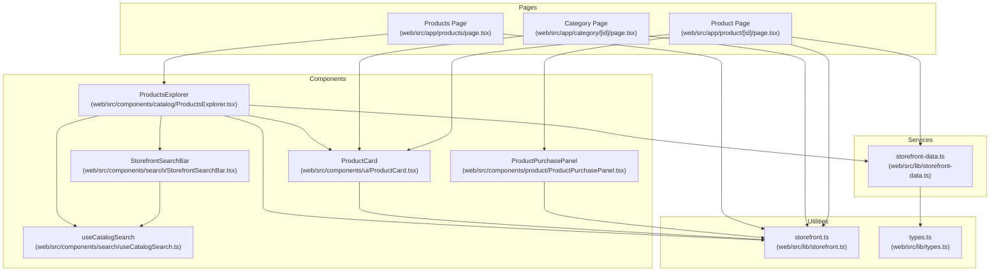
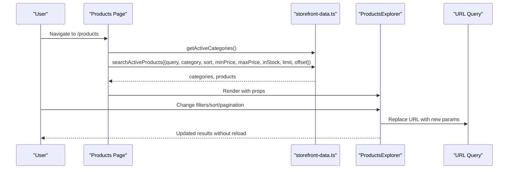
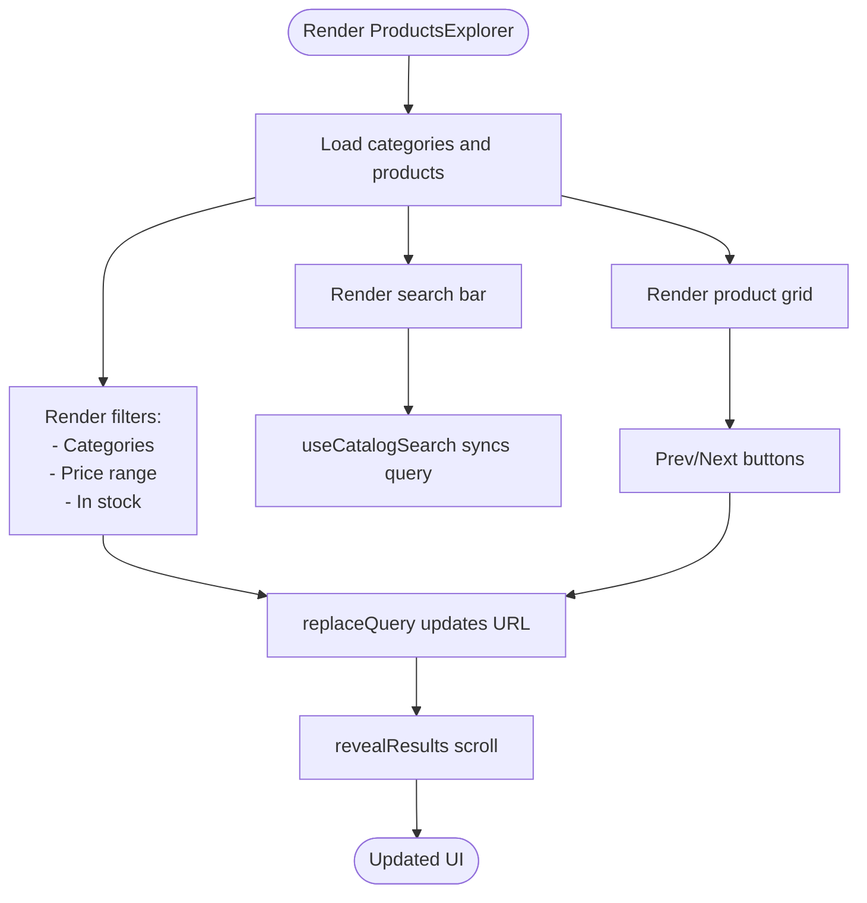
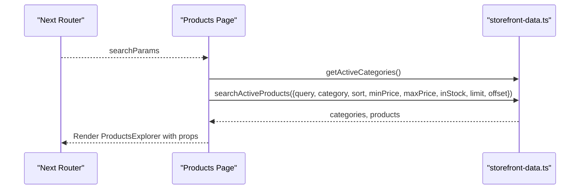
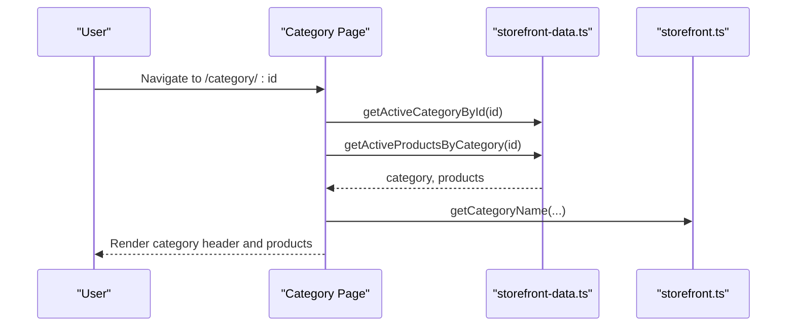
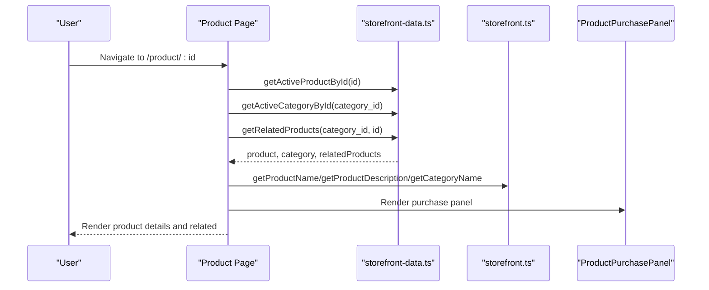
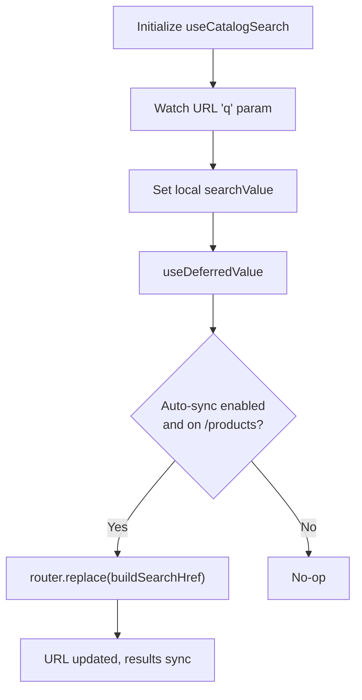
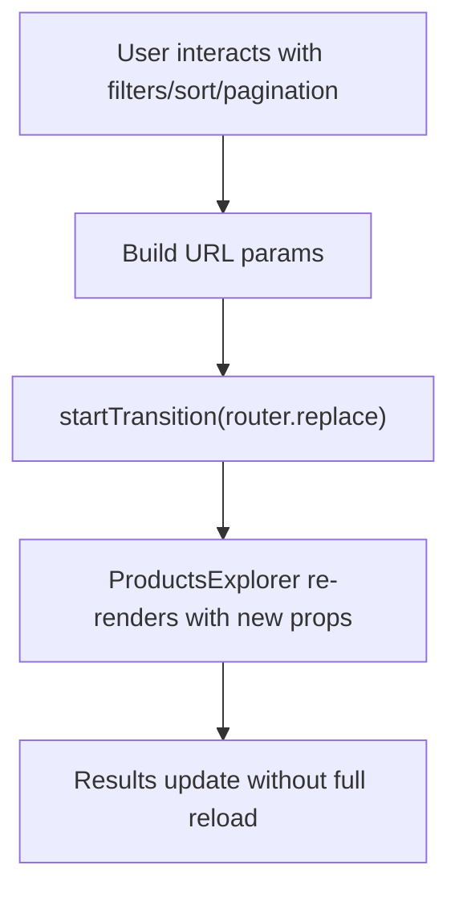
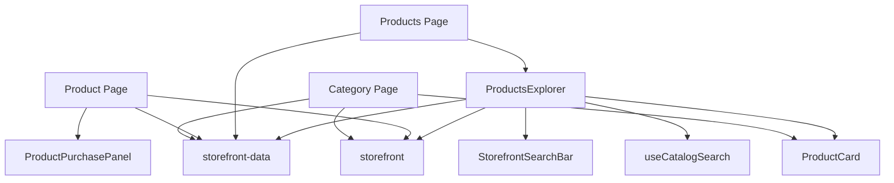

# Web Product Catalog

<cite>
**Referenced Files in This Document**
- [ProductsExplorer.tsx](file://web/src/components/catalog/ProductsExplorer.tsx)
- [ProductsPage.tsx](file://web/src/app/products/page.tsx)
- [ProductPage.tsx](file://web/src/app/product/[id]/page.tsx)
- [StorefrontSearchBar.tsx](file://web/src/components/search/StorefrontSearchBar.tsx)
- [useCatalogSearch.ts](file://web/src/components/search/useCatalogSearch.ts)
- [storefront-data.ts](file://web/src/lib/storefront-data.ts)
- [ProductCard.tsx](file://web/src/components/ui/ProductCard.tsx)
- [ProductPurchasePanel.tsx](file://web/src/components/product/ProductPurchasePanel.tsx)
- [storefront.ts](file://web/src/lib/storefront.ts)
- [CategoryPage.tsx](file://web/src/app/category/[id]/page.tsx)
- [Header.tsx](file://web/src/components/layout/Header.tsx)
- [Footer.tsx](file://web/src/components/layout/Footer.tsx)
- [types.ts](file://web/src/lib/types.ts)
</cite>

## Table of Contents
1. [Introduction](#introduction)
2. [Project Structure](#project-structure)
3. [Core Components](#core-components)
4. [Architecture Overview](#architecture-overview)
5. [Detailed Component Analysis](#detailed-component-analysis)
6. [Dependency Analysis](#dependency-analysis)
7. [Performance Considerations](#performance-considerations)
8. [Troubleshooting Guide](#troubleshooting-guide)
9. [Conclusion](#conclusion)

## Introduction
This document explains the web product catalog system with a focus on the enhanced product listing experience optimized for desktop. It covers the ProductsExplorer component, category navigation, search and filtering, individual product pages, responsive design patterns, and performance optimizations such as lazy loading, pagination, and efficient data fetching.

## Project Structure
The product catalog spans Next.js app routes, shared UI components, and service-layer data access. Key areas:
- Pages: product listing, category view, and individual product page
- Components: reusable UI pieces for search, product cards, purchase panels
- Services: data access for categories, products, and related queries
- Utilities: localization, formatting, and storefront helpers

**Diagram sources**
- [ProductsPage.tsx:1-90](file://web/src/app/products/page.tsx#L1-L90)
- [CategoryPage.tsx:1-98](file://web/src/app/category/[id]/page.tsx#L1-L98)
- [ProductPage.tsx:1-103](file://web/src/app/product/[id]/page.tsx#L1-L103)
- [ProductsExplorer.tsx:1-427](file://web/src/components/catalog/ProductsExplorer.tsx#L1-L427)
- [StorefrontSearchBar.tsx:1-106](file://web/src/components/search/StorefrontSearchBar.tsx#L1-L106)
- [useCatalogSearch.ts:1-114](file://web/src/components/search/useCatalogSearch.ts#L1-L114)
- [ProductCard.tsx:1-98](file://web/src/components/ui/ProductCard.tsx#L1-L98)
- [ProductPurchasePanel.tsx:1-261](file://web/src/components/product/ProductPurchasePanel.tsx#L1-L261)
- [storefront-data.ts:1-312](file://web/src/lib/storefront-data.ts#L1-L312)
- [storefront.ts:1-613](file://web/src/lib/storefront.ts#L1-L613)
- [types.ts:1-2](file://web/src/lib/types.ts#L1-L2)

**Section sources**
- [ProductsPage.tsx:1-90](file://web/src/app/products/page.tsx#L1-L90)
- [ProductsExplorer.tsx:1-427](file://web/src/components/catalog/ProductsExplorer.tsx#L1-L427)
- [storefront-data.ts:1-312](file://web/src/lib/storefront-data.ts#L1-L312)

## Core Components
- ProductsExplorer: Desktop-optimized product listing with category filters, price range, stock availability, sorting, pagination, and integrated search bar.
- Products Page: Server-side rendering of categories and paginated products, passing props to ProductsExplorer.
- Category Page: Displays category header and active products within a category.
- Product Page: Renders product details, purchase panel, and related products.
- StorefrontSearchBar + useCatalogSearch: Shared search UI and hook for synchronized query updates.
- ProductCard: Reusable product tile with image, pricing, discount badge, stock indicator, and add-to-cart.
- ProductPurchasePanel: Detailed product view with description/details tabs, quantity selector, and cart integration.
- storefront-data: Backend queries for categories, products, and related items.
- storefront: Localization, currency formatting, and text helpers.

**Section sources**
- [ProductsExplorer.tsx:23-46](file://web/src/components/catalog/ProductsExplorer.tsx#L23-L46)
- [ProductsPage.tsx:49-89](file://web/src/app/products/page.tsx#L49-L89)
- [CategoryPage.tsx:19-97](file://web/src/app/category/[id]/page.tsx#L19-L97)
- [ProductPage.tsx:21-102](file://web/src/app/product/[id]/page.tsx#L21-L102)
- [StorefrontSearchBar.tsx:8-32](file://web/src/components/search/StorefrontSearchBar.tsx#L8-L32)
- [useCatalogSearch.ts:22-34](file://web/src/components/search/useCatalogSearch.ts#L22-L34)
- [ProductCard.tsx:12-14](file://web/src/components/ui/ProductCard.tsx#L12-L14)
- [ProductPurchasePanel.tsx:16-19](file://web/src/components/product/ProductPurchasePanel.tsx#L16-L19)
- [storefront-data.ts:112-169](file://web/src/lib/storefront-data.ts#L112-L169)
- [storefront.ts:527-572](file://web/src/lib/storefront.ts#L527-L572)

## Architecture Overview
The catalog follows a server-rendered listing pattern with client-side refinement:
- Server route fetches categories and paginated products, then passes data to ProductsExplorer.
- ProductsExplorer manages URL query synchronization for filters, sorting, and pagination.
- Search integrates via a dedicated hook that defers updates and replaces URLs to keep state in sync.
- Product detail pages load product, category, and related items concurrently.

**Diagram sources**
- [ProductsPage.tsx:61-73](file://web/src/app/products/page.tsx#L61-L73)
- [storefront-data.ts:72-85](file://web/src/lib/storefront-data.ts#L72-L85)
- [storefront-data.ts:112-169](file://web/src/lib/storefront-data.ts#L112-L169)
- [ProductsExplorer.tsx:80-107](file://web/src/components/catalog/ProductsExplorer.tsx#L80-L107)

## Detailed Component Analysis

### ProductsExplorer Component
Responsibilities:
- Renders category sidebar with icons and names, sticky on desktop.
- Provides price range inputs and “in stock only” toggle.
- Integrates StorefrontSearchBar for live query updates.
- Sorts results and paginates with Previous/Next controls.
- Updates URL query parameters reactively and scrolls to results.

Key behaviors:
- replaceQuery updates URL without full reload, preserving UX.
- clearFilters resets query and scrolls to top.
- handleCategoryChange toggles category filter and reveals results.
- Pagination computes next/previous page links based on current page and product count per page.

**Diagram sources**
- [ProductsExplorer.tsx:133-427](file://web/src/components/catalog/ProductsExplorer.tsx#L133-L427)
- [useCatalogSearch.ts:44-85](file://web/src/components/search/useCatalogSearch.ts#L44-L85)

**Section sources**
- [ProductsExplorer.tsx:46-131](file://web/src/components/catalog/ProductsExplorer.tsx#L46-L131)
- [ProductsExplorer.tsx:133-427](file://web/src/components/catalog/ProductsExplorer.tsx#L133-L427)

### Products Page (Server Route)
Responsibilities:
- Reads URL search parameters and normalizes them.
- Fetches categories and paginated products concurrently.
- Passes initial state to ProductsExplorer for hydration.

**Diagram sources**
- [ProductsPage.tsx:49-89](file://web/src/app/products/page.tsx#L49-L89)
- [storefront-data.ts:72-85](file://web/src/lib/storefront-data.ts#L72-L85)
- [storefront-data.ts:112-169](file://web/src/lib/storefront-data.ts#L112-L169)

**Section sources**
- [ProductsPage.tsx:10-26](file://web/src/app/products/page.tsx#L10-L26)
- [ProductsPage.tsx:49-89](file://web/src/app/products/page.tsx#L49-L89)

### Category-Based Navigation
- Category Page loads category metadata and active products, then renders a hero-style header and product grid.
- Category names and icons are localized via storefront helpers.

**Diagram sources**
- [CategoryPage.tsx:19-97](file://web/src/app/category/[id]/page.tsx#L19-L97)
- [storefront-data.ts:171-192](file://web/src/lib/storefront-data.ts#L171-L192)
- [storefront.ts:565-572](file://web/src/lib/storefront.ts#L565-L572)

**Section sources**
- [CategoryPage.tsx:19-97](file://web/src/app/category/[id]/page.tsx#L19-L97)

### Individual Product Page
Responsibilities:
- Loads product, category, and related products concurrently.
- Displays product image gallery area and a purchase panel with description/details tabs.
- Shows related products in a horizontal scrollable carousel.

**Diagram sources**
- [ProductPage.tsx:21-102](file://web/src/app/product/[id]/page.tsx#L21-L102)
- [storefront-data.ts:194-226](file://web/src/lib/storefront-data.ts#L194-L226)
- [storefront.ts:549-572](file://web/src/lib/storefront.ts#L549-L572)
- [ProductPurchasePanel.tsx:21-261](file://web/src/components/product/ProductPurchasePanel.tsx#L21-L261)

**Section sources**
- [ProductPage.tsx:21-102](file://web/src/app/product/[id]/page.tsx#L21-L102)
- [ProductPurchasePanel.tsx:21-261](file://web/src/components/product/ProductPurchasePanel.tsx#L21-L261)

### Search Functionality
- StorefrontSearchBar provides a unified search input with clear and submit actions.
- useCatalogSearch:
  - Defers updates to avoid excessive re-renders.
  - Synchronizes query to URL for deep linking and refresh safety.
  - Auto-syncs on the products page when enabled.

**Diagram sources**
- [StorefrontSearchBar.tsx:21-106](file://web/src/components/search/StorefrontSearchBar.tsx#L21-L106)
- [useCatalogSearch.ts:29-114](file://web/src/components/search/useCatalogSearch.ts#L29-L114)

**Section sources**
- [StorefrontSearchBar.tsx:8-32](file://web/src/components/search/StorefrontSearchBar.tsx#L8-L32)
- [useCatalogSearch.ts:29-114](file://web/src/components/search/useCatalogSearch.ts#L29-L114)

### Filtering, Sorting, and Pagination
- Filtering:
  - Category selection toggles category filter in URL.
  - Price range inputs update min/max price filters.
  - “In stock only” toggle switches stock filter.
  - Clear filters resets all filters and scrolls to results.
- Sorting:
  - Options include newest first, price low to high, price high to low, and name.
- Pagination:
  - Previous/Next buttons compute page transitions and disable when not applicable.

**Diagram sources**
- [ProductsExplorer.tsx:80-131](file://web/src/components/catalog/ProductsExplorer.tsx#L80-L131)
- [ProductsExplorer.tsx:335-409](file://web/src/components/catalog/ProductsExplorer.tsx#L335-L409)

**Section sources**
- [ProductsExplorer.tsx:80-131](file://web/src/components/catalog/ProductsExplorer.tsx#L80-L131)
- [ProductsExplorer.tsx:335-409](file://web/src/components/catalog/ProductsExplorer.tsx#L335-L409)

### Responsive Design Patterns
- Sticky filters on desktop (lg breakpoint) with top offset for fixed header.
- Grid layouts scale from single column on mobile to three columns on large screens.
- Search bar variants differ between header and page contexts.
- Horizontal scrolling for related products on product detail.

**Diagram sources**
- [ProductsExplorer.tsx:373-377](file://web/src/components/catalog/ProductsExplorer.tsx#L373-L377)
- [Header.tsx:133-144](file://web/src/components/layout/Header.tsx#L133-L144)
- [storefront.ts:446-448](file://web/src/lib/storefront.ts#L446-L448)

**Section sources**
- [ProductsExplorer.tsx:133-134](file://web/src/components/catalog/ProductsExplorer.tsx#L133-L134)
- [ProductsExplorer.tsx:373-377](file://web/src/components/catalog/ProductsExplorer.tsx#L373-L377)
- [Header.tsx:133-144](file://web/src/components/layout/Header.tsx#L133-L144)
- [storefront.ts:446-448](file://web/src/lib/storefront.ts#L446-L448)

## Dependency Analysis
- ProductsExplorer depends on:
  - StorefrontSearchBar and useCatalogSearch for search UX.
  - storefront-data for categories and product queries.
  - storefront for localization and formatting.
  - ProductCard for rendering product tiles.
- Products Page depends on storefront-data for categories and product search.
- Product Page depends on storefront-data for product, category, and related items.
- Category Page depends on storefront-data and storefront for category metadata.

**Diagram sources**
- [ProductsExplorer.tsx:14-21](file://web/src/components/catalog/ProductsExplorer.tsx#L14-L21)
- [ProductsPage.tsx:2-6](file://web/src/app/products/page.tsx#L2-L6)
- [ProductPage.tsx:5-13](file://web/src/app/product/[id]/page.tsx#L5-L13)
- [CategoryPage.tsx:5-11](file://web/src/app/category/[id]/page.tsx#L5-L11)

**Section sources**
- [ProductsExplorer.tsx:14-21](file://web/src/components/catalog/ProductsExplorer.tsx#L14-L21)
- [ProductsPage.tsx:2-6](file://web/src/app/products/page.tsx#L2-L6)
- [ProductPage.tsx:5-13](file://web/src/app/product/[id]/page.tsx#L5-L13)
- [CategoryPage.tsx:5-11](file://web/src/app/category/[id]/page.tsx#L5-L11)

## Performance Considerations
- Lazy loading:
  - Product images use native lazy loading to defer offscreen resources.
- Efficient data fetching:
  - Server route performs concurrent fetches for categories and products.
  - Pagination uses limit/offset to constrain payload size.
- Deferred updates:
  - useDeferredValue reduces re-render pressure during rapid typing.
- URL-driven state:
  - replaceQuery avoids full reloads and maintains browser history.
- Localized formatting:
  - Currency and dates formatted client-side with locale-aware options.

Recommendations:
- Implement intersection observer-based infinite scrolling if pagination becomes unwieldy.
- Add skeleton loaders for product grids during transitions.
- Consider debounced search for very large catalogs to reduce database load.

**Section sources**
- [ProductCard.tsx:34-38](file://web/src/components/ui/ProductCard.tsx#L34-L38)
- [ProductsPage.tsx:61-73](file://web/src/app/products/page.tsx#L61-L73)
- [useCatalogSearch.ts:37-38](file://web/src/components/search/useCatalogSearch.ts#L37-L38)
- [ProductsExplorer.tsx:102-106](file://web/src/components/catalog/ProductsExplorer.tsx#L102-L106)
- [storefront.ts:527-547](file://web/src/lib/storefront.ts#L527-L547)

## Troubleshooting Guide
Common issues and resolutions:
- Empty results:
  - Verify filters (category, price range, in-stock) are not overly restrictive.
  - Clear filters to confirm data exists.
- Search not updating:
  - Ensure autoSyncOnProducts is enabled on the products page.
  - Confirm useDeferredValue is applied to avoid stale queries.
- Pagination not working:
  - Check that productsPerPage matches backend limit and that product count equals limit for “Next” to enable.
- Product not found:
  - Confirm product is active and exists; otherwise, notFound is triggered.

**Section sources**
- [ProductsExplorer.tsx:109-116](file://web/src/components/catalog/ProductsExplorer.tsx#L109-L116)
- [useCatalogSearch.ts:64-85](file://web/src/components/search/useCatalogSearch.ts#L64-L85)
- [ProductsExplorer.tsx:397-409](file://web/src/components/catalog/ProductsExplorer.tsx#L397-L409)
- [ProductPage.tsx:27-29](file://web/src/app/product/[id]/page.tsx#L27-L29)

## Conclusion
The web product catalog combines server-rendered listings with client-side refinement to deliver a fast, desktop-optimized experience. ProductsExplorer orchestrates filters, sorting, pagination, and search, while dedicated pages and components provide category browsing and detailed product views. Responsive patterns and performance techniques ensure smooth interactions across devices.