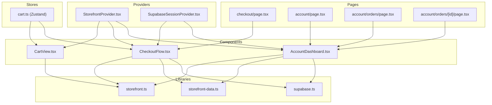
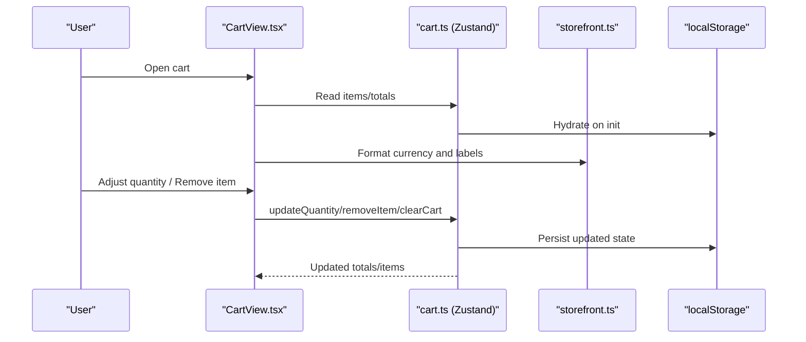
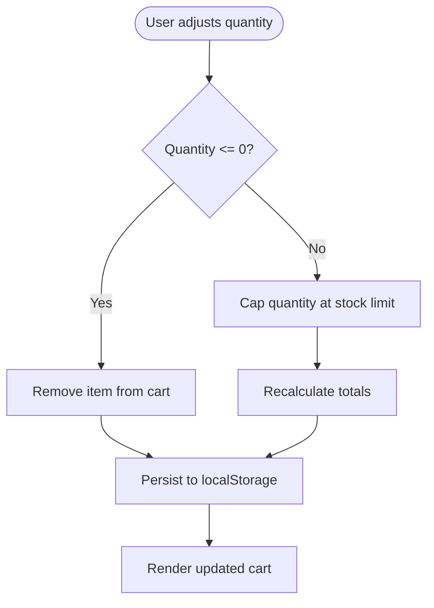
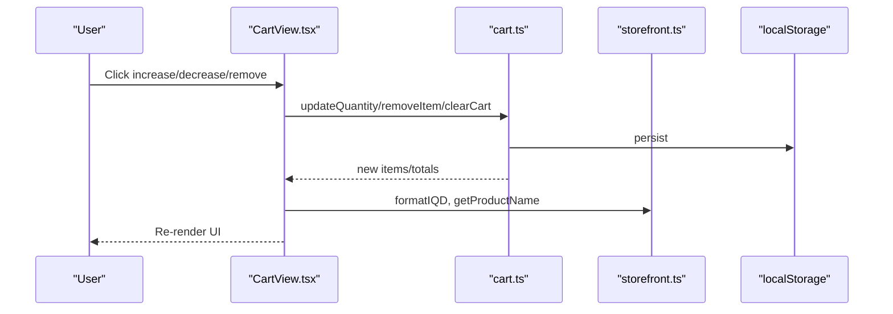
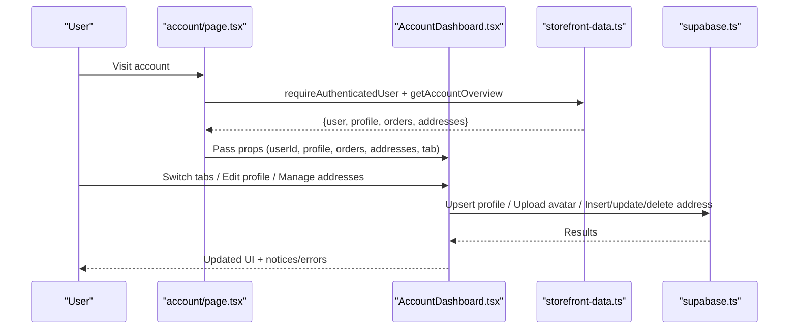
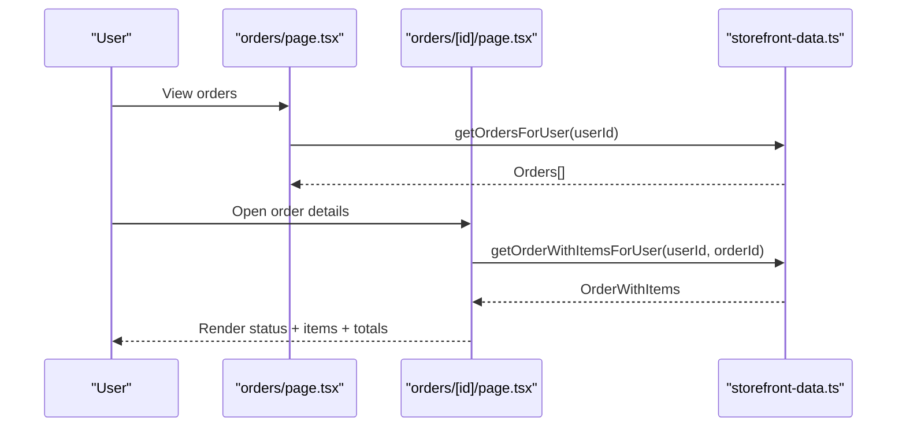
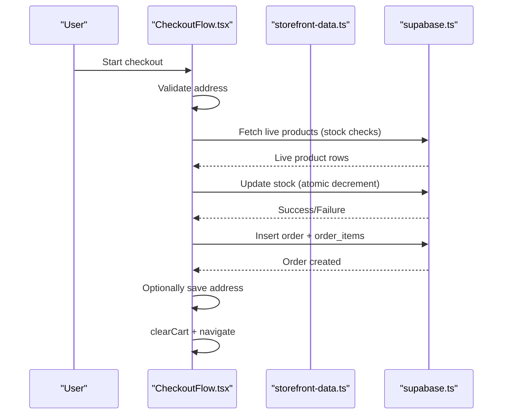
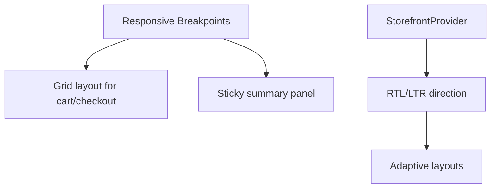
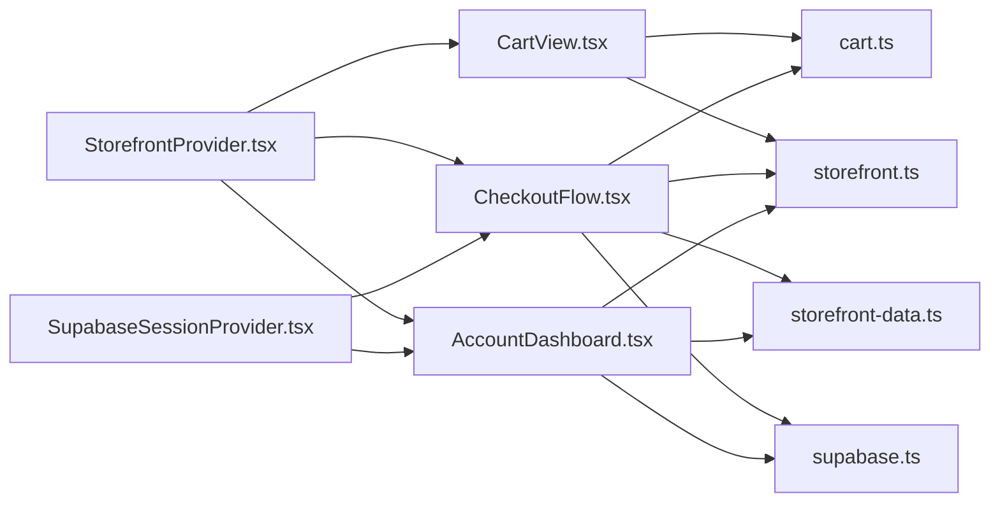

# Web Shopping Experience

<cite>
**Referenced Files in This Document**
- [CartView.tsx](file://web/src/components/cart/CartView.tsx)
- [cart.ts](file://web/src/store/cart.ts)
- [storefront.ts](file://web/src/lib/storefront.ts)
- [storefront-data.ts](file://web/src/lib/storefront-data.ts)
- [supabase.ts](file://web/src/lib/supabase.ts)
- [StorefrontProvider.tsx](file://web/src/components/providers/StorefrontProvider.tsx)
- [SupabaseSessionProvider.tsx](file://web/src/components/providers/SupabaseSessionProvider.tsx)
- [CheckoutFlow.tsx](file://web/src/components/checkout/CheckoutFlow.tsx)
- [checkout/page.tsx](file://web/src/app/checkout/page.tsx)
- [AccountDashboard.tsx](file://web/src/components/account/AccountDashboard.tsx)
- [account/page.tsx](file://web/src/app/account/page.tsx)
- [orders/page.tsx](file://web/src/app/account/orders/page.tsx)
- [orders/[id]/page.tsx](file://web/src/app/account/orders/[id]/page.tsx)
- [ORDERS_REALTIME_SETUP.md](file://.docs/ORDERS_REALTIME_SETUP.md)
</cite>

## Table of Contents
1. [Introduction](#introduction)
2. [Project Structure](#project-structure)
3. [Core Components](#core-components)
4. [Architecture Overview](#architecture-overview)
5. [Detailed Component Analysis](#detailed-component-analysis)
6. [Dependency Analysis](#dependency-analysis)
7. [Performance Considerations](#performance-considerations)
8. [Troubleshooting Guide](#troubleshooting-guide)
9. [Conclusion](#conclusion)
10. [Appendices](#appendices)

## Introduction
This document describes the web shopping experience built with Next.js, focusing on the shopping cart, checkout, account management, order lifecycle, and responsive design. It explains how items are managed in the cart, how quantities are adjusted, and how cart state persists across browser sessions. It also documents the integration with Supabase for real-time updates, secure user sessions, and persistent data. Finally, it covers order management, payment and shipping integration points, inventory handling, accessibility, and cross-browser compatibility considerations.

## Project Structure
The web storefront is organized around a provider-based architecture:
- Providers manage global state for language, direction, and Supabase session.
- Stores encapsulate cart logic with persistence.
- Pages orchestrate server-side data fetching and pass props to components.
- Components render UI and interact with stores and Supabase.

**Diagram sources**
- [StorefrontProvider.tsx:1-89](file://web/src/components/providers/StorefrontProvider.tsx#L1-L89)
- [SupabaseSessionProvider.tsx:1-74](file://web/src/components/providers/SupabaseSessionProvider.tsx#L1-L74)
- [cart.ts:1-107](file://web/src/store/cart.ts#L1-L107)
- [checkout/page.tsx:1-12](file://web/src/app/checkout/page.tsx#L1-L12)
- [account/page.tsx:1-59](file://web/src/app/account/page.tsx#L1-L59)
- [orders/page.tsx:1-103](file://web/src/app/account/orders/page.tsx#L1-L103)
- [orders/[id]/page.tsx:1-189](file://web/src/app/account/orders/[id]/page.tsx#L1-L189)
- [CartView.tsx:1-179](file://web/src/components/cart/CartView.tsx#L1-L179)
- [CheckoutFlow.tsx:1-722](file://web/src/components/checkout/CheckoutFlow.tsx#L1-L722)
- [AccountDashboard.tsx:1-870](file://web/src/components/account/AccountDashboard.tsx#L1-L870)
- [storefront.ts:1-613](file://web/src/lib/storefront.ts#L1-L613)
- [storefront-data.ts:1-312](file://web/src/lib/storefront-data.ts#L1-L312)
- [supabase.ts:1-36](file://web/src/lib/supabase.ts#L1-L36)

**Section sources**
- [StorefrontProvider.tsx:1-89](file://web/src/components/providers/StorefrontProvider.tsx#L1-L89)
- [SupabaseSessionProvider.tsx:1-74](file://web/src/components/providers/SupabaseSessionProvider.tsx#L1-L74)
- [cart.ts:1-107](file://web/src/store/cart.ts#L1-L107)
- [checkout/page.tsx:1-12](file://web/src/app/checkout/page.tsx#L1-L12)
- [account/page.tsx:1-59](file://web/src/app/account/page.tsx#L1-L59)
- [orders/page.tsx:1-103](file://web/src/app/account/orders/page.tsx#L1-L103)
- [orders/[id]/page.tsx:1-189](file://web/src/app/account/orders/[id]/page.tsx#L1-L189)
- [CartView.tsx:1-179](file://web/src/components/cart/CartView.tsx#L1-L179)
- [CheckoutFlow.tsx:1-722](file://web/src/components/checkout/CheckoutFlow.tsx#L1-L722)
- [AccountDashboard.tsx:1-870](file://web/src/components/account/AccountDashboard.tsx#L1-L870)
- [storefront.ts:1-613](file://web/src/lib/storefront.ts#L1-L613)
- [storefront-data.ts:1-312](file://web/src/lib/storefront-data.ts#L1-L312)
- [supabase.ts:1-36](file://web/src/lib/supabase.ts#L1-L36)

## Core Components
- CartView: Renders the shopping cart UI, item rows, quantity controls, removal actions, and order summary. Integrates with the Zustand cart store and localization utilities.
- Cart Store: Manages items, recalculates totals, persists to localStorage, and enforces stock limits.
- CheckoutFlow: Implements a 3-step checkout (address, payment, review) with validation, stock checks, order creation, and optional address saving.
- AccountDashboard: Provides tabs for profile, orders, and addresses; integrates with Supabase for reads/writes and displays localized content.
- Providers: StorefrontProvider manages language and direction; SupabaseSessionProvider manages auth state and exposes a typed Supabase client.

**Section sources**
- [CartView.tsx:12-179](file://web/src/components/cart/CartView.tsx#L12-L179)
- [cart.ts:33-107](file://web/src/store/cart.ts#L33-L107)
- [CheckoutFlow.tsx:52-722](file://web/src/components/checkout/CheckoutFlow.tsx#L52-L722)
- [AccountDashboard.tsx:59-870](file://web/src/components/account/AccountDashboard.tsx#L59-L870)
- [StorefrontProvider.tsx:44-89](file://web/src/components/providers/StorefrontProvider.tsx#L44-L89)
- [SupabaseSessionProvider.tsx:29-74](file://web/src/components/providers/SupabaseSessionProvider.tsx#L29-L74)

## Architecture Overview
The shopping experience follows a layered pattern:
- UI Layer: Components (CartView, CheckoutFlow, AccountDashboard) consume stores and providers.
- State Layer: Zustand cart store persists to localStorage; language/session state is centralized via providers.
- Data Layer: Server-side pages fetch data using Supabase clients; client-side components use Supabase for mutations and real-time subscriptions.
- Localization: Utilities in storefront.ts provide currency formatting, labels, and translations.

**Diagram sources**
- [CartView.tsx:12-179](file://web/src/components/cart/CartView.tsx#L12-L179)
- [cart.ts:33-107](file://web/src/store/cart.ts#L33-L107)
- [storefront.ts:527-547](file://web/src/lib/storefront.ts#L527-L547)

**Section sources**
- [CartView.tsx:12-179](file://web/src/components/cart/CartView.tsx#L12-L179)
- [cart.ts:33-107](file://web/src/store/cart.ts#L33-L107)
- [storefront.ts:527-547](file://web/src/lib/storefront.ts#L527-L547)

## Detailed Component Analysis

### Shopping Cart Implementation
- Item Management: The cart store holds items with product metadata and quantity, computes totals, and enforces stock limits.
- Quantity Adjustments: Buttons trigger updateQuantity; values below zero remove the item; stock caps prevent over-purchase.
- Persistence: Uses localStorage via Zustand persist middleware; on rehydration, totals are recalculated.
- UI Integration: CartView renders item rows, quantity controls, removal buttons, and a sticky summary sidebar.

**Diagram sources**
- [cart.ts:73-92](file://web/src/store/cart.ts#L73-L92)
- [CartView.tsx:69-103](file://web/src/components/cart/CartView.tsx#L69-L103)

**Section sources**
- [cart.ts:33-107](file://web/src/store/cart.ts#L33-L107)
- [CartView.tsx:12-179](file://web/src/components/cart/CartView.tsx#L12-L179)

### CartView Component and Supabase Integration
- CartView orchestrates cart rendering and actions, using StorefrontProvider for localization and storefront utilities for formatting.
- Real-time Updates: While CartView itself does not subscribe to Supabase, the checkout flow demonstrates real-time order updates via Supabase channels. The same pattern can be applied to cart synchronization if needed.

**Diagram sources**
- [CartView.tsx:12-179](file://web/src/components/cart/CartView.tsx#L12-L179)
- [cart.ts:33-107](file://web/src/store/cart.ts#L33-L107)
- [storefront.ts:527-554](file://web/src/lib/storefront.ts#L527-L554)

**Section sources**
- [CartView.tsx:12-179](file://web/src/components/cart/CartView.tsx#L12-L179)
- [cart.ts:33-107](file://web/src/store/cart.ts#L33-L107)
- [storefront.ts:527-554](file://web/src/lib/storefront.ts#L527-L554)

### Account Management System
- Overview Page: Loads authenticated user, messages, and account overview (profile, orders, addresses) and renders AccountDashboard with an initial tab.
- AccountDashboard: Provides three tabs:
  - Profile: Edit full name and phone; upload avatar; sync with Supabase profiles and storage.
  - Orders: Displays recent orders and links to full order history.
  - Addresses: Lists saved addresses, set default, delete, and add new address.
- Backend Integration: Uses server-side data utilities to fetch and mutate data via Supabase.

**Diagram sources**
- [account/page.tsx:27-58](file://web/src/app/account/page.tsx#L27-L58)
- [AccountDashboard.tsx:59-870](file://web/src/components/account/AccountDashboard.tsx#L59-L870)
- [storefront-data.ts:241-263](file://web/src/lib/storefront-data.ts#L241-L263)
- [supabase.ts:11-35](file://web/src/lib/supabase.ts#L11-L35)

**Section sources**
- [account/page.tsx:27-58](file://web/src/app/account/page.tsx#L27-L58)
- [AccountDashboard.tsx:59-870](file://web/src/components/account/AccountDashboard.tsx#L59-L870)
- [storefront-data.ts:241-263](file://web/src/lib/storefront-data.ts#L241-L263)
- [supabase.ts:11-35](file://web/src/lib/supabase.ts#L11-L35)

### Order Management Interface
- Orders Overview: Lists all orders with status, date, and total; highlights delivered count and latest order date.
- Order Details: Shows status timeline, ordered items with snapshots, pricing breakdown, and delivery address.
- Data Access: Server-side pages fetch orders and order details filtered by user ID.

**Diagram sources**
- [orders/page.tsx:14-103](file://web/src/app/account/orders/page.tsx#L14-L103)
- [orders/[id]/page.tsx:24-189](file://web/src/app/account/orders/[id]/page.tsx#L24-L189)
- [storefront-data.ts:265-294](file://web/src/lib/storefront-data.ts#L265-L294)

**Section sources**
- [orders/page.tsx:14-103](file://web/src/app/account/orders/page.tsx#L14-L103)
- [orders/[id]/page.tsx:24-189](file://web/src/app/account/orders/[id]/page.tsx#L24-L189)
- [storefront-data.ts:265-294](file://web/src/lib/storefront-data.ts#L265-L294)

### Checkout Flow and Inventory Management
- Steps: Address selection/input, Payment method selection, Review and Confirm.
- Validation: Validates address completeness and phone format; ensures user is authenticated.
- Inventory Safety: Fetches live product data, verifies stock availability, and performs atomic stock decrements with rollback on failure.
- Order Creation: Inserts order with derived totals, delivery cost, and snapshot of product metadata; optionally saves address; clears cart; navigates to order details.

**Diagram sources**
- [CheckoutFlow.tsx:52-722](file://web/src/components/checkout/CheckoutFlow.tsx#L52-L722)
- [checkout/page.tsx:6-11](file://web/src/app/checkout/page.tsx#L6-L11)
- [storefront.ts:15-16](file://web/src/lib/storefront.ts#L15-L16)

**Section sources**
- [CheckoutFlow.tsx:52-722](file://web/src/components/checkout/CheckoutFlow.tsx#L52-L722)
- [checkout/page.tsx:6-11](file://web/src/app/checkout/page.tsx#L6-L11)
- [storefront.ts:15-16](file://web/src/lib/storefront.ts#L15-L16)

### Responsive Design Considerations
- Grid and Sticky Layouts: Cart and checkout pages use responsive grids with sticky sidebars for summaries and order details.
- RTL/LTR Support: StorefrontProvider sets HTML lang/dir and persists language preference; components adapt layouts accordingly.
- Typography and Spacing: Consistent use of soft panels, eyebrow headings, and spacing tokens improves readability across breakpoints.

**Diagram sources**
- [CartView.tsx:39-177](file://web/src/components/cart/CartView.tsx#L39-L177)
- [CheckoutFlow.tsx:392-720](file://web/src/components/checkout/CheckoutFlow.tsx#L392-L720)
- [StorefrontProvider.tsx:44-89](file://web/src/components/providers/StorefrontProvider.tsx#L44-L89)

**Section sources**
- [CartView.tsx:39-177](file://web/src/components/cart/CartView.tsx#L39-L177)
- [CheckoutFlow.tsx:392-720](file://web/src/components/checkout/CheckoutFlow.tsx#L392-L720)
- [StorefrontProvider.tsx:44-89](file://web/src/components/providers/StorefrontProvider.tsx#L44-L89)

### Accessibility and Cross-Browser Compatibility
- Accessibility: Components use semantic labels, aria-labels for icons, proper contrast, and focus-friendly interactions. Inputs and buttons are keyboard accessible.
- Cross-Browser: Uses standard DOM APIs and Next.js runtime; Tailwind utilities ensure consistent rendering. Supabase SDK handles browser differences.

[No sources needed since this section provides general guidance]

## Dependency Analysis
- Provider Coupling: Components depend on StorefrontProvider for localization and SupabaseSessionProvider for auth/session.
- Store Coupling: CartView and CheckoutFlow depend on the cart store; stores depend on localStorage for persistence.
- Data Coupling: Pages depend on server-side data utilities; components depend on Supabase for mutations and optional subscriptions.

**Diagram sources**
- [CartView.tsx:8-15](file://web/src/components/cart/CartView.tsx#L8-L15)
- [cart.ts:10](file://web/src/store/cart.ts#L10)
- [CheckoutFlow.tsx:14-26](file://web/src/components/checkout/CheckoutFlow.tsx#L14-L26)
- [storefront-data.ts:1-12](file://web/src/lib/storefront-data.ts#L1-L12)
- [supabase.ts:1-9](file://web/src/lib/supabase.ts#L1-L9)
- [StorefrontProvider.tsx:12-27](file://web/src/components/providers/StorefrontProvider.tsx#L12-L27)
- [SupabaseSessionProvider.tsx:15-20](file://web/src/components/providers/SupabaseSessionProvider.tsx#L15-L20)

**Section sources**
- [CartView.tsx:8-15](file://web/src/components/cart/CartView.tsx#L8-L15)
- [cart.ts:10](file://web/src/store/cart.ts#L10)
- [CheckoutFlow.tsx:14-26](file://web/src/components/checkout/CheckoutFlow.tsx#L14-L26)
- [storefront-data.ts:1-12](file://web/src/lib/storefront-data.ts#L1-L12)
- [supabase.ts:1-9](file://web/src/lib/supabase.ts#L1-L9)
- [StorefrontProvider.tsx:12-27](file://web/src/components/providers/StorefrontProvider.tsx#L12-L27)
- [SupabaseSessionProvider.tsx:15-20](file://web/src/components/providers/SupabaseSessionProvider.tsx#L15-L20)

## Performance Considerations
- Local Persistence: Cart state is persisted locally to avoid server round-trips for UI updates.
- Minimal Re-renders: Zustand selectors and memoization reduce unnecessary re-renders in providers.
- Efficient Queries: Server-side pages fetch only required fields; client-side queries are scoped to authenticated user.
- Stock Atomicity: Checkout performs atomic stock updates with rollback to prevent race conditions.

[No sources needed since this section provides general guidance]

## Troubleshooting Guide
- Authentication Required: Server-side pages enforce authentication; redirects occur if unauthenticated.
- Real-time Subscriptions: For real-time order updates, ensure Supabase channel setup aligns with documented configuration.
- Stock Errors: If stock updates fail, the system rolls back prior decrements; verify product availability and network connectivity.
- Avatar Uploads: Ensure storage bucket permissions and CORS settings allow uploads; verify file types and sizes.

**Section sources**
- [storefront-data.ts:228-239](file://web/src/lib/storefront-data.ts#L228-L239)
- [CheckoutFlow.tsx:150-160](file://web/src/components/checkout/CheckoutFlow.tsx#L150-L160)
- [ORDERS_REALTIME_SETUP.md](file://.docs/ORDERS_REALTIME_SETUP.md)

## Conclusion
The web shopping experience combines a robust cart store with a provider-driven UI, secure Supabase-backed account and order management, and a checkout flow designed for reliability and clarity. The architecture supports persistence, localization, responsive layouts, and extensibility for real-time updates and payment integrations.

[No sources needed since this section summarizes without analyzing specific files]

## Appendices
- Real-time Orders Setup: Refer to the project’s documentation for configuring Supabase real-time channels for orders.

**Section sources**
- [ORDERS_REALTIME_SETUP.md](file://.docs/ORDERS_REALTIME_SETUP.md)