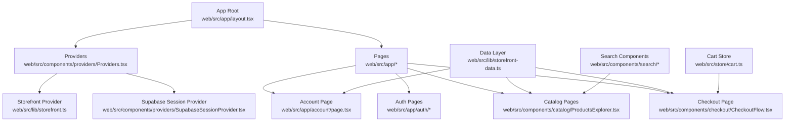
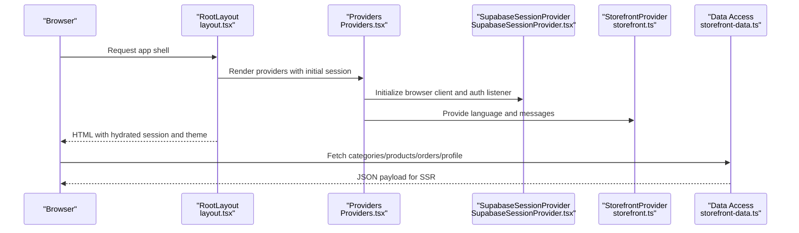
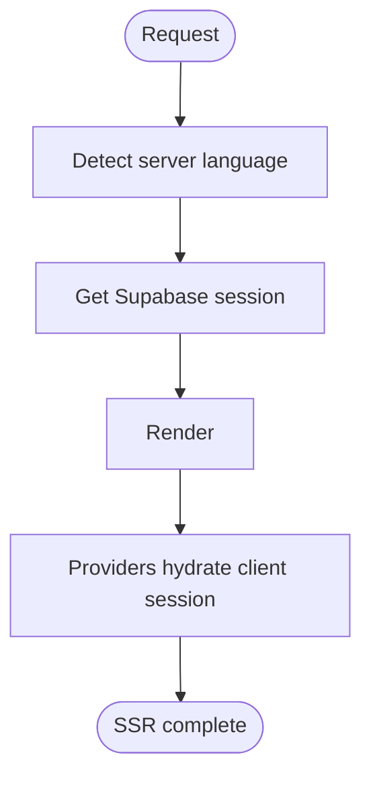
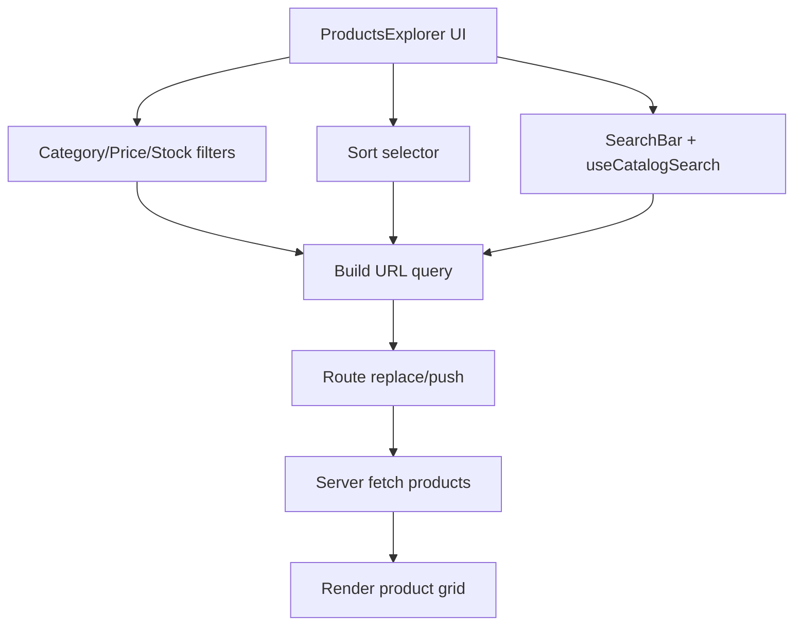
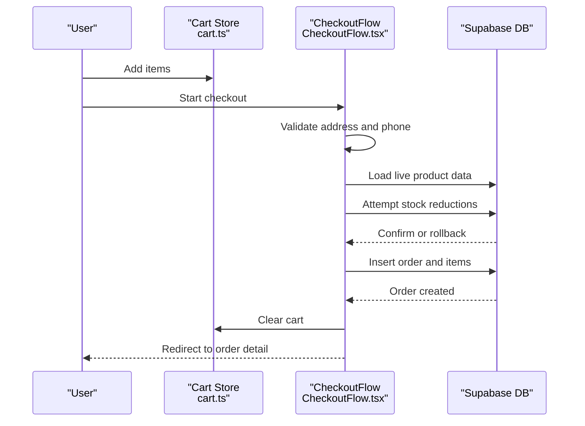
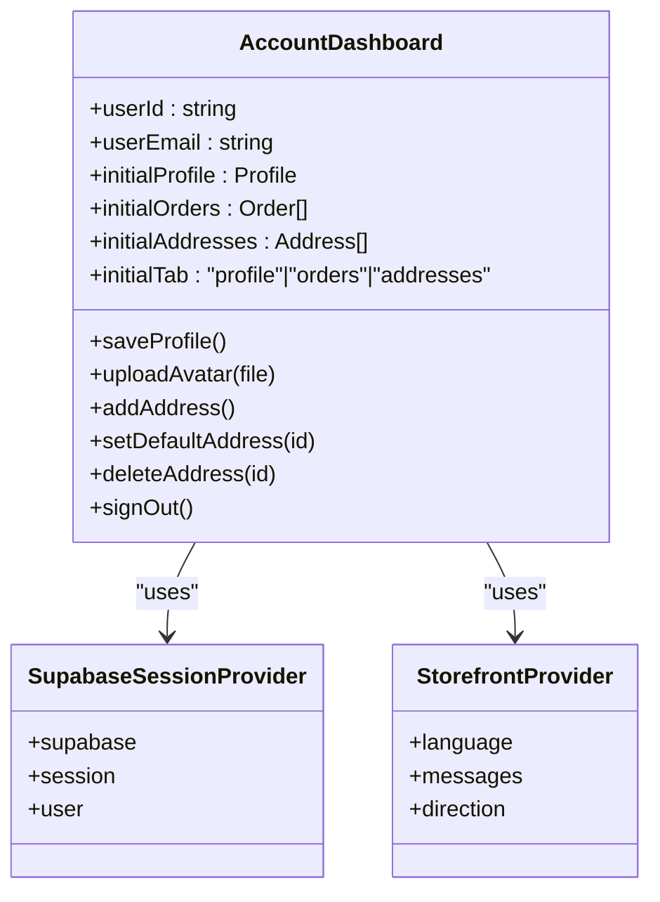
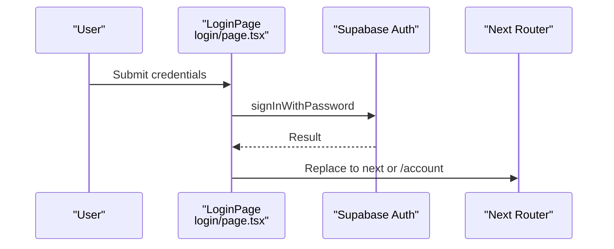
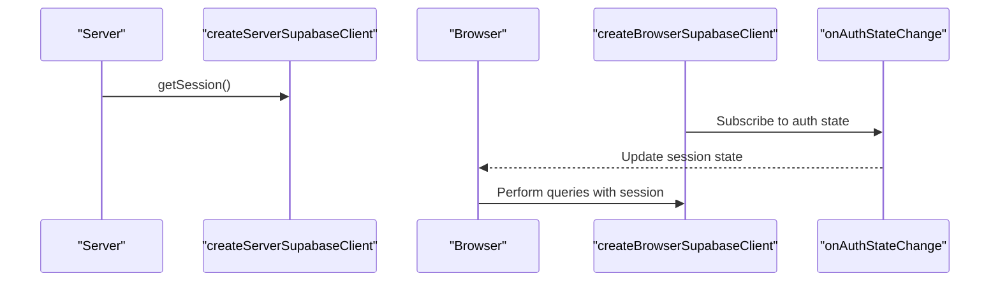
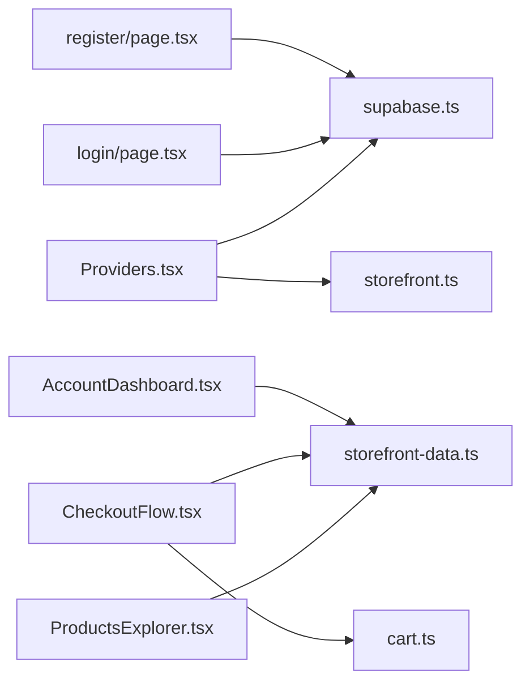

# Web Storefront (Next.js)

<cite>
**Referenced Files in This Document**
- [web/src/app/layout.tsx](file://web/src/app/layout.tsx)
- [web/src/components/providers/Providers.tsx](file://web/src/components/providers/Providers.tsx)
- [web/src/lib/storefront.ts](file://web/src/lib/storefront.ts)
- [web/src/lib/supabase.ts](file://web/src/lib/supabase.ts)
- [web/src/store/cart.ts](file://web/src/store/cart.ts)
- [web/src/components/search/StorefrontSearchBar.tsx](file://web/src/components/search/StorefrontSearchBar.tsx)
- [web/src/components/search/useCatalogSearch.ts](file://web/src/components/search/useCatalogSearch.ts)
- [web/src/components/catalog/ProductsExplorer.tsx](file://web/src/components/catalog/ProductsExplorer.tsx)
- [web/src/components/checkout/CheckoutFlow.tsx](file://web/src/components/checkout/CheckoutFlow.tsx)
- [web/src/lib/storefront-data.ts](file://web/src/lib/storefront-data.ts)
- [web/src/components/providers/SupabaseSessionProvider.tsx](file://web/src/components/providers/SupabaseSessionProvider.tsx)
- [web/src/components/account/AccountDashboard.tsx](file://web/src/components/account/AccountDashboard.tsx)
- [web/src/app/auth/login/page.tsx](file://web/src/app/auth/login/page.tsx)
- [web/src/app/auth/register/page.tsx](file://web/src/app/auth/register/page.tsx)
- [web/src/app/account/page.tsx](file://web/src/app/account/page.tsx)
</cite>

## Table of Contents
1. [Introduction](#introduction)
2. [Project Structure](#project-structure)
3. [Core Components](#core-components)
4. [Architecture Overview](#architecture-overview)
5. [Detailed Component Analysis](#detailed-component-analysis)
6. [Dependency Analysis](#dependency-analysis)
7. [Performance Considerations](#performance-considerations)
8. [Troubleshooting Guide](#troubleshooting-guide)
9. [Conclusion](#conclusion)
10. [Appendices](#appendices)

## Introduction
This document describes the Next.js web storefront for Al-Amal Center. It covers server-side rendering and SEO strategies, the enhanced product catalog with filtering, sorting, and search, the shopping cart and checkout flow, the account management system, responsive design and accessibility patterns, Supabase integration for real-time data synchronization, performance optimizations, troubleshooting guidance, and extension points for customization.

## Project Structure
The web storefront is organized under the web directory with a pages/app router hybrid using Next.js App Router conventions. Key areas:
- App routing and metadata: web/src/app/layout.tsx
- Global providers for theme, session, and storefront context: web/src/components/providers/*
- Internationalization and storefront utilities: web/src/lib/storefront.ts
- Supabase client creation for server and browser: web/src/lib/supabase.ts
- Shopping cart state via Zustand with persistence: web/src/store/cart.ts
- Catalog and search: web/src/components/search/*, web/src/components/catalog/*
- Checkout flow: web/src/components/checkout/*
- Account management: web/src/components/account/*
- Authentication pages: web/src/app/auth/*
- Data access layer: web/src/lib/storefront-data.ts

**Diagram sources**
- [web/src/app/layout.tsx:1-61](file://web/src/app/layout.tsx#L1-L61)
- [web/src/components/providers/Providers.tsx:1-32](file://web/src/components/providers/Providers.tsx#L1-L32)
- [web/src/lib/storefront.ts:1-613](file://web/src/lib/storefront.ts#L1-L613)
- [web/src/components/providers/SupabaseSessionProvider.tsx:1-74](file://web/src/components/providers/SupabaseSessionProvider.tsx#L1-L74)
- [web/src/lib/storefront-data.ts:1-312](file://web/src/lib/storefront-data.ts#L1-L312)
- [web/src/store/cart.ts:1-107](file://web/src/store/cart.ts#L1-L107)
- [web/src/components/search/StorefrontSearchBar.tsx:1-106](file://web/src/components/search/StorefrontSearchBar.tsx#L1-L106)
- [web/src/components/search/useCatalogSearch.ts:1-114](file://web/src/components/search/useCatalogSearch.ts#L1-L114)
- [web/src/components/catalog/ProductsExplorer.tsx:1-427](file://web/src/components/catalog/ProductsExplorer.tsx#L1-L427)
- [web/src/components/checkout/CheckoutFlow.tsx:1-722](file://web/src/components/checkout/CheckoutFlow.tsx#L1-L722)
- [web/src/app/account/page.tsx:1-59](file://web/src/app/account/page.tsx#L1-L59)
- [web/src/app/auth/login/page.tsx:1-178](file://web/src/app/auth/login/page.tsx#L1-L178)
- [web/src/app/auth/register/page.tsx:1-263](file://web/src/app/auth/register/page.tsx#L1-L263)

**Section sources**
- [web/src/app/layout.tsx:1-61](file://web/src/app/layout.tsx#L1-L61)
- [web/src/components/providers/Providers.tsx:1-32](file://web/src/components/providers/Providers.tsx#L1-L32)
- [web/src/lib/storefront.ts:1-613](file://web/src/lib/storefront.ts#L1-L613)
- [web/src/lib/supabase.ts:1-36](file://web/src/lib/supabase.ts#L1-L36)
- [web/src/store/cart.ts:1-107](file://web/src/store/cart.ts#L1-L107)
- [web/src/lib/storefront-data.ts:1-312](file://web/src/lib/storefront-data.ts#L1-L312)

## Core Components
- Providers stack: Theme provider, Supabase session provider, and storefront provider wrap the application to share session state, theme, and localization.
- Storefront utilities: Language detection, direction, translations, currency/date formatting, banner href normalization, and product/category helpers.
- Supabase client: Server and browser clients with cookie handling for SSR and auth state synchronization.
- Cart store: Local state with persistence for cart items, totals, and quantity updates.
- Catalog and search: ProductsExplorer integrates category filters, price sliders, stock filter, sorting, pagination, and a search bar with deferred updates.
- Checkout flow: Multi-step checkout with address selection, payment method selection, order review, stock validation, and order creation.
- Account dashboard: Profile editing, avatar upload, address management, order history, and sign-out.
- Authentication pages: Login and registration forms with Zod validation and Supabase auth integration.

**Section sources**
- [web/src/components/providers/Providers.tsx:17-31](file://web/src/components/providers/Providers.tsx#L17-L31)
- [web/src/lib/storefront.ts:442-613](file://web/src/lib/storefront.ts#L442-L613)
- [web/src/lib/supabase.ts:11-35](file://web/src/lib/supabase.ts#L11-L35)
- [web/src/store/cart.ts:33-106](file://web/src/store/cart.ts#L33-L106)
- [web/src/components/catalog/ProductsExplorer.tsx:36-427](file://web/src/components/catalog/ProductsExplorer.tsx#L36-L427)
- [web/src/components/checkout/CheckoutFlow.tsx:52-722](file://web/src/components/checkout/CheckoutFlow.tsx#L52-L722)
- [web/src/components/account/AccountDashboard.tsx:59-870](file://web/src/components/account/AccountDashboard.tsx#L59-L870)
- [web/src/app/auth/login/page.tsx:13-178](file://web/src/app/auth/login/page.tsx#L13-L178)
- [web/src/app/auth/register/page.tsx:14-263](file://web/src/app/auth/register/page.tsx#L14-L263)

## Architecture Overview
The storefront uses Next.js App Router with server-side rendering for metadata, session hydration, and protected routes. Supabase handles authentication, real-time session events, and database queries. Zustand manages client-side cart state with persistence. The catalog page performs server-side data fetching for categories, offers, and products, while the client handles search and filters with deferred updates.

**Diagram sources**
- [web/src/app/layout.tsx:27-60](file://web/src/app/layout.tsx#L27-L60)
- [web/src/components/providers/Providers.tsx:17-31](file://web/src/components/providers/Providers.tsx#L17-L31)
- [web/src/components/providers/SupabaseSessionProvider.tsx:29-61](file://web/src/components/providers/SupabaseSessionProvider.tsx#L29-L61)
- [web/src/lib/storefront-data.ts:35-85](file://web/src/lib/storefront-data.ts#L35-L85)

**Section sources**
- [web/src/app/layout.tsx:25-60](file://web/src/app/layout.tsx#L25-L60)
- [web/src/lib/storefront-data.ts:35-85](file://web/src/lib/storefront-data.ts#L35-L85)

## Detailed Component Analysis

### Server-Side Rendering and SEO
- Dynamic rendering: The root layout sets dynamic mode to force dynamic rendering to ensure session hydration and language detection occur on the server.
- Metadata: Title and description are defined at the root level for SEO.
- Language and direction: The layout detects server language and sets html lang and dir attributes for proper RTL/LTR rendering.
- Supabase session hydration: The server fetches the session and passes it to providers for client hydration.

**Diagram sources**
- [web/src/app/layout.tsx:25-60](file://web/src/app/layout.tsx#L25-L60)

**Section sources**
- [web/src/app/layout.tsx:20-60](file://web/src/app/layout.tsx#L20-L60)

### Enhanced Product Catalog (Filtering, Sorting, Search)
- Filtering: Category chips, price range inputs, and an in-stock toggle update query parameters and trigger route transitions.
- Sorting: Dropdown supports newest, price low-to-high, price high-to-low, and name sorting.
- Pagination: Previous/Next buttons adjust the page query parameter.
- Search: A dedicated search bar with deferred value and transition-driven navigation keeps URL in sync with results.
- Results panel: Displays product cards and empty state messaging.

**Diagram sources**
- [web/src/components/catalog/ProductsExplorer.tsx:80-130](file://web/src/components/catalog/ProductsExplorer.tsx#L80-L130)
- [web/src/components/search/useCatalogSearch.ts:44-85](file://web/src/components/search/useCatalogSearch.ts#L44-L85)
- [web/src/components/search/StorefrontSearchBar.tsx:21-106](file://web/src/components/search/StorefrontSearchBar.tsx#L21-L106)

**Section sources**
- [web/src/components/catalog/ProductsExplorer.tsx:36-427](file://web/src/components/catalog/ProductsExplorer.tsx#L36-L427)
- [web/src/components/search/useCatalogSearch.ts:29-114](file://web/src/components/search/useCatalogSearch.ts#L29-L114)
- [web/src/components/search/StorefrontSearchBar.tsx:21-106](file://web/src/components/search/StorefrontSearchBar.tsx#L21-L106)

### Shopping Cart and Checkout Flow
- Cart state: Persistent client store tracks items, quantities, and totals.
- Checkout flow: Three-step process—address selection/saving, payment method selection, and order review.
- Validation: Phone number regex, required fields, and stock availability checks.
- Stock reservation: Optimistic stock reduction with rollback on failure.
- Order creation: Inserts order and order items, optionally saves address, clears cart, and navigates to order detail.

**Diagram sources**
- [web/src/store/cart.ts:33-106](file://web/src/store/cart.ts#L33-L106)
- [web/src/components/checkout/CheckoutFlow.tsx:162-346](file://web/src/components/checkout/CheckoutFlow.tsx#L162-L346)

**Section sources**
- [web/src/store/cart.ts:33-106](file://web/src/store/cart.ts#L33-L106)
- [web/src/components/checkout/CheckoutFlow.tsx:52-722](file://web/src/components/checkout/CheckoutFlow.tsx#L52-L722)

### Account Management System
- Dashboard tabs: Profile, orders, addresses.
- Profile editing: Full name and phone updates; avatar upload to Supabase storage with cleanup of old avatars.
- Addresses: CRUD operations with default address management.
- Orders: List and detail views with status labels and formatted totals/dates.
- Authentication: Protected routes enforced by requiring authenticated user before rendering account data.

**Diagram sources**
- [web/src/components/account/AccountDashboard.tsx:59-870](file://web/src/components/account/AccountDashboard.tsx#L59-L870)
- [web/src/components/providers/SupabaseSessionProvider.tsx:29-73](file://web/src/components/providers/SupabaseSessionProvider.tsx#L29-L73)
- [web/src/lib/storefront.ts:442-613](file://web/src/lib/storefront.ts#L442-L613)

**Section sources**
- [web/src/components/account/AccountDashboard.tsx:59-870](file://web/src/components/account/AccountDashboard.tsx#L59-L870)
- [web/src/app/account/page.tsx:27-59](file://web/src/app/account/page.tsx#L27-L59)

### Authentication Pages
- Login: Zod validation for email/password; redirects to next or account after successful sign-in.
- Registration: Zod validation for full name, phone, email, password, and confirmation; supports optional email confirmation flow.

**Diagram sources**
- [web/src/app/auth/login/page.tsx:48-66](file://web/src/app/auth/login/page.tsx#L48-L66)
- [web/src/app/auth/register/page.tsx:79-113](file://web/src/app/auth/register/page.tsx#L79-L113)

**Section sources**
- [web/src/app/auth/login/page.tsx:13-178](file://web/src/app/auth/login/page.tsx#L13-L178)
- [web/src/app/auth/register/page.tsx:14-263](file://web/src/app/auth/register/page.tsx#L14-L263)

### Responsive Design and Accessibility
- Direction and language: The layout sets html lang and dir based on detected language for correct text directionality.
- Components: Consistent use of soft panels, pill buttons, and field inputs promote accessible and responsive layouts across breakpoints.
- Focus and labels: Inputs and buttons include appropriate aria labels and semantic markup for keyboard navigation.

**Section sources**
- [web/src/app/layout.tsx:32-42](file://web/src/app/layout.tsx#L32-L42)
- [web/src/components/search/StorefrontSearchBar.tsx:34-106](file://web/src/components/search/StorefrontSearchBar.tsx#L34-L106)
- [web/src/components/catalog/ProductsExplorer.tsx:133-427](file://web/src/components/catalog/ProductsExplorer.tsx#L133-L427)

### Supabase Integration and Real-Time Updates
- Server client: Creates a Supabase client with cookie store for SSR session retrieval.
- Browser client: Initializes a client for auth state changes and reactive UI updates.
- Auth state: Subscribes to auth state changes and maintains session state across the app.
- Data access: Centralized functions for fetching banners, categories, products, orders, and profiles.

**Diagram sources**
- [web/src/lib/supabase.ts:15-35](file://web/src/lib/supabase.ts#L15-L35)
- [web/src/components/providers/SupabaseSessionProvider.tsx:36-52](file://web/src/components/providers/SupabaseSessionProvider.tsx#L36-L52)

**Section sources**
- [web/src/lib/supabase.ts:11-35](file://web/src/lib/supabase.ts#L11-L35)
- [web/src/components/providers/SupabaseSessionProvider.tsx:29-73](file://web/src/components/providers/SupabaseSessionProvider.tsx#L29-L73)
- [web/src/lib/storefront-data.ts:228-312](file://web/src/lib/storefront-data.ts#L228-L312)

## Dependency Analysis
- Providers depend on Supabase client initialization and storefront utilities.
- Catalog and checkout depend on the data access layer for server-side queries and client-side cart state.
- Authentication pages depend on Supabase auth and Zod validation libraries.
- Internationalization keys and formatting functions are centralized in storefront utilities.

**Diagram sources**
- [web/src/components/providers/Providers.tsx:17-31](file://web/src/components/providers/Providers.tsx#L17-L31)
- [web/src/lib/supabase.ts:11-35](file://web/src/lib/supabase.ts#L11-L35)
- [web/src/lib/storefront.ts:442-613](file://web/src/lib/storefront.ts#L442-L613)
- [web/src/lib/storefront-data.ts:112-169](file://web/src/lib/storefront-data.ts#L112-L169)
- [web/src/store/cart.ts:33-106](file://web/src/store/cart.ts#L33-L106)
- [web/src/components/account/AccountDashboard.tsx:59-870](file://web/src/components/account/AccountDashboard.tsx#L59-L870)
- [web/src/app/auth/login/page.tsx:13-178](file://web/src/app/auth/login/page.tsx#L13-L178)
- [web/src/app/auth/register/page.tsx:14-263](file://web/src/app/auth/register/page.tsx#L14-L263)

**Section sources**
- [web/src/components/providers/Providers.tsx:17-31](file://web/src/components/providers/Providers.tsx#L17-L31)
- [web/src/lib/storefront-data.ts:112-169](file://web/src/lib/storefront-data.ts#L112-L169)

## Performance Considerations
- Deferred updates: useDeferredValue and useTransition are used in search and catalog to prevent blocking UI during frequent keystrokes and route transitions.
- Client-side persistence: Zustand with localStorage persists cart state to reduce server requests and improve perceived performance.
- SSR data fetching: Server functions fetch categories, banners, and product lists to minimize client work and improve TTFB.
- Image optimization: Product images are rendered with lazy loading in category listings and product cards.
- Minimal re-renders: Route transitions avoid full reloads and preserve state where appropriate.

[No sources needed since this section provides general guidance]

## Troubleshooting Guide
- Authentication failures: Verify environment variables for Supabase URL and anon key; check auth state subscription logs.
- Search not updating: Ensure useCatalogSearch is invoked with correct pathname and router; confirm URL parameter handling.
- Stock conflicts during checkout: The flow includes optimistic stock updates with rollback; check console for errors and network responses.
- Avatar uploads: Confirm Supabase storage bucket permissions and CORS settings; verify filename extraction and removal logic.
- RTL issues: Confirm language detection and direction setting; ensure CSS respects dir attribute.

**Section sources**
- [web/src/lib/supabase.ts:5-35](file://web/src/lib/supabase.ts#L5-L35)
- [web/src/components/search/useCatalogSearch.ts:44-85](file://web/src/components/search/useCatalogSearch.ts#L44-L85)
- [web/src/components/checkout/CheckoutFlow.tsx:150-251](file://web/src/components/checkout/CheckoutFlow.tsx#L150-L251)
- [web/src/components/account/AccountDashboard.tsx:162-235](file://web/src/components/account/AccountDashboard.tsx#L162-L235)

## Conclusion
The Next.js web storefront integrates robust SSR, Supabase-powered authentication and data, a responsive and accessible UI, and a streamlined checkout experience. The catalog emphasizes desktop-friendly controls with deferred updates and persistent cart state. The account system centralizes profile, addresses, and order management, while the authentication pages enforce strong validation and safe redirects.

[No sources needed since this section summarizes without analyzing specific files]

## Appendices

### Extending the Web Interface
- Add new catalog filters: Extend ProductsExplorer with new query parameters and update replaceQuery handlers.
- Introduce new checkout steps: Add new step components and update the steps array and confirmOrder flow.
- Enhance account features: Add new tabs or forms in AccountDashboard and wire to Supabase storage and tables.
- Localization: Add new translation keys in storefront.ts and ensure resolveBannerHref handles new routes.

[No sources needed since this section provides general guidance]